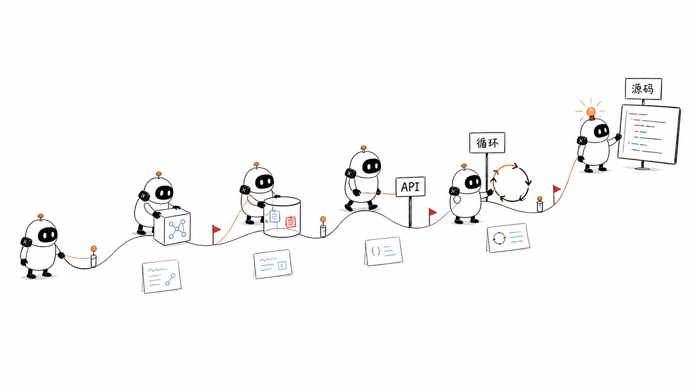

# Learn Pi Agent

从基础概念、主流模型 API 与经典论文出发，逐步读懂 Pi Agent 的设计思想与源码实现。

> 中文内容 · 18 章主线已完成 · 非官方 Pi 项目

## 这是什么

Agent 领域不缺术语，也不缺“十分钟做一个 Agent”的示例。这个仓库关注一条更扎实的学习路径：

**基础直觉 → 行业 API → 论文背景 → Pi 工程实现 → 源码运行追踪**

你会逐步回答这些问题：

- 模型到底负责什么？
- 工具是谁执行的？
- 一次会话怎样在多轮调用中保持连续？
- OpenAI、Anthropic 等 API 的差异为什么需要 Provider 层吸收？
- Pi 如何把模型、循环、工具、事件和会话组织成一个可运行的 coding agent？

本项目只负责讲解，不布置作业，也不要求你先自己实现一个 Agent。

## 从哪里开始

从[第 1 章：从一次模型调用到 Agent](docs/01-from-llm-to-agent.md)开始，然后按照文件编号从 `02` 一直读到 `18`。

各章解决的问题和概念顺序记录在[课程章节结构](docs/00-course-structure.md)中。

## 适合谁

- 第一次系统学习 AI Agent 的读者；
- 调用过模型 API，但还没有完整理解 tool call、agent loop 与 session 的开发者；
- 会一点 JavaScript / TypeScript，希望从真实项目学习工程设计的人；
- 想理解 coding agent 如何连接模型、终端、文件系统和会话状态的人。

不要求你已经写过 Agent。能看懂 TypeScript 的函数、对象和异步迭代，会让源码章节更轻松。

## 你会看到的内容

- 用直觉解释模型、上下文、消息、工具、事件和状态；
- 对照 OpenAI 与 Anthropic 的真实 API 文档；
- 连接 ReAct、Toolformer 等经典论文；
- 沿固定版本追踪 Pi 的调用链和运行事件；
- 解释 Pi 为什么拆成 `pi-ai`、`pi-agent-core` 和 `pi-coding-agent`。

## 参与方式

如果你发现解释、链接或版本信息有误，可以在 GitHub 提交 Issue 或 Pull Request。这个项目更重视“哪一句仍然看不懂”的反馈，而不是堆叠更多术语。

## License

MIT License。
