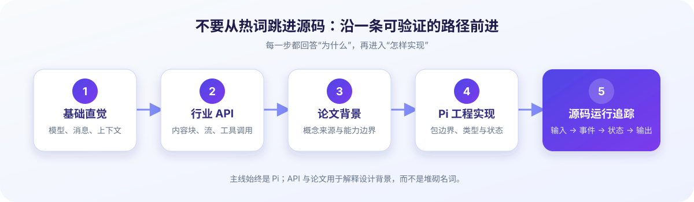

# Learn Pi Agent 学习路线

这不是功能开发清单，而是一张从“看懂一次模型调用”走向“能够追踪 Pi 的真实运行过程”的课程地图。每个阶段都建立在前一阶段形成的心智模型上；初学者不必追赶热词，先把消息如何流动、动作由谁执行、状态放在哪里弄清楚。

## 总览

| 阶段 | 核心问题 | 预期学习结果 | 状态 |
| --- | --- | --- | --- |
| 0 | 怎样使用仓库，怎样讨论一份会变化的源码？ | 会选择阅读路径，知道版本基线与固定 commit 链接的意义 | **已完成** |
| 1 | 模型如何从“返回文本”变成“参与行动循环”？ | 理解消息、上下文、流式响应、工具调用与最小 Agent Loop | **进行中** |
| 2 | Pi 把一个 Agent 系统拆成了哪些层？ | 能说明 `pi-ai`、`pi-agent-core`、`pi-coding-agent` 的职责与依赖方向 | **计划中** |
| 3 | Coding agent 怎样获得工具、规则与可扩展能力？ | 理解 AgentSession、工具、扩展、Skills、ResourceLoader 与 System Prompt | **计划中** |
| 4 | 长会话怎样保存、分支和压缩？ | 理解 JSONL Session、会话树、resume/fork、上下文窗口与 compaction | **计划中** |
| 5 | 一次真实请求怎样贯穿整套系统？ | 能追踪简单 prompt、工具调用、会话恢复和压缩的完整调用链 | **计划中** |
| 6 | 把 Pi 放回更大的 Agent 生态会看到什么？ | 能讨论 MCP、安全、评测和多 Agent，并辨别能力与宣传 | **计划中** |

## 阶段 0：如何使用仓库与固定源码版本

**学习结果：** 能根据自己的经验选择阅读路线；知道“最新上游”与“文章写作基线”不是一回事；引用源码时优先使用固定 commit，而不是容易漂移的行号。

已完成：

- [仓库介绍](README.md)
- [你将学到什么](docs/00-start/01-what-you-will-learn.md)
- [如何使用本仓库](docs/00-start/02-how-to-use-this-repo.md)
- [源码版本为什么重要](docs/00-start/03-source-version.md)
- [版本基线](references/version-baseline.md)

## 阶段 1：从模型 API 到最小 Agent Loop

**学习结果：** 能区分模型、宿主程序和 Agent；读懂 `user`、`assistant`、`tool call`、`tool result`；理解上下文窗口、流式事件与工具调用；能用伪代码描述一个最小循环。

已完成：

- [从大模型到 Agent](docs/01-foundations/01-from-llm-to-agent.md)

计划中：

- OpenAI Chat Completions / Responses 与 Anthropic Messages 的消息格式对比
- 内容块、增量事件与流式响应
- 工具定义、参数校验、错误返回与安全边界
- 从单轮调用到可停止、可观测的 Agent Loop

## 阶段 2：Pi 总体架构与核心循环

**学习结果：** 能画出 Pi 的主要包结构，解释 `pi-ai`、`pi-agent-core` 与 `pi-coding-agent` 的边界；沿 `AgentSession → Agent/AgentHarness → runAgentLoop → pi-ai provider` 找到主调用链；理解状态与事件怎样传播。

计划中：

- Pi 仓库与包级架构
- `pi-ai` 的统一消息与 Provider 抽象
- Agent 类型、状态和生命周期
- `agent-loop.ts`：消息、工具与事件如何进入循环
- steering、follow-up 与并行/串行工具执行

## 阶段 3：Coding Agent 的能力装配

**学习结果：** 理解模型并不会亲自读文件或执行命令；说明会话、工具、提示词和资源如何被宿主装配成 coding agent；能够定位新增能力的扩展点。

计划中：

- `AgentSession` 如何协调一次交互式会话
- 文件、搜索、编辑与终端工具
- Extensions 与生命周期钩子
- Skills 与按需加载的操作知识
- ResourceLoader、System Prompt 与项目上下文

## 阶段 4：会话树与上下文管理

**学习结果：** 能区分“磁盘上的完整历史”“本轮发给模型的上下文”和“模型参数里的知识”；解释为什么长会话需要分支、恢复与压缩，以及压缩会丢失什么。

计划中：

- JSONL Session 的追加写入模型
- 会话树、resume 与 fork
- Context Window 与 token 预算
- compaction 的触发、摘要与保真边界
- Lost in the Middle、MemGPT、LongLLMLingua 等研究背景

## 阶段 5：完整源码运行追踪

**学习结果：** 不只认识类名，而是能用“输入—状态变化—事件—输出”的方式解释真实路径，并在版本升级后重新找到对应位置。

计划中：

- 简单 prompt：从终端输入到模型流式输出
- 工具调用：从模型请求到宿主执行再回填结果
- 会话恢复：历史怎样重新进入运行状态
- 上下文压缩：触发、摘要、落盘与下一轮请求

## 阶段 6：扩展视野——MCP、安全、评测与多 Agent

**学习结果：** 能把 Pi 与更广泛的 Agent 生态进行有边界的比较；理解“能调用更多工具”不等于“更可靠”；能为工具权限、提示注入、评测指标和多 Agent 协调提出基本问题。

计划中：

- MCP 与工具/资源的互操作
- 权限、沙箱、提示注入与最小授权
- AgentBench、SWE-bench 等评测的范围与局限
- 多 Agent 的分工、通信成本与失败模式

## 状态约定

- **已完成**：正文已进入仓库，并完成链接与版本检查；
- **进行中**：至少已有一篇可读正文，但阶段内容尚未覆盖完整；
- **计划中**：已经明确学习目标，尚未提供空链接或占位文章。

路线会随着 Pi 上游变化和读者反馈调整，但“先建立直觉，再验证到协议和源码”的顺序不会轻易改变。
