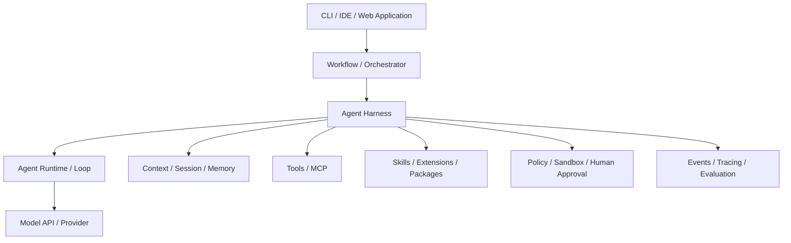

# 课程章节结构：以 Pi 为主线理解现代 Agent

章节按 Agent 的运行链路排列，从模型调用开始，逐步进入工具、上下文、协议、编排和真实环境中的工程问题；每组概念都放回 Pi 的工程结构中。

章节主线是：

```text
LLM API → Agent Loop → Tools → Context / Session
        → MCP / Skills / Extensions
        → Workflow / SDK / Multi-Agent
        → Sandbox / Security / Evaluation
        → Pi 源码与 Harness Engineering
```

## 一张总图



贯穿这些章节的工程视角是 `Harness`：它不是某一个 API，而是让模型能够持续完成任务的完整运行层，包括循环、上下文、工具、会话、策略、执行环境和反馈机制。Pi 官方仓库把 Pi 称为 Agent Harness，并将模型 API、Agent Runtime 与 coding agent 产品层拆成不同包；这为源码阅读提供了清晰主干。

## 第一部分：Agent 的核心运行机制

这一部分从 Agent 的核心运行机制开始，说明模型如何在宿主程序中变成一个可以行动的 Agent。

### 第 1 章：从 LLM 到 Agent，再到 Harness

建立 LLM、Agent、Runtime、Host、Environment 和 Harness 的边界，解释 Message、Context、State、Session、Tool Call 与 Agent Loop；同时用这些共同语义理解不同 API 的差异。

### 第 2 章：模型 API 与消息协议

比较 OpenAI Chat Completions、OpenAI Responses 和 Anthropic Messages，解释消息角色、内容块、Tool Call、Tool Result、Streaming、停止原因和 Provider 适配。

### 第 3 章：Agent Loop、状态机与停止条件

从第 1 章的教学循环进入 Pi 的真实源码，沿着 `AgentContext`、`AgentLoopConfig`、`runAgentLoop`、`runLoop` 和 `AgentEvent` 逐段阅读“准备 Context → 调用模型 → 处理响应 → 写回结果 → 继续或停止”，并区分模型的停止原因和 Runtime 对整段运行的控制。

### 第 4 章：Tools 与 Function Calling

继续阅读 Pi 的 `AgentTool`、参数校验、`executeToolCalls` 和 `ToolResultMessage`，再从 Tool Contract、Schema、Validation、Registry、Policy、Executor 和 Result 解释工具调用；补充并行调用、Tool Search、Toolformer 与 ReAct 的背景。

## 第二部分：上下文与能力接入

这一部分说明 Agent 能看到什么、能做什么，以及外部能力如何进入 Harness。

### 第 5 章：Context Engineering 与 Structured Output

解释 Prompt Engineering、Context Engineering、系统指令、项目上下文、动态上下文、token 预算、结构化输出与 Prompt Injection。`AGENTS.md`、`CLAUDE.md` 等项目指令会在这里作为 Harness 上下文的一部分出现。

### 第 6 章：Session、Memory、Retrieval 与 Compaction

区分 Context、Memory、Session、State、Checkpoint 和 Durable Execution；解释 RAG、消息树、分支、恢复、压缩以及长任务为什么需要持久化。

### 第 7 章：MCP：Agent 与外部世界的协议

讲清 MCP Host、Client、Server、JSON-RPC、能力发现、stdio、Streamable HTTP、Tools、Resources、Prompts，以及 Elicitation 与 Multi Round-Trip Requests。说明 2026 版协议为什么改为无状态请求，Roots、Sampling、Logging 为什么已进入弃用期；MCP 标准化外部能力接入，而不是 Agent 编排，Pi 可以通过 Extension 或 Package 把 MCP 接进自己的 Harness。

### 第 8 章：Skills 与 Prompt Templates

解释 Skill 与 Tool、MCP、System Instruction 和 Prompt Template 的区别；沿 Pi 源码追踪 Skill Catalog、`description` 路由、`read(SKILL.md)`、`/skill:name` 与 Prompt Template 参数展开。讲清渐进式披露、参考资料、脚本、资产、跨 Harness 可移植边界、安全审查与 Skill 评估，以及 Skill 如何指导 Agent 组合多个 Tool 或 MCP 能力。

### 第 9 章：Extensions、Plugins 与 Packages

解释 Pi Extension 的加载、项目信任、`ExtensionAPI`、自定义 Tool、Command、UI、Provider 与生命周期事件；区分 `input`、`before_agent_start`、`context` 和 Provider Payload 四个修改边界，追踪 `tool_call` / `tool_result` 中间件以及并行工具的预检、执行和写回顺序。再说明状态重建、`resources_discover`、reload、Package manifest、npm / Git / Local 来源和资源过滤，并比较 Pi Package、OpenAI Plugin 与 Claude Code Plugin 的不同语义。最后把 MCP 适配、供应链、权限、Sandbox 与审计放回完整扩展边界。

## 第三部分：Workflow 与 Agent 编排

这一部分说明一个任务由谁决定下一步，以及多个步骤或多个 Agent 如何协作。

### 第 10 章：Workflow 与 Agent 的区别

以“下一步由谁决定”为判断标准，区分代码预先定义控制流的 Workflow、由模型根据中间结果动态选择行动的 Agent，以及外层流程约束内层 Agent 的混合系统；进一步解释 deterministic orchestration 确定的是控制结构，而不是模型文本或并发顺序，并用 Pi SDK 构造可嵌入 Workflow 的 Agent 节点。

### 第 11 章：Workflow Patterns

先用 Node、Contract、State、Transition 与 Gate 建立共同骨架，再把真实 Pi Agent Session 包成可取消、可隔离的 Workflow Node。依次解释 Prompt Chaining、Routing、Parallel Sectioning / Voting、Orchestrator-Workers、Evaluator-Optimizer 和通用 Loop，补齐运行时校验、依赖图、fan-out / fan-in、并发取消、最佳候选、硬上限、幂等与可观测性；最后把多种 Pattern 组合进一个外层固定、内层可动态行动的发布流程。

### 第 12 章：Planning 与 Reasoning Patterns

先区分模型内部推理、Provider 返回的 thinking、可见说明、可执行计划、Workflow 与 Plan Mode，再说明 Pi 的 `thinkingLevel`、`ThinkingContent` 和流式 thinking 事件分别处在哪一层。随后比较 ReAct-like Tool Loop、Plan-and-Execute、Plan-and-Solve、Critic、Reflection、Self-Refine、Reflexion、Self-Consistency 与 Tree of Thoughts，明确每种 Pattern 所需的状态、证据、搜索或停止边界。最后沿 Pi SDK 和官方 Plan Mode Extension 示例说明怎样用只读工具集、计划校验、人工批准与执行证据组装规划流程。

### 第 13 章：Agent SDK 与应用集成

先比较直接调用模型 API、使用 Agent Runtime、使用 Agent SDK 和使用 CLI 时，应用分别要承担哪些循环、状态、会话与界面工作；再把 `pi-ai`、`pi-agent-core` 和 `pi-coding-agent` 放到这四层中定位。沿 Pi 固定源码解释 `createAgentSession()` 怎样装配 `ModelRuntime`、Tool、`ResourceLoader`、`SessionManager` 与 `SettingsManager`，并用真实接口完成事件订阅、最终消息提取、取消和清理。随后区分 Message、Turn、Run、Session、Streaming Event 与 View State，说明持久化、用户隔离、Session 替换和 Provider 适配边界；最后与 OpenAI Agents SDK 的 `Agent`、`run()`、`finalOutput`、Streaming 和 Run Context 对照，并给出 Web 应用的 Adapter 与生命周期设计。

### 第 14 章：Multi-Agent 与 A2A

先判断一个组件何时具有独立 Agent Loop、Context、状态和生命周期，再区分 Manager–Worker、Agents-as-Tools、Handoff 与 Delegation 各自描述的控制关系。随后设计跨 Context 的任务与结果契约，分析 fan-out/fan-in、依赖关系、关键路径、Token 成本、并发和取消边界；结合 CAMEL、AutoGen、MetaGPT 与 Anthropic Research 系统理解多 Agent 的收益和代价。沿 Pi 固定源码说明核心为何不内置 Subagent，以及官方 Extension 示例怎样用 `subagent` Tool、Agent Markdown、独立 Pi 子进程、single/parallel/chain 和项目级信任边界实现协作。最后以 A2A 1.0 解释 Agent Card、Message、Task、Part、Artifact、Task State、Streaming、MCP/A2A 分工，并给出把 Pi `AgentSession` 适配为 A2A Server 所需的 Task Store、ID 映射、幂等、认证和事件转换边界。

## 第四部分：真实工程环境

这一部分说明 Agent 如何安全、可恢复、可观测地运行在真实环境中。

### 第 15 章：Sandbox、Code Agent 与 Computer Use

解释文件系统、Shell、代码执行、浏览器、Computer Use、工作目录、Sandbox、环境变量和 Secret 管理，明确“模型能请求”与“环境允许执行”的区别。

### 第 16 章：Durable Execution 与 Human-in-the-loop

解释 Background Agent、长时间任务、Checkpoint、Retry、Pause、Approval、Reject 和 Resume；把人工批准作为 Workflow 的控制流，而不只是安全弹窗。

### 第 17 章：Security、Guardrails 与 Governance

介绍 Input、Output 和 Tool Guardrail，权限、策略、最小权限、Prompt Injection、Tool Poisoning、数据泄漏、审计和用户同意。

### 第 18 章：Observability、Evaluation 与 Harness Engineering

介绍 Agent Event、Lifecycle Hook、Trace、Token、延迟、成本、Task Success、Trajectory Evaluation、LLM-as-a-Judge 和回归测试，并用 Harness Engineering 总结如何通过工具、约束、测试和反馈提升可靠性。

## Pi 源码如何进入这条主线

源码阅读不单独制造一条平行路线，而是跟随章节逐步进入：

```text
第 2 章 → pi-ai：Provider、Message、Content、Stream
第 3 章 → pi-agent-core：AgentContext、AgentLoopConfig、runAgentLoop、runLoop、AgentEvent
第 4 章 → pi-agent-core：AgentTool、executeToolCalls、ToolResultMessage
第 6～9 章 → coding-agent：Session、Resource、Skill、Extension、Package
第 13～18 章 → SDK、Sandbox、Telemetry、Evaluation 与完整运行链路
```

最终目标不是记住所有术语，而是能从一次用户输入出发，解释它如何经过 Provider、Context、Agent Loop、Tool/MCP、Session、Event 和 UI，最后得到响应或进入下一轮。
