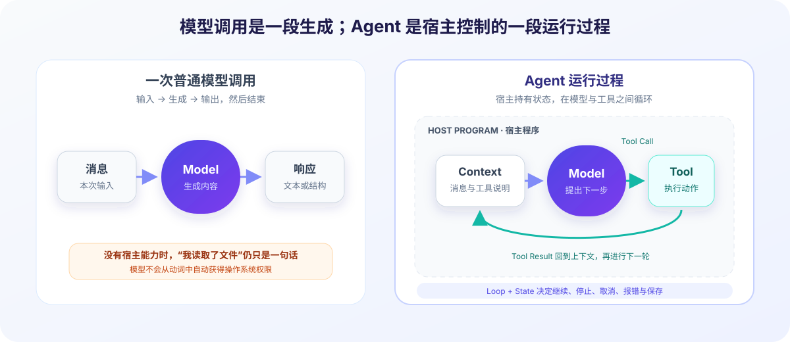
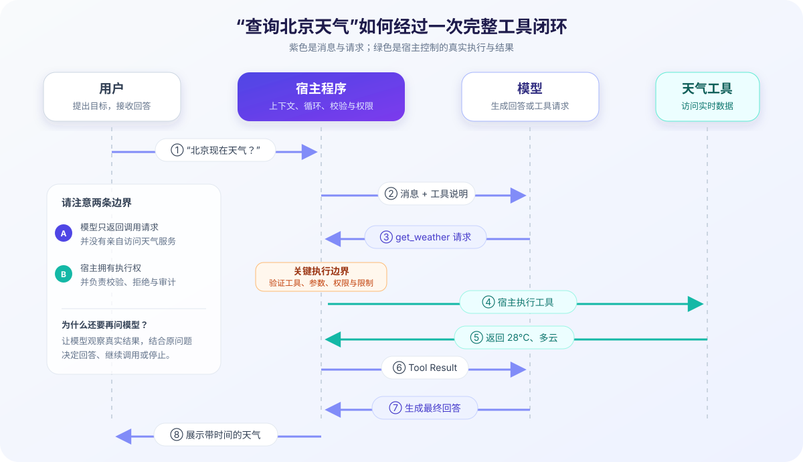

# 从大模型到 Agent：中间到底多了什么？

> **本章问题：为什么一个能回答问题的大模型，还不等于一个能完成任务的 Agent？**

你可能已经见过这样的描述：“给大模型接上工具，它就变成了 Agent。”这句话抓住了一部分现象，却省略了最关键的执行者：**围绕模型运行的宿主程序**。

本章先不进入 OpenAI 和 Anthropic 的具体 JSON，也不展开 Pi 的几百行循环代码。我们只建立一条以后反复使用的主线：消息由谁生成，动作由谁执行，结果怎样回到下一次模型调用。

## 1. 先看一次普通模型调用

把所有 SDK 细节拿掉，一次模型调用可以近似写成：

```ts
const response = await model.generate(messages);
```

这里发生了三件事：

1. 应用程序准备本次请求的 `messages`；
2. 模型服务根据这些输入生成一个响应；
3. 应用程序收到响应，并决定展示、保存或继续处理。

假设用户问：“法国的首都是什么？”模型返回“巴黎”。这是一条完整的普通问答路径：输入消息，生成输出消息。



### 对话历史是谁记住的？

如果下一轮用户追问“那里有什么著名博物馆？”，模型需要知道“那里”指巴黎。常见做法不是模型在两次 API 调用之间自动保存了你的对话，而是应用程序把相关历史再次放进请求：

```ts
const messages = [
  { role: "user", content: "法国的首都是什么？" },
  { role: "assistant", content: "巴黎。" },
  { role: "user", content: "那里有什么著名博物馆？" },
];

const response = await model.generate(messages);
```

这组本轮可见的信息属于**上下文（Context）**的一部分。应用还可能加入系统提示、工具说明或项目文件摘要。

因此要区分三件事：

| 容易混淆的对象 | 它是什么 | 谁负责 |
| --- | --- | --- |
| 模型参数中的知识 | 训练后保留的统计表示 | 模型训练过程 |
| Session 历史 | 应用保存的消息和元数据 | 宿主程序 / 存储系统 |
| 本轮上下文 | 这一次真正发给模型的有限输入 | 宿主程序组装 |

保存了完整 Session，不代表所有历史都会进入下一轮上下文；进入上下文，也不代表模型会永久记住它。上下文受 token 与窗口限制，长会话还可能被裁剪或压缩。

### 文本响应不会自己变成动作

模型可以生成：“我已经读取了 `README.md`。”但如果应用没有提供读文件的能力，这句话只是文本。模型 API 不会因为响应中出现“读取”“运行”或“发送”这些动词，就自动越过宿主环境的权限边界。

这是学习 Agent 的第一个支点：

```text
模型擅长生成下一条内容；宿主程序拥有并控制真实能力。
```

## 2. Agent 是一段运行过程，不只是一个模型

为了建立直觉，我们先使用一个教学近似：

```text
Agent ≈ Model + Context + Loop + Tools + State
```

这不是严格的学术定义，也不是所有框架的类型公式。它只是提醒我们：一个能持续完成任务的系统，至少要解决五类问题。

### Model：谁提出下一步？

模型读取当前上下文，生成回答或结构化的工具调用请求。它是重要的决策组件，但不是整个系统。

### Context：这一步依据什么？

上下文告诉模型用户目标、此前发生了什么、有哪些工具以及有哪些规则。宿主需要选择信息、控制长度，并避免把不可信内容错误提升为高权限指令。

### Loop：怎样从“一次返回”走到“继续做事”？

如果模型第一次返回的是“请调用天气工具”，任务还没有完成。循环负责检查响应、执行工具、回填结果，然后再次调用模型，直到得到最终回答、遇到错误、用户取消或满足停止条件。

### Tools：怎样接触模型之外的世界？

工具是宿主提供的受控能力，例如：

- 查询天气或数据库；
- 读取、搜索或修改文件；
- 执行测试命令；
- 调用浏览器或其他服务。

向模型描述工具，通常要提供名称、用途和输入结构；真正的实现仍在宿主程序中。

### State：怎样知道现在进行到哪里？

状态可以包括消息历史、当前模型、工具列表、正在执行的调用、取消信号、错误、使用量和会话标识。Context 是“本轮给模型看的输入”，State 的范围更大：有些运行信息不应该或不需要发送给模型。

## 3. 一次天气工具调用到底怎样发生

用户问：“北京现在天气怎么样？”假设模型的训练知识无法提供可靠的实时天气，而宿主向它描述了一个 `get_weather` 工具。



完整过程可以压缩成五步：

```text
用户问题
→ 模型返回 get_weather 调用请求
→ 宿主程序校验并执行 get_weather
→ 工具结果写入上下文
→ 模型根据结果生成最终回答
```

### 第一步：宿主把问题和工具说明发给模型

模型看到的不是 JavaScript 函数本身，而是工具的结构化说明：它叫什么、用于什么场景、需要哪些参数。具体表示方式由 API 决定，本章只关心共同语义。

### 第二步：模型返回 Tool Call

响应可能表达这样的意思：

```json
{
  "tool": "get_weather",
  "arguments": { "city": "北京" }
}
```

这是为了教学简化的形状，不属于任何厂商的完整 API 格式。它是一条**工具调用请求（Tool Call）**，不是天气数据，也不证明工具已经运行。

### 第三步：宿主决定是否执行

宿主至少需要检查：

- `get_weather` 是否是已注册工具；
- `city` 是否符合输入 schema；
- 当前用户和环境是否允许调用；
- 调用是否超出超时、速率或成本限制。

校验通过后，宿主才调用真正的实现。网络请求、文件访问或命令执行发生在这里。

### 第四步：把 Tool Result 放回上下文

假设工具返回：

```json
{
  "temperature": "28°C",
  "condition": "多云",
  "observed_at": "2026-08-16T10:00:00+08:00"
}
```

宿主把它包装为与刚才调用对应的**工具结果（Tool Result）**。关联关系非常重要：如果一轮产生多个调用，模型需要知道每个结果回答的是哪一个请求。

### 第五步：模型生成面向用户的回答

模型收到工具结果后，才能把结构化数据转换成自然语言，例如：“北京当前 28°C，多云；观测时间为上午 10 点。”

为什么不直接把工具 JSON 显示给用户？有些产品当然可以这么做，但再次调用模型能让它结合原始问题解释结果、选择语言、处理多个工具输出，并判断是否还需要下一步。

## 4. 最小 Agent Loop

把刚才的流程写成伪代码：

```ts
while (true) {
  const message = await model.generate(context);
  context.push(message);

  if (!message.toolCall) break;

  const result = await executeTool(message.toolCall);
  context.push(result);
}
```

逐行看，它并没有神秘之处：

1. 用当前上下文调用模型；
2. 保存 assistant 消息；
3. 没有工具请求就停止；
4. 有工具请求就由宿主执行；
5. 保存结果，再回到循环顶部。

现在可以回答一个常见问题：**如果没有循环，模型返回一次工具调用后会发生什么？**

答案是：应用只得到一条请求。除非应用接住它、执行并再次调用模型，否则流程会停在那里。

### 这段伪代码故意省略了什么

真实系统至少还要处理：

- 一条消息中的零个、一个或多个工具调用；
- 工具参数的 schema 校验与错误结果；
- 串行、并行与具有副作用的工具顺序；
- 模型与工具的超时、重试、取消和中止；
- 流式文本、工具参数增量与 UI 事件；
- 用户在执行中追加的 steering 或 follow-up；
- 最大轮次、token、费用和停止条件；
- Session 持久化、恢复与上下文压缩；
- 不同模型供应商的消息和事件格式；
- 权限、沙箱、审计与敏感数据边界。

所以“几十行做一个 Agent”通常是在演示核心循环，不是已经得到生产级 Agent Harness。

## 5. OpenAI 与 Anthropic 在这里扮演什么角色

主流 API 的字段不同，但都必须完成工具闭环：

- 宿主声明可用工具；
- 模型返回结构化工具请求；
- 宿主执行；
- 宿主把对应结果加入后续输入；
- 模型继续生成。

OpenAI 的 [Function calling 指南](https://developers.openai.com/api/docs/guides/function-calling)和 Anthropic 的 [Tool use 文档](https://platform.claude.com/docs/en/agents-and-tools/tool-use/define-tools)都描述了各自的具体表示。下一阶段会逐字段比较 OpenAI Chat Completions / Responses 与 Anthropic Messages；现在只需记住：**API 规定怎样表达请求和结果，Agent Loop 决定什么时候调用、执行、回填与停止。**

当 Pi 支持多个供应商时，不应该让上层 Agent Loop 到处判断每家 API 的字段。更合理的分层是由 Provider 适配层吸收格式差异，再把统一消息交给核心循环。这正是我们稍后阅读 `pi-ai` 时要验证的设计。

## 6. 两篇论文提供的背景

[ReAct](https://arxiv.org/abs/2210.03629) 展示了推理与环境行动交替的轨迹，是理解“模型—动作—观察—继续”模式的经典入口。[Toolformer](https://arxiv.org/abs/2302.04761) 则研究模型怎样学习何时调用外部 API。

它们能帮助我们形成问题意识，但不能替代 Pi 源码：Pi 有没有照搬论文格式？怎样表示事件？谁执行工具？如何停止？这些都必须回到固定版本的类型和实现中确认。

## 7. 三个常见误解

### 误解一：Agent 就是会输出 JSON 的模型

结构化输出只是接口能力。没有工具实现、执行循环和状态管理，它仍然只是产生了一段结构化内容。

### 误解二：把所有历史都发给模型，就是长期记忆

上下文窗口有限，长文本中的信息利用也并不均匀。Session 存储、检索、选择与 compaction 是宿主系统需要解决的工程问题。

### 误解三：工具 schema 能保证安全

Schema 可以验证输入形状，不能回答“这个用户能否删除这个文件”“这个域名是否允许访问”。权限和副作用控制必须在宿主执行边界实现。Pi 固定版本的 README 也明确提醒其默认继承启动进程的权限，必要时应使用容器或沙箱；详情见[版本基线](../../references/version-baseline.md#安全相关的版本事实)。

## 8. 回到 Pi：三层主导航

现在把最小心智模型映射到 Pi：

```text
pi-ai
  统一模型供应商、模型消息、内容块与流式事件

pi-agent-core
  处理 Agent Loop、工具调用、状态与运行事件

pi-coding-agent
  把核心能力组织成交互式 coding agent，装配会话、编码工具和资源
```

这三层分别承担“怎样和不同模型说话”“怎样持续运行 Agent”“怎样成为可用的编码产品”。详细固定链接和阅读顺序见 [Pi 源码地图](../../references/source-map.md)。

后面阅读源码时，我们会沿这条路径验证：

```text
AgentSession
    ↓
Agent / AgentHarness
    ↓
runAgentLoop
    ↓
pi-ai provider
```

## 本章小结

- 普通模型调用接收本次输入并生成内容；历史通常由宿主再次发送；
- Agent 不是单个模型，而是模型与上下文、循环、工具、状态共同形成的运行过程；
- Tool Call 是模型的结构化请求，真正的动作由宿主校验并执行；
- Tool Result 要回到上下文，模型才能观察结果并决定回答或继续；
- Pi 用 `pi-ai`、`pi-agent-core`、`pi-coding-agent` 把供应商适配、核心循环和编码产品层分开。

## 下一阶段：模型 API 如何表达这个过程

本章建立了模型、宿主程序、上下文、工具与循环之间的基本关系。下一章会沿同一次工具调用，直接比较 OpenAI 与 Anthropic 如何表示消息、Tool Call 和 Tool Result，并说明这些差异为什么需要由 `pi-ai` 的 Provider 层吸收。

---

**延伸入口：** [术语表](../../references/glossary.md) · [论文索引](../../references/papers.md) · [版本基线](../../references/version-baseline.md) · [Pi 源码地图](../../references/source-map.md)
