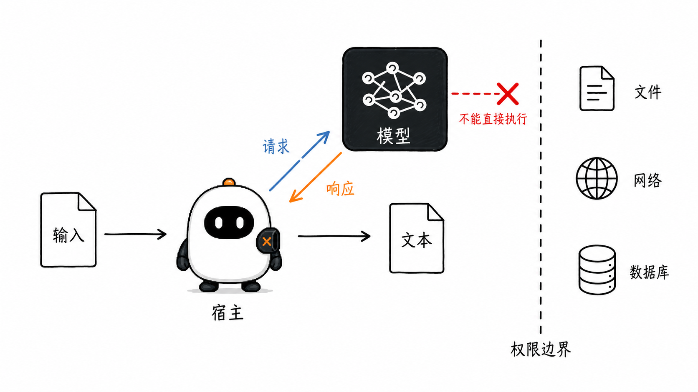
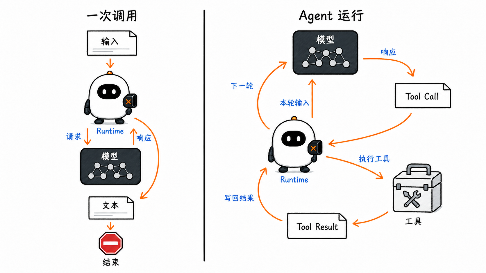
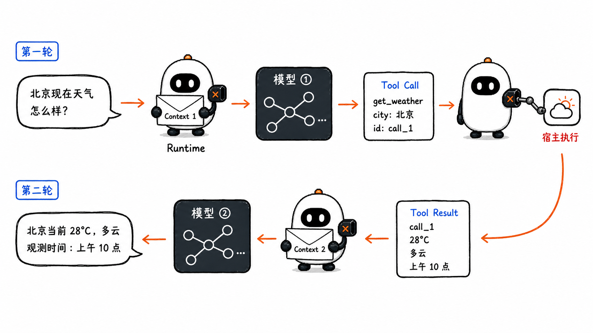
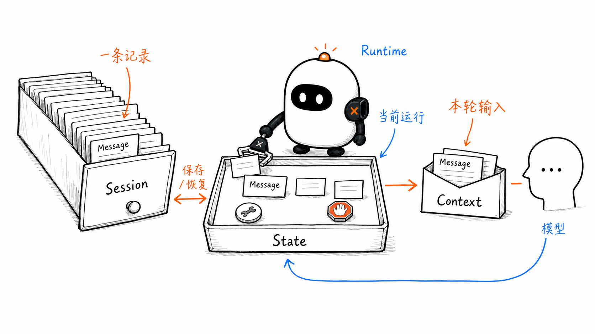
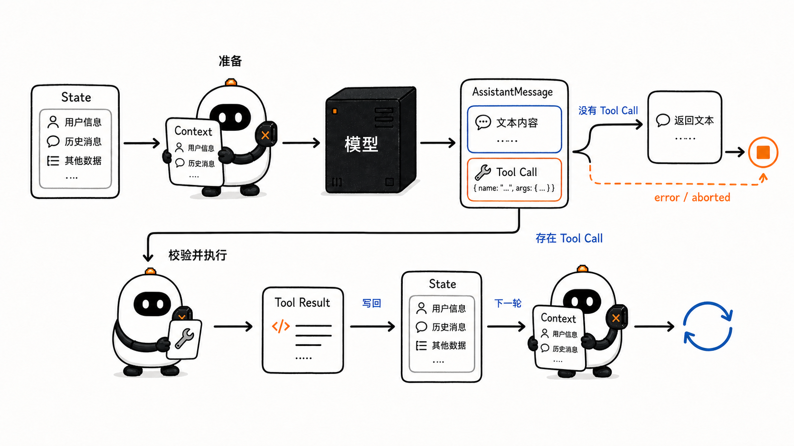
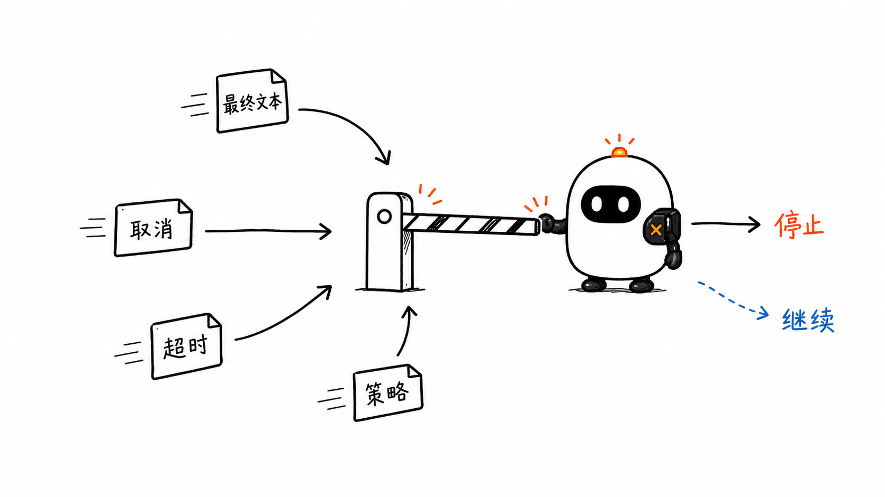
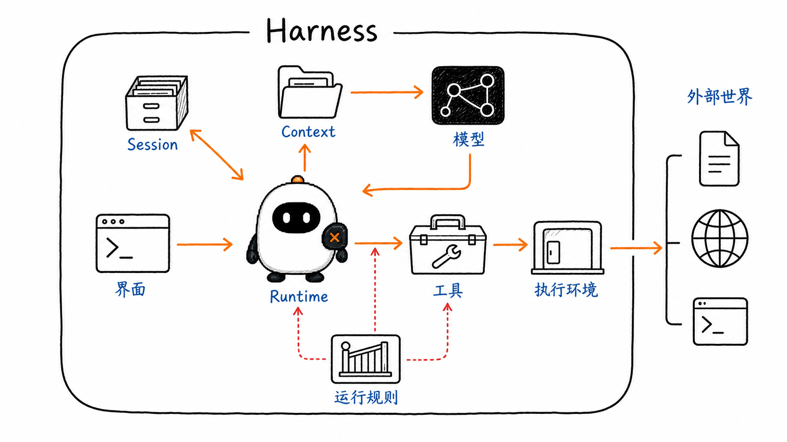

# 从一次模型调用到 Agent：理解 Runtime 与 Harness

这是 **learn-pi-agent** 的第一章。这个项目以 Pi Agent 为主线，从最基础的模型调用开始，逐步解释现代 Agent 如何运行，又是如何实现的。

第一章先回答一个基础问题：

> 一个会回答问题的大模型，怎样一步步变成一个能够完成任务的 Agent？

大模型最常见的工作方式，是接收输入并生成响应。向它问“法国的首都是什么？”，通常一次生成就能给出答案。

但如果任务变成“检查一个项目、修改出错的文件，并验证修改结果”，一次响应就不够了。模型需要查看项目，根据看到的内容决定下一步，调用工具执行动作，再根据新的结果继续判断。

从大模型到 Agent，增加的不是一个新的模型，而是一套围绕模型持续运行的程序。它保存任务进度，执行被允许的动作，再把结果交给模型，让模型继续决定下一步。

接下来，我们从一次最小的模型调用开始，一步步看清这套程序怎样把模型、工具和整个运行过程连接起来。

## 1. 先看一次模型调用

### 1.1 输入、生成与响应

模型调用从一份输入开始。负责准备输入和接收响应的程序，称为**宿主程序**。

下面的 `context` 表示宿主本次发送给模型的内容：

```ts
const context = {
  messages: [
    { role: "user", content: "法国的首都是什么？" },
  ],
};

const response = await model.generate(context);
```

这段代码只发生了三件事：

1. 宿主准备输入；
2. 模型根据输入生成响应；
3. 宿主接收响应。

为了让后面的示例使用同一套写法，可以把这次响应简化为：

```json
{
  "role": "assistant",
  "content": [
    { "type": "text", "text": "法国的首都是巴黎。" }
  ],
  "stopReason": "stop"
}
```

`content` 保存模型生成的内容，`stopReason` 说明这一次生成为什么结束。此时完成的是**一次模型调用**。



图中 Mox 表示宿主程序中的运行部分，模型是与它分开的黑盒。请求由宿主发送，响应也先回到宿主。

### 1.2 模型响应不会自动变成动作

模型可以在响应中写“我已经读取了 `README.md`”，也可以生成一段看起来像命令的文本。只有宿主真正调用了相应工具，读取文件或执行命令才会发生。

```text
模型生成请求 → 宿主检查请求 → 工具执行动作
```

因此，模型与宿主承担的职责不同：

| 事情 | 模型 | 宿主程序 |
| --- | --- | --- |
| 根据输入生成文本或结构化请求 | 负责 | 提供输入并接收响应 |
| 建议使用哪个工具及其参数 | 可以 | 校验后接受或拒绝 |
| 读取文件、访问网络、执行命令 | 不能直接完成 | 通过工具实际执行 |
| 保存运行记录、处理取消和超时 | 不负责 | 负责 |

模型提供判断，宿主负责让被允许的动作真正发生。这条边界贯穿整个 Agent 系统。

## 2. 从一次调用到一段 Agent 运行

一次模型调用很适合回答“法国的首都是什么”这类问题。用户如果问“北京现在天气怎么样”，模型还需要取得此刻的天气数据；用户如果要求修改项目，模型还需要查看文件、提出修改并检查结果。

这类任务不能只靠一次生成完成。系统需要反复经历下面的过程：

```text
准备本轮输入
    ↓
调用模型
    ↓
模型直接回答，或请求工具
    ↓
宿主执行工具并保存结果
    ↓
带着新结果进入下一轮
```

负责推动这个过程的程序部分叫作 **Runtime**。它位于宿主程序中，连接模型、工具和运行记录。重复执行的这一段过程叫作 **Agent Loop**。

模型返回的结构化工具请求称为 **Tool Call**，宿主执行后写回的结果称为 **Tool Result**。



因此，可以先得到一个实用的定义：

> Agent 是一个由 Runtime 组织的运行系统：模型根据当前输入提出下一步，Runtime 执行被允许的动作，并把结果带入下一轮，直到任务完成或运行被终止。

接下来用一条完整的天气查询，把这段定义落到具体数据上。

## 3. 一次天气查询怎样完成

用户提出问题：

```text
北京现在天气怎么样？
```

模型训练时学到的知识不能保证反映当前天气。宿主因此提供一个可以查询实时数据的工具：

```text
工具名：get_weather
用途：查询某个城市的当前天气
输入：{ city: string }
```

工具说明让模型知道“可以请求什么”；真正的天气服务仍由宿主调用。

### 3.1 Runtime 准备第一轮 Context

Runtime 把用户问题、必要的规则和工具说明组合成这次模型调用的输入。这份只供本轮调用使用的输入，称为 **Context**。

模型能依据的是当前 Context，而不是宿主拥有的全部数据。

### 3.2 模型返回 Tool Call

模型判断需要查询天气，于是在响应中返回一个 **Tool Call**：

```json
{
  "role": "assistant",
  "content": [
    {
      "type": "toolCall",
      "id": "call_1",
      "name": "get_weather",
      "arguments": { "city": "北京" }
    }
  ],
  "stopReason": "toolUse"
}
```

这里有三个关键信息：

- `name` 指明模型请求 `get_weather`；
- `arguments` 提供工具参数；
- `id` 标识这一次调用，后面的结果要用它完成关联。

`stopReason: "toolUse"` 表示这次模型生成停在了工具请求处。它不表示天气已经查到，也不表示整段 Agent 运行已经结束。

### 3.3 Runtime 校验并执行工具

Runtime 收到 Tool Call 后，依次确认：

1. `get_weather` 是否是宿主提供的工具；
2. `city` 是否符合工具声明的输入格式；
3. 当前运行是否允许这次调用；
4. 执行是否已经被取消或超过限制。

检查通过后，宿主才会访问天气服务。假设服务返回：

```json
{
  "temperature": "28°C",
  "condition": "多云",
  "observed_at": "2026-08-16T10:00:00+08:00"
}
```

### 3.4 Runtime 写入 Tool Result

Runtime 把天气数据包装成 **Tool Result**，并使用同一个调用标识 `call_1`：

```json
{
  "role": "toolResult",
  "toolCallId": "call_1",
  "toolName": "get_weather",
  "content": {
    "temperature": "28°C",
    "condition": "多云",
    "observed_at": "2026-08-16T10:00:00+08:00"
  },
  "isError": false
}
```

一轮中可能出现多个 Tool Call。`toolCallId` 让每个 Tool Result 都能找到原来的请求，系统不必依赖数组顺序猜测对应关系。

### 3.5 模型根据结果生成最终回答

Runtime 为第二次模型调用准备新的 Context，其中包含用户问题、Tool Call 和对应的 Tool Result。模型现在可以生成：

```json
{
  "role": "assistant",
  "content": [
    {
      "type": "text",
      "text": "北京当前 28°C，多云；观测时间为上午 10 点。"
    }
  ],
  "stopReason": "stop"
}
```

这次响应没有新的 Tool Call。Runtime 可以把文本作为运行结果返回，天气查询到此完成。

完整链路是：

```text
用户问题
  → 第一轮 Context
  → 模型返回 Tool Call
  → Runtime 校验并执行工具
  → Tool Result
  → 第二轮 Context
  → 模型返回文本
  → Runtime 返回结果
```



## 4. 给运行中的数据命名

天气示例中已经出现了用户问题、模型响应、工具结果、本轮输入和保存下来的会话记录。它们分别对应四个容易混淆的概念：**Message、Context、State 和 Session**。



图中的关系是：Session 保存可恢复的会话记录；加载会话后，Runtime 在 State 上推进当前运行；每次调用模型前，Runtime 再从 State 准备本轮 Context。新的模型响应和工具结果会更新 State，必要时也会保存回 Session。

### 4.1 Message：一条有来源的内容记录

**Message** 是一条交互记录。它需要说明内容由谁产生，以及内容是什么。

在天气示例中，下面这些都可以作为 Message 保存：

- 用户提出的天气问题；
- 模型返回的 Tool Call；
- 宿主写入的 Tool Result；
- 模型生成的最终回答。

Message 的内容不一定是纯文本，也可以是图片或结构化内容块。Message 只代表一条记录，不代表完整会话。

### 4.2 Context：模型这一次实际收到的输入

**Context** 是一次模型调用的输入快照。它通常由以下内容组成：

- 行为规则；
- 当前用户请求和选中的历史 Message；
- 本轮可用的工具说明；
- 完成当前任务需要的其他资料。

Context 每一轮都会重新准备。Tool Result 只有进入下一轮 Context，模型才能依据它继续生成。

宿主保存了某条记录，不等于模型本轮一定能看到它。Runtime 会根据当前任务和模型一次能够接收的输入长度，选择、转换或补充要发送的内容。

### 4.3 State：Runtime 推进任务所需的当前状态

**State** 保存当前运行正在发生什么。它的范围比 Context 更大，例如：

- 已产生的 Message；
- 当前使用的模型和可用工具；
- 正在执行的 Tool Call；
- 取消信号、错误和停止原因；
- 本轮是否仍在运行。

State 中既有模型需要看到的内容，也有只供 Runtime 使用的控制信息。可以把两者的关系写成：

```text
Context_t = prepare(State_t)
```

下标 `t` 表示第几轮。`prepare` 表示 Runtime 根据当时的 State，准备第 `t` 次模型调用的 Context。

### 4.4 Session：可以保存和恢复的会话

**Session** 保存跨回合延续的会话记录。程序关闭后再次打开或恢复以前的对话，都需要依靠 Session 中持久化的数据。

Session 不等于模型的永久记忆。Session 可以保存许多历史，但模型只能看到 Runtime 选入本轮 Context 的部分。

| 对象 | 它回答的问题 | 典型生命周期 | 是否直接发给模型 |
| --- | --- | --- | --- |
| Message | 这一条内容是谁产生的、内容是什么 | 一条记录 | 被选入 Context 时会 |
| Context | 这一次调用让模型看到什么 | 一次模型调用 | 会 |
| State | 当前运行进行到哪里 | Agent 运行期间 | 不会整体发送 |
| Session | 一段会话怎样保存和恢复 | 跨多次运行 | 不会整体发送 |

## 5. Agent Loop 怎样推进

天气示例只经过两次模型调用。任务更复杂时，同一套步骤会继续重复。Agent Loop 每轮都处理三个问题：本轮给模型什么、模型要求做什么、下一轮是否还要开始。

### 5.1 先看清循环的两个分支

每一轮都从最新的 State 开始。Runtime 准备 Context，调用模型，再把完整的 `AssistantMessage` 写回 State。接下来出现两个主要分支：

- 响应中没有 Tool Call，Runtime 返回模型生成的文本；
- 响应中存在 Tool Call，Runtime 处理工具请求，把对应的 Tool Result 写回 State，然后开始下一轮。



图中的 Mox 代表 Runtime，黑色方框代表模型。箭头回到 State，表示 Tool Result 已经成为新的运行记录；下一轮会从更新后的 State 再准备 Context。

一次响应可以同时包含文本和 Tool Call，也可以包含多个 Tool Call。因此，Runtime 要检查全部内容块，不能只读取一段文本，也不能只根据 `stopReason` 判断整段运行是否结束。

### 5.2 用 Pi 的真实命名写出循环

下面的代码沿用 Pi 的核心类型名、函数名和控制顺序，但压缩了字段与分支。它是一段可以编译的教学实现，不是从仓库中复制出来的源码。关键的压缩之处，代码里都标出了“教学简化”。

先看这段代码里的数据形状。`AgentContext` 保存当前运行所需的信息，`AgentMessage` 表示会进入消息记录的内容，`AgentLoopConfig` 保存循环配置。

```ts
type TextContent = {
  type: "text";
  text: string;
};

type ToolCall = {
  type: "toolCall";
  id: string;
  name: string;
  arguments: Record<string, unknown>;
};

// 教学简化：Pi 还定义了 pending 和 deferred 等状态。
type StopReason = "stop" | "length" | "toolUse" | "error" | "aborted";

// 教学简化：只保留循环判断会读取的字段。
type AssistantMessage = {
  role: "assistant";
  content: Array<TextContent | ToolCall>;
  stopReason: StopReason;
};

// 教学简化：真实 content 还可以包含图片，并带有 details 等字段。
type ToolResultMessage = {
  role: "toolResult";
  toolCallId: string;
  toolName: string;
  content: TextContent[];
  isError: boolean;
};

// 教学简化：这里只保留本章会遇到的三种消息。
type AgentMessage =
  | { role: "user"; content: string }
  | AssistantMessage
  | ToolResultMessage;

type AgentTool = {
  name: string;
  // 教学简化：真实 AgentTool 还接收取消信号和进度回调，
  // 并返回带有 details 的 AgentToolResult。
  execute(
    toolCallId: string,
    arguments_: Record<string, unknown>,
  ): Promise<TextContent[]>;
};

type AgentContext = {
  systemPrompt: string;
  messages: AgentMessage[];
  tools?: AgentTool[];
};

type ToolExecutionMode = "sequential" | "parallel";

// 教学简化：完整配置还包含模型、上下文转换和各种回调。
type AgentLoopConfig = {
  // 这是 Pi 中真实存在的配置项；本例仍统一按顺序执行工具。
  toolExecution?: ToolExecutionMode;
};

// 教学简化：真实 StreamFn 返回一个事件流，而不是一次性返回消息。
type StreamFn = (context: AgentContext) => Promise<AssistantMessage>;

type ExecutedToolCallBatch = {
  messages: ToolResultMessage[];
  terminate: boolean;
};

// 教学辅助函数：把失败原因组装成一条 Tool Result。
function makeToolError(call: ToolCall, text: string): ToolResultMessage {
  return {
    role: "toolResult",
    toolCallId: call.id,
    toolName: call.name,
    content: [{ type: "text", text }],
    isError: true,
  };
}

async function streamAssistantResponse(
  currentContext: AgentContext,
  streamFn: StreamFn,
): Promise<AssistantMessage> {
  // 教学简化：真实 Pi 会边接收事件，边更新 messages 中的消息。
  const message = await streamFn(currentContext);
  currentContext.messages.push(message);
  return message;
}

async function failToolCallsFromTruncatedMessage(
  toolCalls: ToolCall[],
): Promise<ExecutedToolCallBatch> {
  return {
    messages: toolCalls.map((call) =>
      makeToolError(call, "工具参数可能因输出截断而不完整，未执行。"),
    ),
    terminate: false,
  };
}

async function executeToolCalls(
  currentContext: AgentContext,
  assistantMessage: AssistantMessage,
  config: AgentLoopConfig,
): Promise<ExecutedToolCallBatch> {
  // 教学简化：真实 Pi 会根据 config.toolExecution 选择顺序或并行执行，
  // 还会校验参数、发送事件，并运行工具执行前后的检查函数。
  void config;

  const toolCalls = assistantMessage.content.filter(
    (item): item is ToolCall => item.type === "toolCall",
  );
  const messages: ToolResultMessage[] = [];

  for (const call of toolCalls) {
    const tool = currentContext.tools?.find((item) => item.name === call.name);

    if (!tool) {
      messages.push(makeToolError(call, `找不到工具：${call.name}`));
      continue;
    }

    try {
      const content = await tool.execute(call.id, call.arguments);
      messages.push({
        role: "toolResult",
        toolCallId: call.id,
        toolName: call.name,
        content,
        isError: false,
      });
    } catch {
      messages.push(makeToolError(call, `工具执行失败：${call.name}`));
    }
  }

  return { messages, terminate: false };
}

async function runAgentLoop(
  prompts: AgentMessage[],
  context: AgentContext,
  config: AgentLoopConfig,
  streamFn: StreamFn,
): Promise<AgentMessage[]> {
  // newMessages 只记录本次运行新产生或新传入的消息。
  const newMessages: AgentMessage[] = [...prompts];

  // currentContext 在旧消息之后接上本次输入，供循环持续使用。
  const currentContext: AgentContext = {
    ...context,
    messages: [...context.messages, ...prompts],
  };

  // 教学简化：真实签名还接收发送事件的 emit 和取消运行的 signal。
  await runLoop(currentContext, newMessages, config, streamFn);
  return newMessages;
}

async function runLoop(
  initialContext: AgentContext,
  newMessages: AgentMessage[],
  config: AgentLoopConfig,
  streamFn: StreamFn,
): Promise<void> {
  let currentContext = initialContext;

  // 教学简化：真实 Pi 外层还会处理运行中追加的消息与后续消息。
  let hasMoreToolCalls = true;

  while (hasMoreToolCalls) {
    // ① 调用模型。streamAssistantResponse 会把完整响应写入 currentContext。
    const message = await streamAssistantResponse(currentContext, streamFn);

    // ② 同一条响应也写入 newMessages，最后由 runAgentLoop 返回。
    newMessages.push(message);

    // ③ 模型调用失败或被取消，本次循环结束。
    if (message.stopReason === "error" || message.stopReason === "aborted") {
      return;
    }

    // ④ 是否执行工具，由响应中有没有 Tool Call 决定。
    const toolCalls = message.content.filter(
      (item): item is ToolCall => item.type === "toolCall",
    );

    // ⑤ 没有 Tool Call，模型的这条消息就是本轮最终响应。
    if (toolCalls.length === 0) {
      return;
    }

    // ⑥ 参数可能被截断时生成失败结果；否则进入工具执行阶段。
    const executedToolBatch =
      message.stopReason === "length"
        ? await failToolCallsFromTruncatedMessage(toolCalls)
        : await executeToolCalls(currentContext, message, config);

    // ⑦ 每个 Tool Result 同时进入当前上下文和本次新增消息。
    for (const result of executedToolBatch.messages) {
      currentContext.messages.push(result);
      newMessages.push(result);
    }

    // ⑧ 工具阶段没有要求终止时，带着 Tool Result 进入下一轮模型调用。
    hasMoreToolCalls = !executedToolBatch.terminate;
  }
}
```

天气示例可以和代码逐步对应起来：

1. `runAgentLoop` 把“北京现在天气怎么样？”加入 `currentContext`；
2. 第一次 `streamAssistantResponse` 返回含有 `call_1` 的 `AssistantMessage`；
3. `executeToolCalls` 找到 `get_weather`，生成与 `call_1` 对应的 `ToolResultMessage`；
4. 这条结果进入 `currentContext.messages`，因此下一次模型调用能够看到它；
5. 第二次模型响应不再包含 Tool Call，`runLoop` 结束；
6. `runAgentLoop` 返回 `newMessages`，其中保留了用户输入、两次模型响应和工具结果。

这里有一个容易混淆的地方：`stopReason: "toolUse"` 表示这一次模型生成停在了工具请求处，不表示整个 Agent Loop 已经结束。循环是否继续，要看响应中是否存在 Tool Call，以及工具执行阶段是否要求终止。

与完整 Pi 实现相比，本章保留和压缩的内容如下：

| Pi 中的名称 | 本章保留的部分 | 完整实现还会处理 |
| --- | --- | --- |
| `AgentContext`、`AgentMessage` | 系统提示、消息、工具与三种消息类型 | 自定义消息转换及更完整的消息字段 |
| `runAgentLoop`、`runLoop` | 建立上下文、推进模型与工具循环、返回新增消息 | 事件、取消信号、运行中追加的消息与后续消息 |
| `streamAssistantResponse`、`StreamFn` | 获得并保存一条模型响应 | 流式事件、增量内容、模型与服务商参数 |
| `executeToolCalls` | 查找工具、执行工具、生成对应结果 | 参数校验、钩子、取消以及顺序或并行调度 |

这些结构来自固定版本的 [`agent-loop.ts`](https://github.com/earendil-works/pi/blob/086c32e74530564922d011ade23ff582c9d63116/packages/agent/src/agent-loop.ts)、[`pi-ai/types.ts`](https://github.com/earendil-works/pi/blob/086c32e74530564922d011ade23ff582c9d63116/packages/ai/src/types.ts) 和 [`pi-agent-core/types.ts`](https://github.com/earendil-works/pi/blob/086c32e74530564922d011ade23ff582c9d63116/packages/agent/src/types.ts) 中。第 3 章会进入同一固定版本的 Agent Loop 源码，补上本章压缩掉的事件、流式响应和消息调度；第 4 章再展开工具执行。

### 5.3 Tool Call 的执行边界

教学版 `executeToolCalls` 已经写出了名称查找、工具执行和结果配对。完整的工具执行链还要保证：

1. 从 `AssistantMessage` 中取出全部 Tool Call；
2. 按名称找到已注册的工具；
3. 按照工具声明准备并校验参数；
4. 检查取消信号，并运行工具调用前的钩子，也就是可在执行前拦截调用的回调函数；
5. 调用工具，把成功或失败转换成 Tool Result；
6. 用 `toolCallId` 把结果与原始请求一一对应；
7. 把结果写回消息记录，让下一次模型调用能够看到。

查不到工具、参数不合格或工具调用被阻止时，外部动作都不应该发生。Pi 会生成 `isError: true` 的 Tool Result，把失败原因交给下一轮模型处理。

当模型响应因为长度上限而中断时，Tool Call 的参数也可能被截断。Pi 的 Agent Loop 不会执行这类调用，而是为每个调用生成失败结果，再让模型有机会重新提出完整请求。这一行为可以在固定版本的 [`agent-loop.ts`](https://github.com/earendil-works/pi/blob/086c32e74530564922d011ade23ff582c9d63116/packages/agent/src/agent-loop.ts#L188-L205) 中看到。

## 6. Runtime：谁推动循环，谁落实停止

现在可以更准确地说明 Runtime 的职责。它是宿主程序中负责推进一次 Agent 运行的部分：

- 根据 State 准备 Context；
- 调用模型并保存响应；
- 识别、校验和分发 Tool Call；
- 把 Tool Result 写回 State；
- 处理取消、错误和运行限制；
- 决定开始下一轮，或把运行状态返回给上层程序。

宿主程序是完整应用，可能还包含命令行界面、会话存储和工具实现；Runtime 是其中控制运行过程的核心部分。

### 6.1 模型结束生成，不等于 Agent 一定结束

`stopReason` 说明模型为什么停止**本次生成**。Runtime 还要结合响应内容和运行规则，判断整段 Agent 运行怎样变化：

| 信号或情况 | Runtime 的处理 |
| --- | --- |
| 正常停止，且没有 Tool Call | 返回文本，运行完成 |
| 响应中存在 Tool Call | 处理工具，通常进入下一轮 |
| 生成达到长度上限 | 不把结果误报为完整完成；不执行可能被截断的工具参数 |
| 模型调用出错或被中止 | 保存原因，结束当前运行 |
| 用户取消、超时或达到资源上限 | 阻止新的调用，并结束运行 |
| 工具被拒绝或执行失败 | 写入失败结果，再按运行规则继续或结束 |



停止信号可以来自模型、用户、工具或运行限制；把信号转换成“继续、完成、失败或取消”等明确状态，是 Runtime 的职责。

### 6.2 循环必须守住的五条边界

一个可靠的 Agent Loop 至少要保证：

1. **模型提出工具请求，宿主执行动作。** Tool Call 本身不会修改文件、访问网络或改变其他外部状态。
2. **Tool Call 与 Tool Result 使用标识关联。** 多个调用不能靠位置猜测。
3. **每轮重新准备 Context。** 新的工具结果和用户消息要有机会进入下一次调用。
4. **不同结束原因不能混成一个“结束”。** 完成、失败、取消和未完整输出需要分开记录。
5. **外部动作受宿主环境控制。** 文件、网络、命令和数据库操作不能由模型响应直接触发。

## 7. Harness：把完整运行环境装配起来

Runtime 解决“循环怎样推进”。一个真正可用的 Agent 还需要模型连接、工具、会话保存、界面和执行环境。把这些部分装配在一起的完整运行层，通常称为 **Agent Harness**。

```text
Harness
  = 模型连接
  + Runtime
  + Context 准备
  + 工具
  + Session
  + 运行规则
  + 执行环境与界面
```

Harness 不是一种消息协议，而是工程上对完整运行层的称呼。Runtime 是它的控制核心，模型、工具和存储则是被它组织起来的组成部分。



### 7.1 Pi 怎样拆分这些职责

Pi 官方把项目称为 **Pi Agent Harness**。在本仓库固定的源码版本中，三部分构成了最清晰的学习主线：

| Pi 包 | 主要职责 | 对应本章概念 |
| --- | --- | --- |
| `@earendil-works/pi-ai` | 连接不同模型服务，统一模型、消息和逐步返回的响应 | 模型调用层 |
| `@earendil-works/pi-agent-core` | 维护 Agent Loop 和 State，执行工具并报告运行变化 | Runtime |
| `@earendil-works/pi-coding-agent` | 装配会话、工具和命令行，形成可使用的编程 Agent | Harness 应用 |

Pi 把核心循环保持得较小，同时提供扩展入口。新的工具、命令、界面行为和运行钩子可以接入 Harness，而不必把所有定制都写进 Agent Loop。

这些职责可以在 Pi 固定版本的 [README](https://github.com/earendil-works/pi/blob/086c32e74530564922d011ade23ff582c9d63116/README.md#pi-agent-harness) 和 [`agent-loop.ts`](https://github.com/earendil-works/pi/blob/086c32e74530564922d011ade23ff582c9d63116/packages/agent/src/agent-loop.ts#L141-L256) 中对应起来。

## 本章小结

- 一次模型调用只有“准备输入—模型生成—接收响应”；模型响应不会自动执行外部动作。
- Agent 通过 Runtime 把模型调用、工具执行和新一轮输入连接成循环。
- Tool Call 是模型提出的结构化请求，Tool Result 是宿主执行后写回的结果；两者通过调用标识关联。
- Message 是一条内容记录，Context 是本轮模型输入，State 是当前运行状态，Session 是可保存和恢复的会话记录。
- `stopReason` 结束的是一次模型生成；Runtime 根据响应内容和运行规则，落实整段 Agent 运行的继续或停止。
- Harness 把 Runtime、模型连接、工具、Session、执行环境和界面装配成完整 Agent 系统；Pi 正是沿着这条思路组织代码。

## 参考资料

- [Pi Agent Harness：固定版本 README](https://github.com/earendil-works/pi/blob/086c32e74530564922d011ade23ff582c9d63116/README.md)：Pi 的包结构、定位与运行权限说明。
- [Pi Agent Loop：固定版本源码](https://github.com/earendil-works/pi/blob/086c32e74530564922d011ade23ff582c9d63116/packages/agent/src/agent-loop.ts)：模型响应、工具执行、结果写回和循环结束的实际实现。
- [ReAct: Synergizing Reasoning and Acting in Language Models](https://arxiv.org/abs/2210.03629)：把推理与外部动作交替组织起来的经典研究。
- [Toolformer: Language Models Can Teach Themselves to Use Tools](https://arxiv.org/abs/2302.04761)：研究语言模型如何学习何时调用外部工具。
