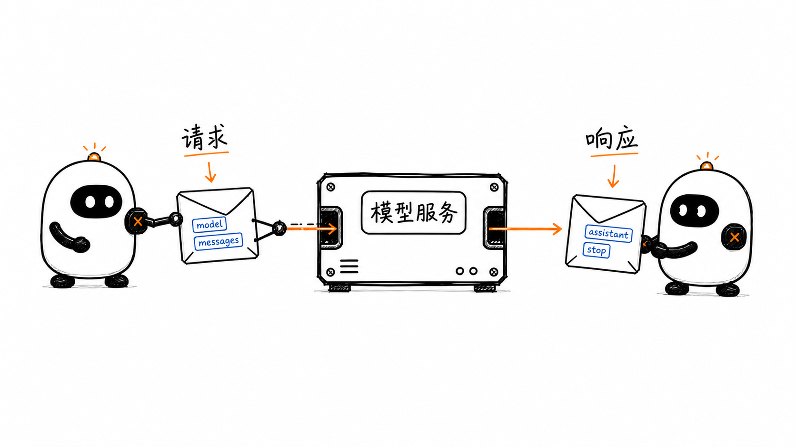
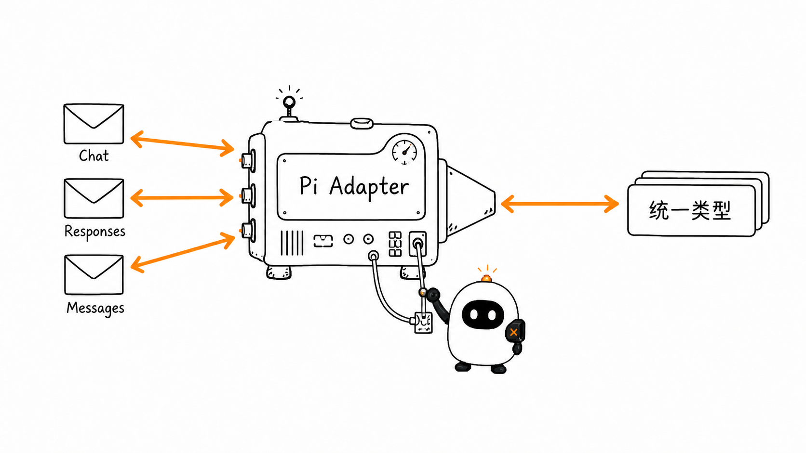
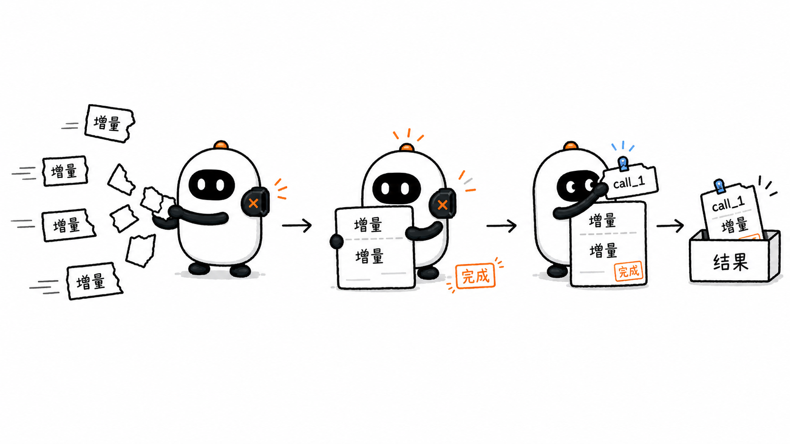

# 模型 API 与消息协议：OpenAI、Anthropic 与 Pi

第一章用下面这行代码表示一次模型调用：

```ts
const response = await model.generate(context);
```

这行代码帮助我们先看清 Agent Loop，却隐藏了宿主程序与模型服务之间的通信过程。通过 OpenAI、Anthropic 这类在线服务调用大模型时，宿主程序需要按照服务规定的格式发送请求，再按照同一套格式读取响应。

这种由调用地址、请求结构、响应结构和交互规则组成的接口就是**模型 API**。它规定请求里怎样表示消息和工具，响应里怎样表示文本、工具调用与停止信息。

OpenAI Chat Completions、OpenAI Responses 和 Anthropic Messages 都能完成这些事情，但使用的字段并不相同。Pi 的 `pi-ai` 位于这条边界上：它把统一的 Context 转换成供应商请求，再把不同响应转换回 Agent Runtime 能理解的消息。

本章仍然沿用两个熟悉的例子：

- “法国的首都是什么？”用来观察普通文本调用；
- “北京现在天气怎么样？”用来观察 Tool Call 与 Tool Result。

## 1. 一次真实的 API 调用怎样表达

先从 OpenAI Chat Completions 的文本请求开始。宿主把一组对话消息提交到 `/v1/chat/completions`：

```json
{
  "model": "your-model",
  "messages": [
    {
      "role": "user",
      "content": "法国的首都是什么？"
    }
  ]
}
```

JSON 是一种用键和值表示结构化数据的文本格式。这份 JSON 是请求体，也就是宿主发送给服务的主要数据。两个字段分别表达：

- `model`：这次要调用哪个模型；
- `messages`：这次要交给模型的消息。

服务完成生成后，会返回一份响应。下面保留与本章有关的字段：

```json
{
  "choices": [
    {
      "message": {
        "role": "assistant",
        "content": "法国的首都是巴黎。"
      },
      "finish_reason": "stop"
    }
  ]
}
```

宿主程序从 `choices[0].message` 取得模型消息，从 `finish_reason` 取得这一次生成的停止信息。

请求和响应共同组成一次 API 调用：

```text
宿主准备 JSON 请求
        ↓
发送到模型 API
        ↓
模型服务生成响应
        ↓
宿主读取 JSON 响应
```



### 1.1 `role` 标记消息在协议中的角色

消息中的 `role` 表示这条记录在对话协议中承担什么角色。常见角色包括：

| 角色 | 表达的内容 |
| --- | --- |
| `system` / `developer` | 应用提供的行为说明或高优先级指令 |
| `user` | 用户输入或宿主放入用户侧的内容 |
| `assistant` | 模型生成的内容 |
| `tool` | OpenAI Chat Completions 中的工具结果 |

这些名字属于 API 协议。不同 API 对同一种内容可能使用不同角色。例如，Anthropic 把工具结果放进 `user` 消息里的 `tool_result` 内容块，而不是使用 `tool` 角色。

因此，看到 `role: "user"` 时，应先理解它在当前协议里的位置，不能只按日常语言推断“这一定是人手动输入的”。

### 1.2 `content` 不一定只是一段字符串

最简单的 `content` 是字符串：

```json
{
  "role": "user",
  "content": "法国的首都是什么？"
}
```

当一条消息需要容纳多个部分时，API 可以把 `content` 组织成多个有类型的**内容块**。例如，Anthropic Messages 中的一段文字使用下面这个真实结构：

```json
{
  "role": "user",
  "content": [
    {
      "type": "text",
      "text": "法国的首都是什么？"
    }
  ]
}
```

这里的 `type: "text"` 说明这个 block 是文字。其他内容也会使用自己的类型和字段；后面的 Anthropic 与 Responses 示例会分别展示它们的真实格式。

可以先记住两个层次：

```text
Message：说明整条记录由哪个协议角色承载
Content Block：说明记录里每一部分是什么
```

### 1.3 SDK 把 API 调用包装成语言方法

直接发送请求时，宿主要自己处理地址、请求头和 JSON。SDK 把这些步骤包装成 TypeScript、Python 等语言中的方法。

使用 OpenAI TypeScript SDK 时，同一次调用可以写成：

```ts
import OpenAI from "openai";

const client = new OpenAI();

const completion = await client.chat.completions.create({
  model: "your-model",
  messages: [
    { role: "user", content: "法国的首都是什么？" },
  ],
});
```

`your-model` 是模型 ID 的占位符，运行时要换成服务实际提供的模型。`new OpenAI()` 默认从 `OPENAI_API_KEY` 环境变量读取 API key；它是服务发给调用者的访问凭据，不应直接写进源码或提交到仓库。

`client.chat.completions.create(...)` 是 SDK 方法；它最终仍要按照 Chat Completions API 的格式发送请求。

现在可以区分三个层次：

| 层次 | 解决的问题 | 例子 |
| --- | --- | --- |
| API | 应用与模型服务交换什么数据 | `messages`、`tool_calls`、`finish_reason` |
| SDK | 在某种编程语言里怎样方便地调用 API | `client.chat.completions.create(...)` |
| Runtime | 怎样反复调用模型、执行工具并推进任务 | 第一章的 Agent Loop |

SDK 可以提供便捷方法，但不会自动等于完整的 Agent Runtime。是否管理循环、工具和会话，要看具体 SDK 提供了哪一层能力。

## 2. OpenAI Chat Completions：消息里的 Tool Call

普通文本调用只需要 `messages`。当模型可以请求工具时，宿主还要在请求中提供工具说明。

### 2.1 用 `tools` 告诉模型有哪些能力

天气工具可以这样声明：

```json
{
  "model": "your-model",
  "messages": [
    {
      "role": "user",
      "content": "北京现在天气怎么样？"
    }
  ],
  "tools": [
    {
      "type": "function",
      "function": {
        "name": "get_weather",
        "description": "查询某个城市的当前天气",
        "parameters": {
          "type": "object",
          "properties": {
            "city": {
              "type": "string",
              "description": "城市名称，例如北京"
            }
          },
          "required": ["city"],
          "additionalProperties": false
        },
        "strict": true
      }
    }
  ]
}
```

`parameters` 描述工具接受什么参数。它帮助模型生成结构化输入，也帮助宿主检查参数形状；真正的 `get_weather` 实现仍然在宿主程序中。

### 2.2 模型用 `tool_calls` 提出请求

模型决定查询天气时，返回的 assistant message 可能包含：

```json
{
  "role": "assistant",
  "content": null,
  "tool_calls": [
    {
      "id": "call_1",
      "type": "function",
      "function": {
        "name": "get_weather",
        "arguments": "{\"city\":\"北京\"}"
      }
    }
  ]
}
```

这里有三个关键字段：

- `id` 标识这一次工具调用；
- `name` 指明要调用 `get_weather`；
- `arguments` 提供参数。

在 Chat Completions 的这个结构中，`arguments` 是一段 JSON 字符串。宿主需要先解析它，再进行参数校验。它看起来像对象，并不意味着已经通过检查。

这条 `message` 所在的 `choice` 通常还会带有：

```json
{
  "finish_reason": "tool_calls"
}
```

它表示模型本次生成停在了工具调用处，不表示工具已经执行。

### 2.3 工具结果使用 `role: "tool"`

宿主执行 `get_weather` 后，把 assistant 的完整 Tool Call 和对应结果放入下一次请求。工具结果写成：

```json
{
  "role": "tool",
  "tool_call_id": "call_1",
  "content": "{\"temperature\":\"28°C\",\"condition\":\"多云\"}"
}
```

`tool_call_id` 与原来的 `id` 都是 `call_1`。模型由此知道这份天气数据回答了哪一个请求。

这条协议链可以压缩成：

```text
assistant.tool_calls[].id
            ↓
      宿主执行工具
            ↓
tool.tool_call_id
```

## 3. Anthropic Messages：Tool Use 也是内容块

Anthropic Messages API 同样接收消息并返回 assistant 响应，但它更明确地使用内容块表达文本和工具调用。

### 3.1 文本请求与响应

同一个文本请求可以写成：

```json
{
  "model": "your-model",
  "max_tokens": 1024,
  "system": "你是一个简洁、准确的助手。",
  "messages": [
    {
      "role": "user",
      "content": [
        {
          "type": "text",
          "text": "法国的首都是什么？"
        }
      ]
    }
  ]
}
```

与 Chat Completions 相比，有两个直接可见的差别：

- 高优先级说明放在顶层 `system` 字段；
- 普通消息使用 `user` 和 `assistant` 角色，内容可以由多个 block 组成。

响应的核心部分可以写成：

```json
{
  "role": "assistant",
  "content": [
    {
      "type": "text",
      "text": "法国的首都是巴黎。"
    }
  ],
  "stop_reason": "end_turn"
}
```

`stop_reason: "end_turn"` 表示模型自然结束了这一次响应。

### 3.2 工具定义使用 `input_schema`

Anthropic 请求的 `tools` 数组中，天气工具这一项可以这样声明：

```json
{
  "name": "get_weather",
  "description": "查询某个城市的当前天气",
  "input_schema": {
    "type": "object",
    "properties": {
      "city": {
        "type": "string",
        "description": "城市名称，例如北京"
      }
    },
    "required": ["city"]
  }
}
```

作用仍然相同：告诉模型工具叫什么、用来做什么、参数是什么形状。

### 3.3 模型返回 `tool_use` block

模型请求天气工具时，Tool Call 位于 assistant message 的 `content` 中：

```json
{
  "role": "assistant",
  "content": [
    {
      "type": "text",
      "text": "我先查询北京的实时天气。"
    },
    {
      "type": "tool_use",
      "id": "toolu_1",
      "name": "get_weather",
      "input": {
        "city": "北京"
      }
    }
  ],
  "stop_reason": "tool_use"
}
```

与 Chat Completions 相比，这里的参数已经位于 `input` 对象中，但宿主仍然需要校验它。`stop_reason: "tool_use"` 同样只表示本次生成需要宿主处理工具。

### 3.4 工具结果是 user message 中的 `tool_result`

工具执行后，宿主把结果放进一条新的 user message：

```json
{
  "role": "user",
  "content": [
    {
      "type": "tool_result",
      "tool_use_id": "toolu_1",
      "content": "{\"temperature\":\"28°C\",\"condition\":\"多云\"}"
    }
  ]
}
```

这里的 `role: "user"` 是 Anthropic Messages 协议承载工具结果的方式，并不表示结果由用户亲自编写。`tool_use_id` 把结果与原来的 `tool_use.id` 关联起来。

Anthropic 对消息顺序还有明确要求：包含 `tool_result` 的 user message 必须紧跟对应的 assistant `tool_use` message；如果同一条 user message 还包含普通文本，所有 `tool_result` block 必须排在普通文本之前。一轮出现多个 `tool_use` 时，下一条 user message 应为每个调用返回对应结果。

对应关系是：

```text
assistant.content[].tool_use.id
                 ↓
           宿主执行工具
                 ↓
user.content[].tool_result.tool_use_id
```

## 4. OpenAI Responses：消息之外还有 Item

OpenAI 还提供 Responses API。[OpenAI 当前的模型指南](https://developers.openai.com/api/docs/guides/latest-model)把 Responses 作为推理、工具调用和多轮工作流的主要接口；Chat Completions 仍然存在，但两者的数据形状不同。

### 4.1 输入使用 `input`

最小文本调用可以直接发送字符串：

```json
{
  "model": "your-model",
  "input": "法国的首都是什么？"
}
```

也可以明确写出消息和内容块：

```json
{
  "model": "your-model",
  "instructions": "你是一个简洁、准确的助手。",
  "input": [
    {
      "role": "user",
      "content": [
        {
          "type": "input_text",
          "text": "法国的首都是什么？"
        }
      ]
    }
  ]
}
```

Responses 返回的是一组 `output` item。文本消息只是 item 类型之一：

```json
{
  "status": "completed",
  "output": [
    {
      "type": "message",
      "role": "assistant",
      "content": [
        {
          "type": "output_text",
          "text": "法国的首都是巴黎。"
        }
      ]
    }
  ]
}
```

SDK 提供的 `response.output_text` 可以方便地汇总文本，但底层 `output` 还可能包含函数调用等其他 item。Runtime 不能假设 `output[0]` 永远是一条文本消息。

### 4.2 函数工具直接放在 `tools` 中

Responses 的函数工具没有 Chat Completions 中的外层 `function` 对象：

```json
{
  "type": "function",
  "name": "get_weather",
  "description": "查询某个城市的当前天气",
  "parameters": {
    "type": "object",
    "properties": {
      "city": { "type": "string" }
    },
    "required": ["city"],
    "additionalProperties": false
  },
  "strict": true
}
```

模型请求工具时，`output` 中出现一个 `function_call` item：

```json
{
  "type": "function_call",
  "id": "fc_1",
  "call_id": "call_1",
  "name": "get_weather",
  "arguments": "{\"city\":\"北京\"}"
}
```

宿主执行工具后，把结果作为新的 input item 传回：

```json
{
  "type": "function_call_output",
  "call_id": "call_1",
  "output": "{\"temperature\":\"28°C\",\"condition\":\"多云\"}"
}
```

这里用于关联的是 `call_id`。`id` 标识 Responses 中的 output item，`call_id` 标识这一次函数调用；工具结果需要使用后者。

## 5. 三种协议表达的是同一条语义链

把三种格式放在一起，可以看到字段不同，但 Agent Runtime 关心的事实相似：

| 共同语义 | OpenAI Chat Completions | OpenAI Responses | Anthropic Messages |
| --- | --- | --- | --- |
| 应用指令 | `system` / `developer` message | `instructions` 或输入消息 | 顶层 `system` |
| 普通输入 | `messages` | `input` items | `messages` |
| 模型文本 | `choices[].message.content` | `output` 中的 message item | assistant 的 `text` block |
| 工具声明 | `tools[].function` | `tools[]` 中的 function item | `tools[]` 与 `input_schema` |
| 工具调用 | `assistant.tool_calls[]` | `function_call` output item | assistant 的 `tool_use` block |
| 调用标识 | `tool_calls[].id` | `function_call.call_id` | `tool_use.id` |
| 工具结果 | `role: "tool"` | `function_call_output` input item | user 的 `tool_result` block |
| 本次生成状态 | `finish_reason` | response `status` 与 output items | `stop_reason` |

最重要的不变量是：

```text
模型给出结构化工具请求
          ↓
宿主按名称找到并执行工具
          ↓
工具结果使用同一个调用标识写回
          ↓
模型在下一次输入中看到结果
```

协议决定这条链在网络数据中怎样编码，Agent Loop 决定怎样执行并继续它。

## 6. Pi 怎样吸收协议差异

如果 Agent Loop 直接读取供应商字段，循环里会到处出现判断：

```ts
if (api === "openai-completions") {
  // 读取 assistant.tool_calls
} else if (api === "anthropic-messages") {
  // 读取 assistant.content 中的 tool_use
}
```

工具执行、会话记录和界面随后也会被同样的条件分支影响。Pi 把这些差异留在 `pi-ai` 的模型边界，把 Agent Runtime 需要的共同事实转换成统一类型。



### 6.1 Provider 与 API 不是同一个概念

在 Pi 的 `Model` 类型中，有两个容易混淆的字段：

| 字段 | 表示什么 | 示例 |
| --- | --- | --- |
| `provider` | 模型服务由谁提供 | `openai`、`anthropic`、`openrouter` |
| `api` | 实际使用哪一种通信协议 | `openai-responses`、`anthropic-messages`、`openai-completions` |

一个 Provider 可以提供多个模型；不同 Provider 也可能使用同一种 API 形状。例如，许多服务提供“OpenAI-compatible”接口，Pi 可以通过 `openai-completions` 实现与它们通信。

但“兼容”不表示所有行为完全相同。不同服务可能不支持 `developer` 角色、`strict` 工具模式、某个输出长度字段或完整的 `finish_reason`。Pi 的兼容配置正是用来记录和处理这些差异。

因此，更准确的关系是：

```text
Provider：服务来源、模型目录与访问凭据
API：请求、响应和流式事件的协议形状
Model：某个 Provider 中可以调用的具体模型
```

访问凭据是宿主用来证明自己可以调用服务的信息，例如 API key。Provider 负责找到对应凭据，并把请求交给所属模型。

### 6.2 Pi 的统一消息类型

本文源码基线中的 [`packages/ai/src/types.ts`](https://github.com/earendil-works/pi/blob/086c32e74530564922d011ade23ff582c9d63116/packages/ai/src/types.ts) 定义了下面这些核心关系：

```ts
type Message = UserMessage | AssistantMessage | ToolResultMessage;

interface Context {
  systemPrompt?: string;
  messages: Message[];
  tools?: Tool[];
}

interface ToolCall {
  type: "toolCall";
  id: string;
  name: string;
  arguments: Record<string, any>;
}

type StopReason =
  | "pending"
  | "stop"
  | "length"
  | "toolUse"
  | "error"
  | "aborted"
  | "deferred";
```

这段代码按 Pi 的真实名称摘出了本章需要的字段。`Record<string, any>` 表示一个以字符串为键、值类型暂不限定的对象。完整的 `ToolCall` 还保留供应商特有信息，完整的消息类型还包含模型、用量、时间戳和错误等字段。

转换以后，同一个天气调用可以统一理解为：

```json
{
  "role": "assistant",
  "content": [
    {
      "type": "toolCall",
      "id": "pi-tool-call-id",
      "name": "get_weather",
      "arguments": {
        "city": "北京"
      }
    }
  ],
  "stopReason": "toolUse"
}
```

这里同样只展示与协议转换有关的字段。Pi 的 Agent Loop 看到的是统一的 `toolCall`，不需要知道它最初来自：

- Chat Completions 的 `tool_calls`；
- Responses 的 `function_call`；
- Anthropic Messages 的 `tool_use`。

示例中的 `pi-tool-call-id` 只是教学占位符。Runtime 应把 `ToolCall.id` 视为一个不可拆解的关联标识：原样交给工具执行，并原样写入 `ToolResultMessage.toolCallId`，不要自行解析或重新生成。Pi 的 Responses Adapter 会在这个字段中同时保留上游 `call_id` 与 output item `id`，回传结果时再恢复 Responses 需要的 `call_id`；这是适配层的实现细节，Agent Loop 不需要感知。

工具执行完成后，Agent Runtime 会创建 Pi 的 `ToolResultMessage`，并通过 `toolCallId` 与原调用关联。下一次调用模型时，`pi-ai` 的适配器再把这条统一消息编码成 Chat Completions 的 `role: "tool"`、Responses 的 `function_call_output`，或者 Anthropic Messages 的 `tool_result`。

### 6.3 `complete` 把不同 API 收敛成同一种调用方式

第一章的 `model.generate(context)` 是教学抽象。在 Pi 的 `pi-ai` 中，获得完整响应的调用更接近：

```ts
const response = await models.complete(model, context);
```

这里：

- `models` 是一个 `Models` 对象，它保存已注册的 Provider，并把请求交给拥有该模型的 Provider；
- `model` 同时带有 `provider` 与 `api` 信息；
- `context` 使用 Pi 的统一消息与工具类型；
- `response` 是统一的 `AssistantMessage`。

调用过程中，Pi 根据 `model.api` 选择对应实现，完成请求转换、发送、响应解析和停止原因映射。

具体转换可以在 [`openai-completions.ts`](https://github.com/earendil-works/pi/blob/086c32e74530564922d011ade23ff582c9d63116/packages/ai/src/api/openai-completions.ts)、[`openai-responses-shared.ts`](https://github.com/earendil-works/pi/blob/086c32e74530564922d011ade23ff582c9d63116/packages/ai/src/api/openai-responses-shared.ts) 和 [`anthropic-messages.ts`](https://github.com/earendil-works/pi/blob/086c32e74530564922d011ade23ff582c9d63116/packages/ai/src/api/anthropic-messages.ts) 中找到。

## 7. Streaming：先收到事件，再得到完整消息

到目前为止，示例都像是等待完整响应一次返回。真实应用通常希望模型生成一点，界面就显示一点。这种逐步返回的方式叫作 **Streaming**。

一次文本流可能经历：

```text
响应开始
  → 文本块开始
  → 收到“法国”
  → 收到“的首都是”
  → 收到“巴黎。”
  → 文本块结束
  → 响应完成
```

中途到达的每一条记录叫作**流式事件**。它描述生成过程中的增量变化，还不是最终 Message。

### 7.1 工具参数也可能分段到达

一个 Tool Call 的参数可能先后到达：

```text
第一个增量：{"ci
第二个增量：ty":"北京"}
```

第一段还不是完整 JSON，不能把它当作最终参数，更不能据此执行工具。Pi 的适配器会在增量到达时进行尽力解析，把当前结果放进 `partial` 供界面预览；收到 `toolcall_end` 后，`ToolCall.arguments` 才完整，但仍未经过工具 schema 校验。Runtime 随后校验参数，只有校验通过后才执行工具。



### 7.2 Pi 统一流式事件

不同 API 的原始事件名也不一样。Anthropic 使用 `content_block_start`、`content_block_delta` 等事件；OpenAI Responses 使用 `response.output_item.added`、`response.output_text.delta` 等事件。Pi 把它们转换成统一的 `AssistantMessageEvent`。

下面从 Pi 的联合类型中摘出与本章直接相关的六种事件。事件名称和字段保持不变，类型名改成了 `SelectedAssistantEvent`，避免把这段摘录误认为完整定义：

```ts
type SelectedAssistantEvent =
  | { type: "start"; partial: AssistantMessage }
  | {
      type: "text_delta";
      contentIndex: number;
      delta: string;
      partial: AssistantMessage;
    }
  | {
      type: "toolcall_delta";
      contentIndex: number;
      delta: string;
      partial: AssistantMessage;
    }
  | {
      type: "toolcall_end";
      contentIndex: number;
      toolCall: ToolCall;
      partial: AssistantMessage;
    }
  | {
      type: "done";
      reason: "stop" | "length" | "toolUse" | "deferred";
      message: AssistantMessage;
    }
  | {
      type: "error";
      reason: "aborted" | "error";
      error: AssistantMessage;
    };
```

`contentIndex` 指向当前正在更新的内容块，`partial` 是到这一刻为止已经拼出的 assistant message。完整的 `AssistantMessageEvent` 还包含文本开始与结束，以及模型推理内容的开始与结束等事件。这里可以先看清两个阶段：

1. 界面消费 delta，逐步显示正在生成的内容；
2. Runtime 取得最终 `AssistantMessage`，再根据完整内容推进循环。

使用 Pi 时，可以一边读取事件，一边在结束后取得完整消息：

```ts
const stream = models.stream(model, context);

for await (const event of stream) {
  if (event.type === "text_delta") {
    process.stdout.write(event.delta); // 在终端追加本次新到的文字
  }
}

const finalMessage = await stream.result();
```

`process.stdout.write(...)` 是 Node.js 向终端追加文字的方法，这里用它演示文本怎样边到达边显示。`event` 是传输过程中的变化，`finalMessage` 才是可以稳定写入 Context 的完整模型响应。

## 8. 停止原因也需要转换

三个 API 对一次生成为什么停止有不同写法。Pi 会把常见情况映射到统一的 `StopReason`：

| 情况 | Chat Completions | OpenAI Responses | Anthropic Messages | Pi `stopReason` |
| --- | --- | --- | --- | --- |
| 自然结束 | `stop` | `completed`，且没有函数调用 | `end_turn` | `stop` |
| 达到输出上限 | `length` | `incomplete` + `max_output_tokens` | `max_tokens` | `length` |
| 请求宿主工具 | `tool_calls` | `output` 中有 `function_call` | `tool_use` | `toolUse` |

Pi 处理 Responses 时，先根据 response `status` 映射停止原因；如果完整输出中存在 `function_call`，再把统一结果标记为 `toolUse`。

Pi 还保留 `rawStopReason`，让日志和错误诊断能够看到供应商原始值。统一字段方便 Agent Loop 判断，原始字段帮助排查供应商差异。

这里仍要守住第一章建立的边界：

```text
供应商停止原因：一次模型生成为什么停止
Runtime 运行状态：整段 Agent 运行接下来怎样变化
```

`toolUse` 表示这条模型响应以工具请求结束；Runtime 仍要从完整 `content` 中取得 `toolCall`，再进入工具处理。`length` 可能意味着内容或工具参数被截断；`error` 与 `aborted` 需要按失败或取消处理。它们不能全部理解成“Agent 已经完成”。

## 9. 四个最容易混淆的地方

### 9.1 API 角色不是权限系统

`system`、`developer`、`user` 和 `assistant` 影响模型怎样理解内容，但不能代替文件权限、网络策略或工具审批。协议中的高优先级指令仍然只是模型输入。

### 9.2 Tool Call 不是工具执行结果

`tool_calls`、`function_call` 和 `tool_use` 都是结构化请求。只有宿主或供应商的工具执行层真正运行了动作，才会产生 Tool Result。

### 9.3 流式事件不是完整 Message

delta 可能只是半句话或半段 JSON。界面可以立即展示文本增量，也可以防御性地预览部分工具参数；Runtime 必须等待 `toolcall_end` 并完成参数校验，才能执行工具，再使用最终消息推进状态。

### 9.4 OpenAI-compatible 不等于完全相同

兼容接口通常复用 Chat Completions 的主要请求形状，但角色、工具严格模式、结束原因、用量统计和流式细节仍可能不同。Provider 适配层必须允许差异存在。

## 本章小结

- API 是宿主与模型服务之间的数据契约；SDK 把 API 包装成编程语言方法；Runtime 在它们之上推进 Agent Loop。
- Message 用 `role` 标记整条记录在协议中的位置，Content Block 表示消息内部各部分的内容类型。
- Chat Completions 使用 `messages`、`tool_calls` 和 `role: "tool"`；Anthropic Messages 使用 `content` block、`tool_use` 和 `tool_result`；Responses 使用 `input` / `output` item、`function_call` 和 `function_call_output`。
- 三种协议都必须保存工具调用标识，Tool Result 才能与原来的 Tool Call 一一对应。
- Pi 用 `Context`、`Message`、`ToolCall`、`ToolResultMessage`、`AssistantMessageEvent` 和 `StopReason` 吸收协议差异。
- Streaming 先产生增量事件，再组成完整消息；不完整的工具参数不能提前执行。
- `provider` 表示服务来源，`api` 表示通信协议；“OpenAI-compatible”也可能需要兼容配置。

## 与热门概念和经典研究的连接

**Function Calling / Tool Use** 是模型 API 中最常见的工具请求机制。它定义结构化请求怎样产生和返回，不负责宿主的实际工具实现与权限控制。

**Provider Adapter** 泛指把供应商协议转换成统一类型的工程边界。它让 Runtime 面向统一语义工作，同时保留供应商特有的响应 ID、停止原因、用量和能力信息。

**OpenAI-compatible API** 让许多模型服务复用相似的 Chat Completions 请求格式，但“字段相似”与“行为完全一致”是两回事。Pi 中的兼容配置展示了真实工程为什么仍需逐项适配。

[Toolformer](https://arxiv.org/abs/2302.04761) 研究模型怎样学习何时调用工具以及生成什么参数；[Gorilla](https://arxiv.org/abs/2305.15334) 关注大量 API 的选择与调用准确性。它们讨论模型的工具使用能力，而本章的消息协议规定这些能力怎样进入一个可执行系统。

## 下一章：进入 Pi 的 Agent Loop

现在我们已经知道，`pi-ai` 怎样把不同模型服务转换成统一的消息和事件。下一章将沿 Pi 的 `AgentContext`、`runAgentLoop`、`runLoop` 与 `AgentEvent` 阅读真实控制链：统一的 Assistant Message 怎样写入状态，Tool Call 怎样进入执行阶段，循环又怎样继续或停止。

## 参考资料

- [OpenAI Chat Completions API Reference](https://developers.openai.com/api/reference/cli/resources/chat/subresources/completions)
- [OpenAI Function Calling Guide](https://developers.openai.com/api/docs/guides/function-calling)
- [OpenAI：Migrate to the Responses API](https://developers.openai.com/api/docs/guides/migrate-to-responses)
- [Anthropic Messages API Reference](https://platform.claude.com/docs/en/api/messages/create)
- [Anthropic：Handle tool calls](https://platform.claude.com/docs/en/agents-and-tools/tool-use/handle-tool-calls)
- [Anthropic：Streaming messages](https://platform.claude.com/docs/en/build-with-claude/streaming)
- [Pi `pi-ai` types](https://github.com/earendil-works/pi/blob/086c32e74530564922d011ade23ff582c9d63116/packages/ai/src/types.ts)
- [Pi `pi-ai` README](https://github.com/earendil-works/pi/blob/086c32e74530564922d011ade23ff582c9d63116/packages/ai/README.md)
