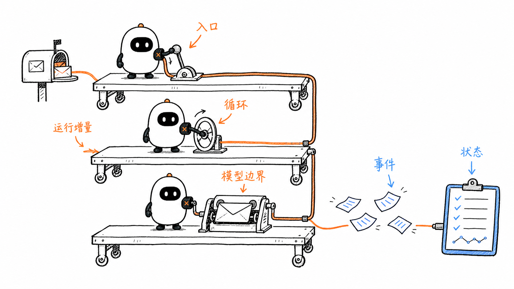
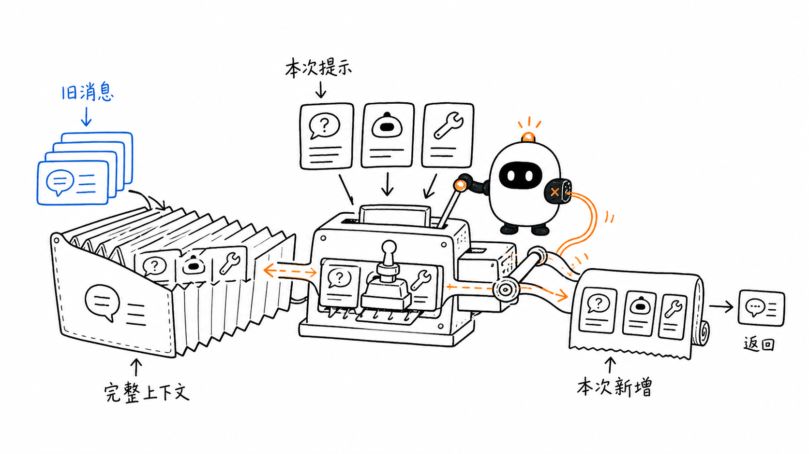
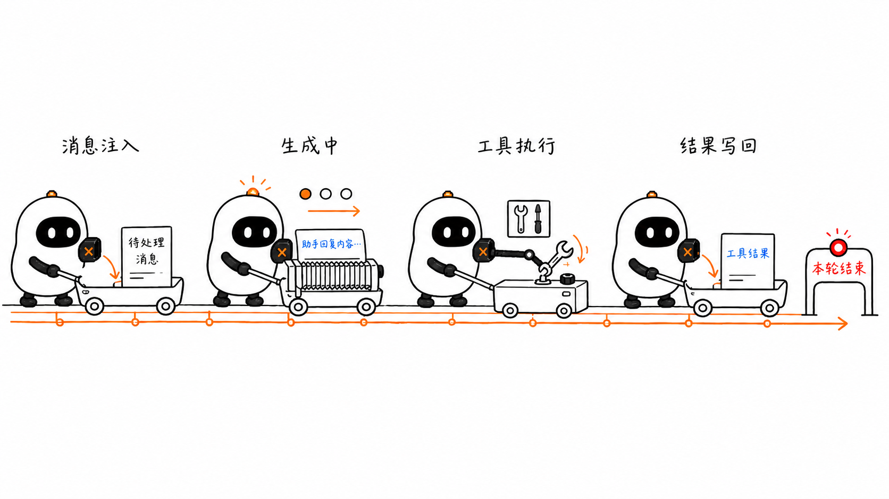
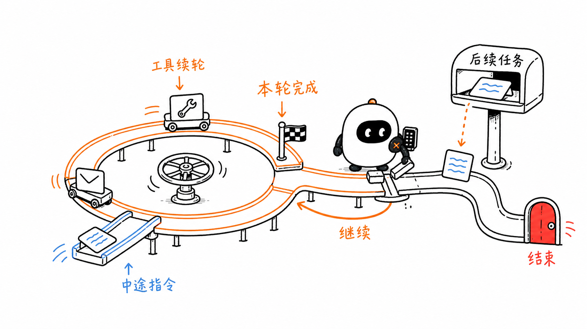
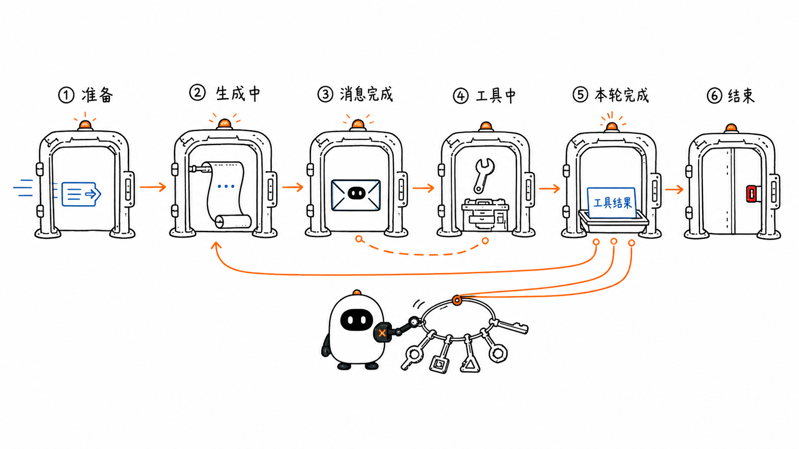
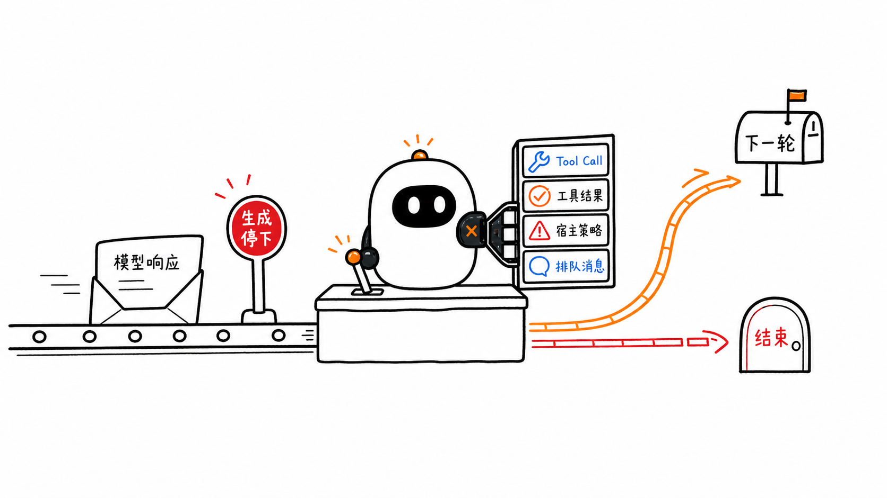

# Pi Agent Loop：状态、事件与停止条件

第一章把一次模型调用、工具执行和下一轮调用连成了 Agent Loop；第二章解释了 OpenAI、Anthropic 等不同协议怎样在 `pi-ai` 的模型边界被转换成统一消息。现在，循环已经拥有可以统一处理的输入和响应，接下来要回答的是：**谁把这些消息写进上下文，谁推进下一轮，又是谁决定整段运行何时结束？**

Pi 在 `pi-agent-core` 中给出了一个具体答案。入口是 `Agent`，底层控制链集中在 `agent-loop.ts`：

```text
Agent.prompt(...)
      ↓
runAgentLoop(...)
      ↓
runLoop(...)
      ↓
streamAssistantResponse(...)
      ↓
模型流式响应 → Tool Call → Tool Result → 下一轮或结束
```

这一章会沿固定源码中的真实名称阅读这条链路。代码片段保留 Pi 的变量名、调用顺序和分支含义，省略了与当前步骤无关的参数和工具执行细节；完整实现始终以文末固定 commit 的源码链接为准。



## 1. 先确定三个运行边界

阅读循环前，先把 `agent`、`turn` 和 `message` 三个边界分开。

- **一次 agent run** 从 `agent_start` 开始，到 `agent_end` 结束。它对应一次 `agent.prompt(...)` 或 `agent.continue()` 调用，里面可能包含多个 turn。
- **一个 turn** 从 `turn_start` 开始，到 `turn_end` 结束。Pi 对 turn 的定义是：**一次 assistant 响应，以及这条响应触发的全部工具调用和工具结果**。
- **一条 message** 有自己的 `message_start`、若干流式更新和 `message_end`。用户消息、assistant 消息和 Tool Result 都会经过消息事件。

因此，“模型回答完一次”不一定等于“Agent 已经结束”。如果 assistant 消息包含 Tool Call，当前 turn 会先完成工具执行；随后新的 turn 才把 Tool Result 再交给模型。

一个不调用工具的运行通常是：

```text
agent_start
└─ turn_start
   ├─ user message_start → message_end
   ├─ assistant message_start → message_update... → message_end
   └─ turn_end
agent_end
```

一个调用工具的运行会多出工具阶段和下一轮：

```text
agent_start
├─ turn_start
│  ├─ user message_start → message_end
│  ├─ assistant message_start → message_update... → message_end
│  ├─ tool_execution_start → tool_execution_update... → tool_execution_end
│  ├─ Tool Result message_start → message_end
│  └─ turn_end
├─ turn_start
│  ├─ assistant message_start → message_update... → message_end
│  └─ turn_end
└─ agent_end
```

这里已经能看出两个重要事实：

1. Tool Call 属于 assistant message，Tool Result 是另一条消息；
2. 工具执行完成后，Agent 通常还要再调用一次模型，才能把工具数据组织成最终回答。

## 2. 循环接收什么：`AgentContext` 与 `AgentLoopConfig`

Pi 把“本轮能看到什么”和“本轮怎样运行”放进两个不同对象。

### 2.1 `AgentContext` 保存模型本轮可见的材料

Pi 的 `AgentContext` 定义很短：

```typescript
interface AgentContext {
  systemPrompt: string;
  messages: AgentMessage[];
  tools?: AgentTool<any>[];
}
```

三个字段分别表示：

- `systemPrompt`：每次模型请求都会带上的系统说明；
- `messages`：当前对话记录；
- `tools`：当前可供模型请求的工具。

这里的 `?` 表示 `tools` 是可选字段；`AgentTool<any>[]` 表示“由若干工具组成的数组”。

`AgentContext` 是一次低层循环使用的上下文快照。它与 `Agent` 对外暴露的完整 `AgentState` 不同：后者还包含当前模型、推理等级、是否正在流式生成、正在执行哪些工具以及最近错误等运行状态。

### 2.2 `AgentLoopConfig` 决定循环怎样工作

`AgentLoopConfig` 的字段更多。先看这一章直接参与控制链的部分：

```typescript
interface AgentLoopConfig {
  model: Model<any>;

  transformContext?: (
    messages: AgentMessage[],
    signal?: AbortSignal,
  ) => Promise<AgentMessage[]>;

  convertToLlm: (
    messages: AgentMessage[],
  ) => Message[] | Promise<Message[]>;

  prepareNextTurn?: (
    context: PrepareNextTurnContext,
  ) => AgentLoopTurnUpdate | undefined
     | Promise<AgentLoopTurnUpdate | undefined>;

  shouldStopAfterTurn?: (
    context: ShouldStopAfterTurnContext,
  ) => boolean | Promise<boolean>;

  getSteeringMessages?: () => Promise<AgentMessage[]>;
  getFollowUpMessages?: () => Promise<AgentMessage[]>;
}
```

可以按执行顺序理解这些配置：

1. `transformContext` 在请求模型前整理 Agent 消息，例如裁剪过长历史；
2. `convertToLlm` 把 Agent 内部消息转换成模型协议接受的消息；
3. `prepareNextTurn` 在一个 turn 完成后，为下一轮替换 Context、模型或推理等级；
4. `shouldStopAfterTurn` 在完整 turn 结束后决定是否优雅停止；
5. 两个消息函数分别读取运行中的 steering 消息和等待运行结束后处理的 follow-up 消息。

函数名后的 `?` 表示这一项可以不提供。`Promise<T>` 表示结果可能需要等待异步操作完成后才能得到。

## 3. `runAgentLoop` 为什么同时维护两组消息

从新提示开始时，`runAgentLoop` 先构造两个数组：

```typescript
export async function runAgentLoop(
  prompts: AgentMessage[],
  context: AgentContext,
  config: AgentLoopConfig,
  emit: AgentEventSink,
  signal: AbortSignal | undefined,
  streamFn: StreamFn,
): Promise<AgentMessage[]> {
  const newMessages: AgentMessage[] = [...prompts];

  const currentContext: AgentContext = {
    ...context,
    messages: [...context.messages, ...prompts],
  };

  await emit({ type: "agent_start" });
  await emit({ type: "turn_start" });

  for (const prompt of prompts) {
    await emit({ type: "message_start", message: prompt });
    await emit({ type: "message_end", message: prompt });
  }

  await runLoop(
    currentContext,
    newMessages,
    config,
    signal,
    emit,
    streamFn,
  );

  return newMessages;
}
```

`[...prompts]` 会创建一个包含相同元素的新数组；`...context` 会复制对象的顶层字段；`[...context.messages, ...prompts]` 则把旧消息和本次提示连接成新的数组。

两个数组承担不同职责：

- `currentContext.messages` 是**工作上下文**。它包含旧对话和本次新增消息，每次调用模型都从这里准备输入。
- `newMessages` 是**本次运行的增量结果**。它只记录这次 `runAgentLoop` 新产生或新注入的消息，最后返回给调用方。

假设运行前已有 12 条历史消息，本次新增了 1 条用户消息，随后得到 1 条 Tool Call、1 条 Tool Result 和 1 条最终回答：

```text
currentContext.messages
= 12 条旧消息 + 4 条本次消息

newMessages
= 4 条本次消息
```

如果只返回完整 Context，调用方就要自己分辨哪些消息原来已经存在；如果只维护 `newMessages`，下一次模型调用又拿不到完整历史。两份数组让“给模型看的完整工作集”和“本次调用产生的增量”各自保持明确。

这个区别在 `runAgentLoopContinue` 中尤其明显。继续运行时，旧 Context 已经包含用户消息或 Tool Result，所以 `newMessages` 从空数组开始；函数最后只返回重试后新产生的 assistant 消息，而不会把旧历史再返回一次。



## 4. 模型响应怎样进入 Context

`runLoop` 不直接拼装供应商请求，而是调用 `streamAssistantResponse`。这个函数完成四步转换：

```text
AgentMessage[]
    ↓ transformContext（可选）
AgentMessage[]
    ↓ convertToLlm（必需）
Message[]
    ↓ 与 systemPrompt、tools 组成 pi-ai Context
streamFunction(model, llmContext, options)
```

对应的源码结构是：

```typescript
let messages = context.messages;

if (config.transformContext) {
  messages = await config.transformContext(messages, signal);
}

const llmMessages = await config.convertToLlm(messages);

const llmContext: Context = {
  systemPrompt: context.systemPrompt,
  messages: llmMessages,
  tools: context.tools,
};

const response = await streamFunction(
  config.model,
  llmContext,
  { ...config, signal },
);
```

`transformContext` 仍在 Agent 消息层工作，`convertToLlm` 才跨过模型边界。这样，界面通知、会话元数据等自定义消息可以留在 Agent 中，而不必强行发送给模型。

### 4.1 流式消息不是最后一次才写入

模型开始生成时，Pi 先把 partial assistant message 放入 `context.messages`：

```typescript
switch (event.type) {
  case "start":
    partialMessage = event.partial;
    context.messages.push(partialMessage);
    addedPartial = true;
    await emit({
      type: "message_start",
      message: { ...partialMessage },
    });
    break;
}
```

收到文本、思考内容或 Tool Call 的增量事件时，最后一条 Context 消息会被替换成更新后的 partial message：

```typescript
switch (event.type) {
  case "text_delta":
  case "thinking_delta":
  case "toolcall_delta":
    if (partialMessage) {
      partialMessage = event.partial;
      context.messages[context.messages.length - 1] = partialMessage;

      await emit({
        type: "message_update",
        assistantMessageEvent: event,
        message: { ...partialMessage },
      });
    }
    break;
}
```

流结束后，再用完整消息替换最后一个 partial message：

```typescript
switch (event.type) {
  case "done":
  case "error": {
    const finalMessage = await response.result();

    if (addedPartial) {
      context.messages[context.messages.length - 1] = finalMessage;
    } else {
      context.messages.push(finalMessage);
    }

    await emit({ type: "message_end", message: finalMessage });
    return finalMessage;
  }
}
```

因此，Context 中不会同时保留许多“半句话版本”。同一个数组位置从 partial message 逐步更新为 final message。`newMessages` 则在 `streamAssistantResponse` 返回完整消息后才执行 `newMessages.push(message)`，所以本次运行的返回值不会包含中间快照。

### 4.2 Context 和 `Agent.state.messages` 不是同一个数组

低层循环更新的是自己的 `currentContext`。上层 `Agent` 则消费 `AgentEvent`，在 `message_end` 时把完整消息写进公开状态：

```typescript
switch (event.type) {
  case "message_end":
    this._state.streamingMessage = undefined;
    this._state.messages.push(event.message);
    break;
}
```

在流式生成期间，界面读取的是 `streamingMessage`；消息完成后，稳定版本才进入 `state.messages`。这使运行中的显示状态和已经完成的对话记录保持分离。

## 5. 一个 turn 的真实控制顺序

把工具实现细节折叠后，`runLoop` 中每个 turn 的主干可以读成下面这段教学摘录：

```typescript
let firstTurn = true;

while (hasMoreToolCalls || pendingMessages.length > 0) {
  // ① runAgentLoop 已发出第一个 turn_start；后续轮次在这里发出。
  if (!firstTurn) {
    await emit({ type: "turn_start" });
  } else {
    firstTurn = false;
  }

  // ② 把等待注入的消息加入完整 Context 和本次增量。
  for (const pending of pendingMessages) {
    currentContext.messages.push(pending);
    newMessages.push(pending);
  }
  pendingMessages = [];

  // ③ 调用模型；函数内部把完整 assistant 消息写入 Context。
  const message = await streamAssistantResponse(
    currentContext,
    config,
    signal,
    emit,
    streamFunction,
  );

  // ④ 完整 assistant 消息也进入本次增量。
  newMessages.push(message);

  // ⑤ 模型调用失败或被取消，结束整段运行。
  if (
    message.stopReason === "error" ||
    message.stopReason === "aborted"
  ) {
    await emit({ type: "turn_end", message, toolResults: [] });
    await emit({ type: "agent_end", messages: newMessages });
    return;
  }

  // ⑥ 从完整响应中取出 Tool Call。
  const toolCalls = message.content.filter(
    (item) => item.type === "toolCall",
  );

  // ⑦ 有 Tool Call 才执行工具，并把结果写回两组消息。
  const toolResults: ToolResultMessage[] = [];
  hasMoreToolCalls = false;

  if (toolCalls.length > 0) {
    const batch = await executeToolCalls(/* ... */);
    toolResults.push(...batch.messages);
    hasMoreToolCalls = !batch.terminate;

    for (const result of toolResults) {
      currentContext.messages.push(result);
      newMessages.push(result);
    }
  }

  // ⑧ assistant 响应及其工具阶段共同构成一个完整 turn。
  await emit({ type: "turn_end", message, toolResults });

  // ⑨ 为下一轮替换 Context / 模型，或在完整 turn 后停止。
  const next = await config.prepareNextTurn?.(/* ... */);
  // 教学省略：若 next 存在，这里应用它的替换项。

  if (await config.shouldStopAfterTurn?.(/* ... */)) {
    await emit({ type: "agent_end", messages: newMessages });
    return;
  }

  // ⑩ 读取运行中追加的 steering 消息。
  pendingMessages =
    (await config.getSteeringMessages?.()) || [];
}
```

这十步与源码中的顺序一致。特别要留意三处边界：

- assistant 的完整消息先写入 Context，再检查 Tool Call；
- 当前响应里的全部工具完成后，才发出 `turn_end`；
- `shouldStopAfterTurn` 在 turn 完整结束后运行，不会截断正在生成的响应或正在执行的工具。



## 6. 为什么 `runLoop` 里面有两层循环

Pi 的 `runLoop` 不是一个简单的 `while (有工具)`。它还要处理用户在运行中追加的消息，因此源码使用了内外两层循环：

```typescript
// 启动时先读取可能已经排队的 steering 消息。
let pendingMessages =
  (await config.getSteeringMessages?.()) || [];

// 外层：Agent 原本准备结束时，检查 follow-up。
while (true) {
  let hasMoreToolCalls = true;

  // 内层：处理工具带来的下一轮，以及 steering 消息。
  while (hasMoreToolCalls || pendingMessages.length > 0) {
    // 注入 pendingMessages
    // 调用模型
    // 执行当前响应中的工具
    // 读取新的 steering 消息
  }

  // 走到这里，说明已没有自动工具续轮，也没有 steering。
  const followUpMessages =
    (await config.getFollowUpMessages?.()) || [];

  if (followUpMessages.length > 0) {
    pendingMessages = followUpMessages;
    continue;
  }

  break;
}
```

两类队列的插入时机不同。

### 6.1 Steering：当前工作完成一个 turn 后改变方向

`agent.steer(message)` 用于 Agent 正在工作时追加指令。例如 Agent 已经开始读取多个文件，用户补充：“先不要改代码，只分析原因。”

Steering 并不会在任意一行代码上强行打断当前工具。Pi 的处理顺序是：

1. 当前 assistant message 已经生成完；
2. 这条消息请求的全部工具调用完成；
3. 发出 `turn_end`；
4. 读取 steering queue；
5. 下一轮开始时，把 steering message 写入 Context；
6. 模型同时看到先前 Tool Result 和新的用户指令。

这条边界避免 Context 出现“模型提出两个工具，但只执行了第一个，第二个凭空消失”的不完整记录。若确实需要取消正在运行的操作，应使用 `abort()` 与 `AbortSignal`，而不是把 steering 当成取消信号。

### 6.2 Follow-up：Agent 原本要结束时再追加任务

`agent.followUp(message)` 表示“当前任务自然结束后，再做这件事”。只有当内层循环已经没有 Tool Call 续轮，也没有 steering 消息时，外层循环才读取 follow-up queue。

例如：

```text
当前任务：检查项目并解释错误
follow-up：再把结论整理成三条建议
```

第一项完成后，Agent 本来可以发出 `agent_end`；因为队列中还有 follow-up，它会把这条消息变成下一轮的 pending message，再继续一次模型调用。

### 6.3 默认一次取一条，而不是把所有消息混在一起

`Agent` 内部为两种消息各维护一个 `PendingMessageQueue`。默认的 `QueueMode` 是 `one-at-a-time`：每到一个读取点，只取最早的一条。也可以改成 `all`，一次注入队列里的全部消息。

一次只取一条可以保留用户指令的先后关系；一次取全部可以减少额外模型调用。它们不是模型能力差异，而是 Harness 对消息调度方式的选择。



## 7. 把控制流看成一台状态机

Pi 没有声明一个名为 `LoopState` 的枚举；状态体现在循环变量、消息内容和事件顺序里。把这些条件画成状态机，有助于检查“当前允许发生什么、下一步能去哪里”。

```text
准备运行
   ↓
注入等待消息
   ↓
请求并流式接收 assistant message
   ├─ error / aborted ─────────────→ 结束运行
   ↓
检查 Tool Call
   ├─ 有 → 执行工具 → 写回 Tool Result ─┐
   └─ 无 ───────────────────────────────┤
                                          ↓
                                      turn_end
                                          ↓
                      prepareNextTurn / shouldStopAfterTurn
                         ├─ 要停止 ─────→ 结束运行
                         ↓
                      检查 steering
                         ├─ 有 ─────────→ 注入等待消息
                         ↓
                      是否需要工具续轮
                         ├─ 是 ─────────→ 请求模型
                         ↓
                      检查 follow-up
                         ├─ 有 ─────────→ 注入等待消息
                         └─ 无 ─────────→ 结束运行
```

这里的“状态”不是某个单独变量，而是一组可以观察的事实：

| 教学状态 | 源码中的可观察依据 | 下一步由什么决定 |
| --- | --- | --- |
| 准备 turn | `turn_start` | 是否有 pending message |
| 接收模型响应 | `message_start` / `message_update` | 流的下一个事件 |
| assistant 消息完成 | `message_end` | `stopReason` 与 `content` |
| 执行工具 | `tool_execution_*` | 工具结果、错误、取消信号 |
| turn 完成 | `turn_end` | next-turn hook、停止 hook 与队列 |
| run 完成 | `agent_end` | 不再产生新的循环事件 |

这种表示法的价值在于暴露非法跳转。例如，Tool Call 还没有对应 Tool Result 就直接进入下一次模型调用，通常会破坏消息协议；`message_update` 在 `message_start` 之前出现，也会让界面无法建立正在更新的消息。



## 8. `stopReason` 不等于整段 Agent 已停止

第二章看到，供应商会为**一次模型生成**提供停止原因，Pi 将常见情况转换成统一的 `AssistantMessage.stopReason`。但 Agent Runtime 还要根据消息内容、工具结果、队列和宿主策略，决定**整段运行**是否结束。

这两个问题必须分开：

```text
stopReason：这一次模型生成为什么停下来？
run control：完整 Agent 运行接下来是继续还是结束？
```

### 8.1 `toolUse` 停止的是模型生成，不是 Agent Loop

模型生成 Tool Call 后，当前生成通常以 `toolUse` 结束。Runtime 随后从 `message.content` 取出 Tool Call，执行工具并写回 Tool Result。如果工具批次没有要求终止，`hasMoreToolCalls` 会保持为 `true`，内层循环进入下一次模型调用。

所以：

```text
assistant.stopReason === "toolUse"
≠ Agent 已完成

它通常表示：模型现在把控制权交给宿主执行工具。
```

### 8.2 没有 Tool Call 时，循环才可能自然收束

Pi 是否执行工具，直接依据完整 `message.content` 中有没有 `toolCall` 内容块。没有 Tool Call 时，`hasMoreToolCalls` 为 `false`。如果同时没有 steering 和 follow-up，内外两层循环都会退出，最后发出 `agent_end`。

这也说明 Runtime 不能只检查 `stopReason`。一个供应商的原始停止字段可能不完整，但统一消息中实际存在 Tool Call；反过来，单看文本里出现“我会调用工具”也不能触发工具执行，因为循环需要结构化的 `toolCall` 内容块。

### 8.3 `error` 与 `aborted` 会直接结束当前 run

`streamAssistantResponse` 把模型请求失败或取消编码为一条 assistant message。`runLoop` 收到下面两种停止原因时，会依次发出 `turn_end` 和 `agent_end`，然后返回：

```typescript
if (
  message.stopReason === "error" ||
  message.stopReason === "aborted"
) {
  await emit({ type: "turn_end", message, toolResults: [] });
  await emit({ type: "agent_end", messages: newMessages });
  return;
}
```

`agent.abort()` 的作用是触发当前 `AbortController`。Provider、`transformContext`、工具以及工具前后的 hook 都可以收到这条 `AbortSignal`；它们在安全边界响应取消后，循环才能完成收尾事件。取消是一种协作式控制，而不是直接杀掉 JavaScript 执行栈。

### 8.4 `length` 要结合内容判断

`length` 表示模型输出达到上限。若响应只有截断文本而没有 Tool Call，循环可能把这条不完整 assistant message 作为本次最终响应结束。

若同一条响应中出现 Tool Call，参数也可能被截断。Pi 不会执行这些调用，而是为每个 Tool Call 生成错误 Tool Result，再进入下一轮，让模型有机会重新提出完整请求：

```typescript
const batch =
  message.stopReason === "length"
    ? await failToolCallsFromTruncatedMessage(toolCalls, emit)
    : await executeToolCalls(/* ... */);
```

即使截断后的字符串碰巧能解析成 JSON，也不能证明参数完整。例如原计划是 `{"path":"src/config.ts"}`，截断恢复算法可能只留下一个语法合法但语义不完整的对象。这里采用的是“整批不执行”的保守边界。

### 8.5 工具的 `terminate` 是批次级提示

工具结果可以带 `terminate: true`，表示完成这批工具后不必自动再请求模型。Pi 只有在**这批所有最终工具结果**都带有该提示时，才把 `batch.terminate` 视为真：

```typescript
function shouldTerminateToolBatch(results) {
  return (
    results.length > 0 &&
    results.every((item) => item.result.terminate === true)
  );
}
```

如果一批有三个 Tool Call，只有一个要求终止，另外两个仍需要模型继续处理，整个批次就不会提前收束。这个规则避免某个工具单方面吞掉同一条 assistant message 中其他工具的结果。

即使工具批次终止了自动续轮，已排队的 steering 或 follow-up 仍可能开启新的 turn。`terminate` 控制的是当前工具批次后的自动模型调用，不是清空所有用户队列。

### 8.6 `shouldStopAfterTurn` 是宿主的优雅停止点

`shouldStopAfterTurn` 在完整 assistant 响应、全部工具执行、Tool Result 写回以及 `turn_end` 之后运行。返回 `true` 时，循环在读取新的 steering 和 follow-up 之前发出 `agent_end`。

它适合实现这类策略：

- Context 已接近容量上限，先停止并准备压缩；
- 已达到宿主设置的 turn 数或费用预算；
- 当前环境要求每个 turn 后重新授权；
- 某个外部工作流已经得到需要的结果。

它不会改写 assistant 的 `stopReason`，因为两者回答的是不同层级的问题。

### 8.7 意外抛错与协议内错误走不同通道

`StreamFn` 的契约要求模型请求失败时不要直接抛出异常，而要通过流事件和最终 assistant message 表达 `error` 或 `aborted`。`transformContext`、`convertToLlm`、停止 hook 与队列读取函数也约定返回安全结果，不应抛错中断低层事件序列。

如果自定义回调仍然意外抛错，`Agent.runWithLifecycle(...)` 会在上层捕获它，构造一条失败 assistant message，并补齐 `message_start → message_end → turn_end → agent_end`。这条兜底让 `Agent` 使用者仍能观察到完整生命周期；直接调用低层 `runAgentLoop(...)` 时，则应遵守各回调的契约。



## 9. `AgentEvent` 怎样把运行过程交给界面

低层循环不直接操作终端或网页组件。它发出 `AgentEvent`，上层 `Agent` 一边据此更新公开状态，一边把事件传给订阅者。

这些事件可以分成四组：

```typescript
type AgentEvent =
  // 整段运行
  | { type: "agent_start" }
  | { type: "agent_end"; messages: AgentMessage[] }

  // 一个 turn
  | { type: "turn_start" }
  | {
      type: "turn_end";
      message: AgentMessage;
      toolResults: ToolResultMessage[];
    }

  // 一条消息
  | { type: "message_start"; message: AgentMessage }
  | {
      type: "message_update";
      message: AgentMessage;
      assistantMessageEvent: AssistantMessageEvent;
    }
  | { type: "message_end"; message: AgentMessage }

  // 一次工具执行
  | { type: "tool_execution_start"; /* ... */ }
  | { type: "tool_execution_update"; /* ... */ }
  | { type: "tool_execution_end"; /* ... */ };
```

`Agent.processEvents(...)` 根据这些事件更新状态：

- `message_start` / `message_update` 更新 `streamingMessage`；
- `message_end` 清空 `streamingMessage`，并把完整消息追加到 `state.messages`；
- `tool_execution_start` 把调用 ID 放入 `pendingToolCalls`；
- `tool_execution_end` 移除对应 ID；
- `turn_end` 记录本轮错误信息；
- `agent_end` 表示不会再出现新的循环事件。

### 9.1 事件流不是另一份对话记录

同一条 assistant message 可能产生一次 `message_start`、几十次 `message_update` 和一次 `message_end`。这些事件描述“消息怎样形成”，最终 Context 只需要保存完整消息。

因此：

```text
Message / Context：保存模型下一轮需要看到的稳定内容
AgentEvent：描述运行过程中刚刚发生的变化
AgentState：保存界面和宿主此刻需要读取的运行状态
```

如果把每个 delta 都当成独立 Message 写进对话，下一次模型调用会看到许多重复的半成品；如果完全没有事件，界面又只能等整条响应结束后一次性刷新。

### 9.2 `agent_end` 是最后一个事件，但不一定是 Promise 立刻完成的时刻

`Agent.subscribe(...)` 的异步监听器会按注册顺序等待。收到 `agent_end` 后，监听器可能还要保存会话或刷新日志。只有这些监听器完成、`finishRun()` 清理运行状态后，`agent.prompt(...)` 与 `waitForIdle()` 才会结束等待，`state.isStreaming` 才变为 `false`。

这是一条工程上很有用的完成边界：**没有新事件**与**所有收尾工作已经完成**不是同一时刻。

### 9.3 `Agent.subscribe(...)` 与低层 EventStream 的等待语义不同

`Agent` 把 `processEvents(...)` 直接作为低层循环的 event sink，因此状态更新和订阅者处理会在循环进入下一阶段前完成。比如 assistant 的 `message_end` 处理完成后，工具参数预处理才开始。

公开的 `agentLoop(...)` / `agentLoopContinue(...)` 则把事件推入 `EventStream`，适合按顺序观察低层事件；异步迭代器里的消费工作不会自动成为生产者进入下一阶段前的屏障。如果工具执行前必须等待界面状态、持久化或审批逻辑完成，应使用 `Agent` 的订阅机制，或者在更高层明确建立等待边界。

## 10. 从 `Agent.prompt()` 到公开状态的完整链路

现在把前面的结构重新接起来：

1. `Agent.prompt(...)` 把字符串转换成 user message；
2. `createContextSnapshot()` 复制当前 system prompt、messages 与 tools；
3. `createLoopConfig()` 把模型、转换函数、工具策略、停止 hook 和两个消息队列交给低层循环；
4. `runAgentLoop()` 建立 `currentContext` 与 `newMessages`，并发出起始事件；
5. `runLoop()` 按 turn 推进模型、工具与队列；
6. `streamAssistantResponse()` 把 AgentMessage 转为模型 Message，消费流式事件，并在 Context 中完成 partial → final 的替换；
7. `Agent.processEvents()` 同步更新公开 `AgentState` 并等待订阅者；
8. `agent_end` 后，`finishRun()` 清理 streaming 状态，当前 `prompt()` 才真正完成。

这条链路解释了为什么 Pi 同时需要 Context、运行增量、Event 和 State：它们观察的是同一次运行的不同切面，不是四个可以互相替换的名字。

## 11. 四个常见误解

### 11.1 “模型返回 `stop`，所以一定由模型结束 Agent”

`stop` 只描述当前模型生成自然结束。Runtime 还会检查 Tool Call、宿主停止 hook、steering 和 follow-up。整段 run 最终由宿主控制链收束。

### 11.2 “Steering 会立刻中断正在执行的工具”

Pi 会等当前 turn 的工具批次完成，再注入 steering。需要取消当前操作时使用 `abort()`；工具和 Provider 还需要配合处理 `AbortSignal`。

### 11.3 “`agent_end` 之后所有保存工作必然已经结束”

`agent_end` 是最后一个循环事件。`Agent` 会继续等待异步订阅者，然后才把 run 标记为空闲。

### 11.4 “有 `newMessages` 就不必再维护 Context”

`newMessages` 只表示本次增量；模型下一轮需要旧历史与本次消息组成的完整工作上下文。`prepareNextTurn` 还可能替换下一轮 Context，而本次增量仍要保持稳定。

## 本章小结

- Pi 用 `AgentContext` 保存低层循环当前可见的 system prompt、messages 与 tools，用 `AgentLoopConfig` 提供模型、消息转换、下一轮准备、停止策略和队列读取方式。
- `currentContext.messages` 是完整工作上下文，`newMessages` 是本次 run 的增量返回值；两者作用域不同。
- 流式 assistant message 在 Context 的同一个位置从 partial 更新为 final；公开 `AgentState` 则通过事件维护 `streamingMessage` 与稳定消息记录。
- 一个 turn 是“一次 assistant 响应 + 它触发的工具调用和结果”；一次 agent run 可以包含多个 turn。
- 内层循环处理 Tool Call 续轮与 steering，外层循环在原本准备结束时处理 follow-up。
- `stopReason` 解释一次模型生成为什么停止；完整 run 是否继续，由消息内容、工具结果、宿主 hook、取消信号与消息队列共同决定。
- `AgentEvent` 让 UI、日志和会话层观察运行过程，但事件增量不应被误当成新的对话 Message。

## 与状态机和事件驱动设计的连接

把循环表示成“状态 + 转移条件”属于有限状态机的基本方法。Pi 没有显式 `LoopState` 枚举，但 `AgentEvent`、循环条件和分支共同形成了一台可观察的状态机。经典的 Statecharts 工作进一步说明，层级、并发和事件可以用来组织复杂系统状态；在 Pi 中，agent / turn / message / tool 四级生命周期正好提供了层级化观察边界。

这里也能看到事件驱动设计的作用：Runtime 负责控制顺序，界面通过事件响应变化。它并不自动等于完整的 Event Sourcing——Pi 的对话消息和会话存储仍有自己的持久化结构——但“状态改变后发出可消费事件”的思路相通。

## 下一章：Tools 与 Function Calling

这一章把 `executeToolCalls(...)` 当作一个阶段，下一章会展开内部实现：Pi 怎样按名称查找 `AgentTool`，怎样准备和校验参数，`beforeToolCall` 如何阻止执行，并行与顺序执行怎样选择，异常又怎样变成带 `toolCallId` 的 `ToolResultMessage`。

## 参考资料

- [Pi `pi-agent-core` README：事件顺序、队列与低层 API](https://github.com/earendil-works/pi/blob/086c32e74530564922d011ade23ff582c9d63116/packages/agent/README.md)
- [Pi `agent-loop.ts`：完整控制链](https://github.com/earendil-works/pi/blob/086c32e74530564922d011ade23ff582c9d63116/packages/agent/src/agent-loop.ts)
- [Pi `types.ts`：`AgentContext`、`AgentLoopConfig` 与 `AgentEvent`](https://github.com/earendil-works/pi/blob/086c32e74530564922d011ade23ff582c9d63116/packages/agent/src/types.ts)
- [Pi `agent.ts`：公开状态、消息队列与事件归约](https://github.com/earendil-works/pi/blob/086c32e74530564922d011ade23ff582c9d63116/packages/agent/src/agent.ts)
- [Pi `agent-loop.test.ts`：事件顺序、队列与停止条件测试](https://github.com/earendil-works/pi/blob/086c32e74530564922d011ade23ff582c9d63116/packages/agent/test/agent-loop.test.ts)
- [David Harel, Statecharts: A Visual Formalism for Complex Systems](https://doi.org/10.1016/0167-6423%2887%2990035-9)
