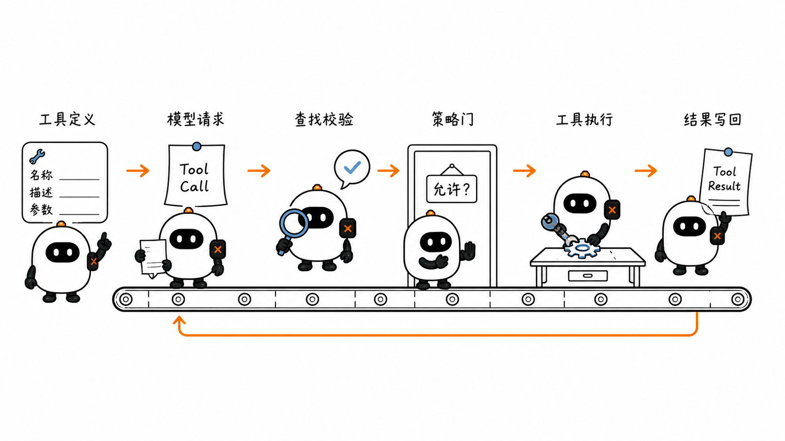
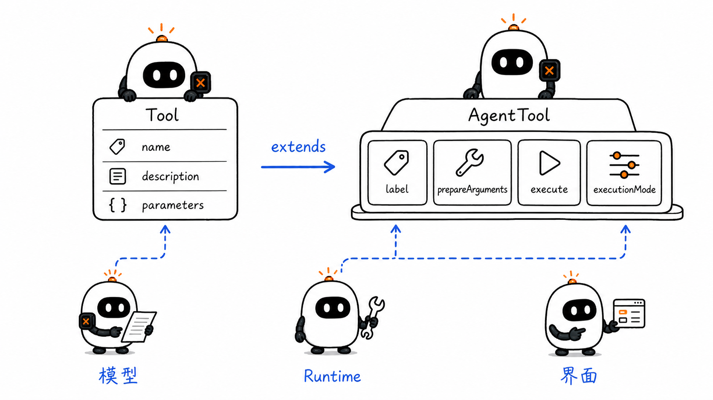
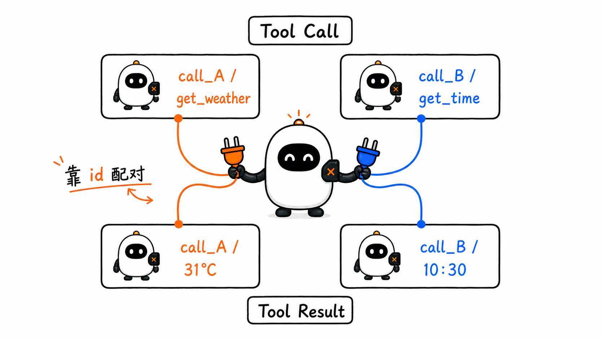
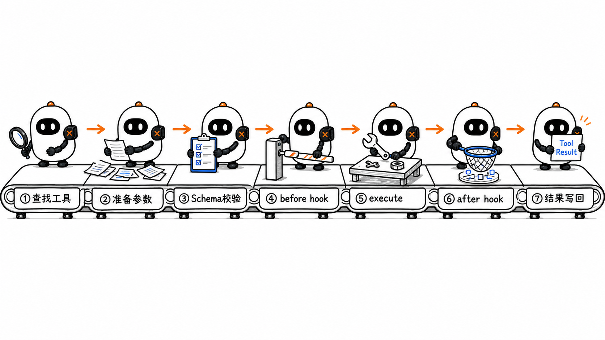
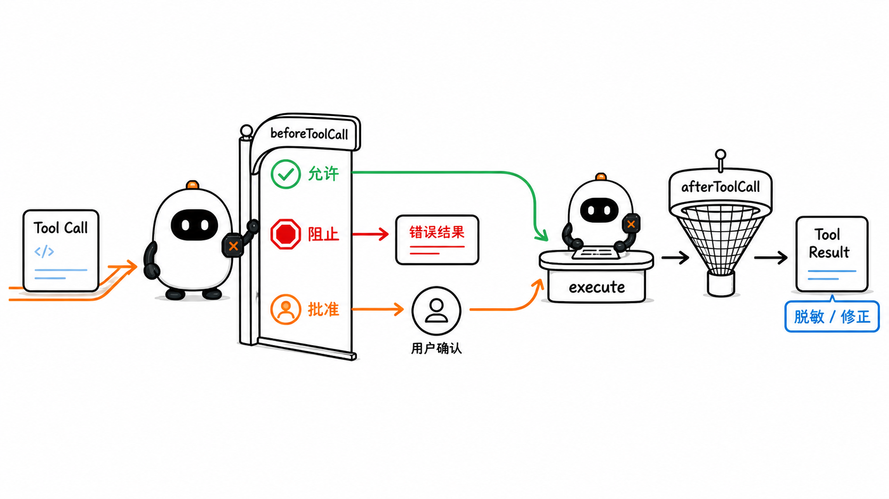
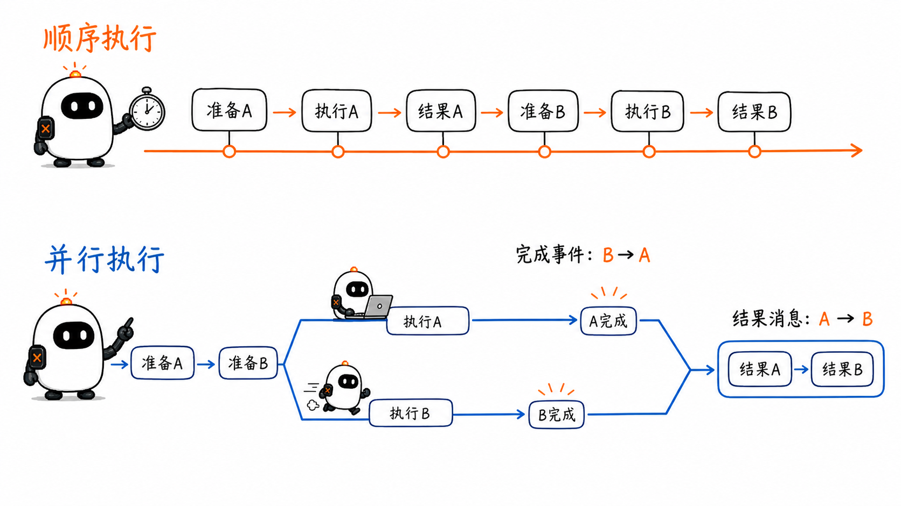

# Tools 与 Function Calling：从结构化请求到可控执行

这是 learn-pi-agent 的第 4 章。前三章已经把一条主线搭了起来：模型先生成消息，Agent Loop 再根据消息内容决定继续还是结束。当 assistant message 中出现 `toolCall` 时，循环会把控制权交给工具执行阶段。

这一阶段要解决的并不是“怎样调用一个 JavaScript 函数”这么简单，而是下面一整条可检查的链路：

```text
告诉模型有哪些工具
        ↓
模型生成结构化 Tool Call
        ↓
宿主查找工具、准备并校验参数
        ↓
策略判断是否允许执行
        ↓
Executor 执行工具
        ↓
Tool Result 按调用 id 写回 Context
        ↓
模型读取结果并继续判断
```

沿着这条链路，本章会把 Tool Contract、Function Calling、Schema、Validation、Registry、Policy、Executor、Tool Result、并行调用与 Tool Search 放回 Pi 的实际实现中。

> **源码说明**：文中的接口名称、字段和控制顺序对应 Pi 源码基线 `086c32e74530564922d011ade23ff582c9d63116`。为突出结构，代码片段会删去事件发送、泛型细节和错误分支，并在片段前说明“教学简化”；它们不是从仓库逐字复制的源码。



## 1. 模型提出请求，宿主执行动作

用户问“北京现在几点”，模型可以直接生成一个看似合理的时间，但训练知识不能保证它等于当前时间。宿主可以注册一个 `get_current_time` 工具，并把工具名称、用途和参数结构随请求一起交给模型。

模型可能返回：

```json
{
  "type": "toolCall",
  "id": "call_42",
  "name": "get_current_time",
  "arguments": {
    "timezone": "Asia/Shanghai"
  }
}
```

这段 JSON 表达的是一个**结构化执行请求**。此时还没有读取时钟，也没有运行任何工具。真正的动作由宿主程序完成：

1. 在可用工具中查找 `get_current_time`；
2. 检查 `timezone` 是否符合工具的参数 Schema；
3. 检查当前策略是否允许调用；
4. 调用工具的 `execute(...)`；
5. 把结果与 `call_42` 关联后写回消息历史。

写回的统一结果可能是：

```json
{
  "role": "toolResult",
  "toolCallId": "call_42",
  "toolName": "get_current_time",
  "content": [
    {
      "type": "text",
      "text": "2026年8月24日 10:30:00 GMT+8"
    }
  ],
  "isError": false
}
```

下一次模型调用同时看到原来的 Tool Call 和这条 Tool Result，才有足够信息回答用户。

这里有三个边界需要先记住：

- **Tool Call 是请求，不是执行记录。** 它说明模型希望调用什么。
- **Tool Result 是宿主提供的观察结果。** 它说明工具实际返回了什么。
- **调用 id 连接请求与结果。** 一条 assistant message 可以同时提出多个工具调用，不能只靠消息顺序猜测结果属于谁。

## 2. Function Calling 与 Tool Calling 是什么关系

`Function Calling` 最初常用来描述一种模型 API 能力：开发者用名称、描述和 JSON Schema 声明函数，模型返回结构化的函数名与参数。模型并不会直接进入你的进程调用函数。

`Tool Calling` 是更宽的表达。Tool 可以是应用自己执行的函数，也可以是搜索、代码沙箱、浏览器、MCP Server 或模型供应商托管的能力。不同工具的执行位置不同，但都需要明确“请求—结果”的协议。

从执行位置看，现代 API 中常见三类工具：

- **客户端执行工具**：应用提供定义、执行代码并回传结果；Pi 的 `AgentTool` 属于这一类。
- **供应商托管工具**：模型服务在服务器侧执行搜索、代码运行等能力，应用主要读取结果。
- **远程协议工具**：应用通过 MCP 等协议连接外部服务；第 7 章会展开 MCP 的 Host、Client 和 Server 边界。

OpenAI Responses 把自定义函数调用表达为 `function_call` 与 `function_call_output`；Anthropic Messages 使用 `tool_use` 与 `tool_result` 内容块；Pi Provider 层把这些差异转换成统一的 `ToolCall` 和 `ToolResultMessage`。因此，本章可以集中讨论一次调用在 Runtime 内部怎样被安全执行。

### 2.1 “模型按 Schema 生成”与“宿主按 Schema 校验”是两道检查

一些 Provider 支持 strict mode，让模型生成的参数更稳定地满足函数 Schema。这能降低缺字段、类型错误和多余字段的概率，却不能取代宿主校验：

- 模型或 Provider 仍可能返回错误、截断或不兼容的内容；
- 同一 Runtime 可能接入不支持严格生成的 Provider；
- Schema 只能描述数据形状，不能决定用户是否有权限写文件或发邮件；
- 工具的外部依赖可能在生成参数后发生变化。

Pi 在工具执行前仍会调用 `validateToolArguments(...)`。Provider 约束提升生成质量，Runtime 校验保护执行边界，两者处在不同层级。

## 3. Pi 用两个接口描述一个工具

Pi 把“交给模型看的定义”和“交给 Runtime 用的执行能力”分成两层。

`pi-ai` 中的 `Tool` 保留模型调用所需的最小信息：

```ts
interface Tool<TParameters> {
  name: string;
  description: string;
  parameters: TParameters;
  constrainedSampling?: false | ConstrainedSamplingConfig;
}
```

`pi-agent-core` 中的 `AgentTool` 在它上面增加 Runtime 能力：

```ts
interface AgentTool<TParameters, TDetails> extends Tool<TParameters> {
  label: string;
  prepareArguments?: (args: unknown) => Static<TParameters>;
  execute(
    toolCallId: string,
    params: Static<TParameters>,
    signal?: AbortSignal,
    onUpdate?: AgentToolUpdateCallback<TDetails>,
  ): Promise<AgentToolResult<TDetails>>;
  executionMode?: "sequential" | "parallel";
}
```

这些字段各自承担不同职责：

| 字段 | 谁主要使用 | 作用 |
| --- | --- | --- |
| `name` | 模型、Runtime | Tool Call 中使用的稳定标识，也是查找工具的键 |
| `description` | 模型 | 说明何时使用、能做什么以及重要限制 |
| `parameters` | 模型、Runtime | 用 TypeBox 表达的参数 Schema；既帮助模型生成，也用于本地校验 |
| `constrainedSampling` | Provider | 在支持的模型 API 上请求 JSON Schema 或 grammar 约束；不参与工具执行 |
| `label` | UI | 给人看的短名称，不参与工具匹配 |
| `prepareArguments` | Runtime | 在正式校验前兼容旧字段或修正原始参数形状 |
| `execute` | Runtime | 执行动作并返回 `AgentToolResult`；失败时抛出异常 |
| `executionMode` | Runtime | 指定当前工具是否要求整批顺序执行 |

### 3.1 一个与 Pi 接口对应的最小工具

下面是按 Pi 接口删减后的教学代码。它使用 `typebox` 定义参数，并利用 JavaScript 自带的时间格式化能力返回结果。

```ts
import { Type, type Static } from "typebox";
import type { AgentTool } from "@earendil-works/pi-agent-core";

const timeSchema = Type.Object({
  timezone: Type.Optional(
    Type.String({
      description: "IANA 时区，例如 Asia/Shanghai",
    }),
  ),
});

type TimeParams = Static<typeof timeSchema>;

export const getCurrentTimeTool: AgentTool<
  typeof timeSchema,
  { utcTimestamp: number }
> = {
  label: "当前时间",
  name: "get_current_time",
  description: "读取指定时区的当前日期和时间",
  parameters: timeSchema,

  async execute(_toolCallId, args: TimeParams) {
    const now = new Date();
    const text = now.toLocaleString("zh-CN", {
      timeZone: args.timezone,
      dateStyle: "full",
      timeStyle: "long",
    });

    return {
      content: [{ type: "text", text }],
      details: { utcTimestamp: now.getTime() },
    };
  },
};
```

逐段看这段代码：

1. `Type.Object(...)` 描述参数必须是对象；
2. `Type.Optional(...)` 表示 `timezone` 可以省略；
3. `Static<typeof timeSchema>` 从 Schema 推导出 TypeScript 参数类型；
4. `AgentTool<typeof timeSchema, ...>` 让 Schema、`execute` 参数和结构化详情保持类型对应；
5. `_toolCallId` 前的下划线表示当前实现没有使用它，但签名仍与 Pi 接口一致；
6. `content` 是可以进入模型上下文的文字或图片；
7. `details` 保存适合日志或 UI 使用的结构化数据。

这个分层很重要。模型只需要看到工具契约，不需要看到 `new Date()` 或数据库客户端等实现细节；Runtime 则需要 `execute`、取消信号、更新回调与执行模式。



## 4. Schema 同时帮助模型选择工具和保护执行入口

工具 Schema 至少回答四个问题：

1. 参数整体是什么类型；
2. 允许出现哪些字段；
3. 哪些字段必须存在；
4. 每个字段可以取什么值。

用普通 JSON Schema 表示前面的时间工具，大致是：

```json
{
  "type": "object",
  "properties": {
    "timezone": {
      "type": "string",
      "description": "IANA 时区，例如 Asia/Shanghai"
    }
  }
}
```

`properties` 描述已知字段，但字段默认并不自动成为必填项；需要用 `required` 明确必填字段。`additionalProperties: false` 可以拒绝未声明字段。OpenAI strict mode 还对可用的 JSON Schema 子集和必填表达方式有额外要求，因此不能把某一家 API 的 strict 规则直接当作完整 JSON Schema 规范。

### 4.1 描述不是装饰文字

Schema 约束“参数能否通过检查”，`description` 则帮助模型判断“什么时候应该选择这个工具”和“字段应该填什么”。两个工具都写成“查询信息”，模型很难区分；更好的描述会说明：

- 适用场景；
- 不适用场景；
- 输入格式和单位；
- 结果包含什么；
- 是否会产生副作用。

工具名称和描述参与模型选择，参数 Schema 参与模型生成和 Runtime 校验。三者共同构成 Tool Contract。

### 4.2 通过 Schema 不等于允许执行

下面这个参数可能完全符合 Schema：

```json
{
  "path": "C:/Windows/System32/config/SAM",
  "content": "..."
}
```

如果 `path` 与 `content` 都只是字符串，Schema 会认为形状合法。但工作区范围、文件权限、用户批准和敏感路径属于 Policy 与执行环境的职责。

可以把边界记成：

```text
Schema：这份参数长得对不对？
Policy：当前用户和场景允不允许做？
Executor：在受控环境中怎样真正完成？
```

## 5. `ToolCall` 与 `ToolResultMessage` 必须一一关联

Pi 的统一 `ToolCall` 内容块保留四个核心字段：

```ts
interface ToolCall {
  type: "toolCall";
  id: string;
  name: string;
  arguments: Record<string, any>;
}
```

执行后，Runtime 构造统一的结果消息：

```ts
interface ToolResultMessage<TDetails = any> {
  role: "toolResult";
  toolCallId: string;
  toolName: string;
  content: (TextContent | ImageContent)[];
  details?: TDetails;
  usage?: Usage;
  addedToolNames?: string[];
  isError: boolean;
  timestamp: number;
}
```

如果模型在同一条 assistant message 中请求两个工具：

```text
assistant message
├─ toolCall id=call_A  name=get_weather
└─ toolCall id=call_B  name=get_current_time
```

对应结果必须保留各自的调用 id：

```text
toolResult toolCallId=call_A  → 北京 31°C
toolResult toolCallId=call_B  → 10:30 GMT+8
```

结果完成顺序可以和请求顺序不同，id 仍能保持关系稳定。Provider 适配器随后把统一结果转换回 OpenAI 的 `call_id` / `tool_call_id`，或 Anthropic 的 `tool_use_id`。

### 5.1 `content` 与 `details` 面向不同消费者

- `content` 是文字或图片，会被 Provider 转换后交回模型；
- `details` 是任意结构化值，适合界面渲染、日志和应用逻辑；
- `usage` 记录工具自身可能产生的用量，不计入主模型上下文用量；
- `isError` 明确告诉 Runtime 和 Provider 这是不是失败结果；
- `addedToolNames` 标记从这条结果之后新增可用的工具；
- `terminate` 存在于执行阶段的 `AgentToolResult`，用于提示循环是否停止自动续轮，不写入最终 `ToolResultMessage`。

不要把大量调试对象全部塞进 `content`。模型需要的是能继续判断的观察结果；界面需要的表格行、原始响应和诊断数据可以放在 `details`。



## 6. Pi 的工具执行不是一个函数，而是一条流水线

第 3 章看到 `runLoop(...)` 会从 assistant message 中筛出全部 `toolCall`，再进入 `executeToolCalls(...)`。这一阶段的真实控制顺序可以拆成十步：

1. 从 assistant message 读取全部 Tool Call；
2. 根据全局配置和工具自身设置选择顺序或并行模式；
3. 为当前调用发出 `tool_execution_start`；
4. 按名称在 `currentContext.tools` 中查找工具；
5. 运行 `prepareArguments`，再按 Schema 校验参数；
6. 运行 `beforeToolCall`，决定允许、阻止或终止；
7. 调用工具的 `execute(...)`，期间可发送局部更新；
8. 运行 `afterToolCall`，按字段覆盖结果；
9. 发出 `tool_execution_end`，构造 `ToolResultMessage`；
10. 按原始调用顺序把结果写回 Context，并判断是否自动续轮。

源码没有声明一个名为 `ToolRegistry` 的类。`currentContext.tools` 这组工具以及按 `name` 查找的逻辑，承担了当前运行中的 Registry 职责。

下面是按真实函数名与顺序整理的教学简化代码：

```ts
async function prepareToolCall(context, assistantMessage, toolCall, config, signal) {
  // ① Registry：按稳定名称查找当前可用工具。
  const tool = context.tools?.find((item) => item.name === toolCall.name);

  // ② 找不到也要生成 Tool Result，不能让调用悬空。
  if (!tool) {
    return immediateError(`Tool ${toolCall.name} not found`);
  }

  try {
    // ③ 兼容性预处理发生在 Schema 校验之前。
    const preparedCall = prepareToolCallArguments(tool, toolCall);

    // ④ 复制、转换并检查参数；失败会抛出异常。
    const args = validateToolArguments(tool, preparedCall);

    // ⑤ Policy：执行前钩子可以阻止调用。
    const decision = await config.beforeToolCall?.(
      { assistantMessage, toolCall, args, context },
      signal,
    );

    if (decision?.block) {
      return immediateError(decision.reason ?? "Tool execution was blocked");
    }

    // ⑥ 通过所有准备步骤后，才把任务交给 Executor。
    return { kind: "prepared", toolCall, tool, args };
  } catch (error) {
    // ⑦ 查找、预处理、校验或 hook 失败都转换为错误结果。
    return immediateError(String(error));
  }
}
```

这段顺序防止三个常见问题：

- 未注册的工具名进入任意动态调用；
- 未校验参数直接到达文件、网络或数据库 API；
- 策略判断只存在于提示词里，无法在代码层阻止动作。



## 7. 参数校验：Pi 实际做了哪些事

`validateToolArguments(tool, toolCall)` 并非简单运行一次 `JSON.parse`。进入这个函数时，Provider 已经把参数转换成 JavaScript 对象；Pi 随后执行以下步骤：

1. 用 `structuredClone(...)` 复制原始参数，避免校验过程直接修改消息记录；
2. 把可选字段上的 `null` 按 Schema 语义规范化；
3. 让 TypeBox 尝试转换可安全转换的值；
4. 对普通 JSON Schema 再执行兼容性 coercion；
5. 用缓存的 validator 检查最终对象；
6. 失败时生成包含字段路径、原因和原始参数的错误。

例如，工具要求：

```json
{
  "type": "object",
  "properties": {
    "count": { "type": "integer", "minimum": 1 }
  },
  "required": ["count"]
}
```

下面三种输入需要分别处理：

```text
{ "count": 3 }        → 合法
{ "count": "3" }      → 可能被安全转换成数字 3
{ "count": "many" }   → 校验失败，生成错误 Tool Result
```

### 7.1 `prepareArguments` 是兼容层，不是绕过校验的入口

有些 Provider、旧会话或第三方扩展可能使用旧字段名。工具可以先做形状迁移：

```ts
const tool = {
  prepareArguments(raw: unknown) {
    const args = raw as { city?: string; location?: string };
    return {
      location: args.location ?? args.city,
    };
  },
};
```

返回值随后仍会进入 `validateToolArguments(...)`。这允许工具兼容旧参数，同时保持统一的执行参数。

Pi 会保留 assistant message 中原始的 Tool Call，`execute(...)` 接收的是预处理并校验后的 `params`。前者忠实记录模型提出了什么，后者表示 Runtime 最终允许工具使用什么；日志与调试界面应当区分这两份数据。

Pi 当前还有一个需要谨慎使用的细节：`beforeToolCall` 收到的 `args` 是已经校验的对象；如果 hook 直接修改这个对象，修改后的值不会再自动校验。策略 hook 更适合做允许、阻止和审计。需要改写参数时，应让改写结果再次通过明确的业务检查，或把兼容性转换放入 `prepareArguments`。

### 7.2 参数合法、业务条件仍可能不成立

假设 `delete_record` 的 Schema 要求一个字符串 `recordId`。`"customer_123"` 可以通过结构校验，但执行时还要面对：

- 记录是否存在；
- 当前身份能否删除；
- 记录是否被锁定；
- 删除是否需要人工确认；
- 外部服务是否暂时不可用。

Schema 负责静态形状，Policy 与 Executor 负责动态世界。

## 8. `beforeToolCall` 与 `afterToolCall` 把策略放进控制链

只在 system prompt 中写“不要修改工作区外的文件”并不能形成可靠的执行边界。模型可能误解提示，输入也可能来自注入攻击。Pi 的两个生命周期 hook 让宿主在工具调用前后执行确定性代码。

### 8.1 执行前：允许、阻止和终止

`beforeToolCall` 在参数校验之后、工具执行之前运行。它收到 assistant message、原始 Tool Call、已校验参数、当前 Context 和取消信号。

下面是一个教学示例：

```ts
const config: AgentLoopConfig = {
  beforeToolCall: async ({ toolCall, args }) => {
    if (toolCall.name !== "write_file") return;

    const { path } = args as { path: string };
    if (!isInsideWorkspace(path)) {
      return {
        block: true,
        reason: `拒绝写入工作区外路径：${path}`,
      };
    }
  },
};
```

如果 hook 返回 `{ block: true }`，Pi 不会调用工具，而是构造 `isError: true` 的 Tool Result。模型能看到失败原因，并有机会改用合法路径或向用户解释。

hook 还可以附带 `terminate: true`。它表示这条失败结果希望当前工具批次之后停止自动模型续轮。第 3 章已经看到，Pi 只有在**这批所有最终结果**都带 `terminate: true` 时，才把整批视为终止，避免一个调用提前吞掉同一 assistant message 中其他调用的结果。

### 8.2 执行后：修正要暴露的结果

`afterToolCall` 在工具结束后、`tool_execution_end` 和 Tool Result 消息发出前运行。它可以按字段覆盖：

- `content`；
- `details`；
- `isError`；
- `usage`；
- `terminate`。

省略的字段沿用原结果，`content`、`details` 与 `usage` 都是整体替换，不做深层合并。

典型用途包括：

- 从模型可见的 `content` 中移除密钥、绝对路径或个人信息；
- 把供应商错误转换成一致的错误说明；
- 给界面补充结构化详情；
- 根据业务结果决定是否继续下一轮。

如果 `afterToolCall` 自己抛出异常，Pi 会把本次调用改成错误结果。这保证 hook 失败不会以未处理异常的形式跳过 Tool Result。

### 8.3 Hook、Policy 与人工批准的关系

Policy 是规则，hook 是规则进入执行链的接口。规则可以直接决定，也可以暂停到外部批准流程：

```text
beforeToolCall
   ├─ 只读、低风险 → 允许
   ├─ 明确违规     → 阻止并返回原因
   └─ 有副作用     → 请求人工批准 → 允许或阻止
```

长时间暂停、恢复和批准状态的持久化会在第 16 章展开；这里先确定位置：批准必须发生在工具真正产生副作用之前。



## 9. Executor 怎样报告进度、成功与失败

工具的 `execute(...)` 接收四项信息：

```text
toolCallId  当前调用的稳定 id
params      已准备并校验的参数
signal      协作式取消信号
onUpdate    发送局部执行结果的回调
```

### 9.1 成功结果需要同时服务模型与应用

一个长时间搜索工具可以返回：

```ts
return {
  content: [
    { type: "text", text: "找到 18 条结果，其中 3 条高度相关。" },
  ],
  details: {
    total: 18,
    topIds: ["doc_7", "doc_11", "doc_15"],
  },
};
```

模型从 `content` 得到足够的继续判断信息；界面从 `details` 绘制结果列表。两者不必使用同一种数据形态。

### 9.2 局部更新不是最终 Tool Result

工具可以在执行期间调用 `onUpdate(partialResult)`，Pi 将其转成 `tool_execution_update` 事件。界面可以显示：

```text
正在扫描 1/5 个目录
正在扫描 2/5 个目录
找到 12 个候选文件
```

这些更新用于实时反馈，不会自动变成多条历史消息。工具 Promise 结束后再调用 `onUpdate` 会被忽略，避免已经完成的工具继续污染界面状态。

### 9.3 失败应抛出，由 Runtime 统一编码

`AgentTool.execute` 的契约要求失败时抛出异常。Pi 会捕获异常并生成：

```ts
const failedResult = {
  content: [{ type: "text", text: errorMessage }],
  details: {},
  isError: true,
};
```

如果工具只是返回 `content: "执行失败"` 而不抛出，Runtime 会把它当作成功结果，除非 `afterToolCall` 再修改 `isError`。统一抛错能让事件、UI 与模型都得到一致的失败语义。

不存在的工具、参数校验失败、策略阻止、工具异常和 hook 异常，最终都会变成带原调用 id 的 Tool Result。错误因此也成为可继续推理的观察结果，而不是留下一个没有结果的 Tool Call。

## 10. 顺序执行与并行执行不是简单的性能开关

一条 assistant message 可以包含多个 Tool Call。Pi 的全局 `toolExecution` 默认为 `"parallel"`，每个 `AgentTool` 也可以设置自己的 `executionMode`。

选择规则是：

```text
全局模式是 sequential
        或
本批任意工具声明 executionMode = sequential
        ↓
整批顺序执行

否则
        ↓
整批采用并行执行路径
```

只要一项要求顺序执行，Pi 就让整批顺序运行。这是保守但容易推理的边界：不会把一个有顺序要求的写操作与其他调用偷偷重叠。

### 10.1 什么时候适合并行

下面的调用相互独立，通常适合并行：

```text
读取北京天气
读取上海天气
读取广州天气
```

下面的调用存在依赖或共享副作用，应当顺序执行：

```text
创建文件 → 再读取这个文件
更新数据库记录 → 再发送包含新状态的通知
对同一个文档执行两次位置相关的编辑
```

模型在同一条响应中提出两个调用，并不证明它们可以安全并行。工具作者与 Harness 仍需根据幂等性、共享资源、事务边界和结果依赖决定执行模式。

### 10.2 Pi 并行路径中的三个顺序

Pi 的并行实现特意区分：

1. **准备顺序**：按 assistant message 中的顺序查找工具、校验参数并运行 `beforeToolCall`；
2. **完成顺序**：允许执行的工具并发运行，`tool_execution_end` 按实际完成先后发出；
3. **结果消息顺序**：等待整批结束后，Tool Result 仍按原始 Tool Call 顺序发出并写回。

假设 A 先提出但执行较慢，B 后提出但先完成：

```text
请求顺序：A → B
完成事件：B → A
结果消息：A → B
```

完成事件适合实时 UI；稳定的结果消息顺序适合对话历史和可重复测试。调用 id 则在三个顺序之间保持对应关系。



## 11. Tool Search 解决的是工具定义过多的问题

每个工具的名称、描述和参数 Schema 都要占用模型上下文。工具从 5 个增加到 500 个时，会出现三个问题：

- 工具定义消耗大量输入 token；
- 相似工具增加选择难度；
- 很多 Schema 在当前任务中完全用不到。

Tool Search 的基本思路是：先让模型看到一个较小的入口或目录，需要时再搜索完整工具目录，并把少量匹配工具加载到后续上下文。

```text
完整 Tool Catalog
        ↓ 搜索
少量候选工具
        ↓ 加载定义
当前模型 Context
        ↓
普通 Tool Call
```

OpenAI 当前文档把 Tool Search 分为托管搜索和客户端执行搜索；Anthropic 当前文档提供正则与 BM25 搜索入口，并用延迟加载的工具定义减少初始上下文。这些 API 细节会变化，但共同边界比较稳定：**搜索负责发现，加载负责把工具契约放进当前上下文，Runtime 仍负责执行与结果关联。**

### 11.1 Pi 用 `addedToolNames` 表示“从这里开始可用”

Pi 的 `AgentToolResult` 可以返回：

```ts
const searchResult = {
  content: [{ type: "text", text: "已找到两个相关工具" }],
  details: { query: "calendar" },
  addedToolNames: ["list_calendar_events", "create_calendar_event"],
};
```

`createToolResultMessage(...)` 会把这些名称复制到 `ToolResultMessage`。`pi-ai` 的 Provider 适配器再根据供应商能力，把这些工具从这条对话位置开始作为延迟工具加载；不支持原生延迟加载的 Provider 继续按普通 `Context.tools` 处理。

这里要区分四个概念：

| 概念 | 回答的问题 |
| --- | --- |
| Catalog | 系统总共知道哪些工具 |
| Registry | 当前 Runtime 可以按名称找到哪些可执行实现 |
| Search | 当前任务最相关的是哪些工具 |
| Loading | 哪些工具定义从当前对话位置进入模型上下文 |

Pi Agent Core 没有内置一个统一的搜索算法。搜索工具、Extension 或上层 Harness 可以决定候选工具，`addedToolNames` 与 Provider 适配层负责把“找到的工具”接回消息与模型协议。

### 11.2 Tool Search 不能代替权限过滤

搜索结果相关，不代表调用被授权。一个“删除所有日历事件”的工具即使与请求语义高度相关，也需要通过用户身份、作用域和批准策略。Catalog 过滤与执行前 Policy 都应使用最小权限原则。

## 12. ReAct 与 Toolformer 提供了什么背景

工具调用在工程上是一套协议，在研究中还涉及模型怎样学会选择动作。

### 12.1 ReAct：推理与行动交替

ReAct 把推理轨迹与环境动作交错组织：模型根据当前观察选择 Action，环境返回 Observation，模型再继续判断。现代 Agent Loop 中的 `Tool Call → Tool Result → 下一轮模型` 与这种交替结构相似。

两者不能简单画等号。Function Calling 规定的是结构化消息与执行接口；ReAct 是一种推理与行动范式。模型是否显式输出推理文本、怎样训练、Runtime 是否使用 JSON Tool Call，都是可以独立变化的设计。

### 12.2 Toolformer：模型学习何时调用 API

Toolformer 研究如何让语言模型通过自监督方式学习在哪些位置调用外部 API，以及怎样利用返回结果继续预测。它帮助回答“模型为什么可能学会用工具”。

本章的 Pi 代码则回答另一个问题：“模型已经提出 Tool Call 后，宿主怎样可靠地执行并反馈”。训练方法与 Runtime 协议相互配合，但不是同一个层级。

## 13. 一次完整调用怎样穿过 Pi

把前面的结构重新接起来。用户问：“上海现在几点？请用一句话回答。”

### 13.1 模型之前：工具定义进入 Context

```ts
const context: AgentContext = {
  systemPrompt: "回答时间问题时使用工具。",
  messages: [userMessage],
  tools: [getCurrentTimeTool],
};
```

Provider 把 `getCurrentTimeTool` 的 `name`、`description` 和 `parameters` 转成当前模型 API 的工具定义。

### 13.2 模型返回结构化调用

```ts
const toolCall: ToolCall = {
  type: "toolCall",
  id: "call_42",
  name: "get_current_time",
  arguments: { timezone: "Asia/Shanghai" },
};
```

assistant message 先作为完整消息进入 Context。Runtime 随后筛出 Tool Call。

### 13.3 Runtime 准备和执行

```text
find("get_current_time")
→ prepareArguments
→ validateToolArguments
→ beforeToolCall
→ execute("call_42", { timezone: "Asia/Shanghai" })
→ afterToolCall
```

任一步失败，都会生成与 `call_42` 关联的错误结果。

### 13.4 Tool Result 写回

```ts
const result: ToolResultMessage = {
  role: "toolResult",
  toolCallId: "call_42",
  toolName: "get_current_time",
  content: [{ type: "text", text: "2026年8月24日星期一 10:30:00 GMT+8" }],
  details: { utcTimestamp: 1787538600000 },
  isError: false,
  timestamp: Date.now(),
};
```

这条结果同时进入 `currentContext.messages` 与本次 `newMessages`。前者让下一次模型调用看到完整工作上下文，后者让 `runAgentLoop(...)` 的调用方拿到本次新增记录。

### 13.5 下一轮模型生成最终文本

模型同时看到：

```text
用户问题
assistant 的 Tool Call（call_42）
toolResult（toolCallId=call_42）
```

于是生成：“上海现在是 2026 年 8 月 24 日 10:30。”这次 assistant message 没有新的 Tool Call，内层循环自然结束。

## 14. 六个常见误解

### 14.1 “模型调用了函数，所以动作已经发生”

模型生成的是 Tool Call。只有 Runtime 完成查找、校验、策略判断和执行后，动作才真正发生。

### 14.2 “有 JSON Schema 就足够安全”

Schema 检查数据形状，不能代替身份、权限、路径边界、额度、批准和沙箱。

### 14.3 “Provider 开启 strict mode 后可以跳过本地校验”

Strict mode 约束模型输出；本地校验保护执行入口，还要兼容其他 Provider、历史消息和异常情况。

### 14.4 “错误应该抛到 Agent Loop 外层”

Pi 在工具边界捕获常见失败，并生成与调用 id 关联的错误 Tool Result。这样消息协议保持完整，模型也能根据失败结果继续调整。

### 14.5 “同一条消息里的工具都可以并行”

是否并行取决于依赖、副作用和共享资源。Pi 允许全局或单工具要求顺序执行。

### 14.6 “Tool Search 就是 Tool Registry”

Registry 保存当前可执行实现，Search 从较大的目录中找相关候选，Loading 决定哪些定义进入模型 Context。它们可以由同一组件实现，但职责不同。

## 本章小结

- 模型产生 `ToolCall`，宿主程序完成查找、校验、策略判断和真实执行。
- Pi 的 `Tool` 描述模型可见契约，`AgentTool` 增加 UI 标签、参数兼容、Executor、取消、进度与执行模式。
- Schema 同时帮助模型生成和 Runtime 校验；Provider strict mode 与宿主校验是两道不同层级的检查。
- `toolCall.id` 与 `ToolResultMessage.toolCallId` 保持一一关联，使并行调用和错误结果仍可正确配对。
- `beforeToolCall` 与 `afterToolCall` 把权限、批准、脱敏和结果修正放入确定性的执行边界。
- Pi 将工具异常转换为错误 Tool Result，并用 `onUpdate` 报告不进入历史的局部进度。
- 并行模式区分准备顺序、完成事件顺序和结果消息顺序；有依赖或副作用的工具应使用顺序执行。
- Tool Search 减少大工具集的上下文负担；Pi 用 `addedToolNames` 记录工具从哪个对话位置开始可用。

## 下一章：Context Engineering 与 Structured Output

工具契约只是模型本轮 Context 的一部分。下一章会解释 system prompt、历史消息、项目指令、动态信息和 token 预算怎样共同组成模型实际看到的 Context，以及 Structured Output 怎样让模型返回可由程序可靠消费的结构。

## 参考资料

- [Pi `pi-agent-core` types：`AgentTool`、hook 与执行模式](https://github.com/earendil-works/pi/blob/086c32e74530564922d011ade23ff582c9d63116/packages/agent/src/types.ts)
- [Pi `agent-loop.ts`：工具准备、执行、结束与结果消息](https://github.com/earendil-works/pi/blob/086c32e74530564922d011ade23ff582c9d63116/packages/agent/src/agent-loop.ts)
- [Pi `pi-ai` types：`ToolCall`、`ToolResultMessage` 与 `Tool`](https://github.com/earendil-works/pi/blob/086c32e74530564922d011ade23ff582c9d63116/packages/ai/src/types.ts)
- [Pi `validation.ts`：参数转换与 Schema 校验](https://github.com/earendil-works/pi/blob/086c32e74530564922d011ade23ff582c9d63116/packages/ai/src/utils/validation.ts)
- [Pi `deferred-tools.ts`：延迟工具的划分](https://github.com/earendil-works/pi/blob/086c32e74530564922d011ade23ff582c9d63116/packages/ai/src/utils/deferred-tools.ts)
- [OpenAI Function Calling](https://developers.openai.com/api/docs/guides/function-calling)
- [OpenAI Tool Search](https://developers.openai.com/api/docs/guides/tools-tool-search)
- [Anthropic：How tool use works](https://platform.claude.com/docs/en/agents-and-tools/tool-use/how-tool-use-works)
- [Anthropic Tool Search](https://platform.claude.com/docs/en/agents-and-tools/tool-use/tool-search-tool)
- [JSON Schema：Object](https://json-schema.org/understanding-json-schema/reference/object)
- [ReAct: Synergizing Reasoning and Acting in Language Models](https://arxiv.org/abs/2210.03629)
- [Toolformer: Language Models Can Teach Themselves to Use Tools](https://arxiv.org/abs/2302.04761)
