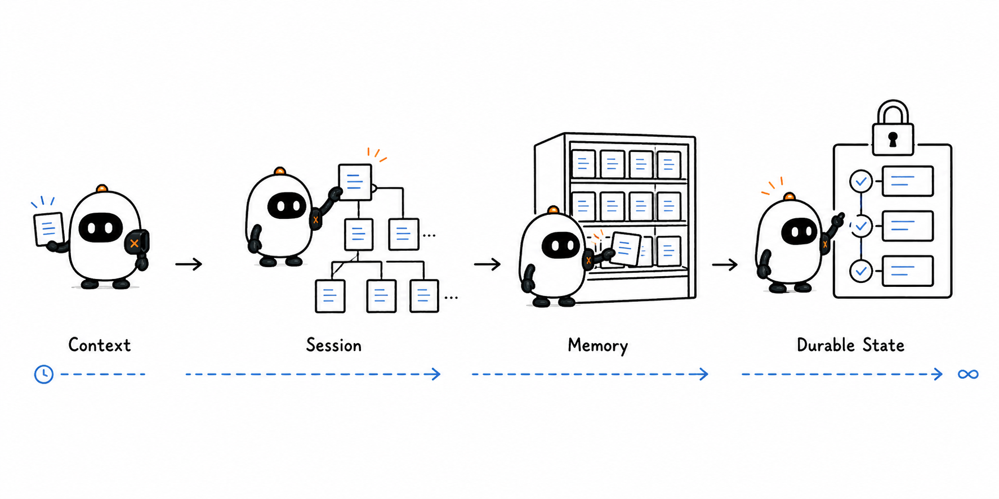
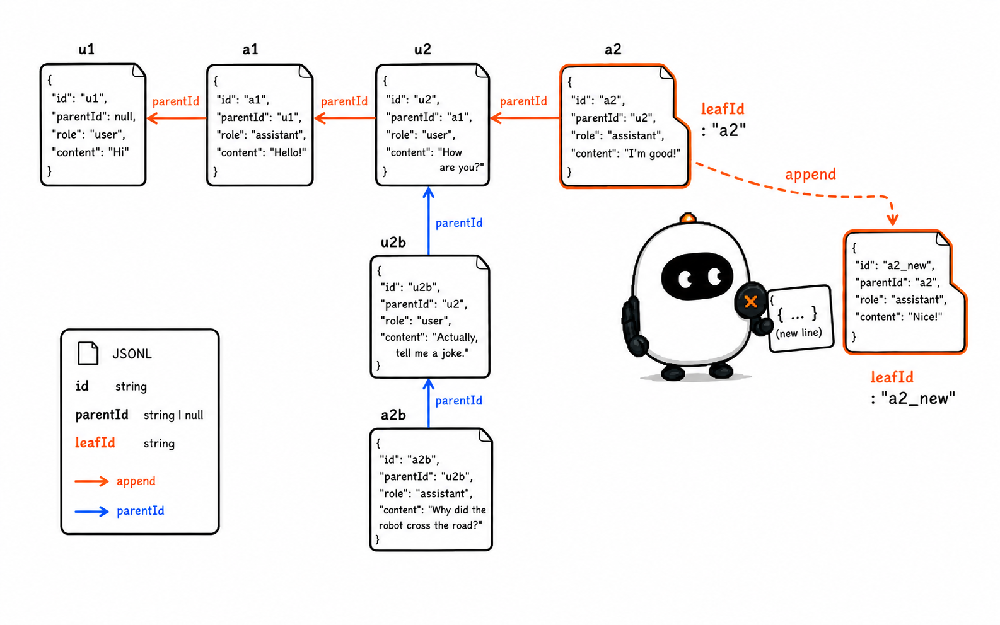
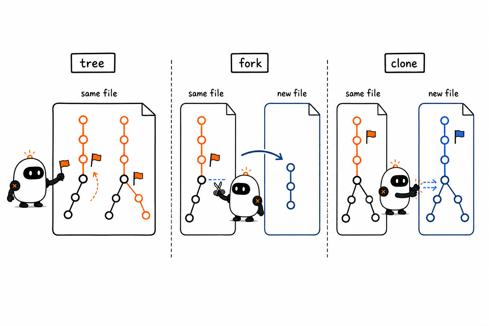
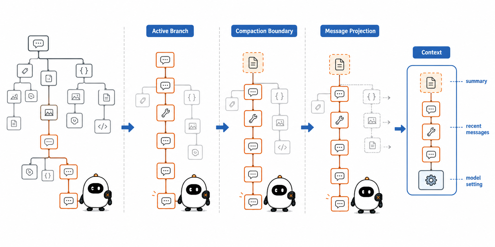
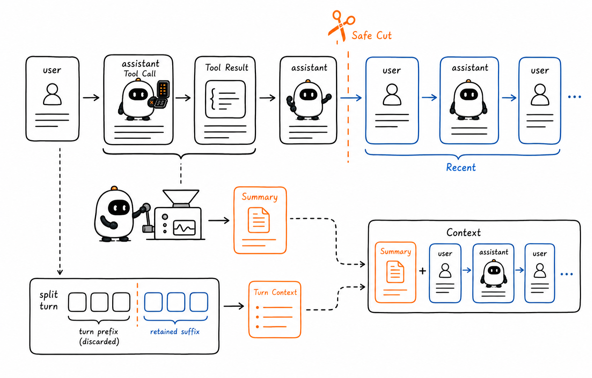
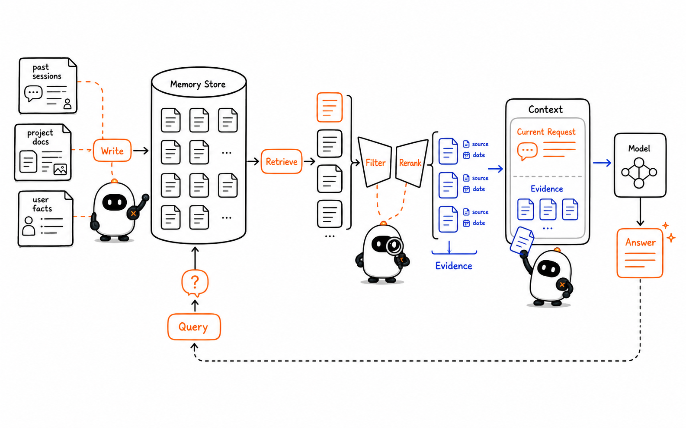
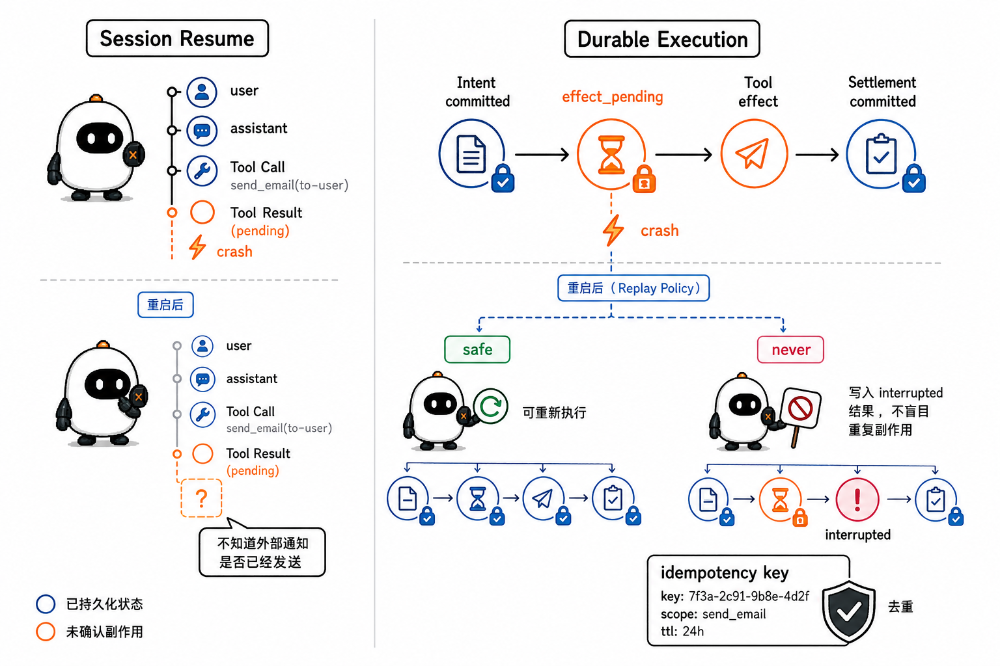

# Session、Memory、Retrieval 与 Compaction：信息怎样跨越多轮任务

这是 learn-pi-agent 的第 6 章。上一章把 Context 解释为一次模型调用的输入快照：每次调用前，宿主都要重新选择 system prompt、历史消息、工具定义和动态信息。

现在把时间拉长。一个 coding agent 可能连续工作几十轮，也可能在关闭程序后第二天继续。完整历史会越来越大，模型的上下文窗口却始终有限；过去的信息即使保存到了磁盘，也不会自动出现在下一次模型调用里。

要让信息真正跨越多轮任务，系统至少要回答四个问题：

1. **保存什么**：哪些消息、设置、分支和运行结果需要持久化；
2. **恢复什么**：重新启动后，怎样还原当前工作位置；
3. **取回什么**：窗口外的大量信息中，哪些与当前问题有关；
4. **压缩什么**：历史过长时，怎样腾出空间又尽量保留继续工作所需的信息。

Pi 的 Session、消息树与 Compaction 给出了保存、恢复和压缩的工程基础；Memory 与 Retrieval 则说明“保存下来”以后怎样选择性地再利用。沿着这些边界，本章还会解释 Checkpoint 与 Durable Execution 为什么比普通的会话恢复多一层运行保证。

> **源码说明**：文中的 Pi 接口名称、字段和控制顺序对应源码基线 `086c32e74530564922d011ade23ff582c9d63116`。标注“教学简化”的代码按真实接口和顺序删减，用于突出职责，不是仓库源码的逐字复制。



## 1. 先把六个容易混淆的对象分开

下面六个词都与“系统知道什么”有关，但它们的生命周期和用途不同。

| 概念 | 它回答的问题 | 典型生命周期 | 是否直接发给模型 |
| --- | --- | --- | --- |
| Context | 这一轮模型能看见什么？ | 一次模型调用 | 是 |
| State | 程序此刻运行到哪里？ | 进程内的一次 run 或更长 | 不一定 |
| Session | 这段交互保存了什么？ | 多轮、重启之后 | 经过投影后才发送 |
| Memory | 哪些过去信息值得以后复用？ | 跨轮次，可能跨 Session | 检索或选择后才发送 |
| Checkpoint | 从哪个已确认位置可以恢复计算？ | 长任务的恢复点 | 通常不是直接输入 |
| Durable Execution | 崩溃后怎样继续，又不重复已确认的副作用？ | 跨进程与基础设施故障 | 由运行系统控制 |

这张表最重要的一行边界是：

```text
保存进 Session
      ≠
进入本轮 Context
      ≠
成为可检索、可更新的长期 Memory
      ≠
获得可安全重放的运行保证
```

一个 JSONL 文件可以完整保存对话，却不能让模型突破 Context Window；一个向量数据库可以找回相似片段，却不一定知道任务执行到了哪一步；一个 Checkpoint 可以记录控制位置，却不等于保存了所有知识。这些能力需要在 Harness 中组合。

## 2. Pi 的 Session 是一棵追加写入的 JSONL 树

Pi coding-agent 会把会话自动保存到 `~/.pi/agent/sessions/`，并按当前工作目录分组。每个会话是一个 JSONL 文件：文件中的每一行都是一个独立 JSON 对象。

JSONL 适合追加写入。程序生成一条新消息或元数据时，可以追加一行，而不需要反复重写整个长文件。

### 2.1 文件头说明“这是哪个 Session”

固定源码中的 `SessionHeader` 包含：

```ts
interface SessionHeader {
  type: "session";
  version?: number;
  id: string;
  timestamp: string;
  cwd: string;
  parentSession?: string;
}
```

- `id` 是会话标识；
- `timestamp` 记录创建时间；
- `cwd` 记录这个会话对应的工作目录；
- `parentSession` 可以指出它从哪个会话派生；
- `version` 让读取器有机会迁移旧格式。

固定基线中，这条 coding-agent Session 文件的当前格式版本是 `3`。版本号属于源码基线事实，以后可能变化，因此解析器不应把某个版本永久写死成“Pi 的最终格式”。

### 2.2 每条 Entry 都有自己的位置

会话头之后是 `SessionEntry`。所有 Entry 共享三个定位字段：

```ts
interface SessionEntryBase {
  type: string;
  id: string;
  parentId: string | null;
  timestamp: string;
}
```

`id` 标识当前节点，`parentId` 指向它的父节点。第一条 Entry 的 `parentId` 为 `null`；后续 Entry 不必只指向文件中的上一行，因此同一个文件可以表达分支。

固定版本中的 Entry 类型包括：

| Entry 类型 | 保存的内容 | 会进入模型 Context 吗 |
| --- | --- | --- |
| `message` | user、assistant、Tool Result 等消息 | 会 |
| `model_change` | Provider 与模型切换 | 不作为消息；用于恢复设置 |
| `thinking_level_change` | 模型推理强度设置的变化 | 不作为消息；用于恢复设置 |
| `compaction` | 压缩摘要与保留边界 | 会投影成压缩摘要消息 |
| `branch_summary` | 离开旧分支时生成的摘要 | 会投影成分支摘要消息 |
| `custom_message` | Extension 注入的自定义消息 | 会 |
| `custom` | Extension 自己的持久化数据 | 不会 |
| `label` | 节点标签 | 不会 |
| `session_info` | 会话名称等元数据 | 不会 |

`custom` 和 `custom_message` 的区别很有代表性：两者都能持久化，但只有后者会参与模型上下文。Session 文件既保存“模型可能看到的内容”，也保存“只给宿主恢复状态的内容”。

## 3. `leafId` 决定当前正在走哪条分支

`SessionManager` 把整个会话描述为一棵 append-only tree，也就是**只追加、不原地修改旧节点的树**。

它还维护一个 `leafId`：当前活动位置的叶子节点。

```text
u1 ─ a1 ─ u2 ─ a2 ─ u3 ─ a3   ← leafId
          └─ u2' ─ a2'
```

每次追加 Entry，新节点都成为当前叶子的孩子，随后 `leafId` 移到新节点。回到旧节点不会删除后面的历史；下一次追加只是在旧节点下面长出另一条分支。



### 3.1 活动分支不是文件中的最后几行

JSONL 的物理顺序记录“哪些 Entry 先后被追加”，树路径记录“当前对话从根走到了哪里”。两者不能混为一谈。

`getBranch()` 的工作是从 `leafId` 沿 `parentId` 一直走到根，再把结果反转成根到叶的顺序：

```ts
// 教学简化：名字和遍历方向与 Pi 对齐
function getBranch(leafId: string | null): SessionEntry[] {
  const path: SessionEntry[] = [];
  let current = leafId ? byId.get(leafId) : undefined;

  while (current) {
    path.push(current);
    current = current.parentId ? byId.get(current.parentId) : undefined;
  }

  return path.reverse();
}
```

因此，一个文件可以保留多条历史路径，但下一轮模型调用通常只使用当前活动分支的投影。

### 3.2 `/tree`、`/fork` 与 `/clone` 解决不同问题

Pi 提供三种容易混淆的导航方式：

| 操作 | 结果写到哪里 | 从哪里继续 | 适合的场景 |
| --- | --- | --- | --- |
| `/tree` | 仍在同一个 Session 文件 | 树中的任意旧位置 | 在同一任务中探索另一种方案 |
| `/fork` | 创建新 Session 文件 | 选中的旧 user message 附近 | 从较早问题开始独立任务 |
| `/clone` | 创建新 Session 文件 | 当前活动分支的当前位置 | 复制当前进度后分别继续 |

`/tree` 改变当前叶子，旧分支仍留在原文件；`/fork` 与 `/clone` 则建立新文件，并通过会话头中的父会话信息保留来源关系。



### 3.3 Branch Summary 与 Compaction 不是同一种摘要

从一条分支跳到另一条分支时，Pi 可以为“被离开的路径”生成 Branch Summary，并把摘要挂到新的活动位置。它的目标是保留旧方案中仍有用的信息。

Compaction 则面向 Context Window：当活动分支太长时，把较早内容变成摘要，同时保留一段较新的原始消息。

```text
Branch Summary：为什么离开旧路径，旧路径有哪些成果仍需带走
Compaction：活动路径太长，怎样为后续模型调用腾出 token
```

两者都会生成摘要，但触发原因、覆盖范围和树中的位置不同。

## 4. Session 怎样重新变成模型 Context

Session 恢复不是“把 JSONL 全部发送给模型”。Pi 会先选择活动路径，再应用 Compaction 边界，最后只把能产生消息的 Entry 转换成 `AgentMessage[]`。

固定源码中的主流程可以压缩成四步：

```text
全部 Session Entries
        ↓ 从 leafId 回溯
当前活动 Branch
        ↓ 应用最新 Compaction 边界
Context Entries
        ↓ sessionEntryToContextMessages
AgentMessage[]
        ↓ 进入 Agent state
下一轮 Context
```



### 4.1 `buildSessionContext()` 是一次投影

删去类型标注后，固定版本中的控制部分很短：

```ts
function buildSessionContext(entries, leafId, byId): SessionContext {
  const path = buildSessionPath(entries, leafId, byId);
  const { thinkingLevel, model } = getSessionContextSettings(path);
  const messages = buildContextEntries(entries, leafId, byId)
    .flatMap(sessionEntryToContextMessages);

  return { messages, thinkingLevel, model };
}
```

这段代码同时恢复两类信息：

- 沿活动路径查找最近的模型与推理强度设置；
- 把适合进入 Context 的 Entry 投影成消息。

它没有把 `label`、`session_info` 或普通 `custom` Entry 伪装成用户消息，也没有把废弃分支无条件塞进 Context。

### 4.2 重新启动时，恢复结果进入 `agent.state.messages`

`createAgentSession(...)` 创建 coding-agent 会话时，会先调用 `sessionManager.buildSessionContext()`。如果已有消息，它会尝试恢复模型和推理强度设置，并把消息放回 Agent state：

```ts
// 教学简化：对应 Pi SDK 的恢复顺序
const existingSession = sessionManager.buildSessionContext();

if (existingSession.messages.length > 0) {
  restoreModelAndThinkingLevel(existingSession);
  agent.state.messages = existingSession.messages;
}
```

下一次 `agent.prompt(...)` 或 `agent.continue()` 便从这份恢复后的活动消息继续。模型没有在后台永久记住昨天的对话；是宿主读取 Session，并把选中的历史重新放回模型输入链路。

## 5. Compaction 怎样在有限窗口中保留连续性

Compaction 的核心动作是：

```text
较早的原始消息 ──生成摘要──► 一条 Compaction Summary
较新的原始消息 ────────────► 原样保留
完整 Session 文件 ──────────► 旧 Entry 仍然存在
```

模型之后看到的是“摘要 + 保留的近期消息”，而不是摘要之前的全部原文。

### 5.1 什么时候触发

固定版本的默认设置是：

```ts
const DEFAULT_COMPACTION_SETTINGS = {
  enabled: true,
  reserveTokens: 16_384,
  keepRecentTokens: 20_000,
};
```

自动阈值判断为：

```ts
function shouldCompact(contextTokens, contextWindow, settings) {
  if (!settings.enabled) return false;
  return contextTokens > contextWindow - settings.reserveTokens;
}
```

`reserveTokens` 是提前留出的空间，避免输入一直增长到模型完全没有输出余量；`keepRecentTokens` 用来寻找压缩切点，尽量保留最近的一段工作。它们是默认值，不是适合所有模型和任务的常数。

### 5.2 切点不能破坏 Tool Call 与 Tool Result 的关系

如果摘要边界落在错误位置，模型可能只看到 Tool Result，却看不到它对应的 Tool Call。Pi 因此把 user、assistant、custom、branch summary 等消息视为可选切点，但不在 Tool Result 上切开。

```text
assistant: Tool Call(read)  ─┐
tool:      Tool Result       ├─ 保持相邻关系
assistant: 根据结果继续      ┘
```

当切点落在带 Tool Call 的 assistant message 上时，后面的 Tool Result 会和它一起保留。

### 5.3 一个超长 turn 还要单独处理前缀

一次用户请求可能触发大量工具往返，单个 turn 本身就可能超过 `keepRecentTokens`。如果切点落在这个 turn 中间，Pi 会：

1. 找到这个 turn 的开始位置；
2. 为更早的完整历史生成主摘要；
3. 为当前 turn 被切掉的前缀生成一段 Turn Context；
4. 把两段摘要合并，再接上保留的 turn 后缀。

这样，最近的工具工作可以原样保留，同时给它补上“用户最初要求什么、这个 turn 前半段已经做了什么”。



### 5.4 多次 Compaction 是迭代更新，不是每次从头总结

第二次压缩时，第一次的摘要已经代表更早历史。Pi 会把 previous summary 交给新的总结请求，再加入这次新增的旧消息，形成更新后的摘要。

```text
第一次：history A → summary A + recent B

第二次：summary A + old part of B
                    ↓
              summary A+B + recent C
```

Pi 的默认摘要还会保留目标、约束、进度、关键决定、下一步与重要文件操作等结构。它针对 coding agent 的继续工作场景设计，不是简单截取前几句话。

### 5.5 `manual`、`threshold` 与 `overflow` 的后续行为不同

Pi 中可以看到三种 Compaction 原因：

| 原因 | 含义 | 压缩后是否自动重试被中断的模型调用 |
| --- | --- | --- |
| `manual` | 用户执行 `/compact` | 否 |
| `threshold` | 成功响应后发现上下文接近阈值 | 否；下一次继续使用新上下文 |
| `overflow` | Provider 报上下文溢出，或输出在可恢复条件下被长度截断 | 可以；固定版本最多进行一次 compact-and-retry 恢复 |

发生可恢复的 overflow 时，失败或被截断的 assistant message 已经留在磁盘 Session 中，但 Pi 会先把它从当前 Agent state 移除，避免把失败响应带进重试 Context。Compaction 完成后，Pi 还会再次检查并移除可能被投影回来的末尾失败消息，然后才继续。

这体现了 Session 与 State 的区别：

```text
Session：保留发生过的事实，便于审计和回看
State：只保留下一次执行真正应该使用的消息
```

### 5.6 Extension 可以改写压缩过程

Compaction 不是不可替换的黑盒。执行自动压缩或 `/compact` 前，Pi 会发出 `session_before_compact` 扩展事件。处理器可以读取：

- `preparation.messagesToSummarize`：准备被主摘要替代的消息；
- `preparation.turnPrefixMessages`：split turn 中准备单独总结的前缀；
- `preparation.previousSummary`：上一次压缩摘要；
- `preparation.firstKeptEntryId`：保留区的第一条 Entry；
- `branchEntries`：当前完整活动分支；
- `reason` 与 `willRetry`：触发原因以及压缩后是否准备重试。

Extension 可以取消本次压缩，也可以返回自己的 `summary`、`firstKeptEntryId`、`tokensBefore` 与可选 `details`。Pi 随后仍通过 `appendCompaction(...)` 保存结果，并重新调用 `buildSessionContext()` 构造 Agent state。

这条扩展边界让应用能够更换摘要模型、保留领域特定结构或记录自定义索引，但也把摘要质量和边界正确性交给扩展实现。一个自定义摘要如果遗漏关键约束，持久化成功也不会让内容自动正确。

## 6. Compaction 是有损压缩，不是无损归档

摘要可能漏掉：

- 某个后来才变重要的细节；
- 工具输出里的精确数字；
- 被模型误判为无关的约束；
- 一段代码中的微小差异；
- 尚未显现价值的失败路径。

Pi 的消息树缓解了这个问题：旧 Entry 仍保留在 JSONL 文件中，`/tree` 可以回到压缩前的路径，Session 导出也可以查看完整历史。但下一轮模型只能依据摘要和保留区工作；它不会自动回头读取被压缩掉的原文。

因此，Compaction 同时有两个质量指标：

1. **空间收益**：压缩后减少了多少 Context token；
2. **继续工作质量**：摘要是否保留了后续决策真正需要的信息。

只看“压缩率”会鼓励过度删减；只保留所有细节又无法解决窗口限制。真正的评估应让 Agent 在压缩后继续完成任务，并观察它是否遗忘约束、重复动作或做出矛盾决定。

## 7. Session 不等于 Memory

Session 是一份持久化记录；Memory 是一套**选择、写入、更新、检索和遗忘过去信息的机制**。一个系统可以保存很多 Session，却没有跨会话复用信息的 Memory；也可以有项目知识库，却不保存逐轮聊天记录。

Agent 领域没有唯一统一的 Memory 分类。CoALA 提供了一套便于工程思考的框架：把当前工作信息与长期信息分开，再把长期信息分成经历、事实和行为规则。

| 教学分类 | 保存什么 | 在 Agent 工程中的例子 |
| --- | --- | --- |
| Working Memory | 当前目标、最近观察、中间结果 | 本轮 Context、当前 State |
| Episodic Memory | 过去发生过的事件与轨迹 | Session 消息、历史工具执行、任务结果 |
| Semantic Memory | 可复用的事实与知识 | 项目事实、用户偏好、文档知识库 |
| Procedural Memory | 怎样行动的规则和步骤 | system prompt、Skill、工作流、工具使用规范 |

这些是设计类比，不代表 Pi 内部一定有四个同名类。固定基线中的 coding-agent `SessionManager` 负责会话树、设置、分支和摘要；它没有自动把每条历史提炼成跨 Session 的用户偏好或语义知识。

MemGPT 则用操作系统的分层存储作类比：有限 Context 像快速但容量小的内存，窗口外的存储容量更大，需要显式把信息移入或移出。这个类比有助于理解“保存”和“模型当前可见”之间的差别，但 Pi 的具体实现仍应以 Pi 源码为准。

## 8. Retrieval：需要时把窗口外的信息找回来

如果长期信息全部放在 Session 或知识库里，下一步问题是：当前请求需要哪一部分？Retrieval 就是根据查询从候选集合中找出相关内容，再选择性地放回 Context。

一个常见流程是：

```text
当前任务
   ↓ 生成查询
候选库搜索
   ↓ 召回一批候选
过滤 / 排序 / 去重
   ↓ 选出少量证据
标注来源与信任级别
   ↓ 注入本轮 Context
模型基于证据生成或行动
```



### 8.1 检索可以使用不同信号

- 关键词匹配适合精确名称、错误码和函数名；
- 向量相似度适合语义接近但用词不同的内容；
- 时间和新鲜度适合状态频繁变化的信息；
- 权限和来源过滤防止把不应访问的内容召回；
- 任务、项目和用户范围过滤防止跨边界混入数据；
- reranking 可以在初步召回后，用更强模型重新排序。

相似度高不等于事实正确，也不等于有权使用。检索系统至少要保留来源、时间、权限范围和稳定标识，才能在后续回答中核对。

### 8.2 RAG 是 Retrieval 与 Generation 的组合

Lewis 等人在 2020 年提出的 RAG 工作，把参数化模型与可检索的非参数化知识结合起来。今天工程实践中的 “RAG” 用法更宽，但核心仍是：**先取回证据，再让模型在证据条件下生成。**

```ts
// 教学简化：表达数据流，不对应 Pi 中某个现成 RAG 类
const hits = await search(query, {
  projectId,
  limit: 20,
});

const evidence = await rerankAndFilter(hits, {
  maxItems: 6,
  maxTokens: 8_000,
});

const context = buildContext({
  request,
  evidence: evidence.map((item) => ({
    source: item.source,
    updatedAt: item.updatedAt,
    content: item.content,
  })),
});

const response = await model.generate(context);
```

RAG 可以提高可更新性和来源可追溯性，但不会自动消除幻觉：检索可能漏掉正确资料，排序可能选错，证据可能过期，模型也可能误读证据。评估时要把“召回是否正确”和“生成是否忠实”分开。

### 8.3 Session Search 是 Retrieval，但不自动等于完整 Memory

Pi 固定版本的 `packages/agent` 提供 `SessionSearch` 接口。基础命中只保证稳定身份：

```ts
interface SessionSearchHit {
  readonly sessionId: string;
  readonly entryId: string;
}

interface SessionSearch {
  search(text: string, options?): AsyncIterable<SessionSearchHit>;
}
```

具体后端可以增加 snippet、timestamp、score 等信息。源码同时给出扫描搜索与 SQLite FTS 的实现思路；远程索引则属于应用可以扩展的部分。

它解决“在哪个 Session Entry 出现过这段相关内容”，但还没有替应用决定：

- 哪些命中应被写入长期记忆；
- 多条矛盾事实怎样更新；
- 何时遗忘过期内容；
- 哪些结果可以进入当前 Context；
- 检索文本中的指令应该获得什么信任级别。

搜索是 Memory 系统的重要读路径，不是 Memory 的全部生命周期。

`SessionSearch` 也不会自动把命中注入模型。调用者仍要读取对应 Entry、做权限和相关性判断、控制 token 预算，再把选中的内容交给 Context Builder。

## 9. Checkpoint 与 Durable Execution 多保证了什么

一个普通 Session 能让对话继续，却不一定能让**正在执行的副作用**安全继续。

考虑一次工具调用：

```text
1. Agent 记录“准备发送通知”
2. 工具真的发送了通知
3. 程序在写入 Tool Result 前崩溃
4. 重启后，系统应该重发，还是认为已经发送？
```

仅凭对话历史无法确定第 2 步是否成功。盲目重放可能发送两次；完全不重放又可能漏掉一次。这是分布式系统中的不确定窗口。

### 9.1 Checkpoint 是已确认的恢复位置

Checkpoint 保存恢复计算所需的控制状态，例如：

- 当前操作标识；
- 已完成到哪个阶段；
- 下一步准备执行什么；
- 哪些请求已经发出；
- 哪些结果已经可靠提交；
- 重试次数、取消状态和等待中的输入。

Compaction Summary 有时也被称为“context checkpoint summary”，因为它为另一轮模型生成保留继续工作所需的信息。但它是**语义摘要**；运行 Checkpoint 则要精确表达程序控制位置。两者用途不同。

### 9.2 Pi 固定版本中有三层容易混淆的内容

第一层是本章前半部分实际使用的 `pi-coding-agent` `SessionManager`。它支撑本地 coding-agent 的 JSONL 消息树、恢复、分支和 Compaction；`AgentSession` 在 `message_end` 时把消息追加进去，重新打开时再从当前叶子投影 Context。这条路径可以运行，但它保存的是会话轨迹，不是工具执行到一半时的程序计数器。

第二层是 `packages/agent/src/harness/session` 中已经存在的 Session 存储类型，以及 `agent-harness.ts` 暴露的 `AgentHarness` API 骨架。固定 commit 的 `AgentHarness.create()` 遇到已有记录会抛出 `HarnessNotImplemented("create.restore")`，`prompt()`、`resume()`、`abort()` 等运行方法也都会返回 `HarnessNotImplemented`。`packages/coding-agent/src/server/create-harness.ts` 能够组装 Tool、System Prompt 与 Harness 选项，但最终仍调用这个尚未完成的骨架；存在装配入口不等于 durable run 已经可用。

第三层是标题明确写着 **implementation specification** 的 `packages/agent/docs/harness.md`。它规定了未来 Durable Harness 的目标模型：Entry tree、Facts、Lanes、Usage ledger、完整 operation state、原子事务和恢复策略。文档中的行为是实现规范，不能当成当前源码已经交付的行为。

把三层放在一起，结论是：

| 层 | 固定版本中的状态 | 能说明什么 |
| --- | --- | --- |
| coding-agent `SessionManager` / `AgentSession` | 可运行 | 消息与会话分支怎样持久化 |
| `AgentHarness` 与 Harness Session API | 类型和存储基础存在，运行路径仍是 scaffold | 计划提供哪些公开能力 |
| `docs/harness.md` | 目标实现规范 | Durable Execution 应怎样记录控制位置和恢复副作用 |

### 9.3 目标规范中的副作用重放策略

`docs/harness.md` 要求未来实现先持久化动作 intent，再执行真实 Tool，并为 Tool 声明 replay policy。若实现完成，恢复到“副作用可能已经开始、结果尚未确认”的状态时：

- 持久化时与恢复时的工具声明都为 `safe`，才可以使用已保存参数重新执行；
- 不可安全重放的工具，不会直接重复执行，而是写入 interrupted error 再继续控制流；
- Provider 生成也有单独的 retry policy，因为崩溃前的请求可能已经计费或产生过输出。

这比“保存消息”多了一套运行协议：系统还要记录动作意图、确认结果和恢复策略。固定 commit 已经把这套语义写入规范和部分公开类型，但不能据此声称 `AgentHarness` 已经能够完成崩溃恢复。



### 9.4 Durable 不代表外部动作天然 exactly-once

Temporal 的官方文档用 Event History 与 deterministic replay 恢复 Workflow 状态，并把网络请求、数据库写入等非确定性操作放入可重试的 Activity。文档同时强调：Activity 可能执行多次，写操作应该具有幂等性。

幂等的含义是：同一个操作重复执行，系统最终结果与执行一次相同。常见做法是给外部 API 传递稳定的 idempotency key，让接收方识别重复请求。

因此，更准确的工程表述是：

```text
Durable Execution
  = 持久化控制状态
  + 明确恢复与重试协议
  + 识别不确定的副作用窗口
  + 幂等键、去重或人工处理
```

不要把“Workflow 最终只观察到一个完成结果”误写成“底层动作绝不可能执行多次”。

第 16 章会继续展开 Background Agent、Retry、Pause、Approval、Reject 与 Resume；本章先建立它们和普通 Session 的边界。

## 10. 把这些组件放回一套 Agent 架构

一个支持长任务的 Harness 可以把信息流分成下面几层：

```text
用户请求
   ↓
Session / Entry Tree ───────────► 保存真实交互轨迹
   ↓ 活动分支投影
State / Checkpoint ─────────────► 保存当前控制位置
   ↓
Retrieval ◄──── Memory / 文档库 ► 选择窗口外相关信息
   ↓
Context Builder ────────────────► 生成本轮有限输入
   ↓
Model + Agent Loop + Tools
   ↓
结果、用量、动作确认再持久化
```

当 Context 接近上限，Compaction 改写的是“以后怎样投影活动历史”；它不需要删除 Session 原始树。当任务跨 Session 复用事实，Memory 系统需要从历史、文档或人工输入中选择并维护可检索内容。当运行跨故障恢复，Checkpoint 与副作用协议还要保证控制流知道自己停在哪里。

### 10.1 选择机制时先看信息的用途

| 需求 | 更合适的机制 |
| --- | --- |
| 继续刚才的对话 | Session active branch |
| 回看另一种尝试 | Session tree / branch |
| 降低长历史 token | Compaction |
| 找到过去提到的错误码 | Session Search / keyword retrieval |
| 从项目文档回答问题 | 文档 Retrieval / RAG |
| 保存跨任务用户偏好 | 有来源、可更新的 semantic memory |
| 崩溃后继续长操作 | Checkpoint + Durable Execution |
| 防止重复付款或重复发消息 | Idempotency key / 去重 / 明确 replay policy |

这些机制可以组合，但不能互相代替。

## 11. 七个常见误解

### 11.1 “Session 保存了，所以模型已经记住了”

Session 属于宿主存储。只有被投影进 Context 的内容，模型在本轮才可见。

### 11.2 “Session 就是 Memory”

Session 是原始经历的重要来源；Memory 还需要选择、更新、检索、冲突处理和遗忘策略。

### 11.3 “长 Context 可以替代 Retrieval”

窗口更长不代表应该把全部资料发给每次调用。Retrieval 还承担相关性、来源、权限与新鲜度筛选。

### 11.4 “RAG 会让回答不再幻觉”

RAG 增加外部证据，但召回、排序和生成每一层仍可能出错。证据引用与忠实度需要单独评估。

### 11.5 “Compaction 只是删除旧消息”

Pi 会生成结构化摘要、保留近期消息、维护 Tool Call 与 Tool Result 边界，并在 split turn 时单独总结前缀。它仍然是有损过程。

### 11.6 “Branch Summary 与 Compaction 一样”

Branch Summary 带回被离开路径中的关键信息；Compaction 为活动路径释放 Context 空间。

### 11.7 “保存 Checkpoint 就能保证副作用只发生一次”

Checkpoint 让系统知道恢复位置。外部副作用仍需要重放策略、幂等键、去重或人工确认。

## 本章小结

- Context 是一次模型调用的有限输入；Session 是跨 turn、跨重启保存的宿主记录。
- Pi coding-agent 用 JSONL 保存 Session；每个 Entry 通过 `id` 与 `parentId` 组成 append-only tree，`leafId` 表示当前活动位置。
- `/tree` 在同一文件内切换路径，`/fork` 从旧 user message 建立新 Session，`/clone` 复制当前活动分支。
- `buildSessionContext()` 从当前叶子选择活动分支、应用 Compaction 边界、恢复模型设置，并把合适的 Entry 投影为 `AgentMessage[]`。
- Branch Summary 保存被离开分支的关键信息；Compaction 用摘要替代较早活动历史，并保留近期原始消息。
- Pi 的 Compaction 会预留输出空间、寻找安全切点、避免拆散 Tool Call 与 Tool Result，并处理单个超长 turn。
- Compaction 摘要是有损表示；完整旧 Entry 仍可留在 Session 树中，但模型不会自动读取它们。
- Memory 不等同于 Session。它还包含信息选择、写入、更新、检索、冲突处理与遗忘。
- Retrieval 把窗口外的相关信息带回 Context；RAG 是先检索证据再生成，不能自动保证事实正确。
- Pi 固定版本的 coding-agent Session 可以恢复消息树；`AgentHarness` 运行 API 仍是 scaffold，`docs/harness.md` 描述的是尚待落地的 operation state 与副作用恢复规范。
- Durable Execution 需要控制状态、重试协议和副作用幂等性；“可恢复”不等于底层动作绝不重复。

## 下一章：MCP——Agent 与外部世界的协议

Session、Memory 与 Retrieval 解决信息怎样保存和取回。下一章进入能力接入：MCP 怎样用统一协议连接 Host、Client 与 Server，Tools、Resources、Prompts 和 Sampling 各自表达什么，以及 Pi 为什么需要通过 Extension 或 Package 把 MCP 接进自己的 Harness。

## 参考资料

- [Pi `SessionManager`：Session Entry、消息树与 Context 投影](https://github.com/earendil-works/pi/blob/086c32e74530564922d011ade23ff582c9d63116/packages/coding-agent/src/core/session-manager.ts)
- [Pi `createAgentSession(...)`：从 Session 恢复模型、推理强度与消息](https://github.com/earendil-works/pi/blob/086c32e74530564922d011ade23ff582c9d63116/packages/coding-agent/src/core/sdk.ts)
- [Pi Sessions 文档：存储、tree、fork 与 clone](https://github.com/earendil-works/pi/blob/086c32e74530564922d011ade23ff582c9d63116/packages/coding-agent/docs/sessions.md)
- [Pi Compaction 源码：阈值、切点、split turn 与迭代摘要](https://github.com/earendil-works/pi/blob/086c32e74530564922d011ade23ff582c9d63116/packages/coding-agent/src/core/compaction/compaction.ts)
- [Pi `AgentSession`：自动压缩、overflow 恢复与 State 重建](https://github.com/earendil-works/pi/blob/086c32e74530564922d011ade23ff582c9d63116/packages/coding-agent/src/core/agent-session.ts)
- [Pi Agent Harness：Durable Session 与 operation state 实现规范](https://github.com/earendil-works/pi/blob/086c32e74530564922d011ade23ff582c9d63116/packages/agent/docs/harness.md)
- [Pi `AgentHarness` API 骨架与 `HarnessNotImplemented`](https://github.com/earendil-works/pi/blob/086c32e74530564922d011ade23ff582c9d63116/packages/agent/src/harness/agent-harness.ts)
- [Pi Session Search：扫描、SQLite FTS 与可扩展索引](https://github.com/earendil-works/pi/blob/086c32e74530564922d011ade23ff582c9d63116/packages/agent/docs/search.md)
- [Lewis et al., Retrieval-Augmented Generation for Knowledge-Intensive NLP Tasks](https://arxiv.org/abs/2005.11401)
- [Sumers et al., Cognitive Architectures for Language Agents](https://arxiv.org/abs/2309.02427)
- [Packer et al., MemGPT: Towards LLMs as Operating Systems](https://arxiv.org/abs/2310.08560)
- [Temporal：Event History 与崩溃恢复](https://docs.temporal.io/encyclopedia/event-history)
- [Temporal：Workflow determinism 与 replay](https://docs.temporal.io/workflow-definition)
- [Temporal：Activity idempotency 与 retry](https://docs.temporal.io/activity-definition)
