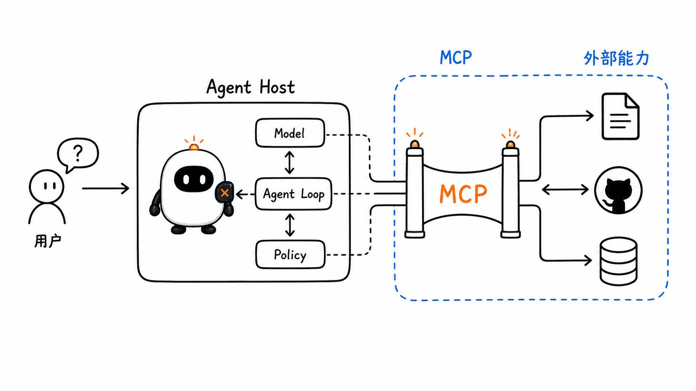
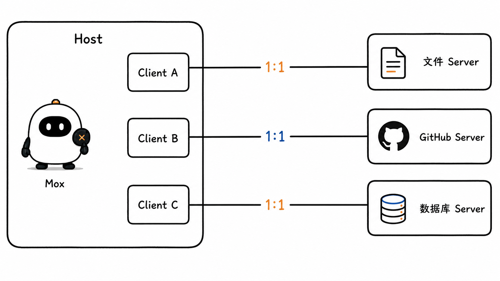
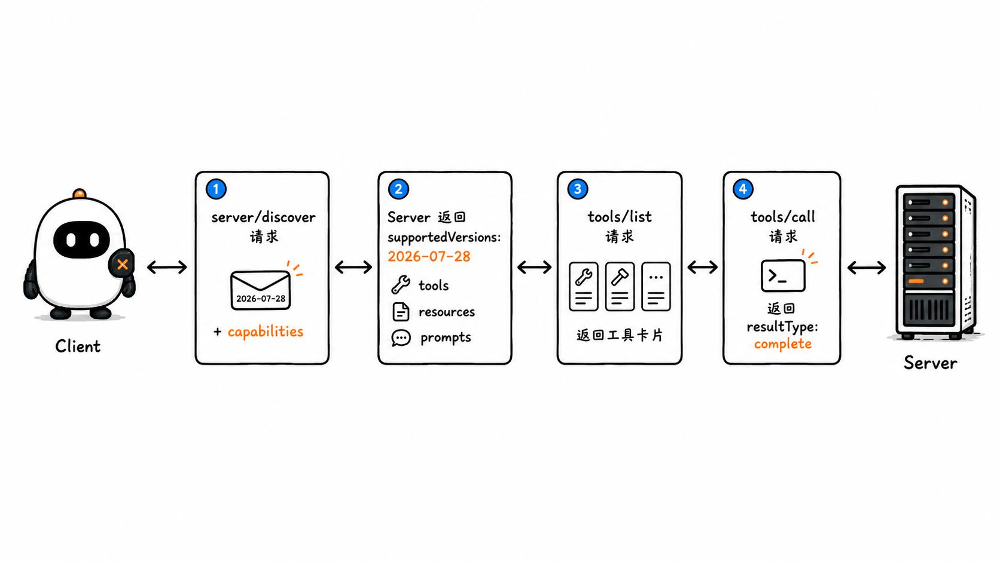
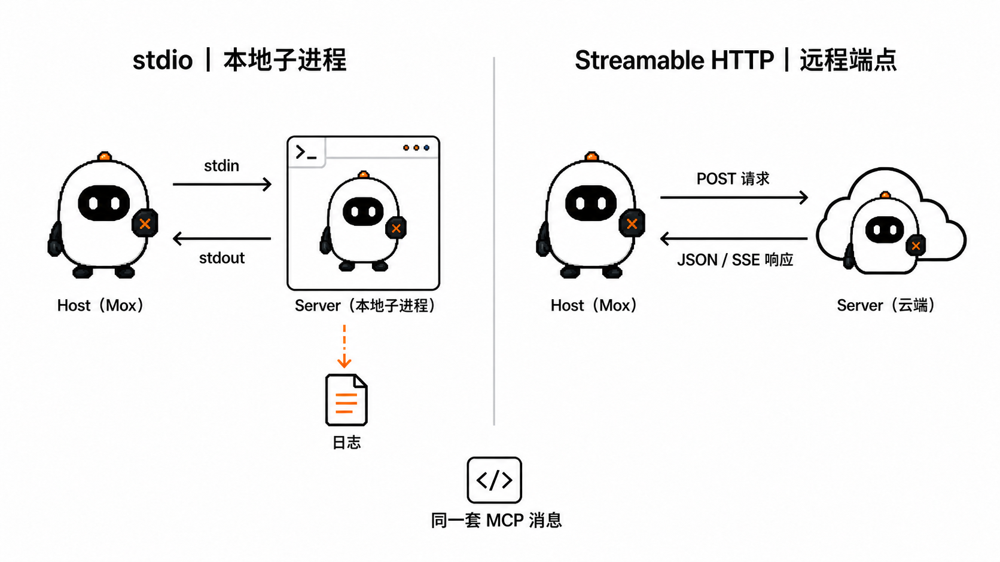
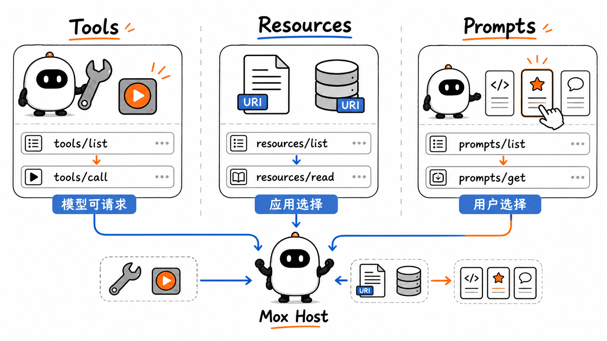
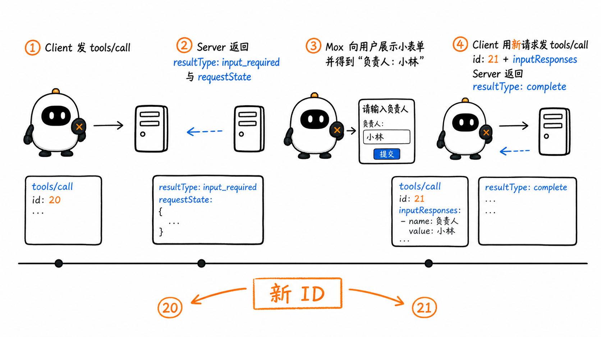
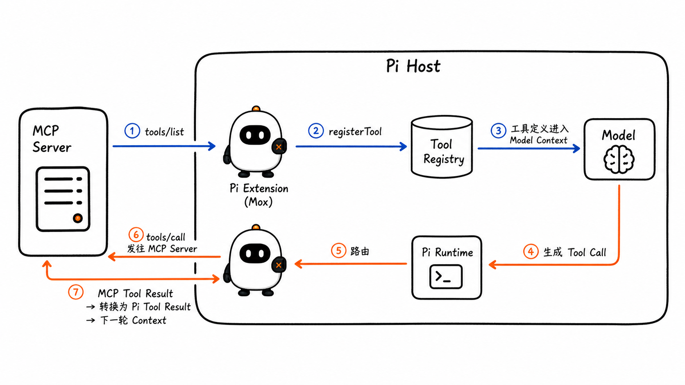
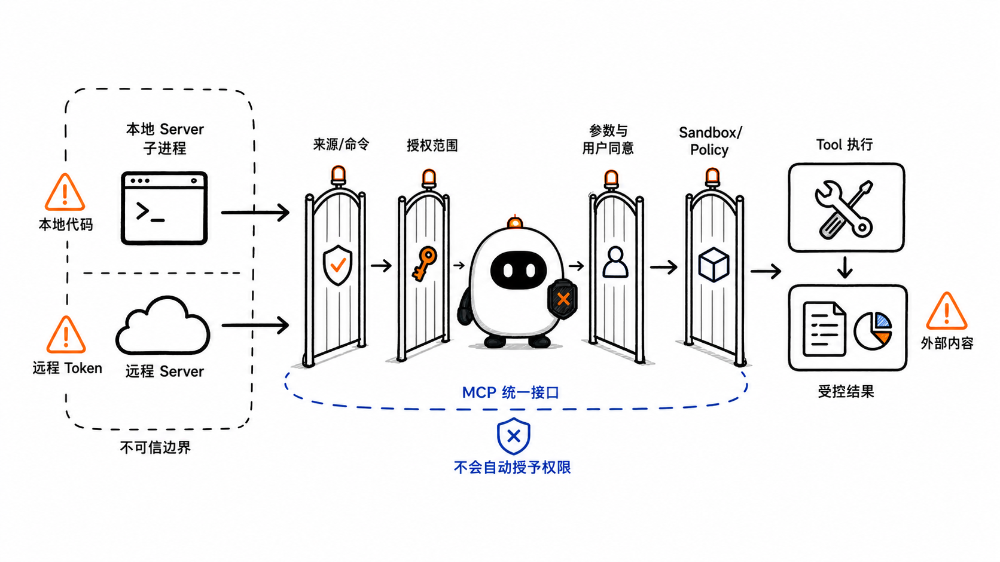

# MCP：Agent 怎样用统一协议连接外部能力

这是 learn-pi-agent 的第 7 章。上一章解释了 Session、Memory 与 Retrieval：信息怎样保存，又怎样在需要时进入模型的 Context。

这一章继续追踪另一条边界：Agent 怎样连接自己进程之外的数据和动作。

假设一个 coding agent 需要读取 GitHub Issue、查询数据库、查看内部文档，再创建一条工单。如果每个宿主都为每项服务自行设计发现方式、参数格式、返回结构和连接流程，接入成本会随着“宿主数量 × 服务数量”增长。MCP（Model Context Protocol）给这些连接定义了一套共同语言。

但共同语言不是完整的 Agent。模型何时调用工具、宿主是否允许执行、结果怎样进入下一轮 Context、任务何时停止，仍由 Agent Runtime 与 Harness 负责。MCP 解决的是**能力怎样被描述、发现和调用**。



> **版本说明**：本章以 MCP `2026-07-28` 规范和官方 TypeScript SDK `3924de99df834302d89f5997a1b64ca268282284` 为基线。这个版本开启了无状态、按请求协商的 modern era；网上大量教程仍使用 2025 版 `initialize`、`Mcp-Session-Id` 和独立 Server-to-Client Request，阅读时必须先分辨版本。
>
> **Pi 源码说明**：Pi 接口名称与行为对应源码基线 `086c32e74530564922d011ade23ff582c9d63116`。文中的适配器代码按照真实接口进行教学简化，用来说明边界和数据流，不是 Pi 仓库中已经存在的 MCP 实现。

## 1. MCP 解决的是连接问题

在没有共同协议时，一个宿主接入外部服务通常需要逐个处理：

- 如何启动本地进程，或怎样连接远程地址；
- 服务提供了哪些能力；
- 每项能力接受什么参数；
- 请求与响应怎样关联；
- 返回文本、图片、资源或错误时怎样表达；
- 版本和能力不同的时候怎样协商；
- 哪些身份信息与授权信息要随请求发送。

MCP 把这些约定标准化。它使用 JSON-RPC 2.0 消息，让 LLM 应用可以用同一组协议概念连接许多 Server。

这与 Language Server Protocol 的思路相似：编辑器不需要为每种编程语言发明一套完全不同的通信方式；Host 也不需要为每个外部能力重新发明发现和调用协议。

### 1.1 它没有替代哪些组件

| 组件 | 负责的事情 | MCP 是否替代它 |
| --- | --- | --- |
| Model API | 让模型生成文本或 Tool Call | 否 |
| Agent Loop | 在模型调用与工具结果之间循环 | 否 |
| Tool Runtime | 真正执行动作、处理超时与错误 | 只标准化其中一条远程调用边界 |
| Workflow | 预先定义步骤、分支与重试规则 | 否 |
| Session / Memory | 保存与取回历史信息 | 否 |
| Sandbox / Policy | 限制文件、网络、命令与权限 | 否 |
| MCP | 描述、发现并调用外部能力 | 是它自己的职责 |

因此，“接入一个 MCP Server”不等于“完成一个 Agent”。它只是让 Harness 多了一组可连接的能力。

## 2. Host、Client 与 Server 是三种不同角色

MCP 采用 Host–Client–Server 架构。

### 2.1 Host 是应用与控制中心

Host 是用户真正使用的 LLM 应用，例如 IDE、桌面助手或 coding agent。它负责：

- 创建和管理多个 MCP Client；
- 连接权限、用户同意与授权决策；
- 聚合来自不同 Server 的能力；
- 把合适的 Tool、Resource 或 Prompt 接入模型与界面；
- 保留完整会话，并控制 Server 能看见哪些信息；
- 处理 Agent Loop、策略、Context 和生命周期。

MCP Server 不应该自动得到完整对话，也不应该看见另一个 Server 的数据。Host 是隔离边界。

### 2.2 Client 是 Host 内部的一条协议连接

每个 MCP Client 由 Host 创建，并且只与一个 Server 通信。一个 Host 可以拥有多个 Client，但 Client 与 Server 是一对一关系。

Client 负责把 Host 的意图编码成 MCP 消息，并把 Server 的响应还原为 Host 可以处理的数据。连接 GitHub Server 和数据库 Server 时，Host 应分别维护两条 Client 连接，而不是让一个 Client 混合多个 Server 的状态。

### 2.3 Server 提供聚焦的能力

Server 可以是本地子进程，也可以是远程服务。它通过 MCP 暴露 Tools、Resources 和 Prompts，并只接收完成当前请求所需的数据。



把三者放进 Pi 的语境：

```text
Pi coding-agent             → Host
Pi Extension 内的 MCP Client → Client
文件、GitHub、数据库等服务    → Server
```

“Pi 是 Client”这种说法不够精确。Pi 作为完整应用更接近 Host；Extension 中为某个 Server 建立的连接才是 MCP Client。

## 3. MCP 消息建立在 JSON-RPC 2.0 之上

JSON-RPC 是一种远程过程调用格式。它定义三种基本消息：

- **Request**：有 `id` 和 `method`，期待对应响应；
- **Response**：用相同 `id` 返回 `result` 或 `error`；
- **Notification**：没有 `id`，发送方不等待响应。

一个简化的工具列表请求如下：

```json
{
  "jsonrpc": "2.0",
  "id": "req-1",
  "method": "tools/list",
  "params": {
    "_meta": {
      "io.modelcontextprotocol/protocolVersion": "2026-07-28",
      "io.modelcontextprotocol/clientInfo": {
        "name": "pi-mcp-extension",
        "version": "0.1.0"
      },
      "io.modelcontextprotocol/clientCapabilities": {}
    }
  }
}
```

Server 返回相同的 `id`：

```json
{
  "jsonrpc": "2.0",
  "id": "req-1",
  "result": {
    "resultType": "complete",
    "tools": [],
    "ttlMs": 0,
    "cacheScope": "private"
  }
}
```

`id` 让并发请求也能找到自己的响应。`method` 表示要调用的协议操作；`params` 是输入；`resultType: "complete"` 表示当前请求已经完成。`ttlMs` 是缓存新鲜度提示，`cacheScope` 表示响应可否经过共享缓存；它们是现代 MCP 可缓存结果的一部分。

### 3.1 2026 版为什么称为无状态协议

`2026-07-28` 版移除了协议级 Session 和 `Mcp-Session-Id`。每个 Request 都携带自己的协议版本、Client 信息和 Client Capabilities，Server 不应依赖某次旧连接里的初始化状态来解释当前请求。

这里的“无状态”是**协议请求自包含**，不是说 Server 不能访问数据库、缓存或业务状态。一个数据库工具当然可以修改数据库；一个长任务扩展也可以返回 durable handle。区别在于：这些状态不能被含糊地藏在一个协议 Session 中。

### 3.2 `server/discover` 发现版本与能力

现代 Server 必须实现 `server/discover`。Client 可以在其他调用前用它查询：

- Server 支持哪些 MCP 版本；
- Server 声明了哪些能力；
- Server 的名称与版本；
- 可选的使用说明和缓存提示。

Client 不是每次都必须先 discover。它也可以直接发起请求，再处理“不支持该版本”的错误。但当 Host 需要展示 Server 身份、提前判断能力，或兼容 stdio 旧 Server 时，discover 很有价值。



### 3.3 每个结果都说明当前是否完成

现代 MCP Result 具有 `resultType`：

- `complete`：这次操作已经完成；
- `input_required`：Server 还需要 Client 一侧提供信息，然后用新的 Request 继续同一项操作。

第二种情况不是 Agent Loop 的“模型又思考了一轮”，而是一次 MCP 操作内部的多轮协议交互。第 8 节会具体解释。

## 4. Transport 决定消息怎样移动

相同的 MCP JSON-RPC 消息可以通过不同 Transport 传递。当前核心规范主要使用 stdio 和 Streamable HTTP。

### 4.1 stdio：本地子进程

Host 启动一个 MCP Server 子进程：

```text
Host / MCP Client ──stdin──► MCP Server 子进程
Host / MCP Client ◄─stdout── MCP Server 子进程
                         └──stderr──► 日志
```

- Client 写 Server 的标准输入；
- Server 把 MCP 消息写到标准输出；
- 每条 JSON-RPC 消息占一行；
- Server 的日志写到标准错误，不能混进标准输出；
- 子进程的命令、参数、环境变量和工作目录都属于安全敏感配置。

stdio 适合本机 CLI、文件系统桥接或开发工具。它不等于 Sandbox：Host 启动的本地 Server 往往拥有与当前用户相同的系统权限。

### 4.2 Streamable HTTP：远程端点

现代 Streamable HTTP 对每个 JSON-RPC Request 使用一次 HTTP `POST`。Server 可以返回：

- 一个普通 JSON Response；
- 或只属于当前 Request 的 SSE 响应流，用于进度和最终结果。

2026 版不再使用 GET 打开通用 Server Event Stream，也不再使用 `Mcp-Session-Id` 维持协议 Session。请求流中断后，Client 应使用新的 Request ID 重新发起操作，而不是依赖旧 SSE event id 恢复。

远程 HTTP 连接还要处理认证、TLS、Origin 检查、超时和网络故障。现代请求还使用 `MCP-Protocol-Version`、`Mcp-Method` 与 `Mcp-Name` 等标准 HTTP Header；官方 SDK 会根据调用自动生成这些协议字段。Server 必须验证 `Origin`，本地服务应优先绑定 localhost，避免 DNS rebinding 把浏览器请求转向本机 MCP 端点。



### 4.3 Transport 不改变能力语义

不论消息经过 stdio 还是 HTTP，`tools/list` 仍表示列举工具，`resources/read` 仍表示读取资源。Transport 解决“怎样送达”，Primitive 解决“在表达什么”。

## 5. Server 用三类 Primitive 暴露能力

MCP Server 的三类核心 Primitive 是 Tools、Resources 和 Prompts。它们并不是三种不同网络协议，而是三种不同的交互语义。

| Primitive | 主要内容 | 典型操作 | 交互惯例 |
| --- | --- | --- | --- |
| Tools | 可以执行的函数或动作 | `tools/list`、`tools/call` | model-controlled |
| Resources | 由 URI 标识的数据 | `resources/list`、`resources/read` | application-driven |
| Prompts | Server 提供的消息模板 | `prompts/list`、`prompts/get` | user-controlled |

“model-controlled”“application-driven”“user-controlled”描述的是推荐交互方式，不是协议强制的 UI。Host 仍可以设计自己的选择、审批和展示流程。



## 6. Tools：让模型请求外部动作

一个 MCP Tool 至少包含：

- `name`：稳定标识；
- `description`：说明用途；
- `inputSchema`：JSON Schema 参数约束。

它还可以包含 `title`、`outputSchema`、图标和 annotations 等元数据。

下面是一个简化的天气工具定义：

```json
{
  "name": "get_weather",
  "title": "天气查询",
  "description": "查询指定城市的当前天气",
  "inputSchema": {
    "type": "object",
    "properties": {
      "city": {
        "type": "string",
        "description": "城市名称"
      }
    },
    "required": ["city"],
    "additionalProperties": false
  }
}
```

Client 先通过 `tools/list` 得到定义。Host 再把合适的定义转换为模型 API 或 Agent Runtime 的 Tool 格式。为了突出调用参数，下方示例省略了每个现代 Request 都必须携带的 `_meta`；真实 Client 不能省略。模型生成 Tool Call 后，Host 才让 MCP Client 发出：

```json
{
  "jsonrpc": "2.0",
  "id": "req-2",
  "method": "tools/call",
  "params": {
    "name": "get_weather",
    "arguments": { "city": "北京" }
  }
}
```

### 6.1 模型没有直接连接 MCP Server

完整路径是：

```text
MCP tools/list
   ↓ Host 转换工具定义
Model Context 中的 Tools
   ↓
模型生成 Tool Call
   ↓ Agent Runtime 路由
MCP Client 发出 tools/call
   ↓
MCP Server 执行动作
   ↓ Host 转换结果
Tool Result Message 进入下一轮模型 Context
```

模型通常只看见工具名称、描述和 Schema。JSON-RPC、Transport、授权和进程管理都由 Host 处理。

### 6.2 Tool Result 不只有字符串

MCP Tool Result 的 `content` 可以包含：

- Text Content；
- Image Content；
- Audio Content；
- Resource Link；
- Embedded Resource。

还可以使用 `structuredContent` 返回机器可读 JSON，并用 `outputSchema` 描述它。`isError: true` 表示工具本身已经收到并处理调用，但业务执行失败，例如城市不存在；JSON-RPC Error 则表示方法、参数或协议层无法正常完成。

这两类错误的处理位置不同：

```text
JSON-RPC error
→ Client/协议层异常：请求无效、方法不存在、版本不支持……

result.isError === true
→ Tool Result：工具运行了，但业务结果失败，可作为证据交给模型处理
```

工具描述与 annotations 都来自 Server，不能仅凭这些自述授予权限。“Server 说这个工具只读”不等于 Host 已验证它绝无副作用。

`tools/list` 返回的集合可以随当前请求携带的授权而变化，例如只列出当前 token scope 允许的工具；但不应依赖某条连接的隐式状态发生变化。Server 还应使用稳定顺序返回工具，减少无意义的 Context 变化并提高模型 Prompt Cache 的命中率。

## 7. Resources 与 Prompts 不会自动进入模型 Context

### 7.1 Resource 是可读取的数据地址

Resource 用 URI 标识内容，例如：

```text
file:///project/README.md
postgres://analytics/orders/schema
docs://handbook/security-policy
```

常见操作包括：

- `resources/list`：列出具体资源；
- `resources/templates/list`：列出带变量的 URI 模板；
- `resources/read`：读取一个 URI；
- 订阅资源变化，并通过 `subscriptions/listen` 接收长期通知。

Resource 更像“Host 可以选择读取的数据”，不是模型天然拥有的记忆。Host 可以把它展示在资源选择器中、在用户选择后加入 Context，或包装成一个模型可调用 Tool。

### 7.2 Prompt 是 Server 提供的消息模板

Prompt 包含名称、描述和参数。Host 用 `prompts/list` 展示可用模板，再用 `prompts/get` 取得填充后的消息。

例如，一个代码审查 Server 可以提供：

```text
review_pull_request(repository, pull_request_number, focus)
```

用户选择模板并填写参数后，Host 得到一组消息，再决定如何呈现在界面中或发送给模型。

Prompt 不是 Tool。获取 Prompt 不会自动执行外部动作；它提供的是一段可复用的对话起点或工作说明。

### 7.3 “发现到了”不等于“模型看见了”

```text
Server 中存在 Resource / Prompt
           ↓ Client 发现
Host 的能力目录中可用
           ↓ Host 选择、转换、授权
本轮 Context 或用户界面中出现
```

这个边界与上一章完全一致：保存在 Session 里的信息不会自动进入 Context；MCP Client 发现的内容也不会自动进入 Context。

## 8. Elicitation 与 Multi Round-Trip Requests

有些工具在执行中才知道缺少什么信息。例如创建工单时发现必须补充负责人，支付前需要用户确认金额。

旧版 MCP 允许 Server 在原请求处理中主动向 Client 发一个独立 Request。现代 MCP 改用 Multi Round-Trip Requests（MRTR）：Server 先结束当前协议响应，并明确告诉 Client“还需要输入”。

### 8.1 第一次返回 `input_required`

```json
{
  "jsonrpc": "2.0",
  "id": "req-20",
  "result": {
    "resultType": "input_required",
    "inputRequests": {
      "ticket_owner": {
        "method": "elicitation/create",
        "params": {
          "mode": "form",
          "message": "请选择工单负责人",
          "requestedSchema": {
            "type": "object",
            "properties": {
              "owner": { "type": "string" }
            },
            "required": ["owner"]
          }
        }
      }
    },
    "requestState": "opaque-server-state"
  }
}
```

Client 根据 Elicitation 请求向用户收集输入。随后重试原来的 `tools/call`，带上 `inputResponses` 和原样返回的 `requestState`，并使用**新的 JSON-RPC ID**。

```text
tools/call (id: 20)
    ↓
input_required + requestState
    ↓ Host 获取用户输入
tools/call (id: 21, inputResponses, requestState)
    ↓
complete
```



`requestState` 是 Server 的不透明延续状态。Client 应原样送回，不应把它当成可信权限令牌，也不应让另一个用户复用。

### 8.2 MCP 内部多轮不等于 Agent Loop 多轮

- MRTR 的多轮：同一次 MCP 操作缺少 Client 输入；
- Agent Loop 的多轮：模型得到 Tool Result 后再次生成。

一个工具可能先通过 MRTR 得到用户确认，最终返回 `complete`；这个完整 Tool Result 随后才进入下一轮模型调用。

## 9. Roots、Sampling 与 Logging 现在怎样理解

许多旧教程把 Roots、Sampling 与 Tools、Resources、Prompts 并列介绍。`2026-07-28` 规范已经把 Roots、Sampling 和 Logging 标记为 deprecated，新实现不应再采用，最早会在 2027 年 7 月 28 日或以后移除。

| 旧能力 | 原来表达什么 | 当前建议迁移方向 |
| --- | --- | --- |
| Roots | Client 告诉 Server 可工作的 URI 边界 | Tool 参数、Resource URI 或 Server 配置 |
| Sampling | Server 请求 Host 代为调用模型 | Server 直接集成模型 Provider |
| Logging | Server 通过协议发送结构化日志 | stderr 与 OpenTelemetry |

弃用不表示旧 Server 立刻停止工作。兼容客户端仍可能需要支持 2025 era；教程也需要读懂旧名词。但设计新的 Pi MCP Extension 时，不应把这三项作为现代主链路的基础。

MCP 还有 Tasks、Skills over MCP、MCP Apps 等可选 Extension。它们是双方显式支持后才可使用的扩展，不等于所有 MCP Client 都天然拥有这些能力。

## 10. MCP 怎样接进 Pi Agent Loop

Pi 固定版本刻意不内置 MCP。README 直接说明：可以让 CLI 工具配合 README/Skill，或编写 Extension 增加 MCP 支持。

这不是说 Pi 不能使用 MCP，而是把协议接入留在可定制层。一个 Extension 可以：

1. 创建 MCP Client 并连接 Server；
2. 调用 `listTools()`；
3. 把每个 MCP Tool 转换为 Pi Tool；
4. 用 `pi.registerTool(...)` 动态注册；
5. 在 Pi Tool 的 `execute(...)` 中转发 `callTool(...)`；
6. 把 MCP 结果转换为 Pi 支持的 Text/Image Content；
7. 在 `session_shutdown` 关闭连接。



### 10.1 工具名称需要命名空间

多个 Server 可能都提供 `search`。如果直接注册，名称会冲突，也无法从 Tool Call 判断应该路由到哪个 Client。

适配器可以生成：

```text
github__search
docs__search
database__search
```

注册表同时记录：

```text
Pi Tool name → MCP Client + 原始 MCP Tool name
```

模型调用 `github__search` 时，Host 才能准确转发为 GitHub Client 的 `tools/call { name: "search" }`。

### 10.2 参数 Schema 需要检查兼容性

MCP `inputSchema` 是 JSON Schema。Pi 的工具参数也以 Schema 描述，并且固定源码的校验路径可以处理普通 JSON Schema；但适配器仍要检查：

- MCP Schema 使用的 dialect 和关键字；
- Pi 当前模型 Provider 支持的工具 Schema 子集；
- `$ref`、联合类型或复杂约束是否需要展开；
- Server 更新工具列表后，已注册定义怎样刷新；
- 是否需要过滤 Host 不愿暴露给模型的参数或工具。

协议格式相同，不代表所有模型 Provider 都支持完整 JSON Schema。

### 10.3 返回内容也需要转换

Pi 固定版本的 Tool Result Message 支持 Text Content 和 Image Content；MCP 还可以返回 Audio、Resource Link、Embedded Resource 和 `structuredContent`。

适配器可以采用明确规则：

| MCP 结果 | 进入 Pi 的方式 |
| --- | --- |
| text | 保留为 Text Content |
| image | 保留 base64 与 MIME type |
| audio | 保存为受控文件或生成文字说明，再返回引用 |
| resource_link | 转成带 URI、名称与 MIME type 的文本；需要时另行读取 |
| embedded resource | 提取文本；二进制内容保存后返回受控引用 |
| structuredContent | 序列化为稳定 JSON 文本，并保留在 `details` 供 UI 使用 |
| `isError: true` | 提取可读错误并抛出；Pi Runtime 捕获后生成 `isError: true` 的 Tool Result Message |

“直接把对象 `JSON.stringify` 一次”可以作为最小演示，但生产适配器必须控制大小、二进制内容、敏感字段和 Context 成本。

## 11. 一个贴近真实接口的 Pi Extension 骨架

下面代码使用当前 MCP TypeScript SDK 和 Pi Extension 的真实名称。为了突出连接、注册和转发，配置读取、重连、认证、分页刷新、MRTR UI、内容截断和完整类型收窄被缩短了。

```ts
import { Client, type CallToolResult } from "@modelcontextprotocol/client";
import { StdioClientTransport } from "@modelcontextprotocol/client/stdio";
import type { ExtensionAPI } from "@earendil-works/pi-coding-agent";

function toPiContent(result: CallToolResult) {
  const content: Array<
    | { type: "text"; text: string }
    | { type: "image"; data: string; mimeType: string }
  > = [];

  for (const block of result.content) {
    if (block.type === "text") {
      content.push({ type: "text", text: block.text });
    } else if (block.type === "image") {
      content.push({
        type: "image",
        data: block.data,
        mimeType: block.mimeType,
      });
    } else {
      // Pi 的 Tool Result 只接受文本和图片；其他 MCP block 要显式降级。
      content.push({
        type: "text",
        text: `[MCP ${block.type}] ${JSON.stringify(block)}`,
      });
    }
  }

  if (result.structuredContent !== undefined) {
    content.push({
      type: "text",
      text: JSON.stringify(result.structuredContent, null, 2),
    });
  }

  return content.length > 0
    ? content
    : [{ type: "text" as const, text: "MCP 工具没有返回内容。" }];
}

export default function mcpExtension(pi: ExtensionAPI) {
  const client = new Client(
    { name: "pi-mcp-extension", version: "0.1.0" },
    { versionNegotiation: { mode: "auto" } },
  );

  pi.on("session_start", async () => {
    const transport = new StdioClientTransport({
      command: "node",
      args: ["./servers/example-server.js"],
    });

    await client.connect(transport);

    const { tools } = await client.listTools();

    for (const mcpTool of tools) {
      pi.registerTool({
        name: `example__${mcpTool.name}`,
        label: mcpTool.title ?? mcpTool.name,
        description: mcpTool.description ?? "MCP tool",

        // 教学简化：生产实现要先检查 JSON Schema 与 Provider 兼容性。
        parameters: mcpTool.inputSchema as any,

        async execute(_toolCallId, params, signal) {
          const result = await client.callTool(
            {
              name: mcpTool.name,
              arguments: params,
            },
            {
              signal,
              maxTotalTimeout: 60_000,
            },
          );

          if (result.isError) {
            const message = result.content
              .filter((block) => block.type === "text")
              .map((block) => block.text)
              .join("\n");

            // Pi 用“execute 抛出异常”区分失败的 Tool Result。
            throw new Error(message || `MCP tool ${mcpTool.name} failed`);
          }

          return {
            content: toPiContent(result),
            details: {
              server: "example",
              tool: mcpTool.name,
              structuredContent: result.structuredContent,
            },
          };
        },
      });
    }
  });

  pi.on("session_shutdown", async () => {
    await client.close();
  });
}
```

### 11.1 逐段对应真实运行过程

1. `new Client(...)` 创建 Host 内的一条 MCP Client；`mode: "auto"` 先识别 modern/legacy era，而 SDK 当前默认值仍是 legacy。
2. `StdioClientTransport(...)` 定义要启动的本地 Server；`connect(...)` 建立协议连接。
3. `listTools()` 读取 Server 当前工具定义。当前 SDK 在不传 cursor 时会自动聚合分页结果。
4. `pi.registerTool(...)` 把 MCP Tool 映射进 Pi 的工具注册表；固定版本支持启动后动态注册，无需 reload。
5. 模型调用注册后的 Pi Tool 时，`execute(...)` 用原始 MCP 名称和参数发出 `callTool(...)`。
6. Pi 传入的 `signal` 交给 MCP SDK，用于取消正在等待的 Request；`maxTotalTimeout` 约束包含 MRTR 在内的完整操作时间。
7. MCP `isError: true` 被转换为异常；Pi Runtime 捕获异常后，才会生成 `isError: true` 的 Tool Result Message。
8. `toPiContent(...)` 跨越两套内容类型边界，不能假设所有 MCP Content Block 都能直接进入 Pi。
9. `session_shutdown` 关闭 Client 和它拥有的 Transport，避免子进程或网络连接泄漏。

### 11.2 这段最小骨架还缺少哪些生产能力

| 能力 | 为什么需要 |
| --- | --- |
| 配置与 Secret 管理 | 不能把 token、命令和环境变量写死在公开 Extension 中 |
| Server allowlist | 不应执行任意配置提供的本地命令 |
| 工具过滤和审批 | 不是所有发现的 Tool 都应暴露给模型 |
| 名称冲突与稳定映射 | 多 Server、名称变化和 Session 恢复需要一致路由 |
| list_changed / 缓存刷新 | Server 的工具集合可能变化 |
| MRTR / Elicitation UI | `input_required` 需要可靠收集并验证用户输入 |
| 内容大小与截断 | Resource、图片和结构化结果可能挤满 Context |
| 重连与故障分类 | 子进程退出、网络中断、协议错误和业务错误处理不同 |
| 日志、Trace 与审计 | 要知道谁在何时调用了哪个 Server、使用了哪些授权 |
| Schema 转换测试 | MCP、Pi 与模型 Provider 的可接受 Schema 并不完全相同 |

Pi Package 可以把 Extension、依赖和默认配置一起分发，但 Package 会以当前用户权限运行。安装来自网络的 Package 或 MCP Server，都相当于引入可执行代码，必须先审查来源和权限。

## 12. Resources 与 Prompts 在 Pi 中怎样落地

Tool 的映射路径最直接，因为 Pi Agent Loop 原生处理 Tool Call。Resources 和 Prompts 需要 Host 设计入口。

### 12.1 Resource 的三种常见接法

1. **Command / 资源选择器**：用户主动浏览 Resource，选择后把内容加入当前请求；
2. **包装为 Tool**：注册 `read_mcp_resource`，让模型在需要时传 URI；
3. **Context Hook**：Extension 根据明确规则读取少量资源，在每轮调用前注入 Context。

第三种最容易造成隐性 token 开销和数据泄漏。只有在资源范围、时效和权限都明确时才适合自动注入。

### 12.2 Prompt 的两种常见接法

1. 注册 Pi Command，让用户选择并填写 MCP Prompt 参数；
2. 把返回的 Prompt Messages 转换成一次新的用户输入或 Context 片段。

转换时要保留角色语义，并区分“Server 提供的外部内容”与“Host 自己的最高优先级指令”。外部 Prompt 不能因为经过 MCP 就自动提升为可信 system instruction。

## 13. 安全边界：统一协议不会让能力自动安全

MCP 可以统一格式，却不能在协议层证明一个 Tool 的行为安全。Host 仍需要建立权限和用户控制。



### 13.1 本地 Server 是本地代码

stdio Server 的配置通常包含一个可执行命令。启动它可能意味着：

- 读取当前用户可以读取的文件；
- 使用继承的环境变量；
- 发起网络请求；
- 修改文件或运行其他程序。

Host 应展示准确命令和来源，使用最小环境变量、受控工作目录与 Sandbox，并在更新版本后重新评估信任。

### 13.2 远程 Server 需要正确授权

认证 token 应只发给它的目标资源 Server。Host 不能接收来自 Client 的任意 token，再不验证 audience 就转发给下游服务；这种 token passthrough 会破坏授权边界。

远程授权还要防范 confused deputy：一个 MCP Client 可能诱导授权代理替它访问别的资源。实现必须验证 redirect URI、state、PKCE、resource indicator 和 token audience，并把用户身份与授权范围绑定。

### 13.3 Tool 输出仍是不可信输入

Server 返回的文本、Resource 和 Prompt 可能包含 Prompt Injection。进入 Context 前需要：

- 标记来源；
- 限制长度和内容类型；
- 不把外部文本提升为系统指令；
- 对后续高风险 Tool Call 再做策略检查；
- 记录数据从哪个 Server 流向了哪个模型或工具。

### 13.4 宿主必须保留最终决定权

```text
Server 提供 Tool 描述与参数
             ↓
Host 选择是否暴露给模型
             ↓
模型提出 Tool Call
             ↓
Host 验证参数、权限、用户同意和运行环境
             ↓
Client 才发送 tools/call
```

模型提出请求，不代表动作已经获准；MCP Server 声明能力，也不代表 Host 必须提供。

## 14. 版本兼容为什么是 MCP 工程的一部分

`2026-07-28` 把 MCP 从 2025 era 的连接级初始化改成了请求级、自包含的 modern era。

| 维度 | 2025 era | 2026-07-28 modern era |
| --- | --- | --- |
| 开始方式 | `initialize` + `notifications/initialized` | 可用 `server/discover` 发现；无 initialize |
| 协议信息 | 初始化后保存在连接状态 | 每个 Request 的 `_meta` 都携带 |
| 协议 Session | 可使用 `Mcp-Session-Id` | 已移除 |
| Server 需要 Client 输入 | 独立 Server-to-Client Request | `input_required` + MRTR |
| 长期通知 | 连接级通知 / SSE | `subscriptions/listen` |
| Streamable HTTP | POST 加可选 GET stream | 每个 Request 使用 POST；不再提供 GET endpoint |

官方 TypeScript SDK v2 同时支持两个 era，但当前 `Client` 默认仍走 legacy。若希望兼容检测，可以显式配置：

```ts
const client = new Client(
  { name: "my-host", version: "1.0.0" },
  { versionNegotiation: { mode: "auto" } },
);
```

`auto` 会探测 modern Server，并在可行时回退到 2025 初始化流程；若应用只接受当前版本，可以 pin：

```ts
{ versionNegotiation: { mode: { pin: "2026-07-28" } } }
```

pin 会在 Server 不支持指定版本时失败，而不是静默回退。

版本兼容不是在文章末尾记一个日期。它会改变握手、消息方向、取消、通知、HTTP 行为和 SDK 写法。复制示例前，第一步应确认示例对应哪个协议版本和 SDK major version。

## 15. 八个常见误解

### 15.1 “MCP 是一个 Agent 框架”

MCP 是连接协议。它没有规定完整 Agent Loop、计划器、Session 或 Workflow。

### 15.2 “模型直接调用 MCP Server”

模型产生 Tool Call；Host/Runtime 决定是否执行，再由 MCP Client 与 Server 通信。

### 15.3 “一个 Client 可以连接很多 Server”

一个 Host 管理多个 Client；每个 Client 与一个特定 Server 一对一通信。

### 15.4 “发现 Resource 后模型就知道了内容”

发现只进入 Host 的能力目录。Host 读取、选择并放入 Context 后，模型才看得见。

### 15.5 “MCP Tool 与本地函数完全一样”

两者可共享名称、描述和 Schema，但 MCP 还跨越 Transport、版本、授权、远端错误和内容类型边界。

### 15.6 “支持 MCP 就意味着工具安全”

MCP 不验证 Server 的真实行为。Host 仍要最小权限、审批、Sandbox、审计和输出隔离。

### 15.7 “Sampling、Roots 仍是新客户端必须实现的核心能力”

它们在当前规范中已经弃用。兼容旧生态与设计新实现是两件不同的事。

### 15.8 “无状态表示每次工具调用都不能延续任务”

无状态描述协议请求自包含。业务数据库、Tasks 扩展、MRTR 的 `requestState` 或 Host 自己的 Session 仍可以表达持续状态。

## 本章小结

- MCP 用 JSON-RPC 2.0 标准化 LLM 应用与外部数据、工具和 Prompt 的连接方式。
- Host 是 LLM 应用与安全控制中心；它管理多个 Client；每个 Client 只连接一个 Server。
- 现代 MCP `2026-07-28` 是无状态协议：每个 Request 携带版本、Client 信息和能力，不再使用 `initialize` 与 `Mcp-Session-Id`。
- `server/discover` 让 Client 查询 Server 版本、能力和身份；Server 必须实现，Client 可以按需调用。
- stdio 适合本地子进程；Streamable HTTP 以每个 Request 一次 POST 连接远程服务。Transport 不改变 Primitive 的语义。
- Tools 面向模型可请求的动作，Resources 表达 URI 数据，Prompts 表达 Server 提供的消息模板；三者都要经过 Host 选择和转换。
- Tool Result 可以包含文本、图片、音频、资源和结构化数据；协议错误与业务工具错误不能混为一类。
- Elicitation 通过 MRTR 返回 `input_required`，Client 收集输入后用新 Request ID 重试原操作。
- Roots、Sampling 与 Logging 已在当前规范中弃用；新实现应采用各自迁移方向，同时按需要兼容旧 Server。
- Pi 刻意不内置 MCP，但 Extension 可以把 `listTools()` 结果动态注册成 Pi Tool，并在 `execute(...)` 中转发 `callTool(...)`。
- MCP 与 Pi 的内容类型、Schema、生命周期和错误模型并不完全相同，适配器必须显式转换。
- MCP 统一了接口，没有替代 Host 的授权、Sandbox、用户同意、Prompt Injection 防护与审计。

## 下一章：Skills——把工作方法交给 Agent

MCP 让 Agent 可以发现并调用外部能力，但它没有告诉 Agent 在什么场景下应该怎样组合这些能力。下一章进入 Skills：`SKILL.md` 怎样通过渐进式披露传递方法、参考资料、脚本与资源，Skill 与 Tool、Prompt Template、MCP Server 又分别位于哪一层。

## 参考资料

- [MCP `2026-07-28` 规范总览](https://modelcontextprotocol.io/specification/2026-07-28)
- [MCP Architecture：Host、Client、Server 与能力协商](https://modelcontextprotocol.io/specification/2026-07-28/architecture)
- [MCP Key Changes：2026 版协议变化](https://modelcontextprotocol.io/specification/2026-07-28/changelog)
- [MCP Deprecated Features：Roots、Sampling 与 Logging](https://modelcontextprotocol.io/specification/2026-07-28/deprecated)
- [MCP Discovery：`server/discover`](https://modelcontextprotocol.io/specification/2026-07-28/server/discover)
- [MCP Tools](https://modelcontextprotocol.io/specification/2026-07-28/server/tools)
- [MCP Resources](https://modelcontextprotocol.io/specification/2026-07-28/server/resources)
- [MCP Prompts](https://modelcontextprotocol.io/specification/2026-07-28/server/prompts)
- [MCP Elicitation](https://modelcontextprotocol.io/specification/2026-07-28/client/elicitation)
- [MCP Multi Round-Trip Requests](https://modelcontextprotocol.io/specification/2026-07-28/basic/patterns/mrtr)
- [MCP stdio Transport](https://modelcontextprotocol.io/specification/2026-07-28/basic/transports/stdio)
- [MCP Streamable HTTP Transport](https://modelcontextprotocol.io/specification/2026-07-28/basic/transports/streamable-http)
- [MCP Authorization](https://modelcontextprotocol.io/specification/2026-07-28/basic/authorization)
- [MCP Security Best Practices](https://modelcontextprotocol.io/docs/2026-07-28/tutorials/security/security_best_practices)
- [MCP TypeScript SDK v2](https://github.com/modelcontextprotocol/typescript-sdk/tree/3924de99df834302d89f5997a1b64ca268282284)
- [MCP TypeScript SDK：Protocol Versions](https://github.com/modelcontextprotocol/typescript-sdk/blob/3924de99df834302d89f5997a1b64ca268282284/docs/protocol-versions.md)
- [JSON-RPC 2.0 Specification](https://www.jsonrpc.org/specification)
- [Language Server Protocol Overview](https://microsoft.github.io/language-server-protocol/overviews/lsp/overview/)
- [Pi README：固定版本的“No MCP”设计说明](https://github.com/earendil-works/pi/blob/086c32e74530564922d011ade23ff582c9d63116/packages/coding-agent/README.md)
- [Pi Extensions：动态 Tool、生命周期与 `session_shutdown`](https://github.com/earendil-works/pi/blob/086c32e74530564922d011ade23ff582c9d63116/packages/coding-agent/docs/extensions.md)
- [Pi Packages：安装、依赖与安全边界](https://github.com/earendil-works/pi/blob/086c32e74530564922d011ade23ff582c9d63116/packages/coding-agent/docs/packages.md)
- [Pi JSON Schema 参数校验](https://github.com/earendil-works/pi/blob/086c32e74530564922d011ade23ff582c9d63116/packages/ai/src/utils/validation.ts)
- [Pi Tool Result Message 内容类型](https://github.com/earendil-works/pi/blob/086c32e74530564922d011ade23ff582c9d63116/packages/ai/src/types.ts)
