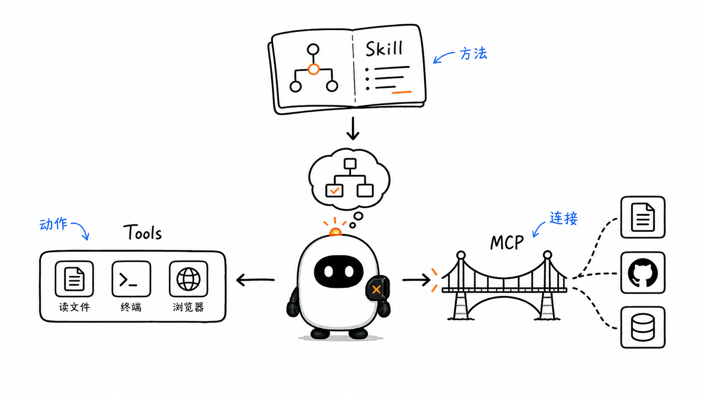
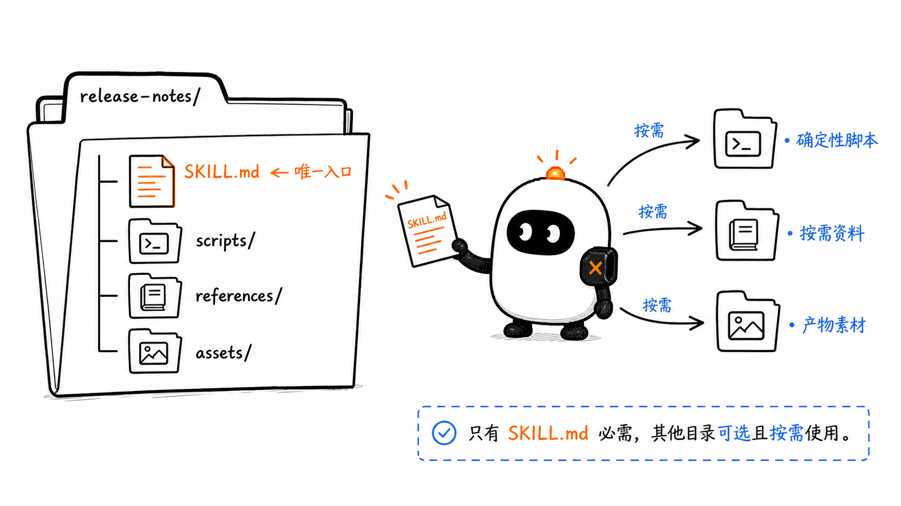
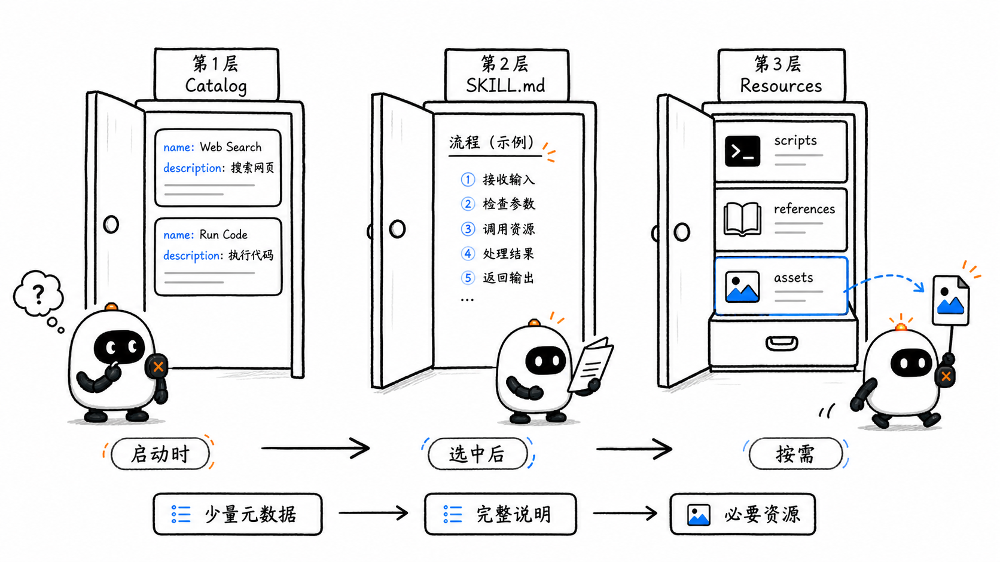
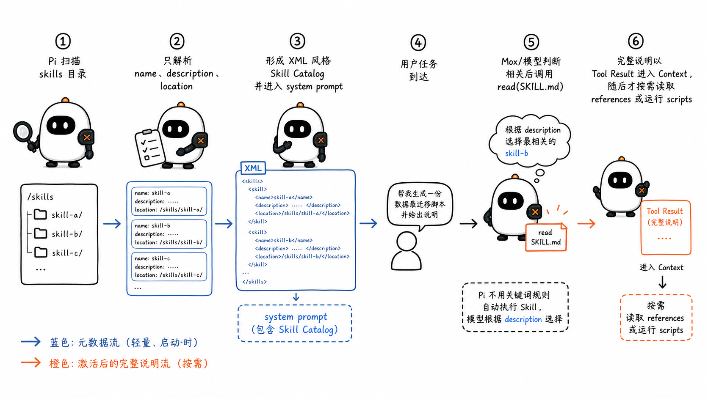
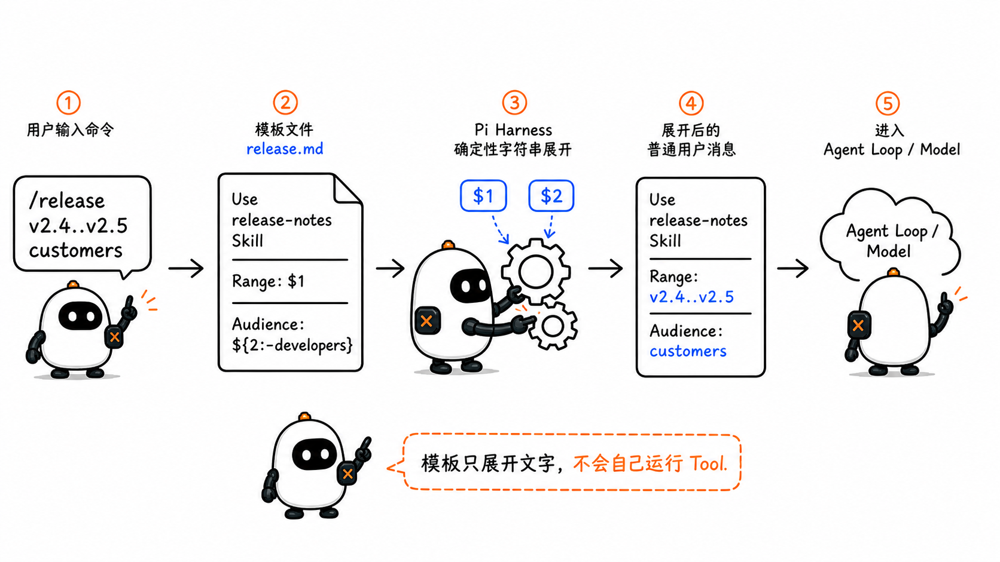
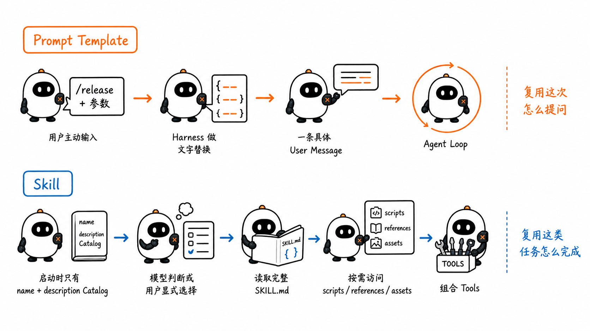
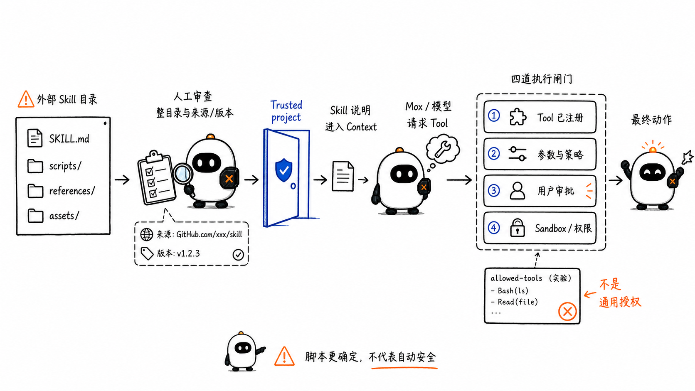

# Skills 与 Prompt Templates：怎样把工作方法交给 Agent

这是 learn-pi-agent 的第 8 章。上一章解释了 MCP：Agent 的宿主怎样用统一协议发现并调用进程之外的能力。

现在假设 Agent 已经拥有文件读写、终端、浏览器、GitHub 和数据库工具。它知道自己“能做什么”，却不一定知道团队希望它“怎样完成一次发布”“怎样审核一份合同”或“怎样制作符合品牌规范的报告”。

这些可复用的工作方法，可以被整理成 Skill。

一个 Skill 通常由说明、参考资料、脚本和模板组成。Harness 先让模型知道有哪些 Skill；任务需要时，再加载相关说明。模型于是可以沿着同一套方法组合多个 Tool 或 MCP 能力，而不必在每次任务中重新猜测流程。



> **版本说明**：Pi 接口名称与行为对应源码基线 `086c32e74530564922d011ade23ff582c9d63116`。Agent Skills 开放规范、OpenAI Codex Skills 文档与相关页面核对日期为 `2026-08-24`。

## 1. Tool 给 Agent 动作，Skill 给 Agent 方法

先看一个“生成发布说明”的任务。

Agent 可能已经拥有：

- `read`：读取文件；
- `bash`：执行 `git log`、测试或构建命令；
- `write`：写入发布说明；
- GitHub MCP Tool：读取 Pull Request 与 Issue；
- 浏览器：核对公开文档。

这些能力仍没有回答：

- 应该读取哪个提交范围；
- 哪些变更面向用户，哪些只属于内部重构；
- 如何验证 Pull Request 描述与代码事实一致；
- 发布说明采用什么结构和语气；
- 哪些检查失败时必须停止；
- 最终文件应该保存在哪里。

Skill 可以把这些步骤、判断标准和输出模板放进一个可版本控制的目录。Tool 负责执行动作，Skill 负责指导模型怎样选择和组合动作。

```text
Tool  → “我可以执行什么动作”
Skill → “遇到这类任务时，应该怎样工作”
```

Skill 不会凭空创造权限。一个 Skill 可以要求运行 `git`，但如果 Harness 没有终端工具，或策略不允许执行命令，这条指令就无法完成。

## 2. 先把六个相近概念分开

| 概念 | 主要内容 | 怎样进入任务 | 是否直接执行动作 |
| --- | --- | --- | --- |
| System / Project Instructions | 长期适用的身份、规则与项目约束 | Harness 在会话或项目启动时装入 Context | 否 |
| Prompt Template | 一段带参数的用户提示 | 用户输入 `/name ...` 后展开 | 否 |
| Skill | 特定任务的工作方法、参考资料、脚本和资产 | 模型按描述选择，或用户显式调用 | 不直接执行；可以指导 Agent 调用 Tool |
| Tool | 可调用函数及其参数 Schema | Model API 的工具定义进入 Context | 是，由 Runtime 执行 |
| MCP Server | 通过协议暴露 Tool、Resource 与 Prompt | Host 通过 MCP Client 发现和调用 | Server 可在收到调用后执行能力 |
| Extension / Plugin | 扩展 Harness 或打包分发多种资源 | 由宿主加载或用户安装 | 取决于其中包含的代码与能力 |

它们可以组合。例如：

```text
用户调用 Prompt Template
        ↓
模板要求使用 release-notes Skill
        ↓
Skill 指导 Agent 读取规范、运行脚本
        ↓
Agent 调用本地 Tool 与 GitHub MCP Tool
        ↓
Runtime 执行动作并返回结果
```

Skill 位于“方法层”。它可以编排已有能力，但没有替代 Tool、Runtime 或权限系统。

## 3. 一个 Agent Skill 是一个目录

Agent Skills 开放规范把 Skill 定义为一个至少包含 `SKILL.md` 的目录：

```text
release-notes/
├── SKILL.md                 # 必需：元数据与核心说明
├── scripts/                 # 可选：可执行脚本
│   └── collect-changes.mjs
├── references/              # 可选：按需读取的参考资料
│   ├── classification.md
│   └── product-names.md
└── assets/                  # 可选：输出模板、图片或数据
    └── release-template.md
```



四部分承担不同职责：

| 位置 | 适合存放什么 | 模型何时需要它 |
| --- | --- | --- |
| `SKILL.md` | 任务边界、核心流程、判断规则、资源入口 | Skill 被激活时 |
| `scripts/` | 重复、机械、需要确定性的处理 | 流程明确要求运行时 |
| `references/` | API 文档、领域规则、错误表、详细说明 | 当前分支确实需要时 |
| `assets/` | 模板、字体、图片、示例文件、Schema | 生成产物或执行脚本时 |

目录名不是装饰。开放规范要求 `SKILL.md` 中的 `name` 与父目录名一致，这让不同 Harness 可以用同一名称定位 Skill。

### 3.1 `SKILL.md` 由两部分组成

一个最小文件如下：

```markdown
---
name: release-notes
description: Generate evidence-backed release notes from a Git commit range. Use when preparing changelogs, release announcements, or user-facing summaries of shipped changes.
---

# Release Notes

1. Confirm the commit range and target audience.
2. Collect commits and linked pull requests.
3. Verify every user-facing claim against code or tests.
4. Classify changes with `references/classification.md`.
5. Write the result with `assets/release-template.md`.
```

开头两个 `---` 之间是 YAML frontmatter，也就是供 Harness 解析的元数据。后面的 Markdown 是模型在 Skill 激活后遵循的说明。

### 3.2 标准 frontmatter 字段

| 字段 | 是否必需 | 作用 |
| --- | --- | --- |
| `name` | 是 | Skill 的稳定标识；1～64 个字符，使用小写字母、数字与连字符 |
| `description` | 是 | 描述 Skill 做什么、什么时候使用；1～1024 个字符 |
| `license` | 否 | 许可证名称或随附许可证文件 |
| `compatibility` | 否 | 操作系统、依赖、网络或产品要求 |
| `metadata` | 否 | 实现可使用的额外键值信息 |
| `allowed-tools` | 否，实验性 | 声明预批准工具；不同 Harness 的支持方式可能不同 |

开放规范还要求 `name`：

- 与父目录名一致；
- 不能以连字符开头或结尾；
- 不能包含连续两个连字符。

为了在不同产品之间迁移，最好遵守规范的严格交集，而不是依赖某个 Harness 的宽松解析。

## 4. `description` 是 Skill 的路由接口

Harness 通常不会把每个 Skill 的完整正文都塞进初始 Context。模型最先看到的是名称与描述，因此 `description` 决定 Skill 能不能在正确任务上被发现。

比较两种写法：

```yaml
# 太模糊
description: Helps with release notes.
```

```yaml
# 范围与触发场景都明确
description: Generate evidence-backed release notes from a Git commit range. Use when preparing changelogs, release announcements, or user-facing summaries of shipped changes.
```

第二个描述同时表达：

1. 产物：release notes；
2. 输入边界：Git commit range；
3. 质量要求：evidence-backed；
4. 使用场景：changelog、release announcement、shipped changes summary。

### 4.1 激活通常是模型判断，不是关键词开关

Pi 把可用 Skill 列表放进 system prompt，并告诉模型：任务与描述匹配时，用 `read` 读取对应文件。Pi 的固定实现没有一套“命中某个关键词就强制激活”的规则引擎。

所以，更准确的链路是：

```text
Harness 提供 Skill 目录
        ↓
模型结合用户任务与 description 判断相关性
        ↓
模型调用 read 读取 SKILL.md
```

同一个描述在不同模型、不同 Context 中可能产生不同的激活结果。Skill 的触发可靠性需要用真实任务样本评估。

### 4.2 描述过窄和过宽都会出问题

- **过窄**：用户说“整理这次上线内容”时，模型可能没意识到应使用 release-notes；
- **过宽**：描述写成“处理 Git 项目”时，几乎每个代码任务都可能加载它；
- **只写能力，不写场景**：模型知道它能做什么，却不知道何时值得占用 Context；
- **把触发条件只写在正文**：模型尚未激活 Skill，自然还看不到正文中的条件。

## 5. 渐进式披露怎样节省 Context

Agent Skills 使用三层加载：

1. **Catalog**：会话开始时只提供 `name`、`description` 和可选位置；
2. **Instructions**：Skill 被选中后读取完整 `SKILL.md`；
3. **Resources**：流程走到相关分支时，再读取参考文件、使用资产或执行脚本。



这叫 Progressive Disclosure，中文常译为渐进式披露：先暴露足够做选择的信息，再按任务需要逐层加载细节。

假设安装了 100 个 Skill：

```text
错误做法：100 份完整 SKILL.md 全部进入初始 Context
正确方向：100 份简短元数据 → 选中 1 份说明 → 读取当前需要的 2 个参考文件
```

它同时解决两个问题：

- 降低初始 token 成本；
- 减少无关说明争夺模型注意力。

开放规范建议把 `SKILL.md` 控制在 500 行、5000 token 以内，并把较长细节移入按需读取的文件。这个数字是编写建议，不是协议强制上限。

### 5.1 渐进式披露不是“文件越碎越好”

如果 `SKILL.md` 只写“去 references 看”，参考文件又继续指向更深的文件，模型可能不知道该读哪一份，也会增加工具调用和遗漏风险。

好的入口会写清触发条件：

```markdown
- API 返回非 2xx 时，读取 `references/api-errors.md`。
- 生成公开版本时，读取 `references/public-language.md`。
- 需要创建最终文件时，使用 `assets/release-template.md`。
```

核心流程留在入口，分支细节按需加载。

## 6. Pi 怎样发现并告诉模型有哪些 Skill

Pi 可以从多个位置收集 Skill：

| 来源 | 典型位置或方式 |
| --- | --- |
| 用户级 | `~/.pi/agent/skills/`、`~/.agents/skills/` |
| 项目级 | `.pi/skills/`、当前目录到仓库根之间的 `.agents/skills/` |
| Package | 包中的 `skills/` 或 `package.json` 的 `pi.skills` |
| Settings | `skills` 数组指定的文件或目录 |
| CLI | 可重复的 `--skill <path>` |

项目级 Skill 只在项目被信任后加载。相同名称发生冲突时，Pi 的资源解析会让项目资源优先于用户资源，用户资源优先于 Package，并产生 collision diagnostic，而不是静默合并两份正文。

Pi 对开放规范采取宽松验证：

- 名称格式不合格通常发出 warning，仍尝试加载；
- `name` 可以与父目录名不同；
- 缺少 `description` 时不加载；
- 未识别的 frontmatter 字段会被忽略。

这些宽松行为提高了兼容性，但不代表不规范的 Skill 在其他 Harness 中也能工作。

### 6.1 Pi 初始 Context 中只有 Skill 索引

固定源码中的 `formatSkillsForPrompt()` 会生成类似下面的 XML：

```xml
<available_skills>
  <skill>
    <name>release-notes</name>
    <description>Generate evidence-backed release notes...</description>
    <location>/project/.agents/skills/release-notes/SKILL.md</location>
  </skill>
</available_skills>
```

前面还会提示模型：

- 任务匹配描述时，用 `read` 读取 Skill；
- 相对路径以 `SKILL.md` 所在目录为基准；
- 工具调用应使用解析后的绝对路径。

Pi 只有在 `read` Tool 可用时才把 Skill 索引加入 system prompt。没有读取能力，告诉模型一个本地文件位置也无法完成激活。

### 6.2 一段与真实源码对应的教学简化

```ts
type Skill = {
  name: string;
  description: string;
  filePath: string;
  baseDir: string;
  disableModelInvocation: boolean;
};

function formatSkillsForPrompt(skills: Skill[]): string {
  const visible = skills.filter(
    (skill) => !skill.disableModelInvocation,
  );

  return visible
    .map(
      (skill) => `
<skill>
  <name>${escapeXml(skill.name)}</name>
  <description>${escapeXml(skill.description)}</description>
  <location>${escapeXml(skill.filePath)}</location>
</skill>`,
    )
    .join("\n");
}
```

这不是复制全部实现，但类型名、过滤逻辑和输出字段与 Pi 固定源码对应。真实函数还会加入使用说明、外层 `<available_skills>` 与完整 XML 转义。



## 7. Skill 有模型选择和用户选择两条激活路径

### 7.1 模型按描述选择

Pi 启动时把可见 Skill 的索引放进 system prompt。模型认为任务相关时，会像读取普通文件一样调用 `read`：

```text
用户：根据最近 20 个提交写一份面向用户的发布说明
  ↓
模型看到 release-notes 的 description
  ↓
read(/project/.agents/skills/release-notes/SKILL.md)
  ↓
Skill 正文作为 Tool Result 进入 Context
  ↓
模型按照说明读取 references、运行 scripts、使用 assets
```

模型并不保证每次都会主动加载。描述质量、任务复杂度、当前 Context 和模型行为都会影响选择。

### 7.2 用户用 `/skill:name` 显式选择

Pi 把 Skill 注册为 `/skill:name` 命令：

```text
/skill:release-notes v2.4.0..v2.5.0 面向普通用户
```

固定源码中的 `_expandSkillCommand()` 会：

1. 找到名为 `release-notes` 的 Skill；
2. 读取文件并去掉 frontmatter；
3. 把正文包进带名称与位置的 `<skill>` 块；
4. 把命令后面的参数追加为用户输入；
5. 将展开后的文本送入正常 Agent Loop。

教学简化如下：

```ts
function expandSkillCommand(text: string, skills: Skill[]): string {
  const { name, args } = parseSkillCommand(text);
  const skill = skills.find((item) => item.name === name);
  if (!skill) return text;

  const body = stripFrontmatter(readFile(skill.filePath));
  const block = `
<skill name="${skill.name}" location="${skill.filePath}">
References are relative to ${skill.baseDir}.

${body}
</skill>`;

  return args ? `${block}\n\n${args}` : block;
}
```

显式调用不需要模型先根据描述猜测，因此适合用户明确知道要采用哪套方法的场景。

### 7.3 `disable-model-invocation` 的作用

Pi 支持一个实现字段：

```yaml
disable-model-invocation: true
```

它会把 Skill 从 system prompt 的可用列表中隐藏，但仍允许用户通过 `/skill:name` 调用。适合：

- 只能由用户明确启动的高影响流程；
- 与普通任务描述非常相似、容易误触发的流程；
- 需要用户先提供完整参数的命令式流程。

这个字段不属于 Agent Skills 开放规范的必需核心，迁移到其他 Harness 前要确认支持方式。

## 8. scripts、references 与 assets 不会自动执行或加载

Skill 被激活时，模型首先得到的是 `SKILL.md`。目录中的其他内容仍要经过显式动作：

```text
references/*.md → 模型调用 read 后才进入 Context
scripts/*       → 模型调用 bash 或其他执行工具后才运行
assets/*        → 模型读取、复制或交给相应工具后才使用
```

### 8.1 脚本把机械步骤变成确定性程序

如果每次都要求模型从自然语言重新实现“读取提交、过滤 merge commit、输出 JSON”，容易产生格式漂移。可以把机械过程放入脚本：

```bash
node scripts/collect-changes.mjs v2.4.0..v2.5.0
```

模型仍负责选择参数、解释结果和处理例外；脚本负责稳定执行重复逻辑。

脚本不是新 Tool。它通常仍通过现有的 shell Tool 执行，也受到相同的权限、工作目录、环境依赖与超时限制。

### 8.2 参考资料要提供读取条件

一个 release-notes Skill 可能有：

```text
references/
├── classification.md      # 何时算 Breaking / Feature / Fix
├── public-language.md     # 面向用户的语言边界
└── internal-components.md # 内部组件名到产品名的映射
```

`SKILL.md` 应说明每份文件在什么情况下读取。模型不会因为文件存在就自动知道其中内容。

### 8.3 资产是产物材料，不是提示文本

`assets/release-template.md` 可以被复制为最终输出骨架；Logo、字体或示例数据也可以放在 `assets/`。只有真正需要时才使用它们，不应把二进制资产整体塞进文本 Context。

## 9. Prompt Template 是怎样工作的

Pi 的 Prompt Template 是一个 Markdown 文件。用户输入对应的 slash command 后，Harness 把模板展开成普通用户提示。

例如 `.pi/prompts/release.md`：

```markdown
---
description: Prepare release notes from a Git range
argument-hint: "<from..to> [audience]"
---

Use the release-notes skill to prepare a release draft.

Commit range: $1
Audience: ${2:-developers}
```

用户输入：

```text
/release v2.4.0..v2.5.0 customers
```

模型最终收到：

```text
Use the release-notes skill to prepare a release draft.

Commit range: v2.4.0..v2.5.0
Audience: customers
```



### 9.1 Pi 从哪里加载 Prompt Template

| 来源 | 位置或方式 |
| --- | --- |
| 用户级 | `~/.pi/agent/prompts/*.md` |
| 项目级 | `.pi/prompts/*.md`，需要信任项目 |
| Package | `prompts/` 或 `pi.prompts` |
| Settings | `prompts` 数组 |
| CLI | `--prompt-template <path>` |

默认目录只扫描当前层的 `.md` 文件，不递归进入子目录。文件名就是命令名：`release.md` 对应 `/release`。

### 9.2 frontmatter 与参数

Prompt Template 支持：

- `description`：自动补全中显示的说明；缺失时取正文第一行；
- `argument-hint`：显示必需与可选参数提示；
- `$1`、`$2`：位置参数；
- `$@`、`$ARGUMENTS`：全部参数；
- `${1:-default}`：参数缺失时使用默认值；
- `${@:N}`、`${@:N:L}`：从第 N 个参数开始切片。

引号用于把含空格的文本保持为一个参数：

```text
/release v2.4.0..v2.5.0 "enterprise administrators"
```

### 9.3 展开发生在模型调用之前

固定源码中的核心逻辑可以简化成：

```ts
function expandPromptTemplate(
  text: string,
  templates: PromptTemplate[],
): string {
  if (!text.startsWith("/")) return text;

  const { name, args } = parseTemplateCommand(text);
  const template = templates.find((item) => item.name === name);
  if (!template) return text;

  return substituteArgs(template.content, args);
}
```

这是一种确定性的字符串展开。模板本身不会运行 Agent Loop，也不会自动调用 Tool；展开后的提示才进入正常执行流程。

## 10. Skill 与 Prompt Template 的核心区别



| 维度 | Skill | Prompt Template |
| --- | --- | --- |
| 谁选择 | 模型可以按描述选择；用户也可显式调用 | 通常由用户输入 `/name` 选择 |
| 初始 Context | 先放名称与描述 | 不需要把模板正文常驻初始 Context |
| 加载内容 | 核心说明，可继续读取资源与脚本 | 展开为一段用户消息 |
| 适合范围 | 可复用、多步骤、有资源依赖的方法 | 常用请求的快捷入口与参数化表述 |
| 是否包含目录资源 | 是 | 通常只是单个 Markdown 文件 |
| 执行稳定性 | 依赖描述路由与模型遵循，也可用脚本提高确定性 | 参数替换确定，后续执行仍由模型决定 |

可以用一句话区分：

```text
Prompt Template 复用“这次怎么提问”；
Skill 复用“这类任务怎么完成”。
```

两者组合时，Prompt Template 可以成为稳定入口，Skill 则提供完整方法。

## 11. Skill、Prompt、Tool 与 MCP 怎样一起运行

回到发布说明示例，一次完整链路可以是：

```text
1. 用户输入 /release v2.4.0..v2.5.0 customers
2. Pi 把 Prompt Template 展开为具体用户消息
3. 模型从 Skill Catalog 选择 release-notes
4. 模型用 read 加载 SKILL.md
5. 模型按说明读取 classification.md
6. 模型通过 bash 运行 collect-changes.mjs
7. 模型调用 GitHub MCP Tool 补充 PR 与 Issue 证据
8. Runtime 执行每个 Tool Call 并返回 Tool Result
9. 模型使用 release-template.md 写出产物
10. Harness 保存消息、文件变更与会话状态
```

这里没有任何一个组件独自完成全部工作：

- Prompt Template 固定入口；
- Skill 提供程序性知识；
- Tool 和 MCP 提供动作与数据；
- Runtime 执行动作；
- Harness 管理 Context、策略、Session 与界面。

## 12. 怎样设计一个有效的 Skill

### 12.1 先确定稳定任务边界

适合做成 Skill 的内容通常满足至少一项：

- 同类任务重复出现；
- 有团队或领域特有规则；
- 步骤顺序影响正确性；
- 需要组合多个 Tool 或数据源；
- 产物结构需要保持一致；
- 某些机械步骤可以由脚本稳定执行。

“解决所有开发问题”范围过大；“根据提交和 PR 生成经过证据核对的发布说明”更容易写清触发条件、流程与成功标准。

### 12.2 入口只保留每次都需要的信息

`SKILL.md` 适合包含：

- Skill 的任务边界；
- 正常流程；
- 必须保持的安全与质量约束；
- 每份参考资料的加载条件；
- 关键失败处理；
- 产物位置和格式。

详细 API 字段、几十种错误码、大量示例可以按需进入 `references/`。

### 12.3 用脚本承担可验证的机械工作

下面这些步骤更适合脚本：

- 解析固定格式；
- 批量转换文件；
- 运行验证器；
- 生成确定性清单；
- 检查链接、尺寸、Schema 或退出码。

下面这些步骤通常仍适合模型判断：

- 选择对当前用户最重要的内容；
- 根据证据解释影响；
- 在冲突要求之间做取舍；
- 决定何时需要追加参考资料。

### 12.4 写出可以观察的完成条件

“生成一份高质量报告”难以验证。可以改为：

```markdown
完成前确认：

- 每条用户可见变更都能追溯到 commit、PR、测试或文档；
- Breaking Changes 独立成节；
- 不使用内部组件代号；
- 输出通过 `scripts/validate-release.mjs`；
- 最终文件保存在用户指定路径。
```

完成条件帮助 Agent 判断是否应该继续调用工具，而不只是尽快生成一段文本。

## 13. 可移植核心与 Harness 差异

Pi、Codex、Claude Code 等产品都可以使用 Agent Skills 目录，但实现细节不完全相同。

### 13.1 可移植核心

- `skill-name/SKILL.md` 目录结构；
- `name` 与 `description`；
- Markdown 指令；
- 相对路径引用 `scripts/`、`references/` 与 `assets/`；
- 渐进式加载的设计思想。

### 13.2 常见实现差异

| 维度 | 可能不同的地方 |
| --- | --- |
| 搜索路径 | `~/.agents/skills`、产品专属目录、项目目录、管理目录 |
| 显式调用 | Pi 使用 `/skill:name`；Codex 可用 `$skill-name` 或 Skill 选择器 |
| 冲突策略 | 有的实现按优先级选一份，有的实现把同名项都展示出来 |
| 额外字段 | `disable-model-invocation`、UI 元数据、模型选择或依赖声明 |
| `allowed-tools` | 仍是实验字段，解析与权限含义因 Harness 而异 |
| Context 预算 | 初始 Catalog 的截断和压缩策略不同 |

OpenAI Codex 也先加载名称、描述与路径，再在选中后读取完整 `SKILL.md`；当前文档还为初始 Skill 列表设置 Context 预算。Pi 则直接用 XML 目录告诉模型通过 `read` 加载文件。

Pi 文档允许把 `~/.claude/skills` 或 `~/.codex/skills` 加入 settings。能被发现不代表行为完全一致；跨 Harness 使用前仍要检查：

1. frontmatter 是否属于共同规范；
2. 显式调用语法是否不同；
3. 脚本依赖和操作系统是否满足；
4. 工具名称与权限模型是否存在；
5. 相对路径与输出目录是否正确。

## 14. Skill 的安全边界

Skill 是可执行行为的指导文件，不是普通说明书。它可能要求模型：

- 执行随附脚本；
- 安装依赖；
- 读取项目或用户文件；
- 调用远程服务；
- 修改、上传或删除数据。



### 14.1 安装前要审查整个目录

只看 `description` 不够。至少要检查：

- `SKILL.md` 要求哪些动作；
- `scripts/` 中的代码；
- 外部依赖、安装命令与版本；
- references 是否包含会影响行为的隐藏指令；
- assets 是否会被上传或写入敏感位置；
- 许可证和来源。

Pi 因此只在项目被信任后加载项目级 Skill、Prompt Template 与 Extension。

### 14.2 Skill 不能代替权限控制

`allowed-tools` 的名字容易造成误解。它是开放规范中的实验字段，支持程度由 Harness 决定；它不应被理解为跨产品通用的安全策略。

在 Pi 固定源码中，Skill 加载器保存 `name`、`description`、路径和 `disableModelInvocation`，没有把 `allowed-tools` 实现为 Tool Runtime 的授权检查。真正的执行能力仍取决于 Harness 已注册的 Tool 与运行环境权限。

### 14.3 脚本提高确定性，不自动提高安全性

脚本可以减少模型临时生成代码造成的偏差，却也可能包含删除、上传或凭据读取。安全性取决于代码审查、最小权限、Sandbox、审批和审计，不取决于它是否被放进 `scripts/`。

### 14.4 参考资料仍可能包含 Prompt Injection

Skill 引用网页、Issue、文档或数据库内容时，这些内容仍属于外部输入。模型应该区分：

- Skill 作者提供的流程说明；
- 当前任务读取的事实数据；
- 数据中试图改变系统规则的文字。

外部文本不能因为被某个 Skill 读取，就自动提升为 system instruction。

## 15. 怎样评估 Skill 是否真的有用

一个 Skill 能加载，不代表它提高了任务质量。可以从五个维度评估：

| 维度 | 要观察什么 |
| --- | --- |
| Trigger Precision | 应使用时是否加载；无关任务是否保持不加载 |
| Procedure Adherence | 关键步骤、停止条件与资源读取是否被遵循 |
| Task Success | 产物是否比不使用 Skill 更正确、完整、可验证 |
| Context Cost | Catalog、正文与参考文件消耗多少 token，是否引入无关内容 |
| Safety / Portability | 权限是否受控；换一个 Harness、模型或操作系统是否仍能工作 |

触发评估需要同时包含：

- should-trigger：表达方式不同、但确实需要这套方法的任务；
- should-not-trigger：关键词相近、但范围不属于该 Skill 的任务。

任务质量评估则可以比较：

```text
Baseline：相同模型 + 相同工具 + 不提供目标 Skill
Candidate：相同模型 + 相同工具 + 提供目标 Skill
```

保持其他条件一致，才能判断改进来自 Skill，而不是模型、工具或输入变化。

## 16. 七个常见误解

### 16.1 “Skill 是一个 Tool”

Skill 主要提供说明和资源；Tool 是 Runtime 可以执行的结构化动作。Skill 可以指导模型调用 Tool。

### 16.2 “安装 Skill 就获得了新权限”

Skill 没有绕过 Harness 的 Tool 注册、审批、Sandbox 与操作系统权限。

### 16.3 “目录里有脚本，模型就会自动运行”

模型需要先读取指令，再通过已有执行工具调用脚本。脚本存在本身不会触发动作。

### 16.4 “description 只是给人看的简介”

它是模型进行 Skill 路由时最先看到的字段，直接影响是否激活。

### 16.5 “Prompt Template 与 Skill 都是 Markdown，所以相同”

Prompt Template 由命令展开为一次用户提示；Skill 是可发现、可按需加载、可携带资源的工作方法包。

### 16.6 “符合 Agent Skills 规范就会在所有 Harness 中完全一致”

目录与核心字段可以移植，搜索路径、显式调用、额外字段、冲突策略和权限语义仍可能不同。

### 16.7 “Skill 写得越长越专业”

正文会与对话、工具结果和其他 Context 竞争注意力。核心流程应清楚、紧凑，分支细节按需加载。

## 本章小结

- Skill 把特定任务的程序性知识、参考资料、脚本和资产组织成可复用目录；
- Tool 提供动作，MCP 标准化外部能力接口，Skill 指导 Agent 怎样组合这些能力；
- `SKILL.md` 的 `name` 与 `description` 是开放规范的必需字段；
- `description` 是模型选择 Skill 的主要路由信息，不只是展示文案；
- 渐进式披露分为 Catalog、完整说明与按需资源三层；
- Pi 启动时把 Skill 索引放入 system prompt，模型通过 `read` 激活完整文件；
- Pi 也支持 `/skill:name`，由 Harness 直接展开 Skill 正文和用户参数；
- Prompt Template 是带参数的用户提示快捷方式，展开后才进入 Agent Loop；
- scripts、references 与 assets 都需要显式读取或调用，不会自动进入 Context；
- 开放规范提供可移植核心，搜索路径、命令、额外字段与权限含义由 Harness 决定；
- Skill 和脚本都必须经过来源审查、最小权限、Sandbox 与真实任务评估。

## 下一章：Extensions、Plugins 与 Packages

Skill 可以教 Agent 怎样工作，但它通常不改变 Harness 本身的事件、界面和工具注册方式。下一章进入 Pi Extensions、Plugins 与 Packages：怎样注册 Tool 与 Command、监听生命周期事件、注入 Context、拦截工具调用，并把 Extension、Skill、Prompt Template 与 Theme 组合成可安装的分发单元。

## 参考资料

- [Agent Skills Overview](https://agentskills.io/home)
- [Agent Skills Specification](https://agentskills.io/specification)
- [Agent Skills：How to add skills support to your agent](https://agentskills.io/client-implementation/adding-skills-support)
- [Agent Skills：Best practices for skill creators](https://agentskills.io/skill-creation/best-practices)
- [Agent Skills：Optimizing skill descriptions](https://agentskills.io/skill-creation/optimizing-descriptions)
- [OpenAI：Build skills](https://developers.openai.com/codex/skills/)
- [OpenAI：Unrolling the Codex agent loop](https://openai.com/index/unrolling-the-codex-agent-loop/)
- [OpenAI：From model to agent——Agent skills 与 computer environment](https://openai.com/index/equip-responses-api-computer-environment/)
- [Anthropic Skills Repository](https://github.com/anthropics/skills)
- [Anthropic `skill-creator`：Skill 编写与评估方法](https://github.com/anthropics/skills/blob/main/skills/skill-creator/SKILL.md)
- [Pi Skills 文档](https://github.com/earendil-works/pi/blob/086c32e74530564922d011ade23ff582c9d63116/packages/coding-agent/docs/skills.md)
- [Pi Prompt Templates 文档](https://github.com/earendil-works/pi/blob/086c32e74530564922d011ade23ff582c9d63116/packages/coding-agent/docs/prompt-templates.md)
- [Pi `skills.ts`：发现、验证与 system prompt 索引](https://github.com/earendil-works/pi/blob/086c32e74530564922d011ade23ff582c9d63116/packages/coding-agent/src/core/skills.ts)
- [Pi `system-prompt.ts`：Skill Catalog 进入 Context](https://github.com/earendil-works/pi/blob/086c32e74530564922d011ade23ff582c9d63116/packages/coding-agent/src/core/system-prompt.ts)
- [Pi `agent-session.ts`：`/skill:name` 展开顺序](https://github.com/earendil-works/pi/blob/086c32e74530564922d011ade23ff582c9d63116/packages/coding-agent/src/core/agent-session.ts)
- [Pi `prompt-templates.ts`：参数解析与模板展开](https://github.com/earendil-works/pi/blob/086c32e74530564922d011ade23ff582c9d63116/packages/coding-agent/src/core/prompt-templates.ts)
- [Pi Package Manager：资源优先级](https://github.com/earendil-works/pi/blob/086c32e74530564922d011ade23ff582c9d63116/packages/coding-agent/src/core/package-manager.ts)
- [Pi Security：项目信任与默认权限边界](https://github.com/earendil-works/pi/blob/086c32e74530564922d011ade23ff582c9d63116/packages/coding-agent/docs/security.md)
