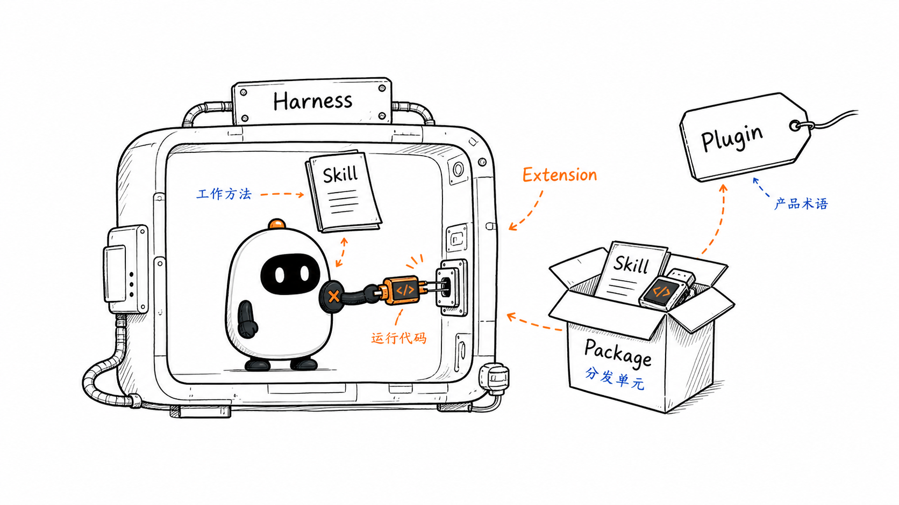
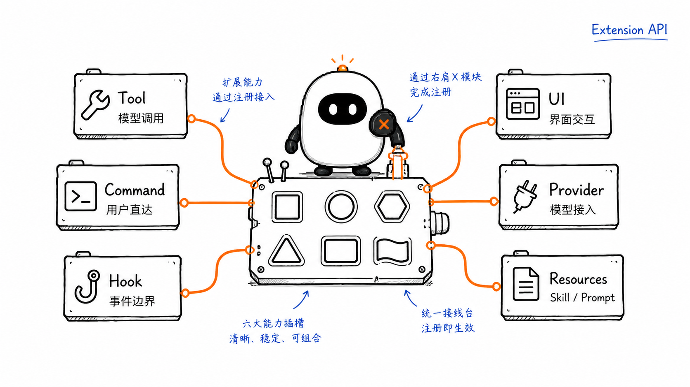
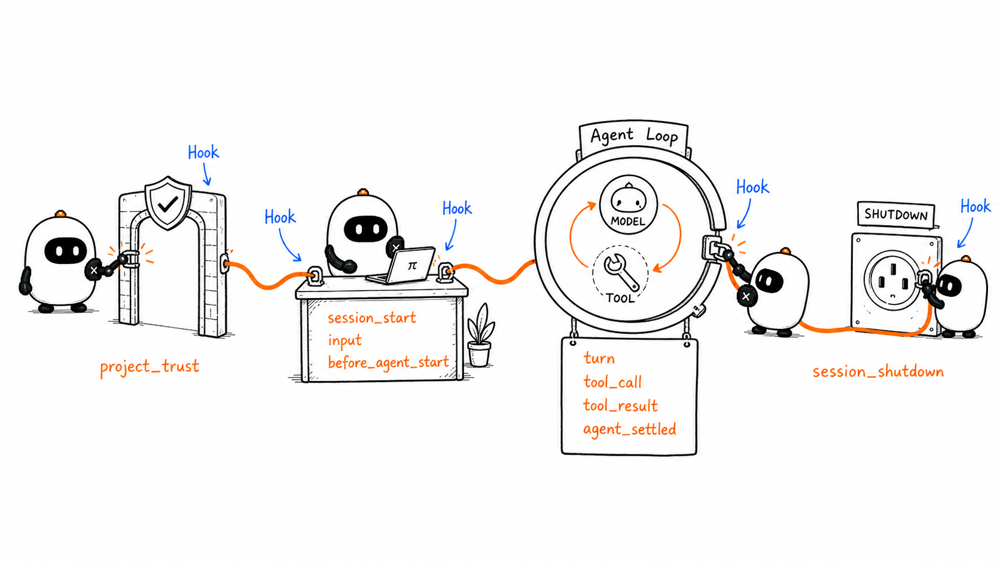
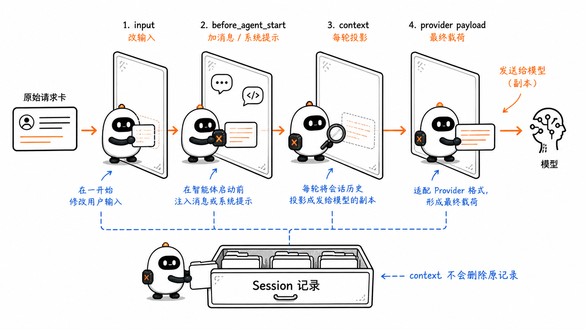
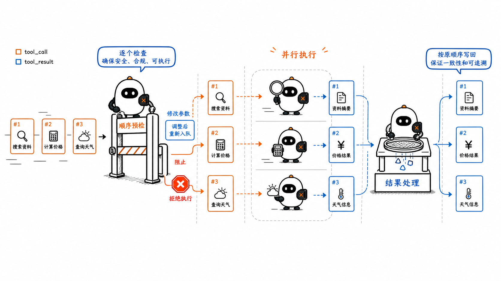
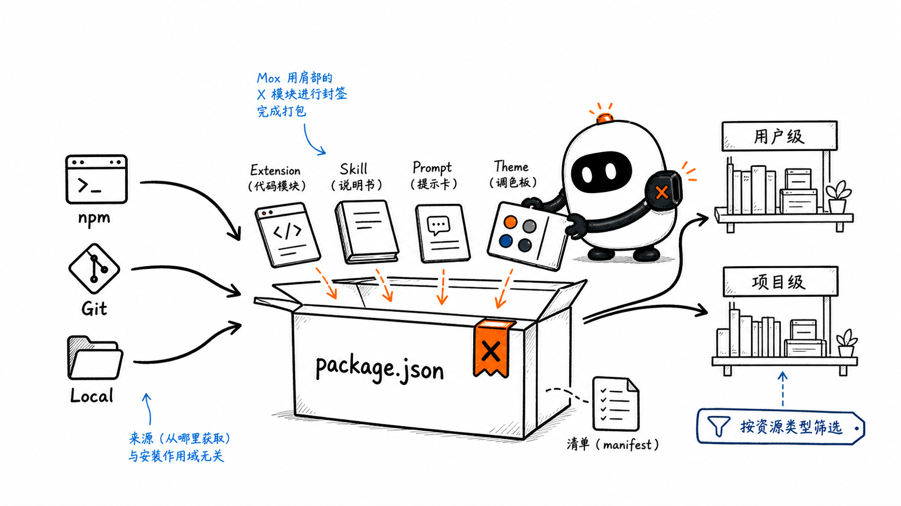
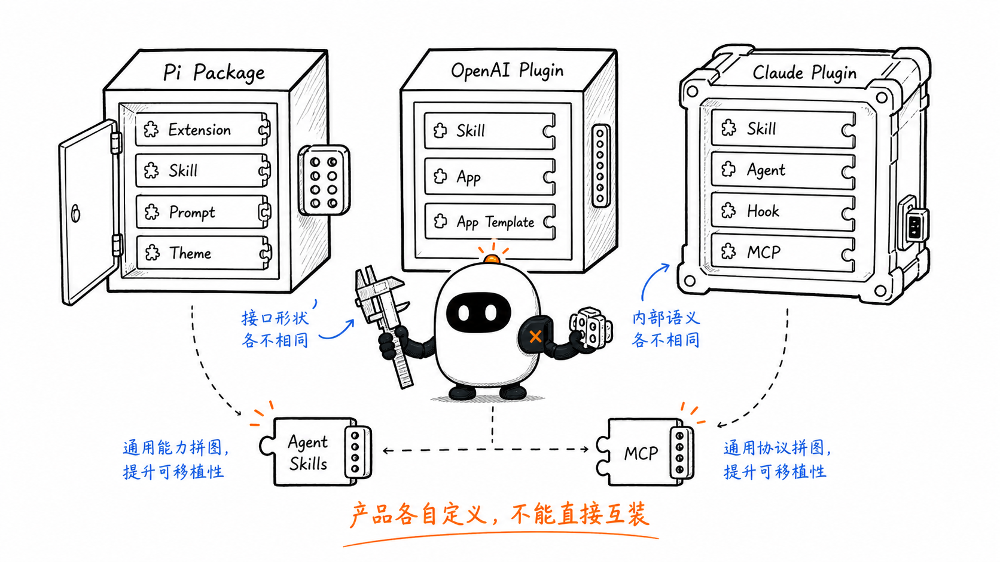
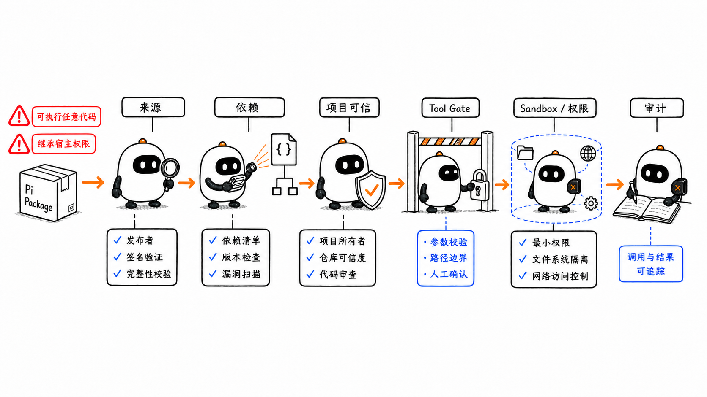

# Extensions、Plugins 与 Packages：怎样扩展并分发 Agent Harness

这是 learn-pi-agent 的第 9 章。上一章介绍了 Skill：它把可复用的工作方法交给 Agent，但不会改变 Harness 本身能注册哪些 Tool、在什么时候触发逻辑，或界面怎样与用户交互。

如果希望 Pi 在工具执行前请求确认、把新的 Tool 接进 Agent Loop、监听 Session 生命周期、动态注入 Context，或者增加一个用户直接调用的命令，就要进入 Extension 层。

Extension 是在 Harness 进程内运行的代码。它接触的不是某一次提示，而是 Agent 系统的扩展点：Tool 注册表、事件流、Session、模型请求、资源加载与 UI。写对 Extension 的前提，是先知道每个扩展点位于哪条运行链路上。



> **版本说明**：Pi 接口名称与行为对应源码基线 `086c32e74530564922d011ade23ff582c9d63116`。Pi 最新文档、OpenAI Plugins 与 Claude Code Plugins 页面核对日期为 `2026-08-24`。Plugin 是产品术语，不存在一份适用于所有 Agent Harness 的统一 Plugin 规范。

## 1. 为什么 Harness 需要扩展点

一个固定 Agent Runtime 可以提前实现：

- 模型调用；
- Agent Loop；
- 内置 Tool；
- Context 组装；
- Session 保存；
- 终端或图形界面。

真实团队仍会提出大量产品特有要求：

- 调用危险命令前必须由用户批准；
- 禁止写入 `.env` 或生产配置；
- 把内部数据库查询注册成 Tool；
- 每轮开始前加入当前工单或代码库状态；
- 在模型请求中增加网关追踪头；
- 在 Session 结束时关闭连接或保存检查点；
- 增加 `/deploy`、`/stats` 等命令；
- 在界面中显示任务状态、表单或自定义结果；
- 把一组 Skill、Prompt Template 和 Extension 安装给整个团队。

如果每个需求都直接修改 Harness 核心源码，升级会不断产生冲突。Extension 提供稳定的注册接口和事件边界，让外部代码在不改动主循环主体的情况下扩展系统。

```text
Harness 核心：定义运行阶段与扩展点
Extension：在扩展点注册能力或处理事件
Package：把多个可安装资源组合并分发
```

Extension 的能力很强，也意味着它处在高信任层：Pi Extension 与当前 Pi 进程拥有相同的系统权限，可以执行任意代码。

## 2. 先把七个容易混用的概念分开

| 概念 | 在 Pi 中是什么 | 由谁触发 | 主要作用 |
| --- | --- | --- | --- |
| Extension | 导出 factory function 的 TypeScript / JavaScript 模块 | Pi 加载资源时 | 注册能力、监听或拦截运行事件 |
| Hook / Event Handler | Extension 用 `pi.on(...)` 注册的处理函数 | Harness 到达对应生命周期阶段时 | 观察、修改、阻止或补充一次事件 |
| Tool | 带名称、描述、参数 Schema 与 `execute()` 的结构化动作 | 通常由模型产生 Tool Call | 让 Runtime 执行动作并返回 Tool Result |
| Command | Extension 注册的 slash command | 用户输入 `/name ...` | 直接运行命令处理器，不必先让模型选择 |
| Skill | `SKILL.md` 及其资源组成的工作方法 | 模型按描述选择，或用户显式选择 | 指导 Agent 怎样组合能力完成任务 |
| Pi Package | Extension、Skill、Prompt Template、Theme 的分发单元 | 用户或项目配置安装 | 通过 npm、Git 或本地路径共享一组资源 |
| Plugin | 某个产品定义的可安装能力包 | 产品的插件管理器 | 组合该产品支持的 Skill、App、Hook、Agent 等组件 |

最重要的两条边界是：

```text
Extension ≠ Skill
Extension 是可执行代码，Skill 是模型读取的工作说明。

Command ≠ Tool
Command 由用户直接调用，Tool 通常由模型在 Agent Loop 中请求。
```

Hook 也不是一类独立分发物。它通常是 Extension 内部对某个事件注册的处理函数；一个 Extension 可以同时注册多个 Hook、Tool、Command 和 UI 组件。

## 3. 一个 Pi Extension 怎样被加载

最小 Extension 是一个导出默认函数的模块：

```ts
import type { ExtensionAPI } from "@earendil-works/pi-coding-agent";

export default function activate(pi: ExtensionAPI) {
  pi.on("session_start", async (_event, ctx) => {
    ctx.ui.notify("Extension 已加载", "info");
  });
}
```

Pi 加载模块后调用 `activate(pi)`。传入的 `ExtensionAPI` 是注册入口，Extension 可以在 factory 执行期间注册 Tool、Command、Hook、Provider、Shortcut 和 UI renderer。

factory 也可以是异步函数。Pi 会等待它完成，再进入 `session_start` 和 `resources_discover`。这适合一次性的初始化，例如读取配置或获取模型目录。

### 3.1 自动发现位置

| 范围 | 位置 |
| --- | --- |
| 用户级单文件 | `~/.pi/agent/extensions/*.ts` |
| 用户级目录 | `~/.pi/agent/extensions/*/index.ts` |
| 项目级单文件 | `.pi/extensions/*.ts` |
| 项目级目录 | `.pi/extensions/*/index.ts` |
| Settings | `extensions` 数组指定的文件或目录 |
| CLI 临时加载 | `pi -e ./my-extension.ts` |

项目级 Extension 只有在项目被信任后才会加载。`-e` 适合快速测试；放在自动发现目录中的 Extension 才能通过 `/reload` 热重载。

### 3.2 Pi 的加载分成信任前和信任后

Pi 的 `DefaultResourceLoader.reload()` 先在“不信任当前项目”的状态下加载用户级和 CLI Extension。这些 Extension 可以处理 `project_trust`，参与决定项目是否可信。

只有信任确定后，Pi 才重新解析资源并加载项目级 Extension、Package、Skill、Prompt Template 与 Theme。这样可以避免一个尚未被信任的项目先执行自己的 Extension，再询问用户是否信任它。

```text
加载用户级 / CLI Extension
        ↓
处理 project_trust
        ↓
解析用户与项目 Settings、Package 和资源路径
        ↓
加载最终 Extension 集合
        ↓
绑定 Runtime、Session、ModelRegistry 与 UI
```

### 3.3 factory 不适合启动长期资源

Pi 有些调用只需要加载 Extension 来列出模型或检查配置，并不一定创建 Session。数据库连接、文件监听器、子进程或定时器不应该在 factory 中无条件启动。

更稳妥的生命周期是：

```ts
export default function activate(pi: ExtensionAPI) {
  let connection: DatabaseConnection | undefined;

  pi.on("session_start", async () => {
    connection = await openDatabase();
  });

  pi.on("session_shutdown", async () => {
    await connection?.close();
    connection = undefined;
  });
}
```

`session_shutdown` 可能因为退出、重载、新建 Session、恢复 Session 或 fork 而发生。清理逻辑应当可重复调用。

## 4. Extension 可以注册什么



`ExtensionAPI` 的能力大致分成六组：

| 类型 | 典型 API | 进入哪条链路 |
| --- | --- | --- |
| 模型可调用能力 | `registerTool()` | Model API → Agent Loop → Tool Runtime |
| 用户直接入口 | `registerCommand()`、`registerShortcut()`、`registerFlag()` | 输入分发与 CLI / UI |
| 生命周期 Hook | `on(event, handler)` | Session、Agent、Turn、Message、Tool 等事件 |
| Context 与消息 | `sendMessage()`、`sendUserMessage()`、`appendEntry()` | Session 与下一次模型调用 |
| 模型与 Provider | `registerProvider()`、`setModel()` | Provider Registry 与模型选择 |
| UI 与显示 | renderer、status、widget、dialog、custom UI | TUI / RPC 界面 |

一个 Extension 不需要同时使用所有能力。权限拦截器可能只监听 `tool_call`；数据库 Extension 可能注册三个 Tool 并管理一条连接；模型 Provider Extension 则主要注册模型和认证方式。

## 5. Tool 与 Command 进入不同执行路径

### 5.1 Tool 是给模型使用的结构化动作

下面是一段可以对应 Pi API 的简化 Tool：

```ts
import type { ExtensionAPI } from "@earendil-works/pi-coding-agent";
import { Type } from "typebox";

export default function activate(pi: ExtensionAPI) {
  pi.registerTool({
    name: "release_commits",
    label: "Release Commits",
    description: "List commits after a Git tag for release analysis.",
    parameters: Type.Object({
      tag: Type.String({ description: "Existing Git tag" }),
    }),

    async execute(_toolCallId, params, signal) {
      const result = await pi.exec(
        "git",
        ["log", `${params.tag}..HEAD`, "--oneline"],
        { signal, timeout: 5000 },
      );

      if (result.code !== 0) {
        throw new Error(result.stderr || "git log failed");
      }

      return {
        content: [{ type: "text", text: result.stdout }],
        details: { tag: params.tag },
      };
    },
  });
}
```

这条 Tool 的数据链路是：

```text
name + description + parameters 进入 Model API
        ↓
模型生成 release_commits Tool Call
        ↓
Pi 按 Schema 校验参数
        ↓
execute() 运行 git
        ↓
content 进入 Tool Result 与下一轮 Context
details 保存结构化状态并供 UI / Session 使用
```

`execute()` 要用 `throw` 表示失败。返回一个带 `isError: true` 的普通对象不会自动把结果标记成执行错误。

### 5.2 Command 是给用户使用的直接入口

```ts
pi.registerCommand("stats", {
  description: "显示当前 Session 的条目数量",
  handler: async (_args, ctx) => {
    const count = ctx.sessionManager.getEntries().length;
    ctx.ui.notify(`当前有 ${count} 条 Session Entry`, "info");
  },
});
```

用户输入 `/stats` 时，Pi 先检查 Extension Command。命中后直接运行 handler，这条输入不会继续经过 Skill / Prompt Template 展开，也不必先进入 Agent Loop。

把三种 slash 入口放在一起看：

| 输入 | Harness 做什么 | 模型是否收到新提示 |
| --- | --- | --- |
| Extension Command `/stats` | 直接调用注册的 handler | 默认不会 |
| Prompt Template `/release ...` | 确定性替换参数，形成用户消息 | 会 |
| Skill Command `/skill:release-notes ...` | 读取 Skill 正文并与参数组合 | 会 |

如果多个 Extension 注册同名 Command，Pi 保留它们，并按加载顺序增加数字后缀，例如 `/review:1` 与 `/review:2`。

## 6. 生命周期事件把 Extension 接进运行过程

Pi 不要求 Extension 自己接管 Agent Loop，而是在关键边界发出事件。



可以把事件分成七组：

| 阶段 | 代表事件 | 可以做什么 |
| --- | --- | --- |
| 项目信任 | `project_trust` | 在项目资源加载前确认或拒绝信任 |
| 资源发现 | `resources_discover` | 增加 Skill、Prompt Template 与 Theme 路径 |
| Session | `session_start`、`session_shutdown`、`session_before_*` | 初始化、清理、拦截切换或压缩 |
| 输入与 Agent | `input`、`before_agent_start`、`agent_start/end/settled` | 转换输入、注入 Context、观察完整运行 |
| Turn 与 Message | `turn_start/end`、`message_start/update/end` | 观察每轮与流式消息 |
| Provider | `before_provider_headers/request`、`after_provider_response` | 调整请求头、检查或替换 Provider Payload |
| Tool | `tool_call`、`tool_result`、`tool_execution_*` | 修改或阻止调用、修改结果、观察执行进度 |

### 6.1 Agent、Turn 与 Message 不是同一个粒度

- 一次 Agent Run 从 `agent_start` 到 `agent_end`；
- 一个 Agent Run 可以有多个 Turn；
- 每个 Turn 包含一次模型响应和由它产生的 Tool Call / Tool Result；
- `message_update` 反映 assistant 的流式增量；
- `agent_end` 后仍可能发生自动重试、自动压缩或排队的 follow-up；
- `agent_settled` 才表示 Pi 没有计划自动继续。

因此，统计“一次低层运行结束”可以监听 `agent_end`，而发出“任务已经稳定空闲”的通知更适合 `agent_settled`。

### 6.2 Handler 按 Extension 加载顺序串联

Pi 的 `ExtensionRunner` 依次遍历 Extension 和对应 Handler。能修改数据的事件采用 middleware 式串联：

- 后一个 `context` Handler 看见前一个返回的消息数组；
- 后一个 `before_agent_start` Handler 看见前一个修改后的 system prompt；
- 后一个 `tool_result` Handler 看见前一个修改后的结果；
- `tool_call` 一旦返回 `block: true`，后续执行被短路。

加载顺序因此属于系统行为的一部分。多个 Extension 同时修改同一边界时，应当检查冲突诊断与最终顺序。

## 7. Context 可以在四个不同边界被修改

“Extension 可以注入 Context”仍然不够准确，因为注入位置决定信息能持续多久、是否写入 Session，以及修改发生在协议的哪一层。



### 7.1 `input`：模型运行前先处理用户输入

`input` 位于 Extension Command 检查之后、Skill 与 Prompt Template 展开之前。它可以：

- 转换文字或图片；
- 直接处理输入并停止后续分发；
- 改变 streaming 时消息采用 steer 还是 follow-up。

如果输入已经命中 Extension Command，就不会再进入 `input`。

### 7.2 `before_agent_start`：为这次运行修改 system prompt 或加入消息

```ts
pi.on("before_agent_start", async (event) => {
  return {
    message: {
      customType: "ticket-context",
      content: "当前工单：OPS-142，发布窗口为今晚 22:00。",
      display: true,
    },
    systemPrompt:
      event.systemPrompt +
      "\n\n涉及发布操作时，先核对当前工单与发布窗口。",
  };
});
```

返回的 `message` 会保存进 Session，也会发给模型；返回的 `systemPrompt` 则替换本次运行继续使用的 system prompt。多个 Handler 的 system prompt 修改会按顺序串联。

### 7.3 `context`：每次模型调用前修改消息投影

```ts
pi.on("context", async (event) => {
  const visible = event.messages.filter(
    (message) => !shouldHideFromModel(message),
  );

  return { messages: visible };
});
```

Pi 给 Handler 的是消息深拷贝。返回的新数组只改变当前模型调用看到的 Context，不会回头删除 Session 中的原始消息。这正是第一章中“State / Session 与 Context 投影”区别的一个实际扩展点。

### 7.4 `before_provider_request`：修改最终 Provider Payload

这个事件发生在 Provider 已经把通用消息转换成自己的请求格式之后。它可以检查或替换最终 payload，例如调试序列化与缓存字段。

在这一层修改 Provider system 字段，不会反映到 `ctx.getSystemPrompt()`，因为后者表示 Pi 构建的 system prompt，而不是最终协议载荷。越靠近 Provider，修改越依赖某个 API 的具体格式。

## 8. `tool_call` 与 `tool_result` 组成执行中间件

Tool 已经注册并不表示每次调用都必须执行。Pi 在 `execute()` 前后保留了两个关键 Hook。



### 8.1 在执行前修改或阻止 Tool Call

```ts
import {
  isToolCallEventType,
  type ExtensionAPI,
} from "@earendil-works/pi-coding-agent";

export default function activate(pi: ExtensionAPI) {
  pi.on("tool_call", async (event, ctx) => {
    if (!isToolCallEventType("bash", event)) return;

    const command = event.input.command;
    const dangerous = /\brm\s+-rf\b|\bsudo\b/.test(command);
    if (!dangerous) return;

    if (!ctx.hasUI) {
      return {
        block: true,
        reason: "非交互模式下拒绝高风险命令",
        terminate: true,
      };
    }

    const approved = await ctx.ui.confirm(
      "高风险命令",
      `是否允许执行：${command}`,
    );

    if (!approved) {
      return {
        block: true,
        reason: "用户拒绝执行",
        terminate: true,
      };
    }
  });
}
```

`event.input` 是可修改对象，后续 Handler 和真实 `execute()` 会看见修改后的参数。Pi 在 Hook 修改之后不会再次进行 Schema 校验，因此修改参数的 Extension 自己必须保证类型、路径和安全条件仍然成立。

### 8.2 并行 Tool 的预检和执行顺序不同

同一条 assistant message 可以产生多个 Tool Call。Pi 默认：

1. 按模型输出顺序对兄弟调用进行 `tool_call` 预检；
2. 预检通过的调用并行执行；
3. `tool_result` 与 `tool_execution_end` 可以按完成顺序交错；
4. 最终写入消息流的 Tool Result 仍按原 Tool Call 顺序排列。

因此，一个 `tool_call` Handler 不能假设同批兄弟 Tool 已经完成，也不能从 Session 中读取到尚未产生的兄弟结果。

### 8.3 在执行后修改 Tool Result

`tool_result` Handler 可以返回 `content`、`details`、`isError` 或 `usage` 的部分更新。后面的 Handler 会继续看到最新结果。

这可以用于：

- 清理敏感输出；
- 给结果附加结构化元数据；
- 记录嵌套模型调用的 token 使用；
- 把某类执行结果转换成模型更容易处理的形式。

不要把 Tool Result 修改成与真实执行相矛盾的内容。Session、UI、模型的后续判断和审计都可能依赖它。

## 9. Extension 怎样保存状态并贡献资源

### 9.1 内存变量不能承担持久状态

Extension factory 中的变量只属于当前加载实例。`/reload`、Session 切换或进程退出都会让它消失。

Pi 建议把与 Tool 结果相关的状态放在 `details` 中，再在 `session_start` 时沿当前分支重建；不应发给模型、但需要持久化的 UI 或 Extension 状态，可以用 `pi.appendEntry()` 保存为 custom entry。

```text
Tool Result content → 会进入模型 Context
Tool Result details → 持久化结构化状态，可供重建和渲染
Custom Entry        → 持久化，但默认不进入模型 Context
```

这让状态能够跟随 Session 分支。只保存一个进程级全局变量，会在 fork、恢复或重载后失去可重放性。

### 9.2 `resources_discover` 可以动态增加资源路径

```ts
pi.on("resources_discover", async (_event, ctx) => {
  return {
    skillPaths: [`${ctx.cwd}/team-resources/skills`],
    promptPaths: [`${ctx.cwd}/team-resources/prompts`],
    themePaths: [`${ctx.cwd}/team-resources/themes`],
  };
});
```

这个事件在 `session_start` 之后触发。它说明 Extension 与 Skill 不是竞争关系：Extension 可以根据运行环境发现 Skill，Skill 再指导模型使用 Extension 注册的 Tool。

### 9.3 `/reload` 会替换 Extension 实例

重载会清除 Extension 模块缓存，重新解析资源、建立 Runner 并绑定新的 Runtime。旧 Extension 捕获的 `pi` 或 `ctx` 会失效，重载之后不应继续调用它们。

长期资源必须在 `session_shutdown` 中清理，并在新的 `session_start` 中重建。

## 10. Pi Package 是怎样的分发单元

Extension 是代码模块；Package 解决的是“怎样把一组资源交付给其他人安装”。



一个 Pi Package 可以包含：

```text
my-release-package/
├── package.json
├── extensions/
│   └── release-tools.ts
├── skills/
│   └── release-notes/
│       └── SKILL.md
├── prompts/
│   └── release.md
└── themes/
    └── team.json
```

`package.json` 可以显式声明资源：

```json
{
  "name": "my-release-package",
  "version": "1.0.0",
  "keywords": ["pi-package"],
  "pi": {
    "extensions": ["./extensions"],
    "skills": ["./skills"],
    "prompts": ["./prompts"],
    "themes": ["./themes"]
  }
}
```

如果没有 `pi` manifest，Pi 也会按约定扫描同名目录：

- `extensions/` 中的 `.ts` 与 `.js`；
- `skills/` 中的 `SKILL.md` 目录和顶层 `.md`；
- `prompts/` 中的 `.md`；
- `themes/` 中的 `.json`。

### 10.1 三类 Package 来源

| 来源 | 示例 | 安装特点 |
| --- | --- | --- |
| npm | `npm:@team/release-package@1.0.0` | 安装到 Pi 管理的 `node_modules` |
| Git | `git:github.com/team/release-package@v1` | clone 到 Pi 管理目录，可固定 tag 或 commit |
| Local | `./path/to/package` | settings 保存路径，不复制源目录 |

默认 `pi install` 写入用户设置；加 `-l` 写入项目设置。项目设置可以进版本控制，Pi 在项目被信任后为团队成员安装缺失 Package。

`pi -e npm:...` 或 `pi -e git:...` 会把 Package 安装到临时目录，只在当前运行中加载，适合低风险试用和开发测试。

### 10.2 Package 可以过滤资源

```json
{
  "packages": [
    {
      "source": "npm:my-release-package@1.0.0",
      "extensions": ["extensions/*.ts", "!extensions/legacy.ts"],
      "skills": [],
      "prompts": ["prompts/release.md"]
    }
  ]
}
```

- 省略某一键：加载该类型的全部资源；
- `[]`：不加载该类型；
- `!pattern`：排除匹配项；
- `+path` / `-path`：精确强制包含或排除。

过滤器只能在 Package 本身允许的范围上继续收窄，不会绕过 manifest 把未声明文件变成资源。

### 10.3 Package、npm package 与 Extension 不是同义词

- npm package 是 npm 生态的发布单元；
- Pi Package 是符合 Pi 资源约定的可安装目录，可以来自 npm、Git 或本地；
- 一个 Pi Package 可以没有 Extension，只包含 Skill；
- 一个 Extension 也可以是没有独立 Package 的本地单文件。

“Pi Package”描述内容怎样被 Pi 发现和分发，不代表它必须发布到 npm。

## 11. Plugin 是产品术语，不是通用协议



不同产品都使用 Plugin 这个词，但包含的组件不同：

| 产品 | 当前 Plugin / 分发单元可以包含什么 | 关键控制面 |
| --- | --- | --- |
| Pi | 官方称 Pi Package：Extension、Skill、Prompt Template、Theme | npm / Git / local source、settings、project trust |
| OpenAI ChatGPT / Codex | Plugin 可组合 Skill、App 与 App Template | Plugin 安装策略；App 的角色权限、OAuth、动作与数据边界 |
| Claude Code | Plugin 目录可包含 Skill、Agent、Hook、MCP Server、LSP Server、Monitor、可执行文件等 | manifest、scope、marketplace、组件命名空间与缓存 |

OpenAI 当前把 Plugin 定义为面向某种 Workflow 的 packaged capability。Plugin 可以携带 Skill，并依赖连接数据和动作的 App；Plugin 本身不会覆盖 App 或底层系统已有的权限。

Claude Code Plugin 是一个自包含组件目录。它可以把 Skill、Agent、Hook、MCP 与 LSP 配置一起分发，并通过 marketplace 安装。它的目录与 manifest 是 Claude Code 的产品协议，不等于 Pi Package 格式。

所以“这个项目支持 Plugin”至少还要追问：

1. Plugin 能装哪些组件？
2. 哪部分是说明，哪部分是可执行代码？
3. 外部能力通过 MCP、App 还是产品私有接口连接？
4. 权限由 Plugin、宿主、组织管理员还是外部系统控制？
5. 分发、版本、更新和卸载采用什么格式？

Plugin 更像安装与组合能力的产品容器。真正可移植的部分可能是 Agent Skills 或 MCP；整个 Plugin 通常不能直接跨 Harness 安装。

## 12. MCP 怎样通过 Extension 与 Package 接进 Pi

第 7 章说明 Pi 固定版本没有内置 MCP Client。现在可以把完整适配链路放到 Extension 层：

```text
Pi Package
└── MCP adapter Extension
    ├── 创建 MCP Client 并连接 Server
    ├── tools/list 发现 MCP Tools
    ├── 转换名称、description 与 inputSchema
    ├── pi.registerTool(...) 注册为 Pi AgentTool
    ├── execute() 中调用 MCP tools/call
    ├── 把 MCP Result 映射成 Pi Tool Result
    └── session_shutdown 时关闭连接
```

Package 可以再同时提供：

- 教模型怎样使用这些 Tool 的 Skill；
- 用户常用入口的 Prompt Template；
- 展示调用状态的 Theme 或 UI；
- 安装 MCP SDK 所需的 npm dependencies。

这也解释了三层关系：

```text
MCP      → 外部能力的协议
Extension → Pi 内部的适配与运行代码
Package   → 把适配代码及配套资源交付给用户
```

## 13. 冲突、模式与输出边界

### 13.1 同名 Tool 与加载顺序

Pi Runner 汇总 Extension Tool 时，每个名称保留第一次注册项，并为冲突产生诊断。Extension 也可以用内置 Tool 的名称覆盖 `read`、`bash`、`edit` 等能力；交互模式会显示警告。

覆盖内置 Tool 可能用于日志、远程执行或访问控制，也可能彻底改变模型以为自己正在调用的动作。覆盖实现必须保持参数和结果形状兼容，并重新声明需要保留的 prompt metadata。

### 13.2 不同运行模式的 UI 能力不同

| 模式 | `ctx.mode` | `ctx.hasUI` | Extension 应怎样处理 |
| --- | --- | --- | --- |
| Interactive TUI | `tui` | `true` | 可以使用完整终端组件与对话框 |
| RPC | `rpc` | `true` | 对话框通过 JSON 协议工作，自定义 TUI 组件受限 |
| JSON | `json` | `false` | UI 方法不产生交互 |
| Print | `print` | `false` | Extension 运行，但不能要求用户现场确认 |

权限 Gate 不能在没有 UI 时默认放行。更安全的策略是明确拒绝，或要求调用方通过另一条经过认证的审批通道提供决策。

### 13.3 Tool 输出必须限制大小

Pi 内置 Tool 的默认边界是 50KB 或 2000 行，先到者生效。自定义 Tool 也应截断大输出、告诉模型发生了截断，并把完整内容保存到可按需读取的位置。

无限制地把日志或数据库结果塞进 Tool Result，会导致 Context 溢出、压缩失败和模型质量下降。

## 14. Extension 与 Package 的安全边界



Pi 文档明确提醒：Extension 以当前用户的完整系统权限执行任意代码；Skill 也可以指导模型运行程序或操作数据。安装 Package 相当于同时接受其中所有可执行代码、指令、依赖与更新路径。

### 14.1 安装前检查

- 来源、维护者与许可证；
- `package.json` 中的 scripts、dependencies 与 Pi manifest；
- 所有 Extension 入口和动态 import；
- Skill、Prompt Template 与外部 reference；
- 是否启动子进程、网络连接、文件监听器或本地服务；
- 是否读取凭据、环境变量或用户目录；
- 是否覆盖内置 Tool、Provider 或 system prompt；
- 更新渠道是否固定版本、tag 或 commit。

### 14.2 运行时仍要保留控制

- Project Trust 决定项目级动态资源是否加载；
- Tool Schema 校验输入，但 Hook 修改后要自行重新保证合法性；
- `tool_call` Gate 可以审批或阻止高影响动作；
- Sandbox 与操作系统权限限制真实执行范围；
- `tool_result` 应清理敏感数据与 Prompt Injection；
- Session 与审计记录要能追踪来源、调用 ID 和最终结果。

Package 被安装，不等于其中每项动作都已获得永久批准。分发层信任与每次运行的授权属于不同控制面。

### 14.3 依赖和更新也是执行面

npm 或 Git Package 可能在安装时拉取 dependencies，并在后续更新时改变代码。固定版本可以提高可重现性，但也需要明确的更新流程来接收安全修复。

团队使用的 Package 最好具备：

- 可审查的源码；
- lockfile 或清晰的依赖策略；
- 版本与变更记录；
- 最小必要的资源过滤；
- 受控的更新和回滚；
- 低权限环境中的验收测试。

## 15. 怎样验证一个 Extension

能加载，不代表它在所有运行路径上都正确。至少应验证下面六类行为：

| 维度 | 要观察什么 |
| --- | --- |
| Registration | Tool、Command、Flag、Provider 是否注册正确；冲突是否可见 |
| Event Order | Handler 位于正确阶段；多个 Extension 串联后结果是否符合预期 |
| Tool Contract | Schema、取消、进度、错误、Result、截断和并行行为是否正确 |
| State Recovery | reload、resume、fork、new Session 后能否从持久记录重建 |
| Mode Compatibility | TUI、RPC、JSON、Print 下没有错误地依赖 UI |
| Security | 信任、路径、命令、网络、凭据、审批和输出清理是否满足最小权限 |

一个权限 Gate 的测试不能只覆盖“危险字符串被拦截”。还要覆盖：

- 相同动作的不同参数和转义形式；
- 多个并行 Tool Call；
- 没有 UI 的 Print / JSON 模式；
- Handler 抛出异常时的 fail-safe 行为；
- 前一个 Hook 修改参数后，后一个 Hook 是否仍能正确判断；
- reload 和 Session 切换后的资源清理。

对 Tool 还应比较模型是否能够从 `description` 与 Schema 正确选择和填写参数。Extension 代码正确，但工具描述含糊，Agent 仍可能频繁误用。

## 16. 八个常见误解

### 16.1 “Extension 就是 Skill”

Extension 在 Harness 进程内执行代码；Skill 进入模型 Context，指导 Agent 工作。它们可以配套分发。

### 16.2 “Hook 是另一个 Agent”

Hook 是事件处理函数。它在某个确定边界运行代码，不会自然获得独立模型、Context 或 Agent Loop。

### 16.3 “Command 只是另一种 Tool 名称”

Command 由用户直接调用，handler 可以不经过模型；Tool 通过 Model API 暴露，并由 Runtime 响应 Tool Call 执行。

### 16.4 “注册 Tool 后，模型一定会调用”

模型是否调用仍受任务、Tool description、Schema、system prompt 与当前 Context 影响。

### 16.5 “修改 `context` 就修改了 Session”

`context` Hook 修改的是当前模型调用的消息投影。Session 中的源记录仍然保留。

### 16.6 “Package 就是一个 Extension 文件”

Package 可以组合多个 Extension、Skill、Prompt Template 与 Theme，也可以完全不含 Extension。

### 16.7 “Plugin 是跨产品通用格式”

Pi Package、OpenAI Plugin 和 Claude Code Plugin 的组件与 manifest 不同。可移植的是其中遵循开放标准的部分，不是整个容器名称。

### 16.8 “安装 Plugin 或 Package 就授予了所有权限”

安装只让资源可被加载。App 权限、Tool Gate、Sandbox、操作系统权限、外部系统 ACL 与单次审批仍然独立存在。

## 本章小结

- Pi Extension 是在 Harness 进程内运行的 TypeScript / JavaScript 模块；
- Extension factory 接收 `ExtensionAPI`，可以注册 Tool、Command、Hook、Provider 和 UI；
- Extension Command 由用户直接调用，Tool 通常由模型在 Agent Loop 中请求；
- Pi 的生命周期事件覆盖项目信任、资源、Session、Agent、Turn、Message、Provider 与 Tool；
- `input`、`before_agent_start`、`context` 和 `before_provider_request` 位于四个不同的输入与 Context 边界；
- `tool_call` 可以修改或阻止执行，`tool_result` 可以串联修改结果；
- 并行 Tool 会先按顺序预检，再并行执行，最终消息仍按原调用顺序写回；
- Extension 的内存状态不耐重载，应通过 Tool Result details 或 custom entry 重建；
- Pi Package 把 Extension、Skill、Prompt Template 与 Theme 组合，通过 npm、Git 或本地路径分发；
- Plugin 是产品定义的安装容器，不是统一协议；Pi、OpenAI 与 Claude Code 的组成不同；
- MCP 定义外部能力协议，Extension 负责 Pi 内部适配，Package 负责交付适配器和配套资源；
- Extension 与 Package 都位于高信任层，必须审查来源、依赖、更新、权限和运行时行为。

## 下一章：Workflow 与 Agent 的区别

Extension 让 Harness 可以注册新能力和运行钩子，但“一个任务的下一步由代码预先安排，还是由模型动态决定”仍是另一层问题。下一章进入 Workflow 与 Agent：怎样区分确定性流程、模型驱动决策和两者结合的混合系统，并为后续 Workflow Patterns 建立统一坐标。

## 参考资料

- [Pi Extensions 文档](https://github.com/earendil-works/pi/blob/086c32e74530564922d011ade23ff582c9d63116/packages/coding-agent/docs/extensions.md)
- [Pi Packages 文档](https://github.com/earendil-works/pi/blob/086c32e74530564922d011ade23ff582c9d63116/packages/coding-agent/docs/packages.md)
- [Pi `extensions/types.ts`：Extension Event、ToolDefinition 与 ExtensionAPI](https://github.com/earendil-works/pi/blob/086c32e74530564922d011ade23ff582c9d63116/packages/coding-agent/src/core/extensions/types.ts)
- [Pi `extensions/loader.ts`：factory 加载与注册](https://github.com/earendil-works/pi/blob/086c32e74530564922d011ade23ff582c9d63116/packages/coding-agent/src/core/extensions/loader.ts)
- [Pi `extensions/runner.ts`：事件串联、Tool Gate 与 Context 修改](https://github.com/earendil-works/pi/blob/086c32e74530564922d011ade23ff582c9d63116/packages/coding-agent/src/core/extensions/runner.ts)
- [Pi `resource-loader.ts`：项目信任、资源解析与 reload](https://github.com/earendil-works/pi/blob/086c32e74530564922d011ade23ff582c9d63116/packages/coding-agent/src/core/resource-loader.ts)
- [Pi `package-manager.ts`：Package 来源、安装、过滤与优先级](https://github.com/earendil-works/pi/blob/086c32e74530564922d011ade23ff582c9d63116/packages/coding-agent/src/core/package-manager.ts)
- [Pi 最新 Extensions 文档](https://pi.dev/docs/latest/extensions)
- [Pi 最新 Packages 文档](https://pi.dev/docs/latest/packages)
- [OpenAI：Plugins in ChatGPT and Codex](https://help.openai.com/en/articles/20001256-plugins-in-codex/)
- [OpenAI：Codex for every role, tool, and workflow](https://openai.com/index/codex-for-every-role-tool-workflow/)
- [Claude Code：Create plugins](https://code.claude.com/docs/en/plugins)
- [Claude Code：Plugins reference](https://code.claude.com/docs/en/plugins-reference)
- [Claude Code：Discover and install plugins](https://code.claude.com/docs/en/discover-plugins)
