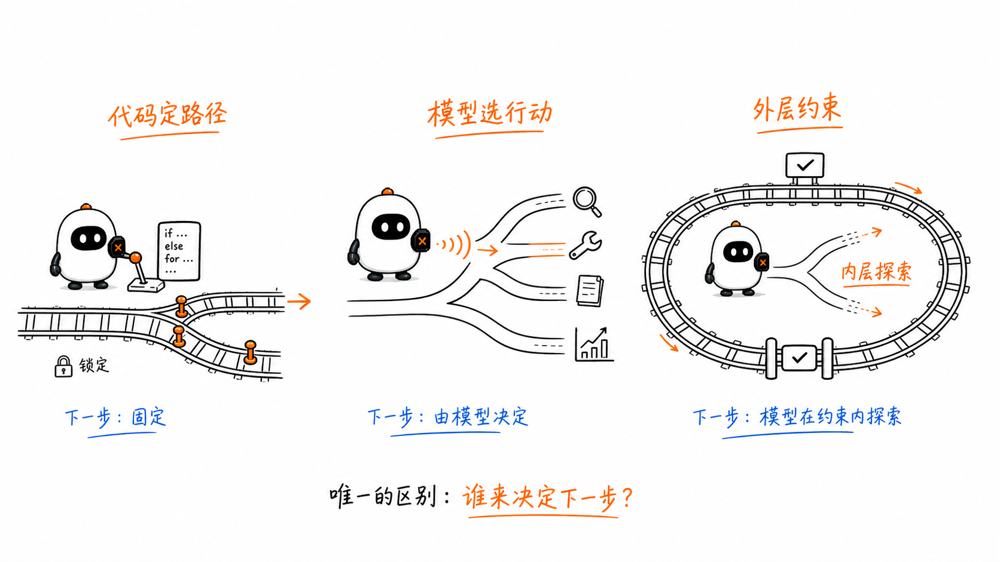
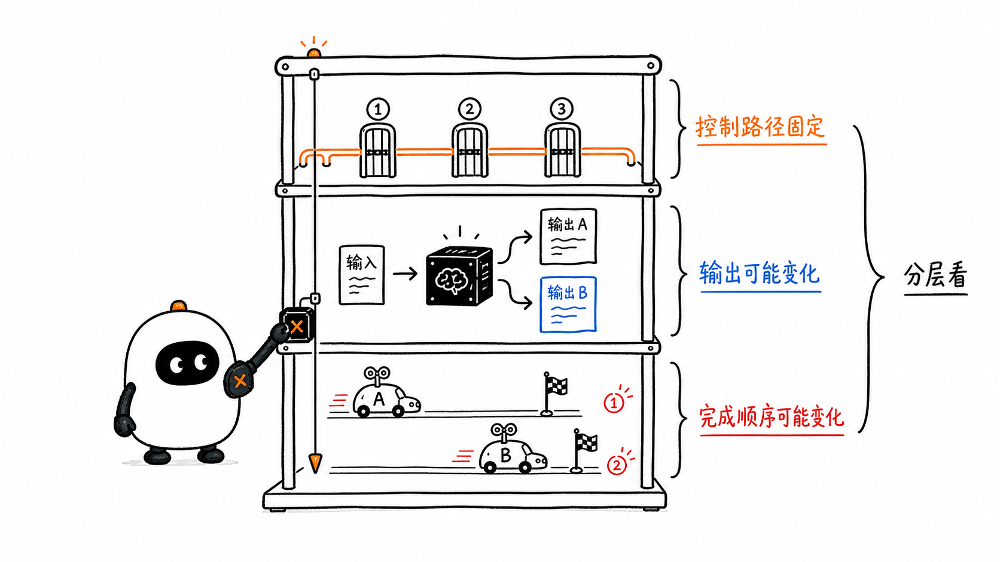
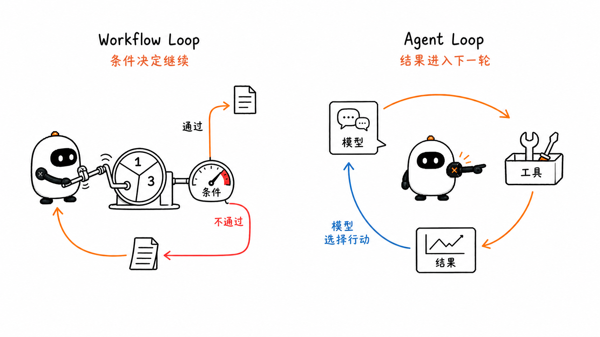
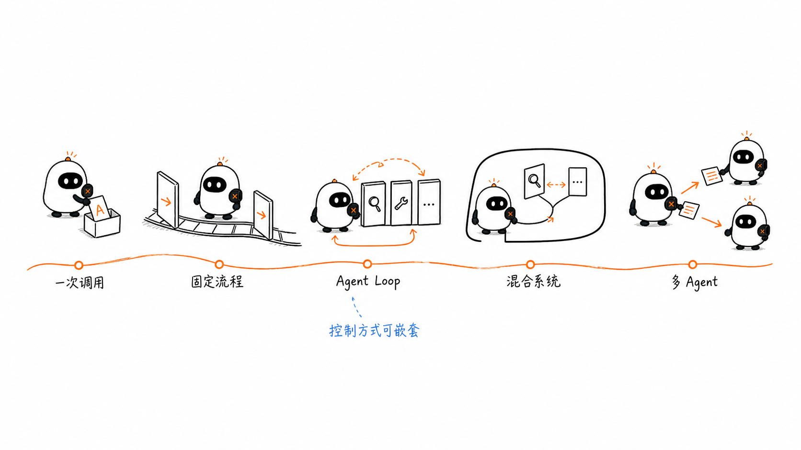
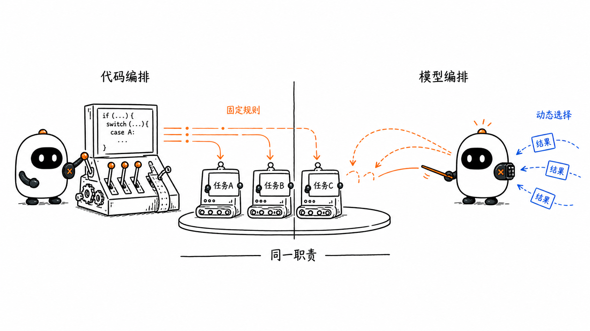
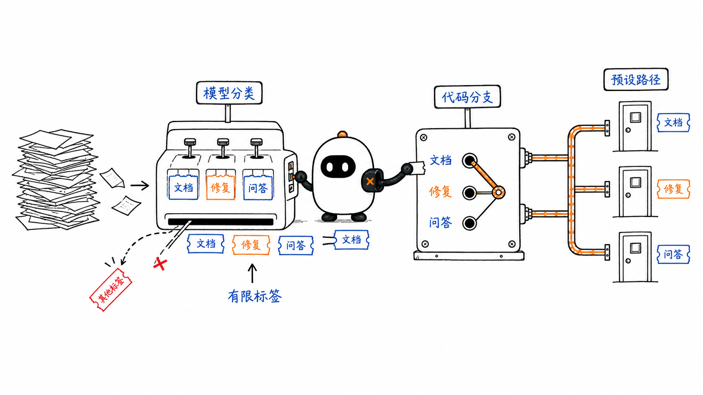
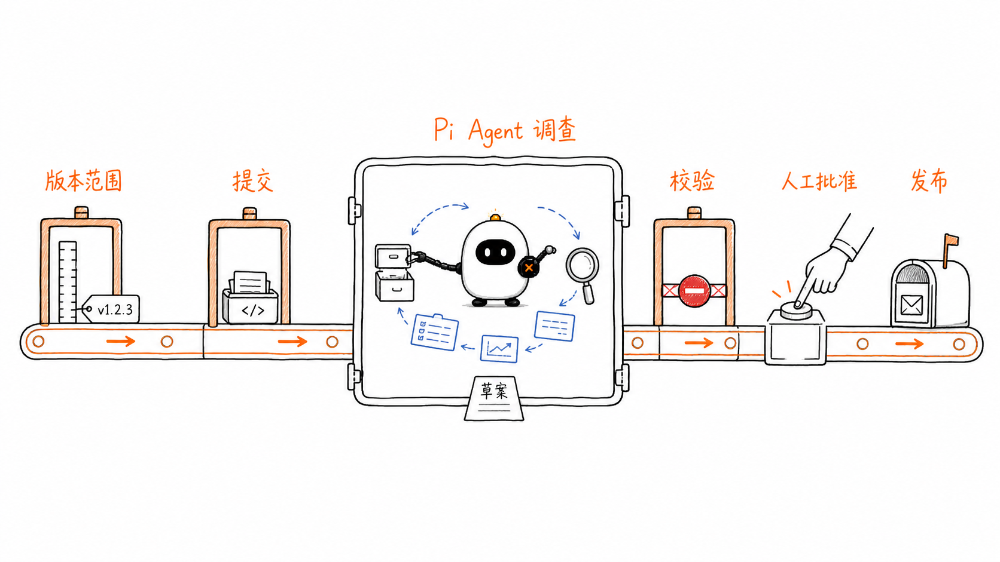
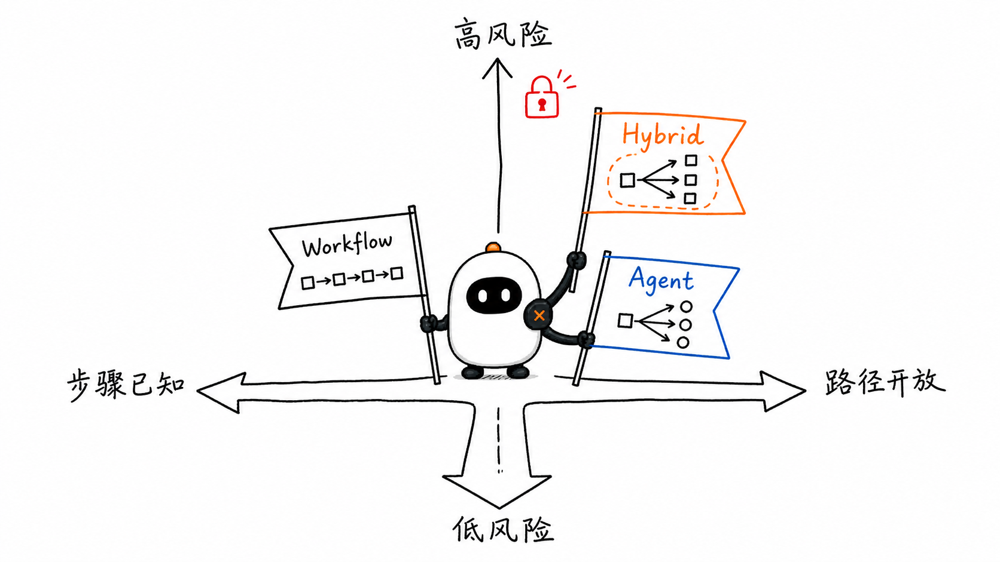

# Workflow 与 Agent：下一步由谁决定

这是 learn-pi-agent 的第 10 章。前九章已经把模型调用、Agent Loop、Tool、Context、Session、MCP、Skill 和 Extension 连成了一条运行链。现在把视角再向外移动一层：当一个任务包含多个步骤时，究竟由谁决定下一步？

例如，生成一份发布说明可能要经历收集提交、分析改动、生成草稿、检查格式、人工确认和正式发布。这里有两种不同的控制方式：

- 程序提前写好每一步及其连接关系，运行时按这些规则前进；
- 程序只给模型目标和可用工具，由模型根据中间结果决定接下来做什么。

前者是 **Workflow** 的核心，后者是 **Agent** 的核心。工程实践中更常见的是第三种：程序控制高风险和可预测的阶段，把开放性较强的局部任务交给 Agent。



> **版本说明**：Pi 接口名称与行为对应源码基线 `086c32e74530564922d011ade23ff582c9d63116`。Anthropic、OpenAI Agents SDK 与 Google ADK 文档核对日期为 `2026-08-24`。不同产品对 Workflow、Agent 和 Orchestrator 的命名并不完全一致，本章按实际控制机制分类。

## 1. 先建立一个判断标准

判断一个系统更接近 Workflow 还是 Agent，最有用的问题不是“它有没有调用大模型”，而是：

> **运行到当前步骤以后，谁拥有选择下一步的控制权？**

为了准确回答，需要先认识五个基础对象。

| 对象 | 含义 | 发布说明示例 |
| --- | --- | --- |
| Task | 系统要完成的目标 | 为某个版本生成并发布说明 |
| Step / Node | 一次可识别的处理单元 | 收集提交、生成草稿、请求批准 |
| Transition / Edge | 从当前步骤前往下一步骤的规则 | 格式检查通过后进入人工批准 |
| Control Flow | 步骤、分支、循环和结束条件组成的运行路径 | 校验失败返回修改，批准后才发布 |
| Orchestrator | 协调步骤、传递状态并选择下一步的组件 | 一段业务代码，或负责分解任务的模型 |

Orchestrator 是一个职责名称，不等于某种固定技术。它可以是一段普通代码，也可以是一次模型调用，甚至可以由代码与模型共同组成。

### 1.1 Workflow：控制流由程序预先规定

Workflow 把任务拆成一组已知步骤，并用代码或流程定义描述它们怎样连接。运行时可以读取数据、调用模型、等待人工输入，也可以分支和循环；但下一步仍由预先存在的规则决定。

```text
收集提交
   ↓
调用模型生成草稿
   ↓
格式是否合格？ ── 否 ──→ 返回修改
   │
   是
   ↓
人工是否批准？ ── 否 ──→ 结束，不发布
   │
   是
   ↓
发布
```

即使“生成草稿”和“判断类别”使用了 LLM，只要程序已经规定了候选步骤、分支集合与连接规则，整体仍然是 Workflow。

### 1.2 Agent：模型在边界内动态选择行动

Agent 通常接收目标、当前 Context 和一组 Tool。模型可以根据执行结果选择：

- 是否调用 Tool；
- 调用哪个 Tool；
- 使用什么参数；
- 是否根据 Tool Result 再调用另一个 Tool；
- 什么时候给出最终回答。

这些选择不是程序在开始前逐条枚举出来的，而是在运行中由模型根据当前信息产生。宿主程序仍然负责执行 Tool、保存状态、实施权限和终止策略。

因此，“模型决定下一步”不等于“模型拥有系统”。更准确的说法是：

```text
宿主定义可行动的边界
模型在边界内选择下一项行动
宿主验证并执行这项行动
```

### 1.3 Hybrid：外层规则固定，内层行动开放

混合系统把两种控制方式嵌套起来：

```text
外层 Workflow：收集 → Agent 分析 → 校验 → 人工批准 → 发布
                         │
                         └─ 内层 Agent：读文件 ↔ 搜索代码 ↔ 整理证据 → 草稿
```

外层 Workflow 保证发布前一定经过校验和批准；内层 Agent 不需要业务代码提前穷举“先读哪个文件、再搜索哪个符号”。这就是常说的 **bounded autonomy（有边界的自主性）**。

## 2. “确定性 Workflow”究竟确定了什么

工程文档经常把 Workflow 称为 deterministic orchestration。这里的“确定性”主要指 **控制结构可由代码预先确定**，而不是每次运行的所有字节都完全相同。

一个 Workflow 可以同时包含下列不确定性：

- LLM 每次生成的措辞不同；
- 网络请求返回时间不同；
- 并行任务的完成顺序不同；
- 外部数据库内容发生变化；
- 人工批准的结果不同。

只要程序已经定义“收到这些结果以后怎样选择下一节点”，控制流仍然是代码拥有的。



可以把“确定性”拆成四层：

| 层次 | 要问的问题 | 可能确定吗 |
| --- | --- | --- |
| Control | 哪些节点可以连接，条件如何判断 | 可以由代码固定 |
| Data | 节点收到和返回的数据是否相同 | 取决于输入与外部状态 |
| Model Output | 模型生成是否逐字相同 | 通常不能假定 |
| Scheduling | 并行节点按什么顺序完成 | 通常不能假定 |

所以，可靠的 Workflow 不应依赖“模型大概每次都会说相同的话”。它会使用结构化输出、Schema 校验、显式分支和错误处理，把不稳定数据放进稳定的控制边界。

## 3. Agent 也不是没有控制流

Pi 的 Agent Loop 本身当然由 TypeScript 代码实现。代码负责调用模型、执行 Tool、追加 Tool Result 并判断错误或取消；但在正常工具循环中，**模型响应决定本轮是否请求 Tool，以及请求什么 Tool**。

```text
宿主准备 Context
       ↓
宿主调用模型
       ↓
模型返回 Assistant Message
       ↓
有 Tool Call 吗？
   ├─ 没有：本轮形成最终响应
   └─ 有：宿主校验并执行 Tool
                    ↓
              写回 Tool Result
                    ↓
                再调用模型
```

这里存在两类决定，不能混为一谈：

| 决定 | 主要由谁做 | Pi 中的表现 |
| --- | --- | --- |
| 本轮请求哪个 Tool、参数是什么 | 模型 | Assistant Message 中的 `toolCall` 内容块 |
| Tool 是否存在、参数能否执行 | Runtime / Tool 实现 | 工具查找、Schema 校验与执行错误 |
| 动作是否获得授权 | Harness / Extension / 环境策略 | Tool Hook、审批、Sandbox 与操作系统权限 |
| Tool Result 是否进入下一轮 | Runtime | 追加消息并再次调用模型 |
| 错误、取消、终止请求是否结束运行 | Runtime / 宿主策略 | stop reason、abort、tool terminate 等条件 |

“Agent 的下一步由模型决定”描述的是模型在授权范围内选择行动；它没有抹掉宿主对执行、状态和安全边界的控制。

## 4. Agent Loop 与 Workflow Loop 不是同一种循环

两种系统都可能出现循环，但继续循环的原因不同。



### 4.1 Workflow Loop：程序条件决定是否再来一次

```ts
for (let attempt = 1; attempt <= 3; attempt += 1) {
  const draft = await generateDraft(input);
  const issues = validateDraft(draft);

  if (issues.length === 0) {
    return draft; // 代码规定：校验通过就退出
  }

  input = { ...input, issues }; // 代码规定下一次输入
}

throw new Error("三次校验后仍不合格");
```

循环次数、退出条件和下一次输入都写在代码中。`generateDraft()` 内部可以调用 LLM，但外层仍是 Workflow Loop。

### 4.2 Agent Loop：模型根据观察结果选择后续行动

```text
目标：分析这次发布包含哪些用户可见变化

模型 → grep("deprecated")
宿主 → 返回 6 处匹配
模型 → read("src/config.ts")
宿主 → 返回文件内容
模型 → read("CHANGELOG.md")
宿主 → 返回历史格式
模型 → 输出发布说明
```

宿主没有提前写死这三次 Tool Call。每次 Tool Result 都成为新的观察，模型据此选择下一步。工具、轮次、超时和权限仍由宿主限制。

### 4.3 两层循环可以同时存在

一个外层 Workflow 可以在校验失败时重新运行一个 Agent；每次 Agent Run 内部又可以包含多轮模型—工具循环：

```text
Workflow 重试循环
└─ 第 1 次 Agent Run
   ├─ 模型调用 1 → Tool A
   ├─ 模型调用 2 → Tool B
   └─ 模型调用 3 → 草稿
└─ 校验失败，Workflow 决定重试
└─ 第 2 次 Agent Run
   ├─ 模型调用 1 → Tool C
   └─ 模型调用 2 → 修订草稿
```

只看见“有循环”还不够，还要沿每一层找到它的继续条件和拥有者。

## 5. 从一次模型调用到混合系统

Workflow 与 Agent 不是两个互斥产品标签，而是一组可以嵌套的控制方式。



| 形态 | 下一步怎样产生 | 例子 |
| --- | --- | --- |
| 单次模型调用 | 没有后续步骤，调用后返回 | 摘要一段文字 |
| 固定 Workflow | 代码按顺序、条件或循环连接节点 | 摘要 → 校验 → 存储 |
| Agent Loop | 模型根据结果动态选择 Tool 或结束 | 在代码库中调查问题 |
| Workflow 中的 Agent 节点 | 外层代码定阶段，节点内部由模型行动 | 发布流程中的代码分析节点 |
| Multi-Agent 系统 | 一个或多个控制者把任务交给多个 Agent | Manager 分配给研究、编码和审核 Agent |

这张连续谱并不表示越靠右越先进。控制方式要服从任务特征：固定流程通常更容易测试和审计；开放任务需要更强的动态适应能力，也会增加成本与失败路径。

## 6. Orchestrator 到底是代码还是模型

答案是：两者都可以。



### 6.1 Code Orchestration

代码 Orchestrator 读取显式状态，通过 `if`、`switch`、队列、图或状态机选择节点。

```ts
switch (state.route) {
  case "documentation":
    return writeDocumentation(state);
  case "bug_fix":
    return investigateBug(state);
  case "question":
    return answerQuestion(state);
}
```

它的优势是候选路径可见、可测试，预算、重试和副作用边界容易明确。

### 6.2 LLM Orchestration

模型 Orchestrator 接收目标和可用能力，可以动态拆解任务、选择 Agent 或创建子任务。例如，它可能先发现任务涉及前端和数据库，再分别调用两个专门 Agent，最后综合结果。

它适合无法事先列出完整步骤的任务，但需要额外处理：

- 任务是否真的被完整分解；
- 多个结果是否相互冲突；
- 是否出现无效循环或重复委派；
- 总轮次、token、时间和费用是否超限；
- 高风险动作是否越过批准边界。

### 6.3 名称不能代替运行分析

Google ADK 把 `SequentialAgent`、`ParallelAgent` 和 `LoopAgent` 统称为 workflow agents，但这些顶层组件按预定义逻辑编排子 Agent，不依靠 LLM 选择控制路径。

Anthropic 则把 orchestrator-workers 列为 workflow pattern，即使中央 LLM 会动态拆解任务和分配 worker。这里的差异说明：框架名称只是产品词汇，真正需要观察的是每一层的控制权。

判断时可以画出嵌套关系：

```text
代码 Orchestrator
├─ 固定预处理节点
├─ 模型 Orchestrator
│  ├─ 动态 Worker A
│  └─ 动态 Worker B
└─ 固定批准与发布节点
```

整体外壳是 Workflow，内部某个节点可以具有 Agent 式控制。

## 7. Routing 使用 LLM，为什么仍可能是 Workflow

Routing 的任务是先判断输入属于哪一类，再交给对应处理路径。如果模型只能返回预先定义的有限标签，代码再根据标签选择固定分支，那么控制边界仍由 Workflow 拥有。



```ts
type Route = "documentation" | "bug_fix" | "question";

type RouteDecision = {
  route: Route;
  reason: string;
};

const decision: RouteDecision = await classifyWithModel(input);

switch (decision.route) {
  case "documentation":
    return runDocumentationFlow(input);
  case "bug_fix":
    return runBugFixFlow(input);
  case "question":
    return runQuestionFlow(input);
}
```

这段设计中：

1. 模型负责把非结构化输入映射成 `RouteDecision`；
2. `Route` 联合类型限定了三个合法标签；
3. 运行前已经存在三个候选分支；
4. `switch` 决定真正调用哪条代码路径；
5. 未通过 Schema 或业务校验的输出不能直接进入执行。

如果模型可以自由生成新工具名、任意组合未限定的步骤，并根据中间结果持续改变计划，控制方式就更接近 Agent。

因此，**一次 LLM decision 不会自动把整个系统变成 Agent**。关键仍然是模型的输出能改变多大范围的控制流。

## 8. 用 Pi SDK 构造一个 Agent 节点

Pi SDK 提供 `createAgentSession()`，可以把 Pi 的 Agent 能力嵌入应用或自动化流程。下面的代码使用固定版本 Pi 文档中的真实名称：`ModelRuntime`、`SessionManager.inMemory()`、`createAgentSession()`、`session.prompt()`、`session.messages` 与 `session.dispose()`。

### 8.1 从 Pi Session 中取得最终文本

```ts
import type { AgentMessage } from "@earendil-works/pi-agent-core";
import {
  createAgentSession,
  ModelRuntime,
  SessionManager,
} from "@earendil-works/pi-coding-agent";

function latestAssistantText(messages: AgentMessage[]): string {
  for (let index = messages.length - 1; index >= 0; index -= 1) {
    const message = messages[index];

    if (message.role !== "assistant") {
      continue;
    }

    if (message.stopReason !== "stop") {
      throw new Error(
        message.errorMessage ?? `Agent 未完整结束：${message.stopReason}`,
      );
    }

    return message.content
      .filter((item) => item.type === "text")
      .map((item) => item.text)
      .join("");
  }

  throw new Error("Pi Agent 没有返回 Assistant Message");
}
```

这段函数从后向前寻找最后一条 Assistant Message，再收集其中的文本内容块。它没有把 Tool Result 当成最终文本，而且只接受 `stopReason === "stop"` 的完整结束；错误、取消、输出截断或尚未完成的异步响应都会交给外层 Workflow 处理。

### 8.2 让 Pi 在只读边界内生成发布说明

```ts
async function draftReleaseNotesWithPi(
  cwd: string,
  commitSummary: string,
): Promise<string> {
  const modelRuntime = await ModelRuntime.create();

  const { session } = await createAgentSession({
    cwd,
    tools: ["read", "grep", "find", "ls"],
    sessionManager: SessionManager.inMemory(),
    modelRuntime,
  });

  try {
    await session.prompt(`
根据下面的提交摘要，为这个仓库生成面向用户的发布说明。
你可以读取和搜索当前仓库，以确认改动影响；不要修改文件。

提交摘要：
${commitSummary}
    `.trim());

    const text = latestAssistantText(session.messages);

    if (text.trim().length === 0) {
      throw new Error("Pi Agent 返回了空的发布说明");
    }

    return text;
  } finally {
    session.dispose();
  }
}
```

`session.prompt()` 会等待这次被接受的 Agent Run 完成，包括内部工具往返与自动重试。这个函数没有规定 Pi 必须先 `grep` 还是先 `read`；Pi Agent 根据仓库内容和 Tool Result 自己选择行动。

同时，宿主仍然规定了清晰边界：

- `cwd` 限定工作目录；
- `tools` 只启用 `read`、`grep`、`find` 与 `ls`；
- Session 使用内存存储，不延续到另一批任务；
- 调用方检查错误、取消和空结果；
- `finally` 保证 Session 资源被释放。

代码能够限制 Pi 暴露的 Tool，但这不等于操作系统级 Sandbox。进程权限、路径策略和秘密管理仍要由运行环境负责。

## 9. 再把 Pi Agent 放进外层 Workflow

现在用普通 TypeScript 固定整个发布流程。下面的 `ReleaseServices` 表示应用自身提供的服务边界；它们不是 Pi API。

```ts
type ReleaseServices = {
  validateRange(range: string): Promise<void>;
  collectCommits(range: string): Promise<string>;
  validateDraft(draft: string): Promise<string[]>;
  requestApproval(draft: string): Promise<boolean>;
  publish(draft: string): Promise<void>;
};

type ReleaseResult =
  | { status: "published"; draft: string }
  | { status: "needs_revision"; draft: string; issues: string[] }
  | { status: "rejected"; draft: string };

async function runReleaseWorkflow(
  services: ReleaseServices,
  cwd: string,
  range: string,
): Promise<ReleaseResult> {
  // ① Workflow 固定：发布流程必须先校验版本范围。
  await services.validateRange(range);

  // ② Workflow 固定：先收集提交，再允许 Agent 分析。
  const commits = await services.collectCommits(range);

  // ③ Agent 节点：Pi 自己选择怎样读取和搜索仓库。
  const draft = await draftReleaseNotesWithPi(cwd, commits);

  // ④ Workflow 固定：代码校验失败就返回修改，不进入发布。
  const issues = await services.validateDraft(draft);
  if (issues.length > 0) {
    return { status: "needs_revision", draft, issues };
  }

  // ⑤ Workflow 固定：发布是外部副作用，必须经过人工批准。
  const approved = await services.requestApproval(draft);
  if (!approved) {
    return { status: "rejected", draft };
  }

  // ⑥ Workflow 固定：只有校验和批准都通过才调用发布服务。
  await services.publish(draft);
  return { status: "published", draft };
}
```



这段代码把控制权分成两部分：

| 范围 | 控制者 | 可以改变什么 |
| --- | --- | --- |
| 发布流程的阶段顺序 | `runReleaseWorkflow()` | 校验、收集、Agent、批准、发布的连接 |
| 仓库调查过程 | Pi Agent | 在允许的 Tool 中选择调用与参数 |
| 草稿合格条件 | `validateDraft()` | 是否允许进入人工批准 |
| 最终发布授权 | 人与应用代码 | 是否产生真实外部副作用 |

Pi 在这里不是整个业务流程的 Orchestrator，而是一个 Agent 节点。它的动态能力解决开放性调查，外层 Workflow 保留可预测的业务约束。

## 10. Workflow、Agent 与 Hybrid 怎样选择



### 10.1 更适合 Workflow 的情况

- 步骤和合法分支能够提前列出；
- 业务要求稳定顺序、严格审计或法规合规；
- 外部写操作多，重复执行代价高；
- 每一步都有清晰的输入输出契约；
- 成本和延迟必须容易估算；
- 失败后需要从指定节点重试。

例如付款、权限变更、数据迁移和正式发布，都应让代码与人工 Gate 保持最终控制。

### 10.2 更适合 Agent 的情况

- 无法在运行前列出完整调查路径；
- 下一步高度依赖刚刚取得的非结构化结果；
- 任务需要在大量工具或资料中动态选择；
- 失败可以通过观察结果、改变方法继续恢复；
- 对“怎样完成”允许一定变化，但目标与边界清晰。

例如在陌生代码库中定位缺陷、综合多份资料和处理开放式支持请求，通常受益于 Agent Loop。

### 10.3 更适合 Hybrid 的情况

- 任务同时包含开放性分析和高风险动作；
- 某些步骤可自动探索，但结果必须经过结构化校验；
- 需要 Agent 处理长尾情况，又要限制预算、轮次和权限；
- 希望把 Agent 当作现有业务系统中的一个受控能力。

多数生产系统不会把所有控制权交给同一层。混合设计让 Agent 负责难以枚举的认知步骤，让 Workflow 负责确定性的业务承诺。

## 11. 五个问题可以定位控制权

面对任何号称“Agent Workflow”的系统，可以沿下面五个问题检查：

1. **谁选择下一节点？** 是 `if` / 图定义，还是模型输出的 Tool Call、handoff 或计划？
2. **候选路径是否预先有界？** 模型只能在三个 route 中选择，还是能动态创建步骤？
3. **谁决定步骤数量与顺序？** 代码固定三步，还是模型根据观察继续行动？
4. **谁判定完成？** 是业务条件、人工批准、最大轮次，还是模型给出最终响应？
5. **谁控制副作用与失败？** 哪一层负责权限、超时、重试、幂等和恢复？

同一个系统可能给出混合答案。不要急着给整套产品贴一个标签，先标出每一层的控制者。

## 12. 控制方式会改变工程设计

Workflow 和 Agent 的差异不只影响架构图，还直接改变测试、状态与故障处理方式。

### 12.1 State：保存数据，也保存控制位置

Workflow State 通常要记录当前节点、已完成步骤和分支结果；Agent State 则还要保存消息、Tool Call、Tool Result 和本轮运行状态。

混合系统需要同时知道：

```text
Workflow 位于“等待批准”节点
Agent 节点已经完成，输出草稿版本 v3
草稿校验通过
发布动作尚未执行
```

只有保存对了控制位置，进程重启后才不会把“已经生成草稿”误当成“已经发布”。

### 12.2 Retry：重试哪个边界

模型请求、Tool、Agent Run 和 Workflow Node 是不同的重试范围。一次网络错误可以重试 Provider 请求；草稿不合格可能重跑 Agent 节点；发布请求超时则必须先确认外部系统是否已经接收，不能盲目重复。

### 12.3 Idempotency：保护有副作用的步骤

如果 Workflow 可能恢复或重试，发布、付款、发信等动作应使用稳定的操作 ID 或幂等键。Agent 生成的自然语言不能充当可靠去重标识。

### 12.4 Budget：把开放性变成可执行边界

Agent 节点应有明确预算，例如：

- 最大模型轮次；
- 最大 Tool Call 数；
- token 或费用上限；
- 单次和总任务超时；
- 允许访问的目录、网络和 Tool；
- 超限后的失败或人工接管路径。

预算是宿主控制流的一部分，不应只写在提示词里请求模型自觉遵守。

### 12.5 Observability：既看结果，也看路径

Workflow 要记录节点进入、退出、分支和重试；Agent 要记录模型调用、Tool Call、Tool Result、停止原因和消耗。混合系统还要用统一的 run ID 把外层节点与内层 Agent 事件关联起来。

最终草稿正确，并不能证明运行路径安全；运行路径看起来合理，也不能证明业务结果正确。两者需要分别观察和评估。

## 13. 七个常见误解

### 13.1 “只要用了 LLM，就是 Agent”

单次摘要、分类或结构化提取都可以是普通 Workflow 节点。模型是否拥有持续选择行动的权力，才是关键。

### 13.2 “多步骤系统就是 Agent”

固定的五步流水线仍然是 Workflow。步骤数量不会自动产生自主控制。

### 13.3 “Workflow 必须是 DAG”

DAG 不允许环，但 Workflow 可以有条件分支、循环、等待、取消和人工节点。DAG 是一种流程结构，不是 Workflow 的完整定义。

### 13.4 “Agent 没有程序控制”

Agent Loop、Tool 执行、权限、状态和停止条件都由宿主代码实现。模型只在宿主提供的行动空间内作出动态选择。

### 13.5 “让模型选择 route，就已经是 Agent”

如果模型只返回有限结构化标签，而代码拥有所有后续分支，整体仍然是模型辅助的 Workflow。

### 13.6 “Orchestrator 一定是另一个 Agent”

Orchestrator 可以是状态机、队列消费者、普通函数，也可以是 LLM。这个词描述协调职责，不说明实现方式。

### 13.7 “Agent 比 Workflow 更高级”

Agent 用灵活性换取了更大的成本、延迟和失败空间。对稳定业务规则使用 Agent，可能只是降低可预测性；对开放问题强行穷举 Workflow，也可能让规则迅速变得脆弱。

## 本章小结

- Workflow 的步骤、分支、循环和结束条件主要由程序预先规定；
- Agent 在 Harness 边界内，根据目标和中间结果动态选择 Tool、参数和后续行动；
- 判断两者的核心问题是“下一步由谁决定”，而不是“有没有调用 LLM”；
- deterministic orchestration 主要表示控制结构可预测，不保证模型文本、外部数据或并发顺序完全相同；
- Agent Loop 由代码运行，但模型在正常工具循环中提出下一项行动；
- Workflow Loop 的继续条件由代码拥有，Agent Loop 的行动路径受模型输出驱动；
- Orchestrator 是协调角色，可以由代码或模型实现；
- LLM Routing 仍可能是 Workflow，因为模型只在预定义标签内分类，代码执行固定分支；
- Pi SDK 可以把一个完整 Agent Session 嵌入现有 Workflow；
- 生产系统常用外层 Workflow 约束阶段、批准与副作用，内层 Agent 处理开放性调查；
- State、Retry、Idempotency、Budget 与 Observability 都必须沿控制权边界设计。

## 下一章：Workflow Patterns

下一章继续研究代码控制与模型判断怎样组合，逐一拆解 Prompt Chaining、Routing、Parallelization、Orchestrator-Workers、Evaluator-Optimizer 和带退出条件的循环。每种模式都会回答三个问题：控制流怎样连接，状态怎样传递，失败以后从哪里继续。

## 参考资料

- [Pi SDK：把 Agent 能力嵌入应用与自动化 Workflow](https://github.com/earendil-works/pi/blob/086c32e74530564922d011ade23ff582c9d63116/packages/coding-agent/docs/sdk.md)
- [Pi `agent-loop.ts`：模型调用、Tool 执行与循环控制](https://github.com/earendil-works/pi/blob/086c32e74530564922d011ade23ff582c9d63116/packages/agent/src/agent-loop.ts)
- [Pi `types.ts`：AgentMessage、AgentTool 与 AgentLoopConfig](https://github.com/earendil-works/pi/blob/086c32e74530564922d011ade23ff582c9d63116/packages/agent/src/types.ts)
- [Anthropic：Building effective agents](https://www.anthropic.com/engineering/building-effective-agents)
- [OpenAI Agents SDK：Orchestrating multiple agents](https://openai.github.io/openai-agents-js/guides/multi-agent/)
- [OpenAI Agents SDK：Running agents](https://openai.github.io/openai-agents-js/guides/running-agents/)
- [OpenAI：A practical guide to building agents](https://openai.com/business/guides-and-resources/a-practical-guide-to-building-ai-agents/)
- [Google ADK：Workflow agents](https://adk.dev/agents/workflow-agents/)
- [Google ADK：Sequential agents](https://adk.dev/agents/workflow-agents/sequential-agents/)
- [Google ADK：Parallel agents](https://adk.dev/agents/workflow-agents/parallel-agents/)
- [Google ADK：Loop agents](https://adk.dev/agents/workflow-agents/loop-agents/)
- [ReAct: Synergizing Reasoning and Acting in Language Models](https://arxiv.org/abs/2210.03629)
