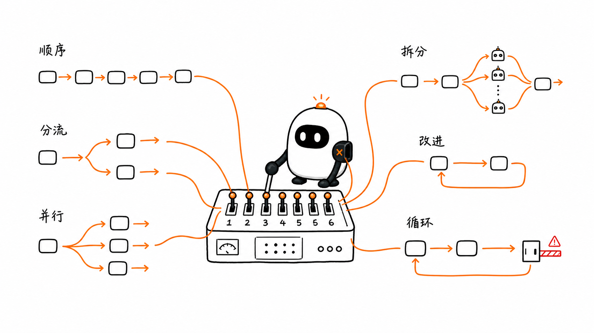
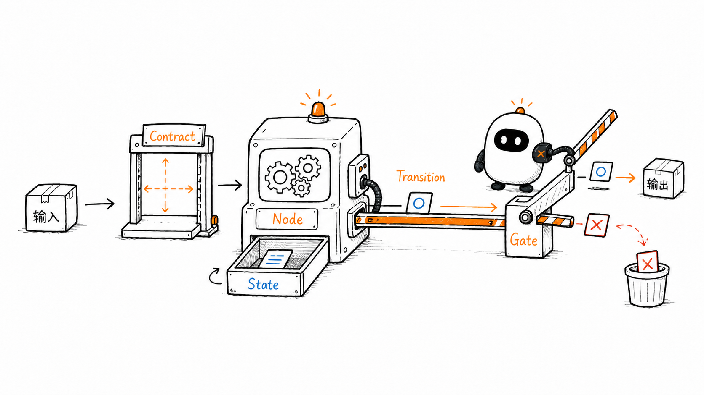
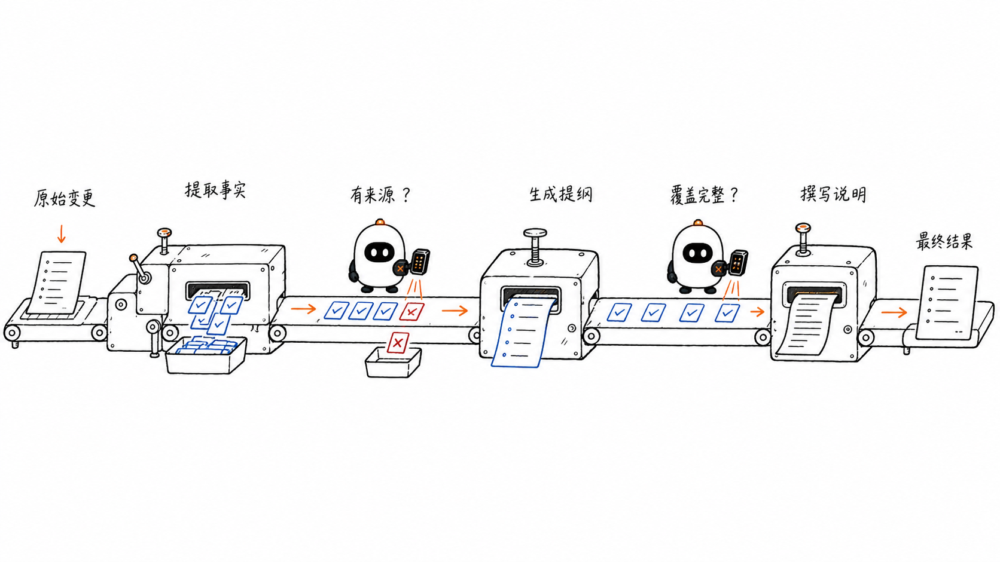
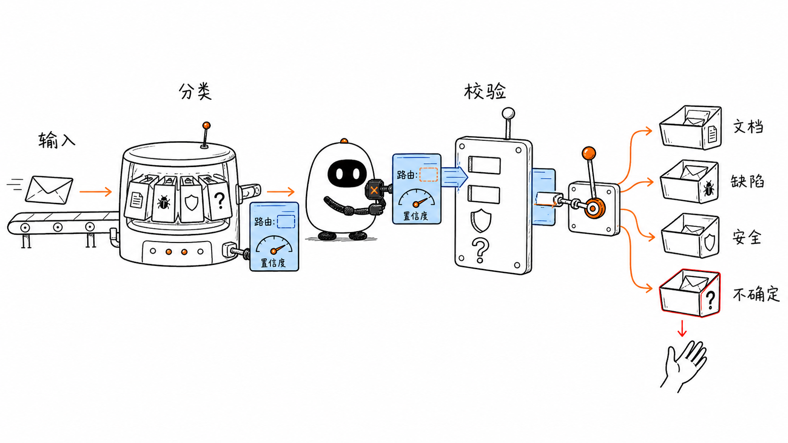
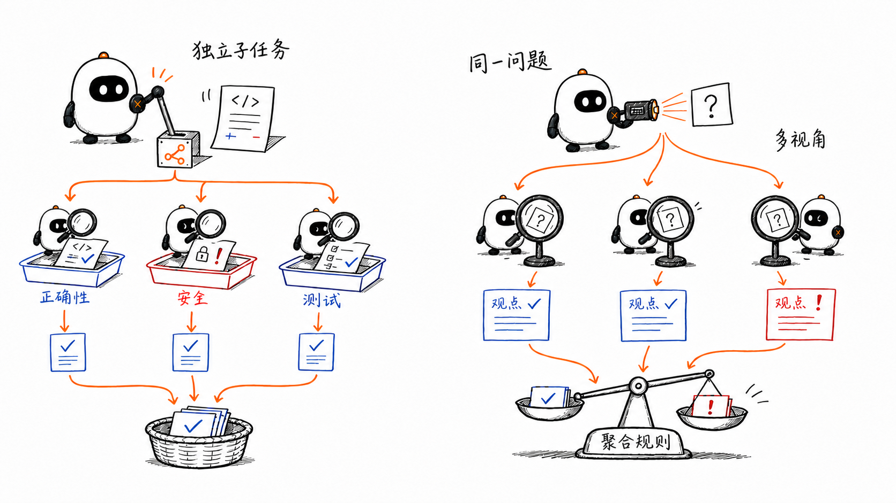
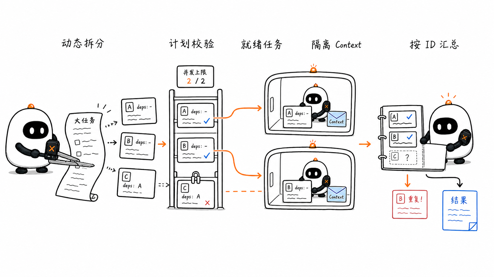
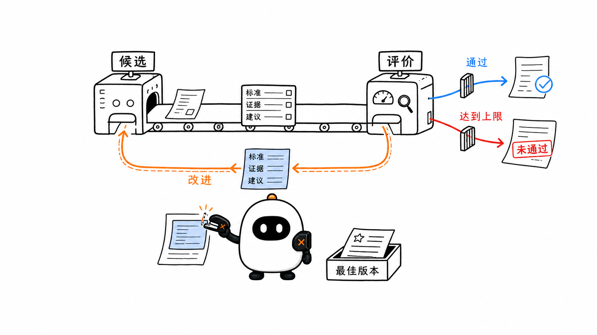
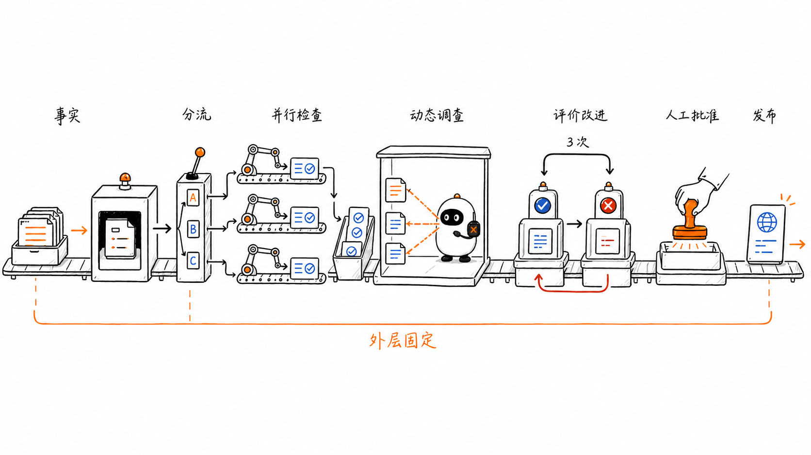

# Workflow Patterns：怎样连接多个模型与 Agent 节点

这是 learn-pi-agent 的第 11 章。上一章用“下一步由谁决定”区分了 Workflow、Agent 和混合系统。本章继续向前：当控制流由应用组织时，多个模型调用或 Agent 节点应该怎样连接？

同样是“多调用几次模型”，可以形成完全不同的结构：

- 前一步输出成为后一步输入；
- 先分类，再进入一条专门路径；
- 把互不依赖的任务同时执行；
- 让模型动态拆出若干 worker 任务；
- 让生成者根据评价反复改进；
- 按明确的继续条件重复一组步骤。

这些结构被称为 **Workflow Patterns**。Pattern 不是框架名称，而是可复用的控制结构；它说明节点怎样连接、状态怎样流动、什么条件让系统继续或结束。



> **版本说明**：Pi 接口名称与行为对应源码基线 `086c32e74530564922d011ade23ff582c9d63116`。Anthropic、OpenAI Agents SDK 与 Google ADK 文档核对日期为 `2026-08-24`。同一 Pattern 在不同框架中可能使用不同名称，本章按控制结构解释。

## 1. 先看 Pattern 的共同骨架

任何 Workflow Pattern 都可以先拆成五类对象：

| 对象 | 负责什么 | 例子 |
| --- | --- | --- |
| Node | 完成一个有边界的步骤 | 生成提纲、检查安全、运行 Pi Agent |
| Contract | 规定节点输入与输出的形状 | `RouteDecision`、`Review`、`WorkItem[]` |
| State | 保存跨节点需要继续使用的数据 | 原始任务、草稿、反馈、已完成结果 |
| Transition | 决定下一节点 | 顺序、`switch`、fan-out、循环条件 |
| Gate | 阻止不合格结果继续前进 | Schema 校验、测试、人工批准、预算检查 |



一个最小节点接口可以写成：

```ts
type WorkflowNode<Input, Output> = (
  input: Input,
  signal: AbortSignal,
) => Promise<Output>;
```

这个类型表达三件事：

1. 节点只能从声明的 `Input` 开始；
2. 节点完成后返回明确的 `Output`；
3. Workflow 可以用同一个 `AbortSignal` 取消节点。

TypeScript 类型只在开发与编译阶段存在。模型返回的 JSON、网络数据和 Tool Result 到达运行时以后，仍然必须进行真实校验；给变量写上 `RouteDecision` 类型，不会自动把错误 JSON 变成合法数据。

### 1.1 Pattern 关注连接，不规定节点内部实现

一个 Node 可以是：

- 普通函数；
- 数据库或 HTTP 调用；
- 单次 LLM 请求；
- 一个包含多轮 Tool Call 的 Pi Agent Run；
- 人工输入或批准；
- 另一个子 Workflow。

因此，下面两句可以同时成立：

```text
外层是 Prompt Chaining Workflow
其中一个 Node 内部是 Pi Agent Loop
```

Pattern 描述节点之间的控制关系；节点内部是否具有 Agent 式控制，要单独分析。

## 2. 先做一个可复用的 Pi Agent 节点

Pi SDK 的 `createAgentSession()` 可以把一个完整 Agent Run 包装成 Workflow Node。下面沿用上一章的完整响应检查，并把取消信号接到 `session.abort()`。

这段代码不是从 Pi 仓库原样复制的源码：`createAgentSession`、`ModelRuntime`、`SessionManager`、`session.prompt()`、`session.messages`、`session.abort()` 和 `session.dispose()` 都是 Pi 的真实公共接口；`WorkflowNode` 与 `createPiTextNode()` 是本章为了演示组合方式写的适配代码。

```ts
import type { AgentMessage } from "@earendil-works/pi-agent-core";
import {
  createAgentSession,
  ModelRuntime,
  SessionManager,
} from "@earendil-works/pi-coding-agent";

function latestAssistantText(messages: AgentMessage[]): string {
  for (let index = messages.length - 1; index >= 0; index -= 1) {
    const message = messages[index];
    if (message.role !== "assistant") continue;

    if (message.stopReason !== "stop") {
      throw new Error(
        message.errorMessage ?? `Agent 未完整结束：${message.stopReason}`,
      );
    }

    return message.content
      .filter((item) => item.type === "text")
      .map((item) => item.text)
      .join("");
  }

  throw new Error("Pi Agent 没有返回 Assistant Message");
}

type PiTextNodeOptions = {
  cwd: string;
  tools: string[];
  modelRuntime: ModelRuntime;
};

function createPiTextNode(
  options: PiTextNodeOptions,
): WorkflowNode<string, string> {
  return async (task, signal) => {
    if (signal.aborted) {
      throw signal.reason ?? new Error("Workflow 已取消");
    }

    const { session } = await createAgentSession({
      cwd: options.cwd,
      tools: options.tools,
      sessionManager: SessionManager.inMemory(),
      modelRuntime: options.modelRuntime,
    });

    const abortSession = () => {
      void session.abort().catch(() => undefined);
    };
    signal.addEventListener("abort", abortSession, { once: true });

    try {
      // 创建 Session 期间也可能收到取消，因此注册监听后再检查一次。
      if (signal.aborted) {
        throw signal.reason ?? new Error("Workflow 已取消");
      }

      await session.prompt(task);
      const text = latestAssistantText(session.messages);

      if (text.trim().length === 0) {
        throw new Error("Pi Agent 返回了空文本");
      }

      return text;
    } finally {
      signal.removeEventListener("abort", abortSession);
      session.dispose();
    }
  };
}
```

这个适配器让 Workflow 只关心 `string → string` 的节点契约。节点内部，Pi 仍然可以根据 Tool Result 进行多轮行动。

每次调用都创建独立的内存 Session，能减少不同 Node 之间无意共享历史。需要共享的信息应通过显式 `Input` 传入，而不是期待另一个 Session 自动“知道前面的内容”。

`tools` 控制启用的 Tool 名称，但不是完整安全边界。默认资源加载器还可能发现项目指令、Skill 和 Extension；需要严格复现的自动化任务应使用经过审查的资源配置，并在受限运行环境中执行。

## 3. Prompt Chaining：把复杂任务拆成固定顺序

Prompt Chaining 把任务分成一串顺序节点，每一步处理前一步的输出。



```text
原始变更
   ↓
提取事实
   ↓ Gate：事实是否有来源？
生成提纲
   ↓ Gate：是否覆盖必要章节？
撰写说明
   ↓
最终结果
```

它适合能被干净拆成固定子任务的工作。每次模型调用只处理一个较小问题，通常更容易写清指令和检查输出；代价是调用次数、延迟与中间状态都会增加。

### 3.1 真实 TypeScript 骨架

```ts
type ChangeFacts = {
  files: string[];
  userVisibleChanges: string[];
  evidence: string[];
};

type ReleaseOutline = {
  sections: Array<{
    heading: string;
    factIndexes: number[];
  }>;
};

type ChainNodes = {
  extractFacts: WorkflowNode<string, ChangeFacts>;
  buildOutline: WorkflowNode<ChangeFacts, ReleaseOutline>;
  writeDraft: WorkflowNode<
    { facts: ChangeFacts; outline: ReleaseOutline },
    string
  >;
};

async function runReleaseChain(
  input: string,
  nodes: ChainNodes,
  signal: AbortSignal,
): Promise<string> {
  const facts = await nodes.extractFacts(input, signal);
  if (facts.evidence.length === 0) {
    throw new Error("事实提取结果没有证据，Workflow 在 Gate 停止");
  }

  const outline = await nodes.buildOutline(facts, signal);
  if (outline.sections.length === 0) {
    throw new Error("提纲为空，不能进入写作节点");
  }

  return nodes.writeDraft({ facts, outline }, signal);
}
```

代码把三个 Node 的顺序写死，但没有要求它们必须使用同一个模型。`extractFacts` 可以是只读 Pi Agent，`buildOutline` 可以是一次 Structured Output 调用，`writeDraft` 也可以使用另一个 Provider。

### 3.2 中间结果必须成为 Contract

不稳定的写法是把每一步都当作自由文本，再把一大段自然语言原样塞给下一步。更稳妥的做法是：

- 让事实、来源、标识和状态使用结构化字段；
- 在节点边界进行 Schema 与业务校验；
- 只传后一步真正需要的字段；
- 保留原始证据，不让摘要成为唯一事实来源；
- 为每个节点记录输入版本和输出版本。

Prompt Chaining 提高质量的原因不是“调用次数多”，而是让问题被拆小，并在中间位置加入可验证的 Gate。

## 4. Routing：先分类，再进入专门路径

Routing 先把输入映射到有限类别，再由代码选择对应节点或子 Workflow。



```text
输入
 ↓
Classifier → RouteDecision
 ↓ Runtime validation
 ├─ documentation → 文档流程
 ├─ bug_fix       → 缺陷调查流程
 ├─ security      → 安全审查流程
 └─ unknown       → 人工分流
```

### 4.1 TypeScript 类型不能代替运行时校验

```ts
type Route = "documentation" | "bug_fix" | "security" | "unknown";

type RouteDecision = {
  route: Route;
  confidence: number;
  reason: string;
};

function parseRouteDecision(text: string): RouteDecision {
  const value: unknown = JSON.parse(text);

  if (typeof value !== "object" || value === null) {
    throw new Error("RouteDecision 必须是对象");
  }

  const candidate = value as Record<string, unknown>;
  const routes: Route[] = [
    "documentation",
    "bug_fix",
    "security",
    "unknown",
  ];

  if (
    !routes.includes(candidate.route as Route) ||
    typeof candidate.confidence !== "number" ||
    candidate.confidence < 0 ||
    candidate.confidence > 1 ||
    typeof candidate.reason !== "string"
  ) {
    throw new Error("RouteDecision 字段不合法");
  }

  return candidate as RouteDecision;
}
```

`as RouteDecision` 只发生在所有字段检查之后。真正项目可以使用 JSON Schema、TypeBox、Zod 或 Provider Structured Output，但业务规则仍要单独验证。

### 4.2 分支代码要处理低置信度与未知类别

```ts
type RouteNodes = Record<
  Exclude<Route, "unknown">,
  WorkflowNode<string, string>
>;

async function runRoutedWorkflow(
  input: string,
  classify: WorkflowNode<string, string>,
  nodes: RouteNodes,
  signal: AbortSignal,
): Promise<string> {
  const rawDecision = await classify(input, signal);
  const decision = parseRouteDecision(rawDecision);

  if (decision.route === "unknown" || decision.confidence < 0.75) {
    return "需要人工确认处理路径";
  }

  return nodes[decision.route](input, signal);
}
```

阈值 `0.75` 只是这个示例的业务配置，不是通用正确答案。它要根据验证集、误路由代价和人工处理容量校准。

### 4.3 Routing 的主要失败方式

- 类别定义重叠，模型无法稳定区分；
- 没有 `unknown` 或人工兜底，被迫把所有输入塞进某一类；
- 只看模型自报的 confidence，没有用真实数据校准；
- 分类标签合法，但输入不具备进入该流程的业务权限；
- 路由后丢失原始输入和分类理由，难以审计错误。

Routing 的价值来自专门化：每条路径可以使用不同提示、Tool、模型、预算和安全策略。

## 5. Parallelization：并发不是把箭头画成三条

Parallelization 让互不依赖的 Node 同时运行，再在 fan-in 阶段收集结果。



Anthropic 把它分成两种常见形式：

| 形式 | 怎样拆分 | 典型目的 |
| --- | --- | --- |
| Sectioning | 把任务拆成不同且独立的子问题 | 降低总延迟，让每个 Node 专注一项标准 |
| Voting | 对同一任务运行多个独立判断 | 获得多种视角或按规则聚合判断 |

### 5.1 Sectioning：独立任务并发执行

```ts
type DimensionReview = {
  dimension: "correctness" | "security" | "tests";
  findings: string[];
};

type ReviewNodes = {
  correctness: WorkflowNode<string, DimensionReview>;
  security: WorkflowNode<string, DimensionReview>;
  tests: WorkflowNode<string, DimensionReview>;
};

async function reviewInParallel(
  diff: string,
  nodes: ReviewNodes,
  signal: AbortSignal,
): Promise<DimensionReview[]> {
  return Promise.all([
    nodes.correctness(diff, signal),
    nodes.security(diff, signal),
    nodes.tests(diff, signal),
  ]);
}
```

三个 Node 都只依赖 `diff`，所以可以同时启动。`Promise.all()` 返回数组的顺序与输入 Promise 的顺序一致，不等于真实完成顺序一致。

还有一个容易忽略的行为：其中一个 Promise 拒绝后，`Promise.all()` 会尽快拒绝，但其他异步任务不会自动停止。要取消剩余 Provider 请求、Pi Session 或 Tool，必须把共享 `AbortSignal` 真正连接到各节点实现。

### 5.2 什么任务不能直接并行

如果 B 需要 A 的输出，就不能为了“更快”同时启动：

```text
读取代码 ──→ 修改代码 ──→ 运行测试
```

同样，多个 Node 并发写同一文件、同一 Session State 或同一外部资源，会产生竞态。Google ADK 的 Parallel Agent 文档也明确指出：并行分支不会自动共享对话历史或状态；需要共享时，必须显式设计并发访问与后处理。

### 5.3 Voting 不是简单多数表决

对同一代码运行三次安全审查，然后“二比一通过”，可能掩盖一个严重漏洞。聚合规则应由风险目标决定：

- 安全告警可以采用 one-veto：任一高置信度严重问题就进入人工审查；
- 主观文案可以保留多个候选，再由评分器或人选择；
- 数值与事实问题应优先依赖可验证证据，而不是模型票数；
- 多个调用如果使用相同模型、提示和 Context，错误可能高度相关，并不是真正独立的票。

并行化改善的是延迟或视角覆盖，不自动提高事实正确率。

## 6. Orchestrator-Workers：子任务在运行时才出现

Orchestrator-Workers 中，中央模型先根据当前输入动态拆分任务，再把子任务交给多个 worker，最后综合结果。



它与固定 Parallelization 的关键差异是：

```text
Parallelization：运行前已经知道要执行 correctness / security / tests
Orchestrator-Workers：运行后才知道要调查哪些文件、拆出多少子任务
```

### 6.1 Work Plan 也要有结构化契约

```ts
type WorkItem = {
  id: string;
  task: string;
  expectedOutput: string;
  dependsOn: string[];
};

type WorkPlan = {
  items: WorkItem[];
};

function validateWorkPlan(plan: WorkPlan, maxItems: number): void {
  if (plan.items.length === 0 || plan.items.length > maxItems) {
    throw new Error("WorkItem 数量超出边界");
  }

  const ids = new Set(plan.items.map((item) => item.id));
  if (ids.size !== plan.items.length) {
    throw new Error("WorkItem id 必须唯一");
  }

  for (const item of plan.items) {
    if (item.task.trim() === "" || item.expectedOutput.trim() === "") {
      throw new Error(`WorkItem ${item.id} 缺少任务契约`);
    }

    for (const dependency of item.dependsOn) {
      if (!ids.has(dependency) || dependency === item.id) {
        throw new Error(`WorkItem ${item.id} 的依赖不合法`);
      }
    }
  }

  // 引用存在仍不够：A 等 B、B 又等 A 会让调度器永久没有就绪任务。
  const itemsById = new Map(plan.items.map((item) => [item.id, item]));
  const visiting = new Set<string>();
  const visited = new Set<string>();

  const visit = (id: string): void => {
    if (visited.has(id)) return;
    if (visiting.has(id)) throw new Error("Work Plan 存在循环依赖");

    visiting.add(id);
    for (const dependency of itemsById.get(id)!.dependsOn) {
      visit(dependency);
    }
    visiting.delete(id);
    visited.add(id);
  };

  for (const id of ids) visit(id);
}
```

动态计划仍然要受程序边界约束：最大 WorkItem 数、唯一 ID、依赖合法性、允许的 Tool、每个 worker 的预算和输出要求都不能靠提示词单独保证。

### 6.2 只有无依赖的 Work Item 才能同时运行

如果 `dependsOn` 非空，整个计划已经是一张依赖图。调度器应反复选择“依赖全部完成”的就绪任务，而不是对所有项目直接 `Promise.all()`。

```ts
type WorkResult = {
  id: string;
  output: string;
};

async function runReadyWorkers(
  readyItems: WorkItem[],
  runWorker: WorkflowNode<WorkItem, WorkResult>,
  signal: AbortSignal,
): Promise<WorkResult[]> {
  return Promise.all(
    readyItems.map((item) => runWorker(item, signal)),
  );
}
```

真实调度器还应单独限制并发度。`maxConcurrency = 8` 不代表可以对每个 Provider 同时发出八个无限时请求；还要考虑 API rate limit、Tool 资源、内存、文件冲突和总费用。

### 6.3 Worker 需要隔离 Context

每个 worker 默认只应获得：

- 当前 `WorkItem`；
- 完成它所需的最小共享背景；
- 明确允许的 Tool 与数据范围；
- 依赖任务的已确认结果；
- 输出 Schema 和预算。

把主 Session 的完整历史复制给所有 worker，既浪费 token，也会把无关指令、秘密和其他任务的结论扩散到更多执行面。

### 6.4 汇总器不能假设所有 Worker 都正确

fan-in 阶段需要保留 `WorkItem.id` 与 `WorkResult.id` 的关联，检查缺失、重复、冲突与失败。综合结果时应引用 worker 证据，而不是把所有文字拼接起来再要求模型“自行处理”。

## 7. Evaluator-Optimizer：评价必须能转化为下一次修改

Evaluator-Optimizer 使用一个生成节点产生候选，再由评价节点给出结构化反馈；如果未通过，反馈进入下一轮优化。



它适合两个条件同时成立的任务：

1. 质量标准能够明确表达；
2. 生成结果收到具体反馈后，确实可以进一步改善。

### 7.1 先定义 Review Contract

```ts
type ReviewIssue = {
  criterion: string;
  evidence: string;
  suggestion: string;
};

type Review = {
  verdict: "accept" | "revise";
  score: number;
  issues: ReviewIssue[];
};

type EvaluatorNodes = {
  optimize: WorkflowNode<
    { task: string; previous?: string; feedback: ReviewIssue[] },
    string
  >;
  evaluate: WorkflowNode<{ task: string; candidate: string }, Review>;
};
```

`verdict` 决定控制流，`issues` 必须指出标准、证据和建议。只有“写得不好，请优化”无法形成可靠的下一次输入。

### 7.2 循环要有硬上限，并保留最佳候选

```ts
type OptimizationResult =
  | { status: "accepted"; output: string; attempts: number }
  | { status: "max_attempts"; output: string; review: Review };

async function evaluatorOptimizer(
  task: string,
  nodes: EvaluatorNodes,
  signal: AbortSignal,
  maxAttempts = 3,
): Promise<OptimizationResult> {
  let previous: string | undefined;
  let feedback: ReviewIssue[] = [];
  let best: { output: string; review: Review } | undefined;

  for (let attempt = 1; attempt <= maxAttempts; attempt += 1) {
    const candidate = await nodes.optimize(
      { task, previous, feedback },
      signal,
    );

    const review = await nodes.evaluate({ task, candidate }, signal);

    if (!best || review.score > best.review.score) {
      best = { output: candidate, review };
    }

    if (review.verdict === "accept") {
      return { status: "accepted", output: candidate, attempts: attempt };
    }

    previous = candidate;
    feedback = review.issues;
  }

  if (!best) throw new Error("Evaluator-Optimizer 没有产生候选");
  return { status: "max_attempts", ...best };
}
```

达到 `maxAttempts` 只表示循环预算用完，不等于结果已经合格。返回值保留 `status`，让外层 Workflow 决定人工接管、失败或使用最佳候选。

保留最佳候选也很重要：迭代不保证单调变好，最后一版可能引入新错误。

### 7.3 评价器有哪些可靠性问题

- 生成者与评价者使用相同模型和 Context，可能共享盲点；
- 评价标准模糊，score 只是看起来精确的数字；
- 评价器偏好表面措辞，忽略真实行为；
- 优化者针对评分器“刷分”，结果反而偏离用户目标；
- 反馈不断累积，Context 变长且互相冲突；
- 没有环境证据，模型只能评价自己看到的文字。

工程上应优先使用能执行的硬标准：Schema、单元测试、静态分析、事实引用检查和业务规则。LLM Evaluator 更适合补充风格、完整性和开放性判断，而不是替代所有验证。

Self-Refine 论文展示了模型用自反馈迭代改进输出的可能性；它是研究结果，不代表任何任务都能靠同一个模型不断自评而收敛。

## 8. Loop：循环是一种控制结构，不是一种评价方法

Evaluator-Optimizer 包含循环，但不是所有 Workflow Loop 都有评价器。

| Loop 类型 | 继续条件 | 例子 |
| --- | --- | --- |
| Retry Loop | 出现可重试的临时错误 | Provider 429 后按退避策略重试 |
| Polling Loop | 外部状态仍未完成 | 等待异步任务变成 completed |
| Batch Loop | 还有未处理项目 | 分页读取 1000 条记录 |
| Evaluator Loop | 质量 Gate 返回 revise | 根据具体反馈修改草稿 |
| Human Review Loop | 人要求修改 | 修改后再次提交审批 |
| Agent Loop | 模型继续请求 Tool | Tool Result 进入下一轮模型调用 |

Google ADK 的 Loop Agent 文档明确提醒：Loop 本身不会天然知道何时停止，必须提供最大迭代次数或显式终止信号。

一个可控循环至少要回答：

- 什么状态允许进入下一轮；
- 最大次数、时间与费用是多少；
- 每轮是否取得可测量进展；
- 哪些错误可重试，哪些应立即失败；
- 取消怎样传递到正在运行的 Node；
- 达到上限以后返回什么状态；
- 外部副作用是否能安全重复。

“让模型一直试到成功”为不了解的成功标准、成本和副作用留下了无限空间。

## 9. 六种 Pattern 可以怎样组合

真实系统通常不是六选一，而是在不同层次组合。



以一份发布说明为例：

```text
Prompt Chaining
├─ 收集变更事实
├─ Routing：文档 / 缺陷修复 / 安全更新
├─ Parallel Sectioning
│  ├─ API 兼容性检查
│  ├─ 安全影响检查
│  └─ 迁移步骤检查
├─ Orchestrator-Workers
│  └─ Pi 按实际改动动态调查相关文件
├─ Evaluator-Optimizer
│  └─ 草稿 ↔ 标准化 Review，最多 3 次
└─ Human Gate → 发布
```

外层顺序由代码规定；Routing 的标签集合由代码规定；并行检查项由代码规定；Orchestrator 才能动态产生调查任务；每个 Pi worker 内部又有自己的 Agent Loop。

同一系统因此包含多层控制权：

| 层次 | 谁决定下一步 |
| --- | --- |
| 整体发布阶段 | Workflow 代码 |
| 路由分支 | 模型分类，代码校验与 `switch` |
| 固定并行检查 | Workflow fan-out / fan-in |
| 动态调查任务 | Orchestrator 模型提出，调度器验证 |
| Worker 内部 Tool | Pi Agent 模型选择，Pi Runtime 执行 |
| 是否发布 | 业务 Gate 与人 |

把这些层次画清楚，比给整套系统贴“Agentic Workflow”标签更有用。

## 10. Pattern 之外的工程边界

流程图只描述顺利路径，生产代码还要处理每条边的异常语义。

### 10.1 Node Contract 要包含失败

如果所有函数只返回成功数据，调用方就无法区分：

- 输入不合法；
- Provider 临时失败；
- Agent 被取消；
- 输出被截断；
- 业务 Gate 不通过；
- 人工拒绝；
- 达到预算上限。

可以用判别联合类型表达业务结果，并保留异常处理真正的系统故障。

### 10.2 fan-out 后必须有 fan-in 策略

并行启动三个任务之后，要明确：

- 必须全部成功，还是允许部分结果；
- 失败一个时是否取消其余任务；
- 超时后使用已有结果，还是整体失败；
- 结果按输入顺序、完成顺序还是优先级聚合；
- 冲突由规则、模型还是人解决。

没有 fan-in 规则的并行图，只画出了启动，没有定义完成。

### 10.3 State 要区分草稿与已确认事实

模型候选、评价意见、已校验证据、人工批准和已执行副作用不应混在一个自由文本字段里。每个状态都要知道来源、版本和可信级别。

### 10.4 Retry 要停留在正确边界

Provider 请求重试、Node 重试与整个 Workflow 重跑的影响不同。一个发布 Node 超时后，外部系统可能已经收到请求；没有幂等键时重跑整个 Workflow 可能重复发布。

### 10.5 全链路使用同一个取消意图

外层取消必须传到正在运行的 Pi Session、Provider 请求和 Tool。函数接收了 `AbortSignal`，但内部没有监听，取消就只停留在接口表面。

### 10.6 每个节点都要可观察

至少记录：

- workflow run ID、node ID 与 attempt；
- 节点开始、结束、状态和耗时；
- 输入与输出的版本、大小和安全摘要；
- 模型、token、费用和停止原因；
- Tool Call、Tool Result 与错误；
- route、fan-out、fan-in 和 evaluator 决策；
- 人工批准与外部副作用标识。

完整内容可能包含秘密或个人数据，日志同样需要权限与脱敏。

## 11. 怎样选择 Pattern

| 任务特征 | 优先 Pattern | 核心检查 |
| --- | --- | --- |
| 子任务顺序明确，前后依赖强 | Prompt Chaining | 中间 Contract 与 Gate |
| 输入有稳定、互斥的处理类别 | Routing | 运行时校验、unknown 与误路由成本 |
| 子任务互不依赖 | Parallel Sectioning | 竞态、取消、部分失败与 fan-in |
| 需要多个独立视角 | Parallel Voting | 错误相关性与聚合规则 |
| 子任务数量和内容无法提前知道 | Orchestrator-Workers | 动态计划校验、并发上限与 Context 隔离 |
| 有清晰质量标准，反馈能改善结果 | Evaluator-Optimizer | Review Contract、硬上限与最佳候选 |
| 某一条件成立前需要重复 | Loop | 进展、退出、预算与幂等 |

最简单的合适结构通常更容易调试。增加一个 Node 应该能回答它解决了哪个已测量失败；增加并行、评价或动态 worker，也应有延迟、质量或覆盖率方面的证据。

## 12. 八个常见误解

### 12.1 “Prompt Chaining 就是把长提示拆成多段”

真正的 Chain 还需要节点契约、状态传递和中间 Gate。只拆提示但不检查输出，错误会顺着链条继续放大。

### 12.2 “Structured Output 已经完成业务校验”

Schema 可以限制字段与类型，不知道置信度阈值、用户权限、文件是否存在或金额是否合理。

### 12.3 “Promise.all 会在一个失败后取消其余任务”

它会尽快拒绝返回，但不会自动停止已经启动的 Promise。取消必须由节点响应共享信号。

### 12.4 “并行结果的数组顺序就是完成顺序”

`Promise.all()` 保持输入顺序；并发任务真实完成顺序可能不同。事件和日志不能据此反推时间线。

### 12.5 “Voting 的票越多越可靠”

同模型、同提示和同资料会产生相关错误。聚合规则与外部证据比单纯增加票数更重要。

### 12.6 “Orchestrator 生成计划后可以直接执行”

动态计划仍要检查数量、依赖、权限、预算、重复任务和输出契约。

### 12.7 “Evaluator 说通过，就等于事实正确”

模型评价也是模型输出。能运行的测试、Schema、业务规则和人工审查仍是独立证据。

### 12.8 “达到最大迭代次数就是成功”

最大次数只让循环有界。到达上限应返回 `max_attempts`、失败或转人工，不能伪装成通过。

## 本章小结

- Workflow Pattern 描述 Node、Contract、State、Transition 与 Gate 怎样组合；
- Pattern 只规定节点之间的控制结构，节点内部可以是普通函数、LLM 调用或 Pi Agent Run；
- Pi SDK 可以把独立 Agent Session 包装成可取消的 Workflow Node；
- Prompt Chaining 用固定顺序拆小问题，中间 Contract 与 Gate 决定它是否可靠；
- Routing 用有限结构化标签选择专门路径，必须提供运行时校验和 unknown 兜底；
- Parallelization 包括独立子任务的 Sectioning 和多视角的 Voting；
- `Promise.all()` 保持输入顺序，但不会自动取消其他任务；
- Orchestrator-Workers 动态产生子任务，计划仍要经过数量、依赖、权限和预算检查；
- Evaluator-Optimizer 需要清晰 Review Contract、最大次数和最佳候选，达到上限不等于通过；
- Loop 是通用控制结构，Retry、Polling、Evaluation、Human Review 与 Agent Loop 的继续条件不同；
- 多种 Pattern 可以嵌套，必须逐层标出谁决定下一步；
- fan-in、失败状态、取消、幂等与可观测性是流程图之外不可缺少的完成语义。

## 下一章：Planning 与 Reasoning Patterns

Workflow Pattern 说明系统怎样连接多个步骤；下一章进入模型怎样形成和调整行动方案，区分 ReAct、Plan-and-Execute、Reflection、Critic、Self-Consistency、Tree of Thoughts 与产品中的 Plan Mode，并说明可见计划、模型推理和可执行 Workflow 不是同一个对象。

## 参考资料

- [Pi SDK：`createAgentSession()`、AgentSession 与事件](https://github.com/earendil-works/pi/blob/086c32e74530564922d011ade23ff582c9d63116/packages/coding-agent/docs/sdk.md)
- [Pi `agent-loop.ts`：Agent Node 内部的模型—工具循环](https://github.com/earendil-works/pi/blob/086c32e74530564922d011ade23ff582c9d63116/packages/agent/src/agent-loop.ts)
- [Anthropic：Building effective agents](https://www.anthropic.com/engineering/building-effective-agents)
- [OpenAI Agents SDK：Agent orchestration](https://openai.github.io/openai-agents-js/guides/multi-agent/)
- [OpenAI：Structured model outputs](https://developers.openai.com/api/docs/guides/structured-outputs)
- [Google ADK：Sequential workflow](https://adk.dev/agents/workflow-agents/sequential-agents/)
- [Google ADK：Parallel workflow](https://adk.dev/agents/workflow-agents/parallel-agents/)
- [Google ADK：Loop workflow](https://adk.dev/agents/workflow-agents/loop-agents/)
- [ReAct: Synergizing Reasoning and Acting in Language Models](https://arxiv.org/abs/2210.03629)
- [Self-Refine: Iterative Refinement with Self-Feedback](https://arxiv.org/abs/2303.17651)
