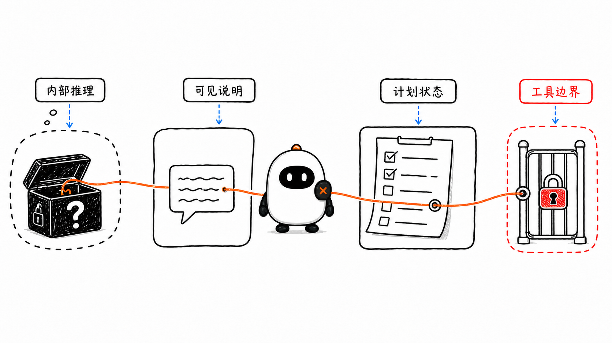
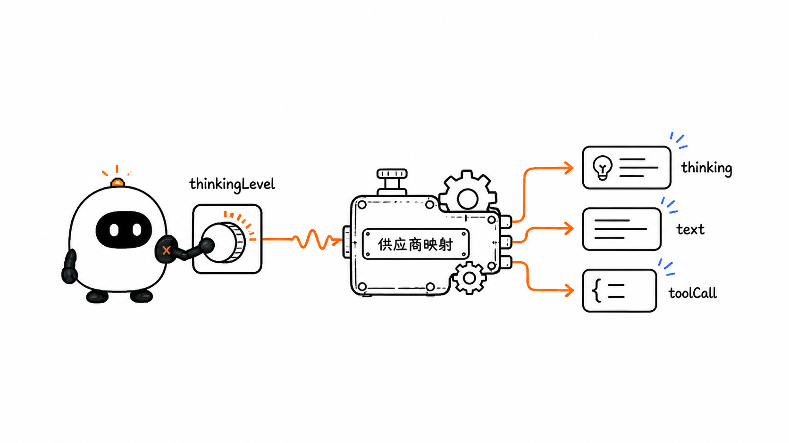
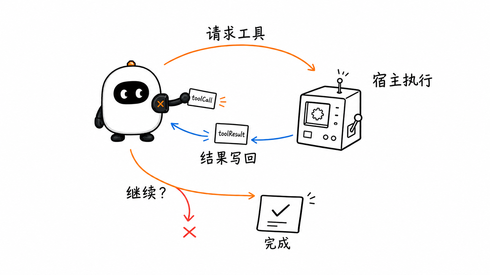
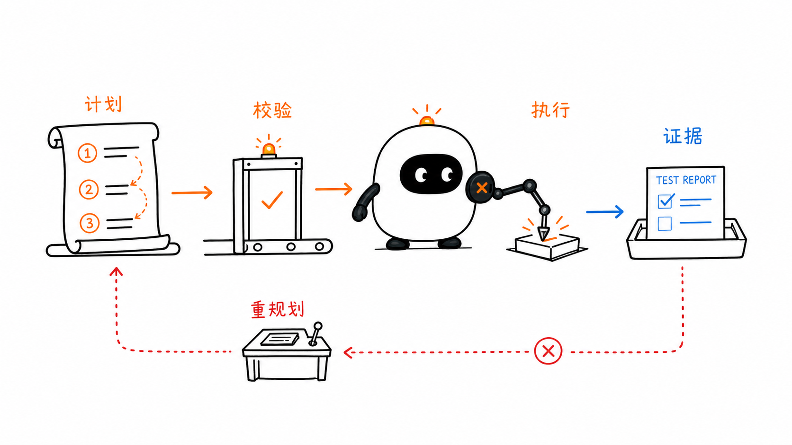
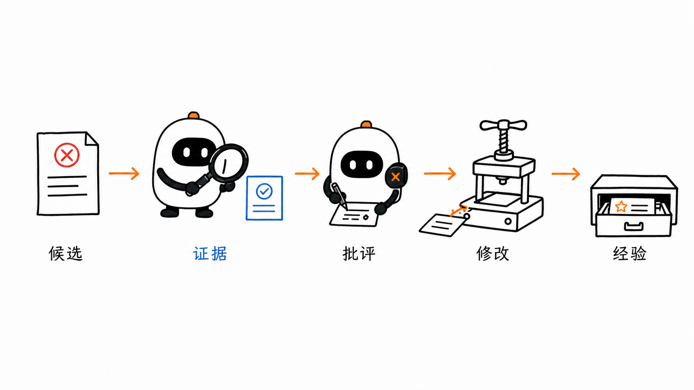
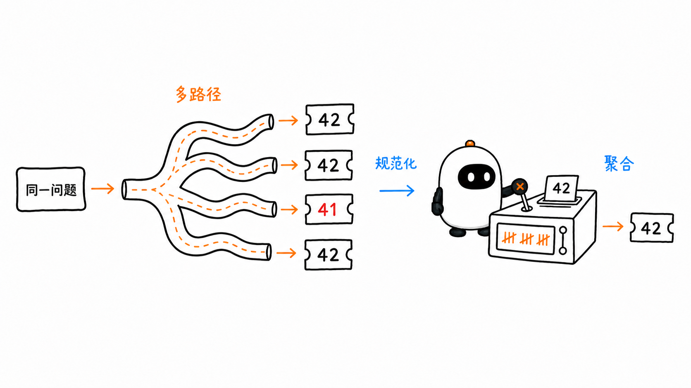
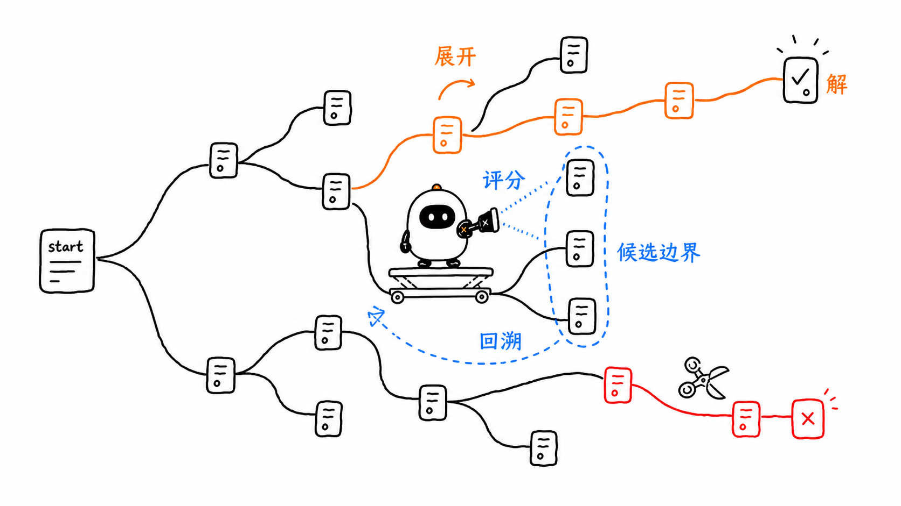
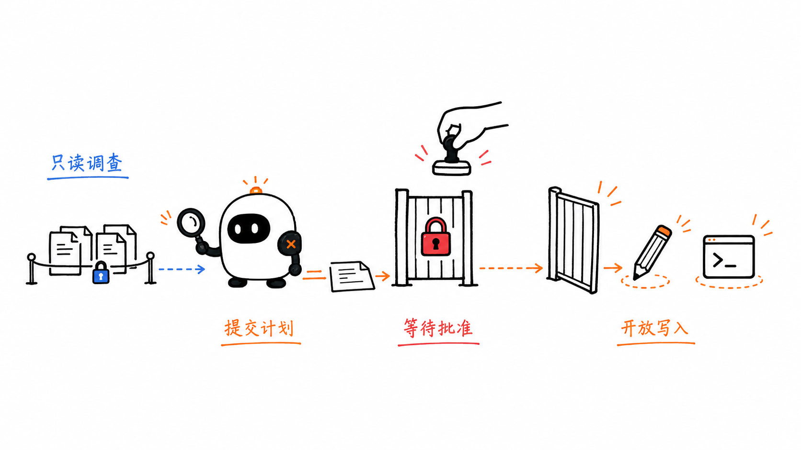

# Planning 与 Reasoning Patterns：模型怎样形成、执行和修正行动方案

这是 learn-pi-agent 的第 12 章。前两章讨论了 Workflow 与 Agent 的边界，以及多个节点怎样连接。现在把视角放到一个节点内部：面对需要多步完成的任务，模型怎样决定下一步，应用又怎样把这种决定变成可检查、可执行、可修正的过程？

以“修复一个失败的测试”为例，系统里可能同时出现四种看起来都像“计划”的东西：

1. 模型在一次请求中投入更多计算，比较可能的修复方向；
2. 模型输出一段给用户看的分析或行动说明；
3. 应用保存一份包含步骤、依赖和状态的计划；
4. Harness 暂时只允许读取文件，等用户批准后再开放修改工具。

它们分别属于**模型推理、可见说明、计划状态和产品控制**。如果把四者混成一个概念，就很容易得出“模型想得更久，所以已经有可靠计划”或“界面显示 Plan Mode，所以不会产生副作用”之类的错误结论。



> **版本说明**：Pi 接口与行为对应源码基线 `086c32e74530564922d011ade23ff582c9d63116`。OpenAI、Anthropic 与 Claude Code 文档核对日期为 `2026-08-24`。论文中的方法用于解释设计空间；是否出现在 Pi 中，以固定源码为准。

## 1. 先把 Reasoning、Plan 和 Workflow 分开

下面这张表先给每个概念找准位置：

| 对象 | 发生在哪里 | 典型产物 | 谁能直接检查 | 是否直接产生副作用 |
| --- | --- | --- | --- | --- |
| 模型内部推理 | 模型推理过程 | reasoning tokens 或供应商内部状态 | 通常不能看到原始过程 | 否 |
| Reasoning Summary / Thinking Content | 模型 API 输出边界 | 摘要、thinking block | 应用可以读取供应商返回的部分 | 否 |
| 可见说明 | Assistant Text | 原因、方案说明、步骤列表 | 用户与应用 | 否 |
| Execution Plan | Harness State / Session | 结构化步骤、依赖、状态、证据 | 应用可以校验和持久化 | 本身不产生 |
| Workflow | 应用控制流 | Node、Transition、Gate | 代码与追踪系统 | 由节点决定 |
| Plan Mode | 产品与权限层 | 工具白名单、审批状态、计划文件 | Harness 与用户 | 应当限制或阻止写操作 |

一句话概括它们的关系：

```text
模型可以参与制定计划，
但计划必须由 Harness 保存和校验；
Workflow 决定计划怎样被执行，
Plan Mode 决定当前允许执行到哪一步。
```

### 1.1 “推理得更多”不等于“计划已经存在”

Reasoning model 可以在单次请求中使用更多推理 token，但这些计算不自动产生一份应用可恢复的计划。只有当 Harness 把目标、步骤、依赖、状态和证据保存为明确数据时，应用才真正拥有一个 Plan。

例如，下面这段自然语言看起来像计划：

```text
我会先检查测试，再修改实现，最后运行验证。
```

但它没有说明：

- 要检查哪个测试；
- 修改动作允许使用哪些 Tool；
- 哪一步依赖哪一步；
- 怎样判断验证通过；
- 中断后从哪里继续；
- 失败后是重试、改计划还是交给用户。

它可以作为计划草稿，却还不是可执行控制状态。

### 1.2 “输出了推理过程”也不等于“解释了真实因果”

Chain-of-Thought 论文展示了中间推理步骤在部分算术、常识和符号任务上的效果，但可见的推理文字不能自动视为模型内部计算的完整、忠实记录。后续研究发现，模型可能给出听起来合理、却没有反映真正影响答案因素的解释。

工程上更可靠的做法是把下面几类证据分开：

- 模型给出的理由；
- 实际 Tool Call 与 Tool Result；
- 测试、Schema 和业务规则的验证结果；
- 文件 diff、日志和外部事实来源；
- 人工批准或拒绝记录。

Reasoning 文本可以帮助理解和调试，但不能替代这些可验证证据。

### 1.3 隐式计划、可见计划与可执行计划

“隐式计划”通常是对模型行为的观察：模型似乎先形成了方向，再连续采取几步行动。但只要这个方向没有成为 Harness 中的明确对象，应用就无法可靠地读取、校验、暂停或恢复它。

可以把计划按可操作程度分成三层：

| 层次 | 例子 | 应用能做什么 |
| --- | --- | --- |
| 隐式方向 | 模型在内部决定先搜索再修改 | 只能从后续输出和动作推测 |
| 可见计划 | Assistant Text 中的步骤列表 | 能展示和讨论，结构仍可能不稳定 |
| 可执行计划 | 经过 Schema 校验的 `ExecutionPlan` | 能保存、审批、调度、更新与恢复 |

显式不等于可靠：一份写出来的错误计划仍然是错误计划。它的价值在于让错误进入可检查的边界，而不是自动消除错误。

## 2. Pi 怎样表示模型推理

Pi 在 `pi-ai` 中为不同供应商提供统一的思考强度与内容类型。固定源码中的核心类型可以简化为：

```ts
type ThinkingLevel =
  | "minimal"
  | "low"
  | "medium"
  | "high"
  | "xhigh"
  | "max";

type ModelThinkingLevel = "off" | ThinkingLevel;

interface ThinkingContent {
  type: "thinking";
  thinking: string;
  thinkingSignature?: string;
  redacted?: boolean;
}

interface AssistantMessage {
  role: "assistant";
  content: (TextContent | ThinkingContent | ToolCall)[];
  stopReason: StopReason;
  usage: Usage;
}
```

`ThinkingLevel` 表示请求模型投入多少推理资源；`ThinkingContent` 表示 Provider 实际返回并被 Pi 统一后的 thinking 内容。两者不是同一个对象：设置了较高 level，不保证一定得到一段可见 thinking 文本；得到 thinking block，也不代表它是未删减的原始推理。



### 2.1 `thinkingLevel` 会经过模型能力映射

Pi 的 Agent State 保存 `thinkingLevel`。创建模型请求时，`off` 被转换为不传 reasoning，其他值进入 `SimpleStreamOptions.reasoning`：

```ts
return {
  model: this._state.model,
  reasoning:
    this._state.thinkingLevel === "off"
      ? undefined
      : this._state.thinkingLevel,
  // 其余 AgentLoopConfig 字段省略
};
```

真实源码还会根据当前模型支持的级别进行 clamp，并由 Provider Adapter 转换为对应 API 的参数。不同模型可能只支持其中一部分级别，所以 `high` 是 Pi 的统一请求语义，不是所有供应商都完全相同的底层数值。

Pi SDK 可以这样指定或切换强度：

```ts
const { session } = await createAgentSession({
  modelRuntime,
  thinkingLevel: "high",
});

session.setThinkingLevel("medium");
```

提高强度通常会增加 token、延迟和费用，是否改善任务成功率要用实际任务集评估，不能从 level 名称直接推断。

### 2.2 OpenAI 与 Anthropic 返回的“思考”并不相同

当前 OpenAI Responses API 的 reasoning tokens 不通过 API 暴露原始文本，但可以按模型能力请求 reasoning summary；reasoning tokens 仍占用上下文并计入输出 token。Anthropic Messages API 则使用 thinking content block，并可能返回总结、空内容加签名、被遮蔽内容或供应商允许的其他表示；多轮 Tool Use 还可能要求原样回传 thinking block 以维持连续性。

Pi 的统一类型解决的是**传输与程序处理**问题，不会把不同供应商的透明度语义变成完全一致。应用展示 `ThinkingContent` 时，应把它描述为“Provider 返回的 thinking 内容或摘要”，而不是统一称为“模型完整思维链”。

### 2.3 `thinking_delta` 是流式事件，不是计划状态

Pi 可以在模型流式响应期间发出：

```ts
session.subscribe((event) => {
  if (
    event.type === "message_update" &&
    event.assistantMessageEvent.type === "thinking_delta"
  ) {
    process.stdout.write(event.assistantMessageEvent.delta);
  }
});
```

这段代码只把 Provider 已返回的增量交给界面。即使界面把它显示成“正在思考”，也没有创建步骤状态、依赖关系或批准 Gate。

## 3. ReAct：在行动和观察之间反复决策

ReAct 论文把 Reasoning 与 Acting 交错起来：模型根据当前信息选择 Action，环境执行后返回 Observation，模型再据此更新判断。它解决的关键问题不是“先写一份完整计划”，而是**让下一步能够利用刚刚获得的环境反馈**。

论文常用下面的表示：

```text
Thought → Action → Observation → Thought → ... → Answer
```

现代 Tool Calling 系统不一定输出字面上的 `Thought:`、`Action:` 和 `Observation:`。在 Pi 中，更准确的运行映射是：

```text
AssistantMessage 中的 ToolCall
        ↓
宿主校验并执行 Tool
        ↓
ToolResultMessage 写回 Context
        ↓
模型读取新 Context，决定下一步
```



### 3.1 Pi 的 Agent Loop 是 ReAct-like，而不是论文模板的复制品

Pi 真实循环会从 Assistant Message 中筛选 `toolCall`，执行工具并把 `ToolResultMessage` 写回上下文。这个“行动—观察—再决策”的结构与 ReAct 相似，但 Pi 还处理：

- Provider 的结构化 Tool Call；
- 参数校验与工具不存在；
- 并行或顺序执行；
- 取消、错误和输出截断；
- steering 与 follow-up 消息；
- 事件流和 Session 状态。

因此，称它为 **ReAct-like trajectory** 比说“Pi 实现了 ReAct 论文算法”更准确。

### 3.2 ReAct 适合什么时候

ReAct 适合下一步强烈依赖新观察的任务，例如：

- 先搜索文件，再根据命中位置决定读哪些内容；
- 运行测试后，根据错误信息选择修复位置；
- 调用 API 后，根据真实返回决定后续参数；
- 浏览页面时，根据当前界面决定下一次交互。

它的代价是模型会频繁进入决策循环。长任务可能出现局部试错很多、全局目标逐渐模糊、Context 不断增长的问题。这时可以在外层增加显式 Plan、Checkpoint 和预算，但不是每次简单工具调用都需要先生成完整计划。

## 4. Plan-and-Execute：先保存行动方案，再逐步执行

Plan-and-Execute 把“制定方案”和“执行步骤”分成两个阶段：

```text
Task → Planner → Validated Plan → Executor → Evidence
                              ↘ 失败或环境变化 → Replanner
```

这里的 Plan 不是一段装饰性文字，而是 Harness 中可以读取、校验和更新的状态。



### 4.1 Plan-and-Solve 与 Plan-and-Execute 不是同一层

Plan-and-Solve 论文提出的是一种 Prompting 方法：让模型先为推理题列出解决方案，再按方案完成推导。Plan-and-Execute 在 Agent 工程中通常指一种运行结构：Planner 产生计划状态，Executor 通过 Tool 或环境动作逐步执行，Harness 保存证据，并在需要时 Replan。

两者都使用“先计划、后处理”的思想，但前者可以发生在一次模型回答内部，后者跨越模型、状态、Tool 和控制流。引用 Plan-and-Solve 论文可以理解计划式提示的研究背景，不能用它证明某个 Agent Framework 已经实现可恢复的 Plan Executor。

### 4.2 一个最小计划契约

下面是教学用的计划类型，名称对应真实工程职责：

```ts
type PlanStepStatus =
  | "pending"
  | "running"
  | "succeeded"
  | "failed"
  | "blocked";

type PlanStep = {
  id: string;
  goal: string;
  dependsOn: string[];
  allowedTools: string[];
  successCriteria: string[];
  status: PlanStepStatus;
};

type ExecutionPlan = {
  objective: string;
  assumptions: string[];
  steps: PlanStep[];
};
```

每个字段都对应一个控制问题：

- `goal` 说明这一步要改变什么；
- `dependsOn` 决定何时可以开始；
- `allowedTools` 限制执行能力；
- `successCriteria` 规定什么证据才算完成；
- `status` 由 Harness 根据运行结果更新。

模型可以生成这些字段，但程序仍要检查步骤数量、ID 唯一性、依赖是否存在、是否成环、Tool 是否允许，以及成功标准是否为空。

### 4.3 用 Pi Session 生成只读计划

Pi 固定版本没有内置 Plan Mode，但 SDK 允许应用创建只启用读取工具的 Session。下面使用的 `createAgentSession()`、`ModelRuntime`、`SessionManager.inMemory()`、`session.prompt()`、`session.messages` 和 `session.dispose()` 都是 Pi 的真实接口；`latestAssistantText()` 与 `parseExecutionPlan()` 是应用自己的边界代码。

先实现运行时校验。下面的函数检查对象形状、字段类型、步骤状态、ID、依赖、Tool 白名单和循环依赖；业务系统还应继续限制步骤数量、文字长度和总预算。

```ts
function isRecord(value: unknown): value is Record<string, unknown> {
  return typeof value === "object" && value !== null && !Array.isArray(value);
}

function readStrings(value: unknown, label: string): string[] {
  if (!Array.isArray(value) || !value.every((item) => typeof item === "string")) {
    throw new Error(`${label} 必须是 string[]`);
  }
  return value;
}

function parseExecutionPlan(
  text: string,
  permittedTools: ReadonlySet<string>,
): ExecutionPlan {
  const raw: unknown = JSON.parse(text);
  if (
    !isRecord(raw) ||
    typeof raw.objective !== "string" ||
    raw.objective.trim() === ""
  ) {
    throw new Error("Plan 缺少 objective");
  }
  if (!Array.isArray(raw.steps) || raw.steps.length === 0) {
    throw new Error("Plan 至少需要一个 step");
  }

  const steps: PlanStep[] = raw.steps.map((value, index) => {
    if (!isRecord(value)) throw new Error(`steps[${index}] 不是对象`);
    if (
      typeof value.id !== "string" ||
      value.id.trim() === "" ||
      typeof value.goal !== "string" ||
      value.goal.trim() === ""
    ) {
      throw new Error(`steps[${index}] 缺少 id 或 goal`);
    }

    const dependsOn = readStrings(value.dependsOn, `steps[${index}].dependsOn`);
    const allowedTools = readStrings(
      value.allowedTools,
      `steps[${index}].allowedTools`,
    );
    const successCriteria = readStrings(
      value.successCriteria,
      `steps[${index}].successCriteria`,
    );
    if (successCriteria.length === 0) {
      throw new Error(`${value.id} 至少需要一个 successCriteria`);
    }

    if (value.status !== "pending") {
      throw new Error(`新计划中的 ${value.id} 必须从 pending 开始`);
    }
    if (allowedTools.some((tool) => !permittedTools.has(tool))) {
      throw new Error(`${value.id} 请求了未允许的 Tool`);
    }

    return {
      id: value.id,
      goal: value.goal,
      dependsOn,
      allowedTools,
      successCriteria,
      status: "pending",
    };
  });

  const byId = new Map(steps.map((step) => [step.id, step] as const));
  if (byId.size !== steps.length) throw new Error("PlanStep id 必须唯一");

  const visiting = new Set<string>();
  const visited = new Set<string>();
  const visit = (id: string): void => {
    if (visited.has(id)) return;
    if (visiting.has(id)) throw new Error("Plan 存在循环依赖");
    visiting.add(id);

    for (const dependency of byId.get(id)!.dependsOn) {
      if (!byId.has(dependency) || dependency === id) {
        throw new Error(`${id} 的依赖不合法`);
      }
      visit(dependency);
    }

    visiting.delete(id);
    visited.add(id);
  };
  for (const id of byId.keys()) visit(id);

  return {
    objective: raw.objective,
    assumptions: readStrings(raw.assumptions, "assumptions"),
    steps,
  };
}
```

```ts
import type { AgentMessage } from "@earendil-works/pi-agent-core";
import {
  createAgentSession,
  ModelRuntime,
  SessionManager,
} from "@earendil-works/pi-coding-agent";

function latestAssistantText(messages: AgentMessage[]): string {
  for (let index = messages.length - 1; index >= 0; index -= 1) {
    const message = messages[index];
    if (message.role !== "assistant") continue;
    if (message.stopReason !== "stop") {
      throw new Error(
        message.errorMessage ?? `Planner 未完整结束：${message.stopReason}`,
      );
    }

    return message.content
      .filter((item) => item.type === "text")
      .map((item) => item.text)
      .join("");
  }

  throw new Error("Planner 没有返回 Assistant Message");
}

async function createPlan(
  task: string,
  cwd: string,
  modelRuntime: ModelRuntime,
): Promise<ExecutionPlan> {
  const { session } = await createAgentSession({
    cwd,
    modelRuntime,
    thinkingLevel: "high",
    sessionManager: SessionManager.inMemory(cwd),
    tools: ["read", "grep", "find", "ls"],
  });

  try {
    await session.prompt(`
请先调查项目，再为下面的任务生成执行计划：
${task}

只返回符合 ExecutionPlan 结构的 JSON。
不要把步骤标记为 succeeded；不要虚构已经运行的测试。
`);

    const text = latestAssistantText(session.messages);
    return parseExecutionPlan(
      text,
      new Set(["read", "grep", "find", "ls", "bash", "edit", "write"]),
    );
  } finally {
    session.dispose();
  }
}
```

这里有三个容易忽略的事实：

1. `thinkingLevel: "high"` 只是请求较高推理强度，不负责验证 Plan；
2. `tools` 白名单限制该 Session 能调用的工具，才形成只读能力边界；
3. `parseExecutionPlan()` 必须真实解析和校验，TypeScript 返回类型不会自动验证模型 JSON。

`parseExecutionPlan()` 中的 `permittedTools` 描述后续执行器允许使用的工具目录，所以可以包含 `edit`、`write` 等写工具；规划 Session 自己仍只有 `read`、`grep`、`find` 和 `ls`，不能在调查阶段执行这些动作。

### 4.4 Executor 不应让模型自己宣布成功

执行阶段至少要保存下面的结果：

```ts
type StepResult = {
  stepId: string;
  status: "succeeded" | "failed" | "blocked";
  output: string;
  evidence: string[];
};
```

例如“运行测试”步骤只有在测试进程退出码、测试报告或明确错误被 Harness 捕获后，才能被标记为 `succeeded` 或 `failed`。模型输出“测试应该已经通过”不能代替执行证据。

### 4.5 什么时候需要 Replan

下面几类变化可能使原计划失效：

- 文件结构和 Planner 调查时不同；
- 某个步骤失败，后续前提不再成立；
- 用户增加约束或拒绝批准；
- 预算、权限或外部服务发生变化；
- 执行证据揭示了新的根因。

Replan 应接收**原目标、当前计划、已完成步骤、失败证据和剩余预算**，而不是从空白 Context 再猜一次。已成功且仍然有效的步骤不应无条件重跑，尤其当它们包含不可逆副作用时。

## 5. Reflection、Critic、Self-Refine 与 Reflexion

这些词经常被统称为“反思”，但它们描述的对象不同。

| 概念 | 核心动作 | 反馈从哪里来 | 是否跨试次保存 |
| --- | --- | --- | --- |
| Critic | 对候选结果给出结构化评价 | 同一模型、另一模型、规则或人 | 不一定 |
| Reflection | 根据结果和反馈总结错误与改进方向 | 运行证据加模型分析 | 不一定 |
| Self-Refine | 生成 → 自反馈 → 修改，循环迭代 | 论文中可由同一 LLM 承担三种角色 | 通常在当前任务内 |
| Reflexion | 把语言形式的反思写入 episodic memory，影响后续 trial | 外部或内部反馈信号 | 是 |



### 5.1 Critic 是角色，不是正确性来源

一个可执行 Critic 至少需要结构化输出：

```ts
type Critique = {
  verdict: "pass" | "revise" | "cannot_verify";
  issues: Array<{
    criterion: string;
    evidence: string;
    suggestion: string;
  }>;
};
```

`cannot_verify` 很重要。没有测试结果、原始资料或运行权限时，Critic 应能明确表示无法验证，而不是被迫在 `pass` 与 `revise` 之间猜测。

如果生成者和 Critic 使用同一模型、同一 Context、同一错误前提，它们的错误高度相关。更换角色提示并不会自动产生独立证据。能用编译器、测试、Schema、数据库约束或人工判断的地方，应优先把这些信号送给 Critic。

### 5.2 Reflection 要绑定真实反馈

有效 Reflection 可以回答四个问题：

1. 目标是什么；
2. 实际发生了什么；
3. 哪条证据说明结果偏离目标；
4. 下一次具体改变什么。

下面这种内容信息量很低：

```text
上次做得不够好，下次要更仔细。
```

更有用的反思会绑定证据：

```text
测试 `session restores tool result` 失败，因为恢复后的消息缺少 toolCallId。
下一次先追踪 SessionEntry 到 ToolResultMessage 的映射，再修改序列化代码。
```

### 5.3 Self-Refine 是当前任务内的改写循环

Self-Refine 论文使用同一 LLM 产生初稿、反馈和修订，并在多类任务中测试这种循环。工程实现仍然需要最大次数、通过条件、最佳候选和停止原因；模型不断改写不保证单调变好。

它与上一章 Evaluator-Optimizer 的关系是：

- Evaluator-Optimizer 描述**两个节点怎样连成循环**；
- Self-Refine 描述**反馈与修改由同一模型自举产生的一种实例**。

### 5.4 Reflexion 不是微调模型

Reflexion 论文不通过更新模型权重来学习，而是把语言形式的反思保存在 episodic memory 中，供后续 trial 使用。它需要区分：

- 原始失败证据；
- 根据证据生成的反思；
- 反思适用的任务范围；
- 后续运行是否真的因这条反思而改善。

错误反思也会污染后续决策，因此写入长期 Memory 前应进行验证、去重、过期处理和作用域限制。

## 6. Self-Consistency：采样多条路径，再聚合答案

Self-Consistency 不是“让模型检查自己一遍”。原论文把它定义为一种解码策略：对同一问题采样多条不同的 Chain-of-Thought 路径，再通过答案一致性选择结果。

```text
同一问题
  ├─ 路径 A → 答案 42
  ├─ 路径 B → 答案 42
  ├─ 路径 C → 答案 41
  └─ 路径 D → 答案 42
              ↓
       规范化与聚合 → 42
```



### 6.1 它与 Parallel Voting 的联系和区别

从应用控制流看，Self-Consistency 可以用“并行生成 + fan-in 聚合”实现，所以外形接近上一章的 Parallel Voting。区别在研究假设和聚合对象：

- Self-Consistency 针对同一问题的多条推理路径；
- 聚合的是规范化后的最终答案，而不是“哪段解释写得更像”；
- 它最适合答案可以明确比较的任务；
- `k` 次采样大约带来 `k` 倍模型调用成本，是否并行只改变墙钟时间，不消除 token 成本。

### 6.2 多数票不保证正确

如果所有样本都依赖同一个错误事实、相同提示偏差或相同工具结果，多数票可能稳定地选中错误答案。工程实现应额外检查：

- 样本是否真的具有差异；
- 答案怎样规范化；
- 平票怎样处理；
- 是否存在可直接验证的外部判据；
- 聚合前是否应过滤无效或未完成响应。

对于开放式文章、代码补丁或设计方案，“相同答案”的定义并不清晰，此时更适合使用测试、rubric、pairwise comparison 或人工选择，而不是硬套多数票。

## 7. Tree of Thoughts：把候选路径变成显式搜索

Tree of Thoughts（ToT）把一个中间“thought”当作可扩展的搜索状态。系统在每一层生成多个候选，评价它们，保留一部分继续展开，并允许回溯。

它至少包含四类操作：

1. **Expand**：从当前状态生成多个下一步候选；
2. **Evaluate**：估计候选是否有希望；
3. **Select**：按 beam、BFS、DFS 或其他策略选择 frontier；
4. **Stop / Backtrack**：找到答案、耗尽预算或回到其他分支。



### 7.1 一份分层提纲不是 Tree of Thoughts

如果模型只输出：

```text
方案 A
方案 B
方案 C
```

这只是候选列表。只有应用真正保存节点、父子关系、评分、frontier 和预算，并按搜索策略继续展开或回溯时，才形成 ToT 式搜索。

一个最小搜索状态可以表示为：

```ts
type ThoughtNode = {
  id: string;
  parentId?: string;
  state: string;
  score?: number;
  depth: number;
  status: "frontier" | "expanded" | "pruned" | "solution";
};
```

这里的 `state` 是为解决任务而设计的中间表示，不应默认等同于供应商隐藏的原始 Chain-of-Thought。应用可以让模型生成简洁候选、代码状态、棋局状态或计划片段，再由外部控制器搜索。

### 7.2 ToT 的真正成本在搜索宽度

假设每个节点生成 `b` 个候选，搜索深度为 `d`，不剪枝时节点数量会快速增长。实际系统必须设置：

- 最大深度；
- 每层保留数量；
- 总模型调用或 token 预算；
- 重复状态检测；
- 可验证的终止条件；
- evaluator 误判后的回退策略。

ToT 适合初始选择会强烈影响后续、且存在可评分中间状态的任务，例如组合搜索、规划题或需要比较多个设计分支的问题。普通问答和线性编码任务通常先从 ReAct 或单一显式 Plan 开始。

## 8. Plan Mode：Harness 的能力边界与批准流程

Plan Mode 是产品功能，不是一种模型推理算法。它通常把一次任务分成：

```text
调查 → 提交计划 → 等待批准 → 开放执行能力 → 实施
```

以 Claude Code 当前文档为例，Plan Mode 允许读取和探索，阻止编辑源文件，计划经用户批准后才切换到执行所需的 permission mode。这里真正起作用的是权限状态和 Tool Policy，不是模型在文字中承诺“我现在只规划”。



### 8.1 Pi 怎样把 Plan Mode 留给 Extension

本章源码基线中的 Pi Coding Agent README 明确写着：核心不内置 Plan Mode；可以把计划写入文件、用 Extension 构建，或安装第三方 Package。这个取舍与 Pi 的总体哲学一致：核心保持精简，让不同使用者自己决定规划界面、审批和权限边界。

同一仓库还提供了 `examples/extensions/plan-mode`，展示怎样用现有扩展点组装这种产品能力。这个示例会：

- 调用 `pi.setActiveTools()`，在规划阶段关闭内置 `edit` 与 `write`；
- 保留 `bash`，同时在 `tool_call` 事件中用只读命令白名单拦截危险命令；
- 在 `before_agent_start` 注入规划阶段或执行阶段的上下文；
- 从 Assistant Text 提取编号步骤，并在 `agent_end` 让用户选择执行、继续规划或修改计划；
- 把模式、步骤与进度保存为 Extension State，使恢复后的界面能够重建状态。

这段示例说明 Plan Mode 需要同时改变工具、事件、状态和 UI，而不是只切换一条提示词。它仍是教学示例：计划由编号文本提取，完成进度依赖 `[DONE:n]` 标记；对高风险生产系统，还应把步骤、证据和审批保存为更严格的结构化记录。

上一节的只读 Session 展示了另一种应用集成方式。无论使用独立 Session 还是 Extension，完整产品都需要：

- `mode: "planning" | "awaiting_approval" | "executing"` 状态；
- 规划阶段的工具白名单；
- 计划的结构化存储与版本号；
- 用户批准、拒绝和修改事件；
- 批准后重新计算的 Tool Policy；
- 执行时对计划漂移的检测；
- Session 日志中的审批证据。

### 8.2 “只读”也要定义范围

读取文件不会修改仓库，但仍可能读取密钥、个人数据或不在任务范围内的内容。某些 Shell 命令看起来用于调查，也可能产生网络请求、写缓存或执行项目脚本。因此 Plan Mode 的策略应明确：

- 允许读取哪些根目录；
- 是否允许网络访问；
- 是否允许 Shell，以及哪些命令属于只读；
- Extension 和 MCP Tool 是否被纳入白名单；
- 计划中能否包含高风险动作；
- 批准的是整份计划、单个步骤还是一次具体 Tool Call。

### 8.3 批准计划不等于批准所有未来参数

用户批准“更新依赖”时，不能自动推导出其批准删除任意文件、上传源码或执行任意安装脚本。计划批准与工具调用批准可以形成两层 Gate：

```text
批准行动方向
    ↓
执行到具体高风险 Tool Call
    ↓
展示真实参数并再次批准
```

第 16 章会把这种暂停、批准和恢复放入 Durable Execution；第 17 章再讨论最小权限、Prompt Injection 和审计。

## 9. 这些 Pattern 怎样组合

复杂任务通常不是在 ReAct、Plan-and-Execute、Reflection、Self-Consistency 和 ToT 中只选一个。它们可以处在不同层：

```text
Plan Mode
└─ 用户批准 Execution Plan
   ├─ Step 1：固定 Workflow 调查项目
   ├─ Step 2：Pi Agent 用 ReAct-like Tool Loop 修复问题
   ├─ Step 3：测试作为外部 Critic
   └─ 失败时：Reflection → Replan → 继续执行
```

这里：

- Plan Mode 控制什么时候允许写；
- Execution Plan 保存跨步骤状态；
- Workflow 调度步骤与 Gate；
- Pi Agent Loop 在某一步内部动态选择 Tool；
- 测试提供外部反馈；
- Reflection 把失败证据转换为下一次调整；
- Replanner 只修改尚未完成且受影响的部分。

这套分层比“让模型先想一想，然后自己完成”更容易恢复、审计和评测。

## 10. 怎样选择合适的方法

| 任务特征 | 优先考虑 | 不要忽略 |
| --- | --- | --- |
| 下一步依赖实时 Tool Result | ReAct-like Agent Loop | 轮次、Context、失败与 Tool Policy |
| 长任务需要看得见、能恢复的阶段 | Plan-and-Execute | Plan Schema、依赖、证据与 Replan |
| 有明确反馈，可据此改写候选 | Critic / Reflection / Self-Refine | 外部验证、最佳候选与硬上限 |
| 同一问题可产生可比较的明确答案 | Self-Consistency | 样本差异、规范化与调用成本 |
| 必须探索多个中间分支并回溯 | Tree of Thoughts | frontier、剪枝、搜索预算与评分误差 |
| 修改前需要调查和人工批准 | Plan Mode | 真正的工具限制与审批状态 |
| 只是简单、低风险的一步任务 | 一次模型调用或短 Agent Run | 不必为热词增加无用层次 |

更复杂的 Pattern 应解决一个已经观察到的问题：例如 ReAct 在长任务中失去全局方向，才加入显式 Plan；初稿经常违反明确 rubric，才加入 Critic；单一路径在组合搜索中容易过早承诺，才考虑 ToT。

## 11. 七个常见误解

### 11.1 “Reasoning level 越高，答案一定越正确”

更高 level 通常意味着更多推理资源，也意味着更高延迟和费用。具体任务是否受益必须通过评测确认。

### 11.2 “ThinkingContent 就是模型完整思维链”

它是 Pi 对 Provider 返回内容的统一表示。上游可能返回摘要、遮蔽内容、签名或不返回可见文本。

### 11.3 “ReAct 必须把 Thought 全部打印出来”

工程系统可以使用结构化 Tool Call、Tool Result 和必要的简洁说明完成行动—观察循环，无需把供应商的原始内部推理暴露给用户。

### 11.4 “模型列了步骤，就已经实现 Plan-and-Execute”

没有结构化状态、依赖校验、执行证据和状态更新，步骤列表仍只是文本。

### 11.5 “Self-Reflection 能发现模型自己的所有错误”

同一模型可能重复同一错误。外部测试、规则、资料和人工反馈能提供不同来源的证据。

### 11.6 “多采样以后多数票一定更可靠”

相关错误会一起被重复。Self-Consistency 需要可比较答案和合适的任务分布，不是普遍正确性证明。

### 11.7 “Plan Mode 只需要一条 System Prompt”

文字约束不能替代 Tool Allowlist、文件作用域、审批状态和实际执行策略。

## 本章小结

- 模型内部推理、Provider 返回的 thinking、可见说明、Execution Plan、Workflow 与 Plan Mode 属于不同层；
- Pi 用 `thinkingLevel` 表示统一推理强度请求，用 `ThinkingContent` 和流式事件承接 Provider 返回内容；
- Provider 的透明度与参数语义不同，Pi 的统一类型不会把它们变成相同能力；
- ReAct 的核心是行动与观察交错，Pi 的结构化 Tool Loop 属于 ReAct-like trajectory；
- Plan-and-Execute 需要把步骤、依赖、Tool、成功标准、状态和证据保存为 Harness State；
- Critic 是评价角色，Reflection 是基于反馈形成的改进信息，Self-Refine 是任务内自反馈循环，Reflexion 会把语言反思写入跨 trial 记忆；
- Self-Consistency 采样多条路径并聚合可比较答案，不是普通“自查”；
- Tree of Thoughts 需要真实搜索控制器、frontier、评价、剪枝和回溯；
- Plan Mode 是权限与批准工作流。Pi 核心没有内置这一模式，但可用 SDK、Extension 或 Package 组装；
- 任何 Pattern 都要同时管理预算、停止、证据、失败和可观测状态。

## 下一章：Agent SDK 与应用集成

现在已经能解释模型调用、Agent Loop、能力接入、Workflow 和 Planning。下一章把这些部件装进真实应用：比较直接调用模型 API、Agent Runtime、Agent SDK 与 CLI，并用 Pi SDK 和 OpenAI Agents SDK 说明 Session、Streaming、事件、自定义 UI 与 Provider 边界。

## 参考资料

- [Pi `pi-ai/src/types.ts`：ThinkingLevel、ThinkingContent 与 AssistantMessage](https://github.com/earendil-works/pi/blob/086c32e74530564922d011ade23ff582c9d63116/packages/ai/src/types.ts)
- [Pi `pi-agent-core/src/agent.ts`：thinkingLevel 怎样进入 AgentLoopConfig](https://github.com/earendil-works/pi/blob/086c32e74530564922d011ade23ff582c9d63116/packages/agent/src/agent.ts)
- [Pi `agent-loop.ts`：Tool Call、Tool Result 与下一轮](https://github.com/earendil-works/pi/blob/086c32e74530564922d011ade23ff582c9d63116/packages/agent/src/agent-loop.ts)
- [Pi SDK：`createAgentSession()`、工具白名单与 Session](https://github.com/earendil-works/pi/blob/086c32e74530564922d011ade23ff582c9d63116/packages/coding-agent/docs/sdk.md)
- [Pi Coding Agent README：核心不内置 Plan Mode](https://github.com/earendil-works/pi/blob/086c32e74530564922d011ade23ff582c9d63116/packages/coding-agent/README.md)
- [Pi Plan Mode Extension 示例：工具切换、命令拦截、状态与批准界面](https://github.com/earendil-works/pi/tree/086c32e74530564922d011ade23ff582c9d63116/packages/coding-agent/examples/extensions/plan-mode)
- [OpenAI：Reasoning models](https://developers.openai.com/api/docs/guides/reasoning)
- [Anthropic：Thinking](https://platform.claude.com/docs/en/build-with-claude/thinking)
- [Claude Code：Permission modes 与 Plan Mode](https://code.claude.com/docs/en/permission-modes)
- [Chain-of-Thought Prompting Elicits Reasoning in Large Language Models](https://arxiv.org/abs/2201.11903)
- [ReAct: Synergizing Reasoning and Acting in Language Models](https://arxiv.org/abs/2210.03629)
- [Plan-and-Solve Prompting](https://arxiv.org/abs/2305.04091)
- [Self-Consistency Improves Chain of Thought Reasoning](https://arxiv.org/abs/2203.11171)
- [Tree of Thoughts: Deliberate Problem Solving with Large Language Models](https://arxiv.org/abs/2305.10601)
- [Self-Refine: Iterative Refinement with Self-Feedback](https://arxiv.org/abs/2303.17651)
- [Reflexion: Language Agents with Verbal Reinforcement Learning](https://arxiv.org/abs/2303.11366)
- [Language Models Don't Always Say What They Think](https://arxiv.org/abs/2305.04388)
