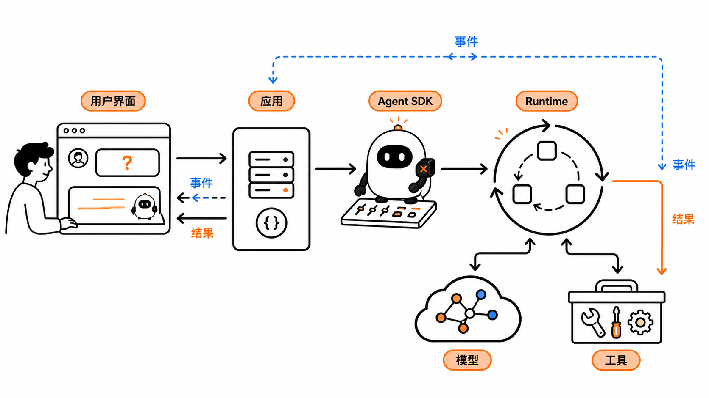
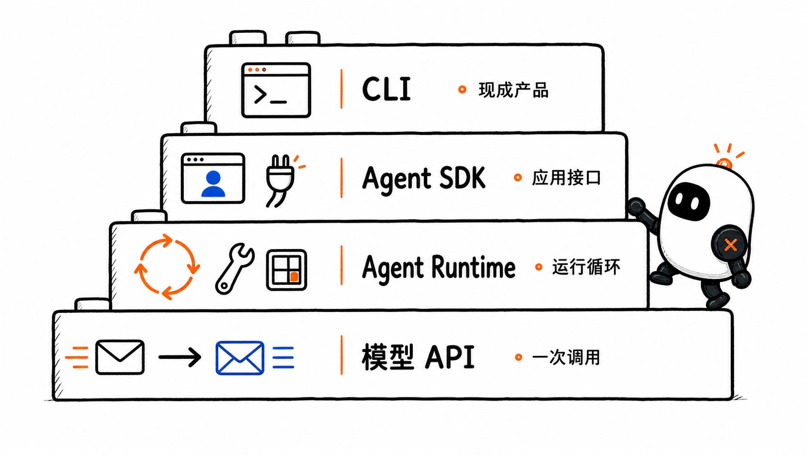
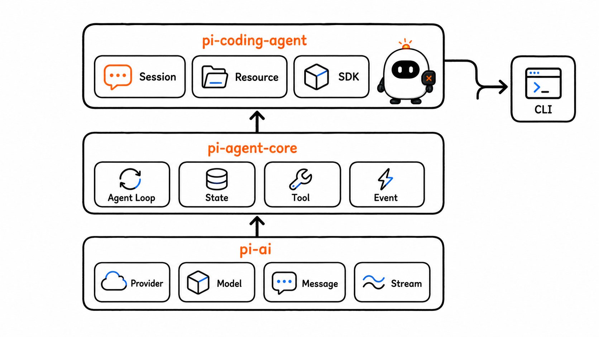
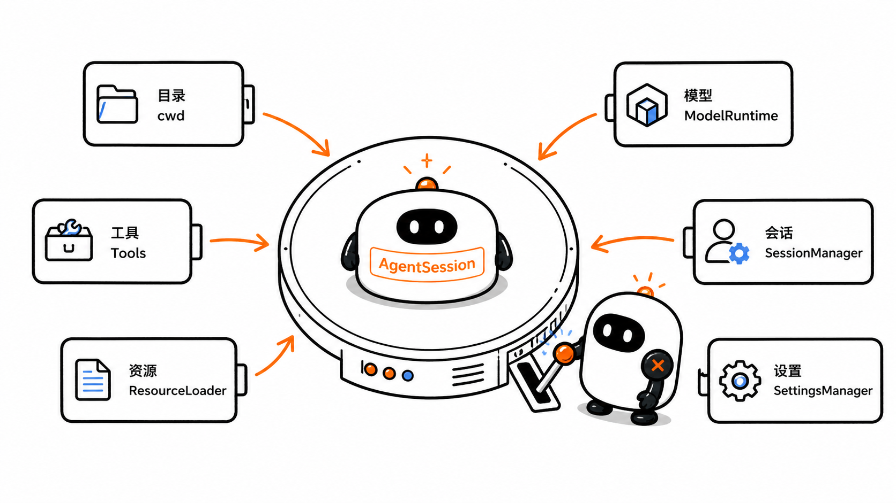
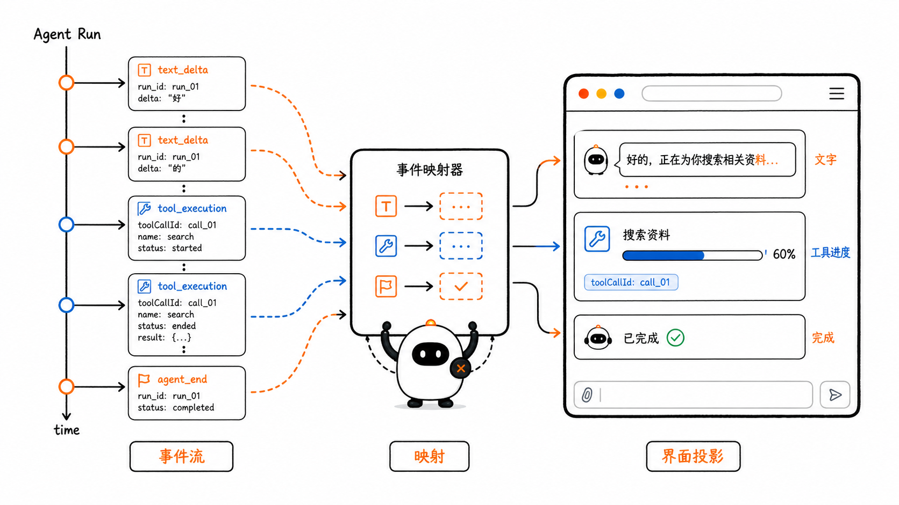
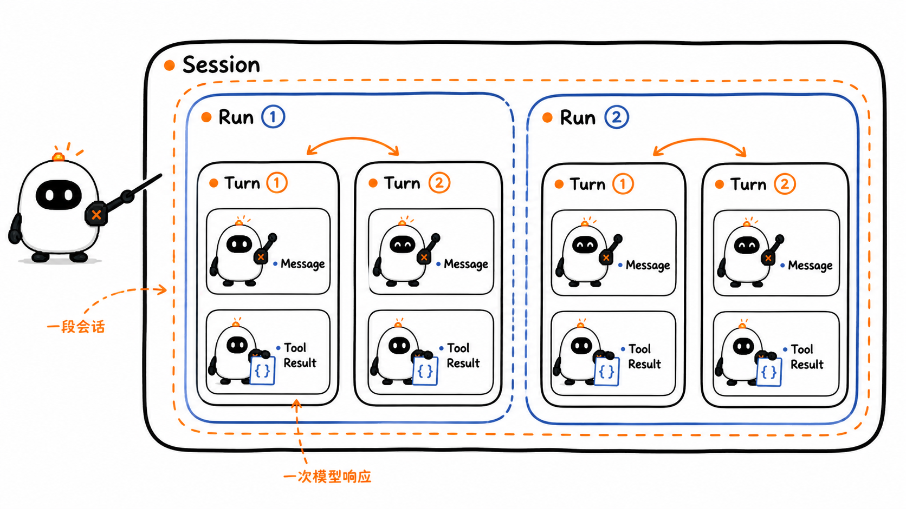
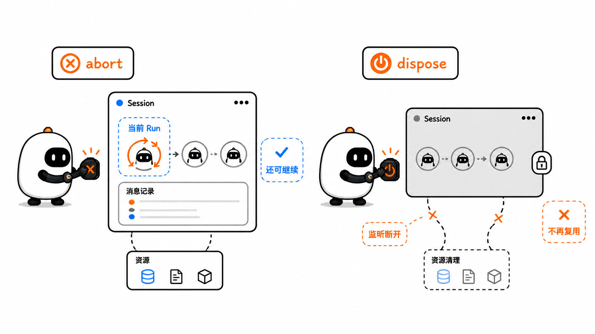
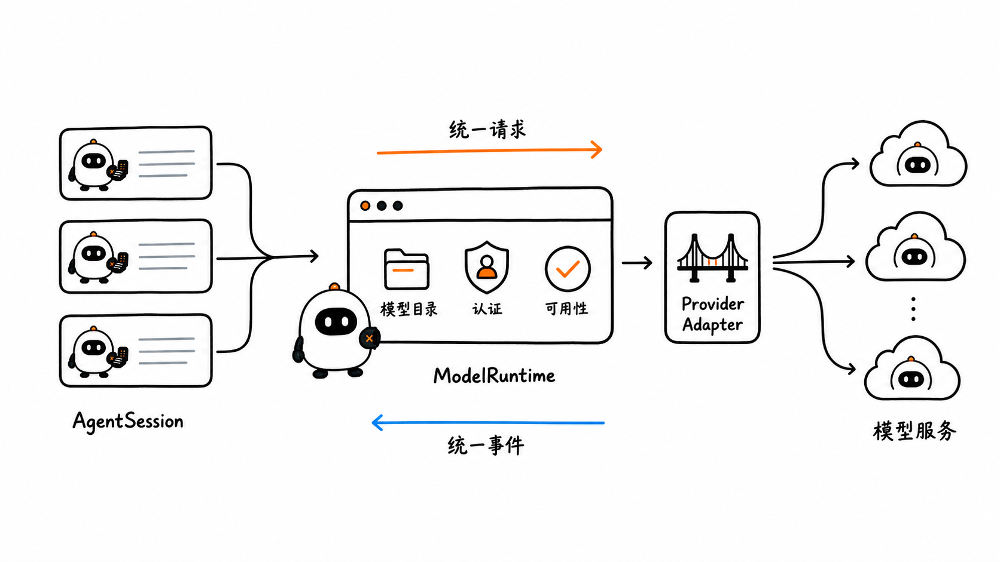
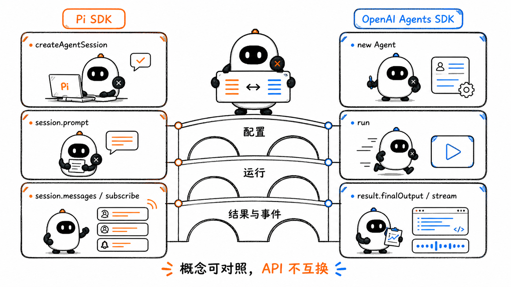

# Agent SDK 与应用集成：把 Agent 能力装进真实产品

这是 learn-pi-agent 的第 13 章。前面的章节已经拆开了模型调用、Agent Loop、工具、Session、Workflow 与 Planning。现在把这些部件放回一个真实应用：网页收到用户输入以后，怎样启动一次 Agent 运行、持续显示文本和工具进度、保存会话，并在用户取消时安全停止？

假设我们要做一个“仓库分析助手”。它需要读取项目文件、调用模型、把增量文本显示在页面上，并让同一位用户稍后继续对话。模型 API 能完成其中的一次请求，Agent Runtime 能推进工具循环，而一个可嵌入的 Agent SDK 还要给应用提供稳定的创建、订阅、会话、配置和清理接口。



> **版本说明**：Pi 接口与行为对应源码基线 `086c32e74530564922d011ade23ff582c9d63116`。OpenAI Agents SDK 文档核对日期为 `2026-08-24`。两个 SDK 的概念可以对照，但类型、返回值和生命周期不能互换。

## 1. 四种接入层次解决不同问题

“调用大模型”“运行 Agent”“使用 Agent SDK”和“打开 Agent CLI”经常被混在一起。判断它们的最好方法，是看应用还要自己负责多少工作。

| 接入层次 | 已经提供什么 | 应用仍要负责什么 | 适合的场景 |
| --- | --- | --- | --- |
| 模型 API / 模型 SDK | 请求模型、接收模型响应 | Tool Loop、状态、事件、会话和界面 | 一次生成、分类、抽取，或高度定制的底层实现 |
| Agent Runtime | Agent Loop、Tool 执行、运行状态和事件 | Provider、Session、资源加载、产品生命周期与界面装配 | 需要完全控制循环与状态语义的框架或基础设施 |
| Agent SDK | 可编程的 Agent、Session、事件、工具和配置入口 | 产品界面、用户体系、业务权限、部署与数据策略 | 把 Agent 嵌入网页、桌面应用、服务或 Workflow |
| CLI / 完整产品 | SDK 能力加现成界面、配置发现和交互方式 | 安装、使用与少量配置 | 人直接在终端里完成任务 |



### 1.1 模型 SDK 与 Agent SDK 不是一回事

第二章使用过 OpenAI 和 Anthropic 的语言 SDK。它们把 HTTP 请求包装成 TypeScript 或 Python 方法，例如 `client.responses.create(...)`。这仍然主要是一层**模型服务客户端**：应用要根据响应中的 Tool Call 执行工具、写回 Tool Result，并决定是否继续请求。

Agent SDK 的抽象单位通常是一整次 Agent Run。开发者声明 Agent、Tool、Session 或运行配置，SDK 推进多轮模型调用和工具执行，再把事件、状态或最终结果交给应用。

因此，判断一个库属于哪一层，不要只看名字里有没有 `SDK`，而要问：

1. 它是否推进 Tool Loop？
2. 它是否定义运行和停止生命周期？
3. 它是否保存或接收跨轮状态？
4. 它是否提供可供界面消费的事件？
5. 工具究竟由谁执行？

### 1.2 Agent SDK 是库边界，不是网络协议

SDK 是某种编程语言中的库接口。应用把它作为依赖安装，再在同一进程或受控服务中调用。MCP、A2A 和 HTTP API 则定义不同组件之间怎样交换数据。

这意味着：

- 两个应用使用同一个 Agent SDK，不代表它们能直接互通；
- SDK 可以在内部调用多个网络 API，也可以连接 MCP Server；
- 应用可以在 SDK 外面再封装自己的 HTTP、SSE 或 WebSocket 接口；
- SDK 的对象不能自然跨进程，必须先转换成明确的协议消息。

### 1.3 CLI 是 SDK 的一种产品装配，不是更底层的接口

CLI 通常已经处理输入框、流式显示、键盘取消、配置文件、凭据、Session 列表和错误提示。它很适合人直接使用，却不适合作为网页后端的内部接口：解析终端文字会丢失结构化事件，也很难稳定管理多个用户的 Session。

如果目标是做自己的界面，应优先使用 Agent SDK 或 Runtime，而不是启动 CLI 后抓取 stdout。

## 2. Pi 的三个包怎样对应这四层

Pi 把模型访问、Agent Runtime 和完整 coding agent 分成三个主包：

| Pi 包 | 主要职责 | 应用看到的代表对象 |
| --- | --- | --- |
| `@earendil-works/pi-ai` | 统一 Provider、Model、Message、Tool 与流式模型事件 | `Model`、`Message`、`streamSimple()` |
| `@earendil-works/pi-agent-core` | Agent 状态、Agent Loop、Tool 执行与运行事件 | `Agent`、`AgentContext`、`AgentEvent` |
| `@earendil-works/pi-coding-agent` | Session、编码工具、资源发现、模型认证、SDK 与 CLI | `createAgentSession()`、`AgentSession`、`ModelRuntime` |



依赖方向可以简化成：

```text
自定义网页 / 桌面应用 / 自动化服务
                 │
                 ▼
     pi-coding-agent SDK ────── Pi CLI
                 │
                 ▼
           pi-agent-core
                 │
                 ▼
               pi-ai
                 │
                 ▼
       OpenAI / Anthropic / 其他 Provider
```

`pi-coding-agent` 同时包含 SDK 和 CLI。两者复用会话与运行能力，但入口不同：CLI 把它装配成现成终端产品，SDK 把同一能力交给你的代码。

## 3. `createAgentSession()` 装配了什么

Pi SDK 的主入口是 `createAgentSession()`。它创建的不是一条孤立模型请求，而是一份可运行的 `AgentSession`。

固定源码中的主要选项可以归为六组：

| 选项 | 决定什么 | 常见例子 |
| --- | --- | --- |
| 目录 | 在哪里工作、从哪里发现项目资源 | `cwd`、`agentDir` |
| 模型 | 使用哪个 Model、认证和思考强度 | `modelRuntime`、`model`、`thinkingLevel` |
| 工具 | 哪些内置或自定义 Tool 可见 | `tools`、`excludeTools`、`customTools` |
| 资源 | 怎样加载 Extension、Skill、Prompt、Theme 和上下文文件 | `resourceLoader` |
| 会话 | 消息怎样保存、恢复和分支 | `sessionManager` |
| 设置 | 重试、压缩和其他产品配置从哪里读取 | `settingsManager` |



### 3.1 默认值很方便，也是一组真实行为

下面的最小写法会使用当前工作目录和默认资源加载器：

```ts
import { createAgentSession } from "@earendil-works/pi-coding-agent";

const { session } = await createAgentSession();
```

默认加载器会发现项目和全局范围内的 Extension、Skill、Prompt Template、Theme 与上下文文件；默认 Session Manager 会创建持久化会话；默认工具选择也会受设置影响。

所以，“没有传参数”不等于“没有配置”。开发应用时要明确哪些默认行为可以接受，哪些必须由产品显式决定。

### 3.2 `cwd` 同时影响工具和资源发现

`cwd` 不只是显示在界面上的路径。Pi 会用它构造文件工具的工作目录，并从该目录及其祖先范围发现项目资源和 `AGENTS.md`。如果一个服务同时处理多个仓库，每次创建 Session 都应传入经过校验的独立 `cwd`，不能依赖服务器进程偶然所在的目录。

### 3.3 Tool Allowlist 是能力选择，不是完整 Sandbox

下面的配置只启用读取类内置工具：

```ts
const { session } = await createAgentSession({
  cwd,
  tools: ["read", "grep", "find", "ls"],
});
```

它能阻止本次 Session 暴露 `bash`、`edit` 和 `write`，却不自动限制 Extension、自定义 Tool 或宿主进程本身的系统权限。第 15 章会继续说明 Sandbox、权限和审批边界。

## 4. 写一个最小但完整的 Pi SDK 接入

下面的例子创建内存 Session、订阅事件、发送输入、读取最终 Assistant 文本，并在结束时清理资源。接口名来自固定版本 Pi；`latestAssistantText()` 和 `renderEvent()` 是应用自己的辅助函数。

```bash
npm install @earendil-works/pi-coding-agent
```

```ts
import {
  createAgentSession,
  ModelRuntime,
  SessionManager,
  type AgentSession,
  type AgentSessionEvent,
} from "@earendil-works/pi-coding-agent";

function latestAssistantText(
  session: AgentSession,
): string | undefined {
  const messages = session.messages;

  for (let index = messages.length - 1; index >= 0; index -= 1) {
    const message = messages[index];
    if (!message || message.role !== "assistant") continue;

    return message.content
      .flatMap((item) => (item.type === "text" ? [item.text] : []))
      .join("");
  }

  return undefined;
}

function renderEvent(event: AgentSessionEvent): void {
  if (
    event.type === "message_update" &&
    event.assistantMessageEvent.type === "text_delta"
  ) {
    process.stdout.write(event.assistantMessageEvent.delta);
  }

  if (event.type === "tool_execution_start") {
    console.log(`\n[tool:start] ${event.toolName}`);
  }

  if (event.type === "tool_execution_end") {
    console.log(
      `[tool:end] ${event.toolName} ${event.isError ? "error" : "ok"}`,
    );
  }
}

const cwd = process.cwd();
const modelRuntime = await ModelRuntime.create();

const { session } = await createAgentSession({
  cwd,
  modelRuntime,
  sessionManager: SessionManager.inMemory(cwd),
  tools: ["read", "grep", "find", "ls"],
});

const unsubscribe = session.subscribe(renderEvent);

try {
  await session.prompt("概括这个项目的目录结构，并给出依据。");

  const finalText = latestAssistantText(session);
  console.log(`\n\n[final]\n${finalText ?? "没有文本响应"}`);
} finally {
  unsubscribe();
  session.dispose();
}
```

### 4.1 代码按什么顺序运行

1. `ModelRuntime.create()` 准备 Provider、模型目录与凭据解析；
2. `SessionManager.inMemory(cwd)` 创建不写入磁盘的会话存储；
3. `createAgentSession(...)` 把模型、工具、资源和 Session 装配起来；
4. `subscribe(renderEvent)` 在运行前接收增量文本和 Tool 事件；
5. Session 空闲时，`session.prompt(...)` 启动并等待一次完整 Agent Run；
6. `session.messages` 读取运行完成后的消息状态；
7. `unsubscribe()` 停止当前界面的事件监听；
8. `session.dispose()` 中止残留操作并释放这份 Session 的资源。

### 4.2 `prompt()` 为什么不直接返回文本

Pi 的 `session.prompt()` 返回 `Promise<void>`。Session 空闲时，它会等待这次已接受的 Agent Run 及其重试、压缩和后续继续处理完成；一次 Run 可能产生多条 Assistant Message 与多次 Tool Result，单个字符串无法完整表达这段过程。

如果 Session 已在 Streaming，并通过 `streamingBehavior` 把新输入作为 `steer` 或 `followUp` 排队，这次 `prompt()` 会在消息进入队列后返回；正在运行的调用继续拥有完整 Run 的等待边界。Extension Command 被立即处理时也可能不启动新的模型 Run。

Pi 把两种需求拆开：

- 运行过程中，用 `subscribe()` 接收结构化事件；
- 运行完成后，从 `session.messages` 读取权威消息状态。

这也解释了为什么不能写成：

```ts
// 错误理解：Pi 的 prompt() 不返回最终文本
const answer = await session.prompt("分析项目");
console.log(answer);
```

`answer` 的值是 `undefined`。如果产品只需要最后一段文本，应像示例一样在应用边界做一次明确提取，同时保留原始消息以便处理 Tool Call、thinking、错误和非文本内容。

## 5. Streaming 是事件消费方式，不是另一套 Agent Loop

一次响应可能在几秒到几分钟内逐步产生。等待全部结束后才刷新界面，会让用户不知道系统正在思考、调用工具还是卡住了。Streaming 让 SDK 在运行期间持续发出事件，应用再把事件投影成界面状态。

Pi 的一条常见成功路径是：

```text
agent_start
  → turn_start
    → message_start
    → message_update × N
    → message_end
    → tool_execution_start
    → tool_execution_update × N
    → tool_execution_end
  → turn_end
  → 下一轮 turn_start ...
agent_end
agent_settled
```

并非每次运行都会经过全部事件。没有 Tool Call 时不会出现工具事件；错误、取消、重试和压缩也会形成不同分支。



### 5.1 事件、消息和界面状态是三个对象

| 对象 | 作用 | 是否适合持久化为对话真相 |
| --- | --- | --- |
| 增量事件 | 让界面及时更新 | 通常不单独作为最终真相 |
| 完整 Message | 表示用户、Assistant 或 Tool Result 内容 | 是 Session 历史的核心材料 |
| View State | 控制按钮、加载状态、工具卡片和错误提示 | 可重建，属于产品界面 |

收到 `text_delta` 时，界面可以把字符追加到当前气泡；收到 `message_end` 后，再用完整 Message 校准最终内容。这样即使某个增量重复、丢失或界面重新连接，也能从权威状态恢复。

### 5.2 不要把第一段文字当成最终答案

Agent 可能先输出一句说明，随后请求工具，再根据 Tool Result 给出最终回答。界面如果在第一次 `text_delta` 后就把运行标记为完成，会提前开放输入框、丢失后续工具状态，甚至把“我先检查一下”保存成最终答案。

应用至少应区分：

```ts
type RunPhase =
  | "idle"
  | "running"
  | "using_tool"
  | "retrying"
  | "completed"
  | "failed"
  | "aborted";
```

这组类型是应用自己的 View State，不是 Pi 源码类型。Pi 事件提供事实，界面根据产品需要将它们映射成较少的展示状态。

### 5.3 事件映射应该保留稳定标识

Tool 事件带有 `toolCallId`。自定义 UI 应使用这个 ID 更新同一张工具卡片，而不是只按工具名称猜测对应关系：同一轮可能并行调用两次 `read`，完成顺序也可能与请求顺序不同。

```ts
if (event.type === "tool_execution_start") {
  toolCards.set(event.toolCallId, {
    name: event.toolName,
    status: "running",
  });
}

if (event.type === "tool_execution_end") {
  const card = toolCards.get(event.toolCallId);
  if (card) {
    card.status = event.isError ? "failed" : "completed";
  }
}
```

## 6. Run、Turn、Message 与 Session 的生命周期

Agent SDK 接入最容易出错的地方，不是创建对象，而是把不同时间尺度混在一起。

| 范围 | 从哪里开始 | 到哪里结束 | 典型数据 |
| --- | --- | --- | --- |
| Message | 一条消息开始构造 | 完整消息产生 | role、content、stopReason |
| Turn | 一次模型响应开始 | 这条响应要求的 Tool 都处理完 | Assistant Message、Tool Results |
| Run | 接受一次用户任务 | Agent 暂停、失败、取消或完成 | 多个 Turn、新增消息、事件 |
| Session | 建立一段可继续的交互历史 | 被关闭、替换或删除 | 消息树、模型、设置、元数据 |



一次 Session 可以包含许多 Run，一次 Run 可以包含许多 Turn，一次 Turn 又可能产生 Assistant Message 和多个 Tool Result。`await session.prompt(...)` 等待的是这次被接受的 Run，而不是只等第一条模型响应。

### 6.1 内存 Session 与持久化 Session

Pi 的 `SessionManager` 支持不同持久化策略：

```ts
// 不写文件：适合一次性任务、测试或由应用自己保存状态
SessionManager.inMemory(cwd);

// 新建持久化 Session
SessionManager.create(cwd);

// 继续该目录最近的 Session
SessionManager.continueRecent(cwd);

// 打开指定 Session 文件
SessionManager.open(sessionPath);
```

选择内存模式，不代表应用没有 Session；它仍然在进程内维护消息和运行状态，只是不由 Pi 写入会话文件。反过来，选择持久化模式也不等于产品已经完成用户隔离、备份、加密和数据保留策略。

### 6.2 一个用户对话对应一份独立 Session

不要让多个用户共享同一个 `AgentSession`。否则会产生三类严重问题：

- 用户 A 的消息进入用户 B 的模型 Context；
- 两个请求争用同一运行状态和消息队列；
- 工具使用的 `cwd`、权限和审计记录互相污染。

Web 服务通常需要维护明确映射：

```text
(tenantId, userId, conversationId)
                  │
                  ▼
         独立的 Session 记录
```

应用还要验证当前用户是否有权访问该 Session，不能只凭前端传来的 `conversationId` 查找文件。

### 6.3 替换 Session 时要重新订阅

Pi 的 `AgentSessionRuntime` 用于新建、切换、分叉或导入会话。执行这些操作后，`runtime.session` 可能指向新的 `AgentSession`，原来的订阅仍绑定旧对象。

```ts
let session = runtime.session;
let unsubscribe = session.subscribe(renderEvent);

await runtime.newSession();

unsubscribe();
session = runtime.session;
unsubscribe = session.subscribe(renderEvent);
```

这不是界面细节，而是对象生命周期：新 Session 有新的状态和监听器集合。

## 7. 取消一次运行与销毁 Session 不相同

用户点击“停止”时，通常只想中止当前任务，并保留已经产生的会话内容。Pi 为这两个动作提供了不同接口。

| 操作 | 含义 | 调用后能否继续使用同一 Session |
| --- | --- | --- |
| `await session.abort()` | 中止当前运行并等待 Agent 变为空闲 | 可以 |
| `session.dispose()` | 中止残留工作、断开监听、使 Extension 上下文失效并清理资源 | 不应继续使用 |



把网页请求的 `AbortSignal` 接到 Pi 时，可以这样处理：

```ts
import type { AgentSession } from "@earendil-works/pi-coding-agent";

async function promptWithSignal(
  session: AgentSession,
  input: string,
  signal: AbortSignal,
): Promise<void> {
  if (signal.aborted) {
    throw new DOMException("The operation was aborted", "AbortError");
  }

  const abortSession = (): void => {
    void session.abort();
  };

  signal.addEventListener("abort", abortSession, { once: true });

  try {
    await session.prompt(input);
  } finally {
    signal.removeEventListener("abort", abortSession);
  }
}
```

函数使用真实的 `prompt()` 与 `abort()` 接口。实际服务还应记录取消原因，并决定保留哪些部分结果。

### 7.1 网络断开不一定等于取消任务

浏览器关闭页面、SSE 断开和用户点击“停止”是三种不同信号。产品可以选择：

- 页面断开后继续后台任务，用户重连时恢复事件；
- 页面断开立即取消，节省成本；
- 只在显式点击“停止”时取消。

SDK 无法替产品做这个决定。应用需要把连接生命周期、Run 生命周期和 Session 生命周期分开。

## 8. `ModelRuntime` 管理模型与 Provider 边界

`AgentSession` 负责一次会话，`ModelRuntime` 则集中管理模型目录、Provider、认证状态和可用性。多个 Session 可以共享同一个应用级 `ModelRuntime`，避免每次请求都重新建立模型目录与认证状态。

```ts
const modelRuntime = await ModelRuntime.create();

const availableModels = await modelRuntime.getAvailable();
const selected = modelRuntime.getModel("anthropic", "claude-sonnet-4-5");

if (!selected) {
  throw new Error("指定模型不存在");
}

const { session } = await createAgentSession({
  modelRuntime,
  model: selected,
  sessionManager: SessionManager.inMemory(cwd),
});
```

这里的模型 ID 只用于展示查找方式，实际可用目录会随 Provider 和版本变化。生产应用应从 `ModelRuntime` 的目录与认证状态生成选择器，并处理模型不可用或恢复失败，而不是把一张旧模型列表写死在前端。



### 8.1 认证信息应留在服务端边界

浏览器不应拿到 Provider API Key。常见部署关系是：

```text
浏览器
  │ 用户身份 + 输入
  ▼
应用后端
  ├─ 授权、限流、Session 映射
  ├─ Agent SDK / ModelRuntime
  ├─ Tool 执行与 Sandbox
  └─ Provider 凭据
        │
        ▼
     模型服务
```

即使 SDK 可以在前端运行 JavaScript，把长期密钥嵌入前端代码仍会暴露凭据，也难以控制工具权限和审计。

### 8.2 自定义 Provider 要落在适配边界

Pi 的 Provider Adapter 负责把统一的 Model、Context 和流事件转换成供应商格式。`ModelRuntime` 再组合内置 Provider、配置文件与 Extension 注册的 Provider。

应用层不应到处出现这样的分支：

```ts
if (provider === "openai") {
  // 一套消息转换
} else if (provider === "anthropic") {
  // 另一套消息转换
}
```

如果每个界面、业务服务和 Tool 都认识供应商差异，切换模型会变成全局改造。差异应尽量收敛在 Provider Adapter 与模型运行层，应用只消费统一事件和消息。

## 9. 用 OpenAI Agents SDK 对照同一组概念

OpenAI Agents SDK 也提供 Agent 定义、Tool、运行循环、Streaming、Session/History、Guardrail、Handoff 和 Tracing。下面先看最小 TypeScript 例子：

```ts
import { Agent, run, tool } from "@openai/agents";
import { z } from "zod";

const lookupOrder = tool({
  name: "lookup_order",
  description: "根据订单号查询订单状态",
  parameters: z.object({
    orderId: z.string(),
  }),
  async execute({ orderId }) {
    return `订单 ${orderId} 的状态是 shipped`;
  },
});

const supportAgent = new Agent({
  name: "Support agent",
  instructions: "回答订单问题；需要实时状态时使用查询工具。",
  tools: [lookupOrder],
});

const result = await run(supportAgent, "查询订单 A-1024");
console.log(result.finalOutput);
```

`run()` 推进 Agent Loop，并返回包含 `finalOutput`、历史和运行状态等信息的结果对象。它与 Pi 的主要差异不是“谁更像 Agent”，而是**SDK 怎样向应用暴露结果**：

| 问题 | Pi SDK | OpenAI Agents SDK |
| --- | --- | --- |
| 怎样定义入口 | `createAgentSession(options)` | `new Agent(config)` |
| 怎样开始运行 | `await session.prompt(input)` | `await run(agent, input)` |
| 最终输出在哪里 | 从 `session.messages` 提取 | `result.finalOutput` |
| 运行中怎样观察 | `session.subscribe(listener)` | `run(..., { stream: true })` 后异步迭代 |
| 历史怎样保留 | `SessionManager` 与 Session 消息树 | `history`、Session 或服务端连续状态 |
| 本地应用数据 | 应用自行闭包或注入 Tool | Run Context，可传给 Tool 等本地代码 |
| 模型来源 | `ModelRuntime` 与 Provider Adapter | Agent model、ModelProvider 与 adapter |



### 9.1 OpenAI 的 Streaming 也要等完成边界

OpenAI Agents SDK 的流式运行返回可异步迭代的对象：

```ts
const stream = await run(supportAgent, "查询订单 A-1024", {
  stream: true,
});

for await (const event of stream) {
  if (
    event.type === "raw_model_stream_event" &&
    event.data.type === "output_text_delta"
  ) {
    process.stdout.write(event.data.delta);
  }
}

await stream.completed;
console.log(stream.finalOutput);
```

异步迭代用于实时消费事件，`stream.completed` 表示运行完成。两者不要混为一件事：循环暂时没有新 delta，不代表 Agent 已经结束；流中也可能出现 Tool、Handoff、Guardrail 或审批相关事件。

### 9.2 下一轮状态要选择一种延续方式

OpenAI Agents SDK 为下一次用户输入提供了四种常见延续策略：

| 策略 | 状态主要由谁保存 | 下一轮传什么 |
| --- | --- | --- |
| `result.history` | 应用 | 可重放历史和新输入 |
| `session` | SDK 配合应用存储 | 同一个 Session 和新输入 |
| `conversationId` | OpenAI Conversations API | 相同 conversation ID 和新输入 |
| `previousResponseId` | OpenAI Responses API | 上一条 response ID 和新输入 |

同一段对话应先选定一种主策略。若应用一边重放完整 `history`，一边又使用服务端连续状态，旧内容可能被重复加入 Context。审批导致的暂停也不是新的用户轮次：此时 `finalOutput` 可能为空，应处理 `interruptions`，并从返回的 `state` 恢复原 Run。

### 9.3 Run Context 不是模型 Context

OpenAI Agents SDK 可以在 `run()` 时传入本地 Run Context，让 Tool、Handoff 和生命周期代码读取数据库连接、用户身份或服务对象。这个对象默认不直接发送给模型。

它与前面章节中的模型 Context 不同：

- **Run Context**：本地代码可见的依赖与业务数据；
- **Model Context**：本轮真正序列化后发送给模型的消息、工具和指令。

如果模型需要某项本地数据，应用仍要通过指令、输入或 Tool Result 有选择地提供，不能因为它存在于 Run Context 就假设模型已经知道。

### 9.4 SDK 帮你运行，不替你完成产品治理

OpenAI 官方架构同样把部署、工具实现、状态存储和审批放在应用服务一侧。SDK 可以提供 Guardrail、Tracing 和 Human-in-the-loop 机制，但租户隔离、业务授权、数据保留、网络边界和发布流程仍由应用负责。

## 10. 给应用定义自己的稳定边界

如果业务代码直接依赖某个 SDK 的每一种事件和消息类型，将来升级 SDK 或切换实现时，界面、数据库和测试都会一起变化。更稳妥的方式是在应用内部定义一层较小的接口。

```ts
type AppAgentEvent =
  | { type: "text_delta"; text: string }
  | { type: "tool_started"; id: string; name: string }
  | { type: "tool_finished"; id: string; ok: boolean }
  | { type: "run_finished" };

type AppAgentResult = {
  text: string;
  sessionId: string;
};

interface AgentBackend {
  run(input: {
    conversationId: string;
    text: string;
    signal: AbortSignal;
    onEvent(event: AppAgentEvent): void;
  }): Promise<AppAgentResult>;
}
```

这段是应用层接口，不是 Pi 或 OpenAI 的源码。Pi Adapter 可以把 `AgentSessionEvent` 转成 `AppAgentEvent`，OpenAI Adapter 可以把流事件转换成同样的形状。数据库与界面只依赖应用真正需要的语义。

### 10.1 不要把所有上游细节都抹平

统一接口的目标是稳定业务边界，不是制造一个“最小公分母”。有些能力确实只属于某个 Provider 或 SDK，例如特定 hosted tool、审批状态或 reasoning 数据。可以用明确的可选能力表达：

```ts
type BackendCapabilities = {
  supportsApprovals: boolean;
  supportsResume: boolean;
  supportsProviderReasoningSummary: boolean;
};
```

界面据此启用功能，比运行时猜测或悄悄忽略字段更可靠。

### 10.2 Adapter 还应统一哪些失败

应用至少要把下面几类结果分开：

- 正常完成并得到最终输出；
- 用户取消；
- Provider 请求或认证失败；
- Tool 执行失败但 Agent 已解释并继续；
- Tool 失败导致整个 Run 失败；
- 输出被长度限制截断；
- 等待批准而暂停；
- 达到最大轮次或产品预算。

只返回 `{ ok: boolean, text: string }` 会丢掉恢复和提示用户所需的信息。

## 11. 从 SDK 到 Web 应用的数据流

一个可维护的 Web 接入通常包含四个边界：

```text
① HTTP 请求边界
   验证用户、会话、输入大小和幂等键
        ↓
② Agent Service
   选择 Session、Tool Policy、模型、预算和取消策略
        ↓
③ SDK Adapter
   创建/恢复 Session，映射事件，读取最终状态
        ↓
④ SSE / WebSocket 输出边界
   把允许公开的 AppAgentEvent 发给当前用户
```

工具读取到的原始数据不一定都能直接发给浏览器。例如环境变量、文件内容和命令输出可能包含秘密；SDK Event 是内部事实流，不自动等于公开 UI Event。Adapter 应在输出前做字段选择、截断和脱敏。

### 11.1 Session 的并发策略必须明确

同一 Session 同时收到第二条输入时，Pi 要求指定 `steer` 或 `followUp` 语义：

- `steer`：当前 Assistant Turn 完成已请求的 Tool 后，尽快把新指令送入循环；
- `followUp`：等 Agent 原本要结束时，再继续处理这条消息。

普通 `prompt()` 在 Streaming 期间没有指定行为会抛错。这能避免两条用户输入以不明确顺序混进同一运行。

```ts
await session.prompt("先不要改文件，改为只分析原因", {
  streamingBehavior: "steer",
});

await session.prompt("完成后再给出测试建议", {
  streamingBehavior: "followUp",
});
```

产品还要决定界面是否允许排队、是否显示待处理消息，以及服务器重启后怎样恢复队列。

### 11.2 一次性任务与长对话使用不同生命周期

| 产品形态 | Session 策略 | 常见清理时机 |
| --- | --- | --- |
| 后台分析任务 | 每个 Job 独立内存 Session，结果另存 | Job 完成后 `dispose()` |
| 在线聊天 | 每个 Conversation 独立持久化 Session | 会话关闭、超时回收或应用退出 |
| Workflow 中的 Agent Node | 每次节点执行独立 Session，状态显式输入输出 | 节点完成后清理 |
| 桌面 coding agent | 长生命周期 Session，可切换或分叉 | 切换对象时重新订阅，退出时清理 |

没有一种策略适合所有应用。关键是让 Session 的所有者、保存位置和结束条件可以被明确回答。

## 12. 八个常见错误

### 12.1 把模型 SDK 当成 Agent SDK

模型客户端能发送 Tool Schema，不代表它会替应用执行 Tool Loop、保存 Session 或处理取消。

### 12.2 把 SDK 当成跨进程协议

SDK 对象不能直接通过网络传输。远程调用仍需要 HTTP、RPC、MCP、A2A 或应用自己的协议。

### 12.3 认为 Pi 的 `prompt()` 会返回答案字符串

它返回 `Promise<void>`。过程通过事件观察，完成后的消息通过 `session.messages` 读取。

### 12.4 把第一段 Streaming 文本当成最终结果

后面可能还有 Tool Call、重试和新的 Turn。应使用运行完成边界和完整消息校准。

### 12.5 让多个用户共享 Session

这会混合 Context、工作目录、队列和审计信息。Session 必须与租户、用户和对话显式绑定。

### 12.6 把 `abort()` 和 `dispose()` 当成同一动作

前者停止当前操作并保留 Session，后者结束对象生命周期并断开资源。

### 12.7 把 Provider 密钥交给前端

浏览器代码和网络请求都可能暴露长期凭据。认证、Tool 和 Agent SDK 通常应位于受控后端。

### 12.8 把 SDK 默认值当成安全策略

默认工具、资源发现和进程权限是运行行为，不是租户隔离、Sandbox 或业务审批。应用必须另行定义边界。

## 13. 怎样选择接入方式

| 需求 | 更合适的起点 | 原因 |
| --- | --- | --- |
| 一次摘要、翻译或结构化抽取 | 模型 API / 模型 SDK | 不需要 Agent Loop |
| 自己研究或实现循环、事件和状态 | `pi-agent-core` | 可以控制底层 Runtime |
| 在应用中复用 Pi 的 coding agent 能力 | Pi SDK | 已有 Session、工具、资源和事件装配 |
| 人在终端中直接完成编码任务 | Pi CLI | 已有完整交互界面 |
| 使用 OpenAI 的 Tool、Handoff、Guardrail 与 Tracing 生态 | OpenAI Agents SDK | 使用其 Agent/Run 抽象与平台集成 |
| 需要同时支持多个后端 | 应用接口 + 多个 SDK Adapter | 稳定业务语义，保留能力声明 |

越高层的接口提供越多现成功能，也带来更多默认行为。选择时应比较控制权、开发成本、可观测性、迁移成本和安全边界，而不是把“封装更多”简单理解为“能力更强”。

## 本章小结

- 模型 API、Agent Runtime、Agent SDK 与 CLI 位于不同接入层次，差异在于谁负责循环、状态、事件、会话和界面；
- Pi 用 `pi-ai` 统一模型访问，用 `pi-agent-core` 实现 Runtime，再由 `pi-coding-agent` 装配 SDK 与 CLI；
- `createAgentSession()` 把目录、模型、工具、资源、Session 和设置装配成可运行对象；
- Pi 的 Session 空闲时，`session.prompt()` 等待一次完整 Agent Run，但返回 `Promise<void>`；Streaming 期间用于排队的新调用会在入队后返回；过程由事件观察，结果从 `session.messages` 读取；
- Streaming Event、完整 Message 与界面 View State 是三个对象，界面应在完成边界用权威消息校准；
- Message、Turn、Run 和 Session 是嵌套但不同的生命周期；
- `abort()` 中止当前操作，`dispose()` 结束整个 Session 对象；
- `ModelRuntime` 集中处理模型目录、Provider 与认证，Provider 差异应收敛在适配边界；
- OpenAI Agents SDK 通过 `Agent`、`run()`、结果对象和异步流表达相似概念，但 API 不能与 Pi 混用；
- Web 应用还要负责用户隔离、授权、Sandbox、脱敏、持久化、取消和连接策略；
- 应用自己的 Adapter 可以稳定业务接口，但不能悄悄抹平上游独有能力和失败状态。

## 下一章：Multi-Agent 与 A2A

一个 SDK 已经能把单个 Agent 嵌入应用。下一章继续讨论多个 Agent 怎样协作：Manager、Worker、Agents-as-Tools、Handoff 与 Delegation 各自把控制权交给谁；不同 Agent 怎样隔离 Context、限制成本；A2A 又怎样让跨框架、跨供应商的 Agent 发现能力并交换任务。

## 参考资料

- [Pi SDK 文档：`createAgentSession()`、AgentSession、事件与 Session 管理](https://github.com/earendil-works/pi/blob/086c32e74530564922d011ade23ff582c9d63116/packages/coding-agent/docs/sdk.md)
- [Pi `sdk.ts`：`CreateAgentSessionOptions` 与真实装配过程](https://github.com/earendil-works/pi/blob/086c32e74530564922d011ade23ff582c9d63116/packages/coding-agent/src/core/sdk.ts)
- [Pi `agent-session.ts`：事件、`prompt()`、`abort()` 与 `dispose()`](https://github.com/earendil-works/pi/blob/086c32e74530564922d011ade23ff582c9d63116/packages/coding-agent/src/core/agent-session.ts)
- [Pi `model-runtime.ts`：模型、Provider 与认证运行层](https://github.com/earendil-works/pi/blob/086c32e74530564922d011ade23ff582c9d63116/packages/coding-agent/src/core/model-runtime.ts)
- [Pi SDK 示例：从最小接入到完整控制](https://github.com/earendil-works/pi/tree/086c32e74530564922d011ade23ff582c9d63116/packages/coding-agent/examples/sdk)
- [Pi `pi-agent-core` 事件类型](https://github.com/earendil-works/pi/blob/086c32e74530564922d011ade23ff582c9d63116/packages/agent/src/types.ts)
- [OpenAI Agents SDK：Overview](https://developers.openai.com/api/docs/guides/agents)
- [OpenAI Agents SDK：Quickstart](https://developers.openai.com/api/docs/guides/agents/quickstart)
- [OpenAI Agents SDK：Define agents](https://developers.openai.com/api/docs/guides/agents/define-agents)
- [OpenAI Agents SDK：Running agents](https://developers.openai.com/api/docs/guides/agents/running-agents)
- [OpenAI Agents SDK：Results](https://developers.openai.com/api/docs/guides/agents/results)
- [OpenAI Agents SDK：Models and providers](https://developers.openai.com/api/docs/guides/agents/models)
