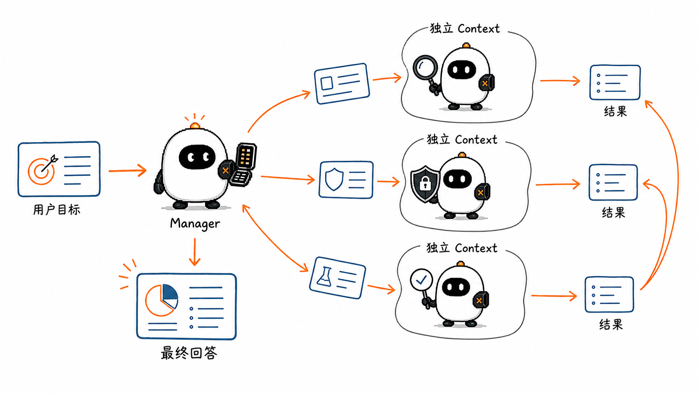
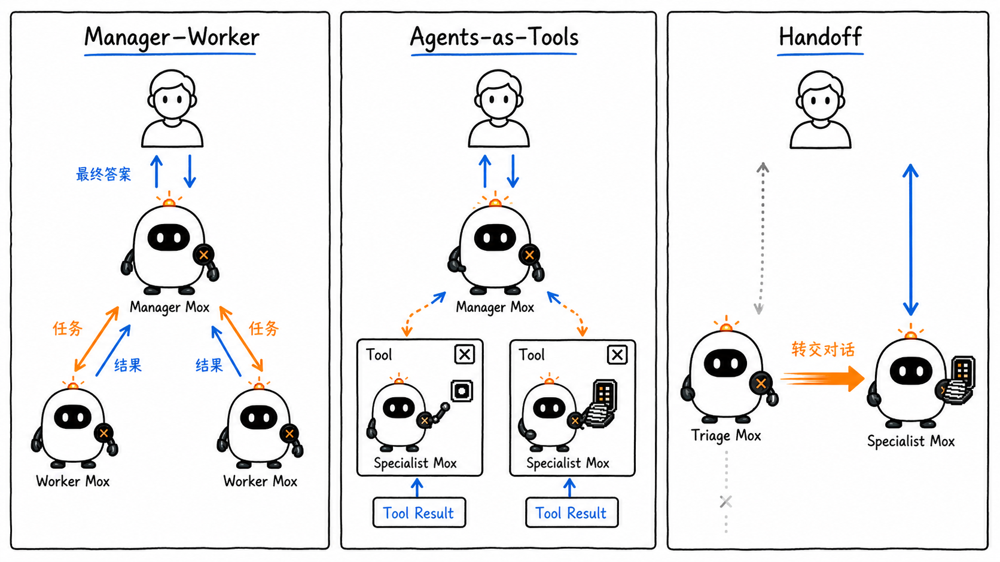
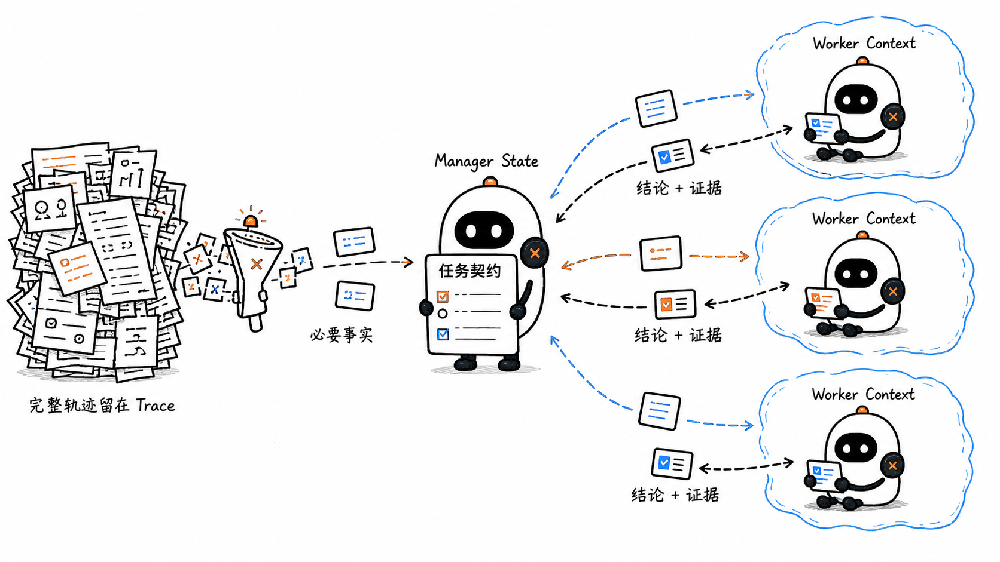
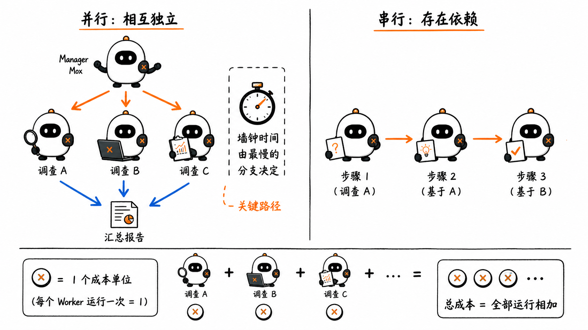
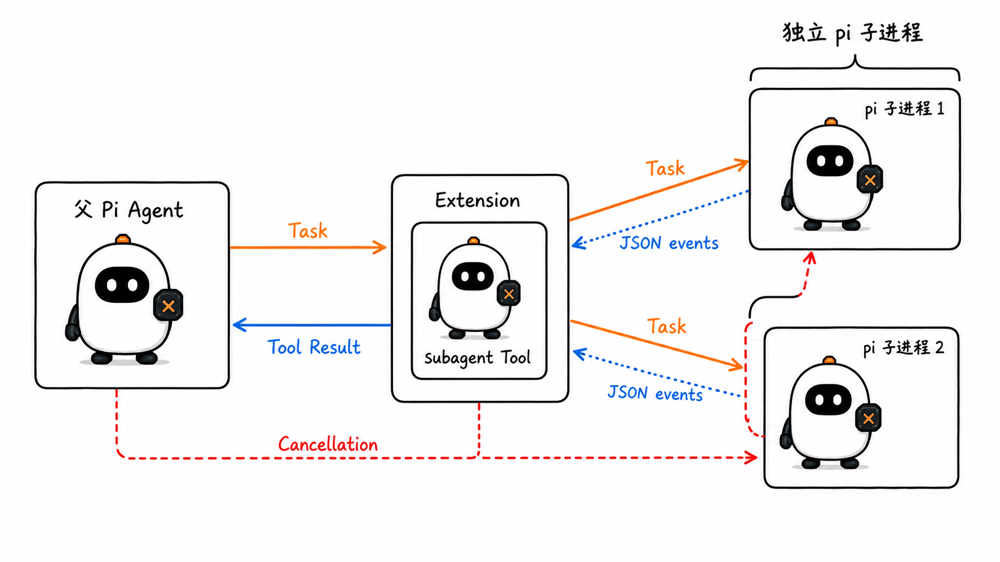
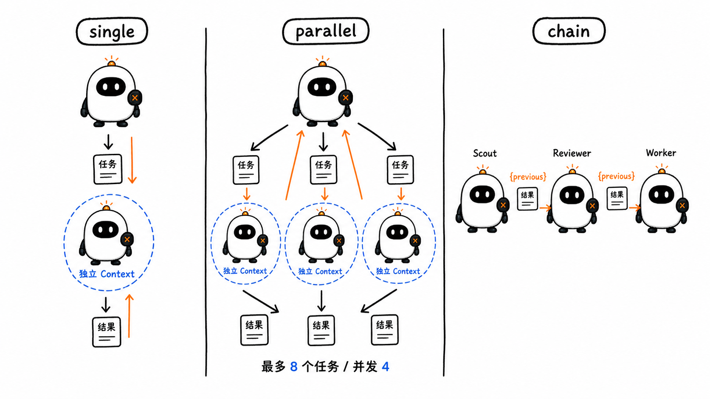
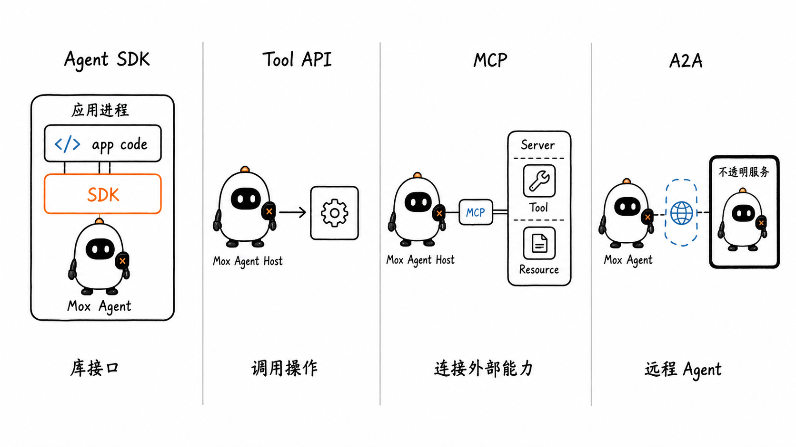
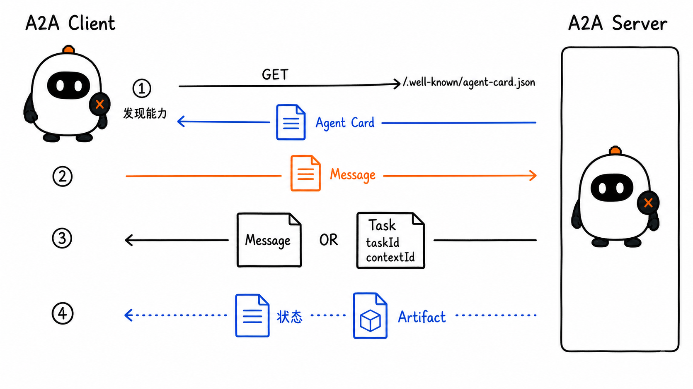
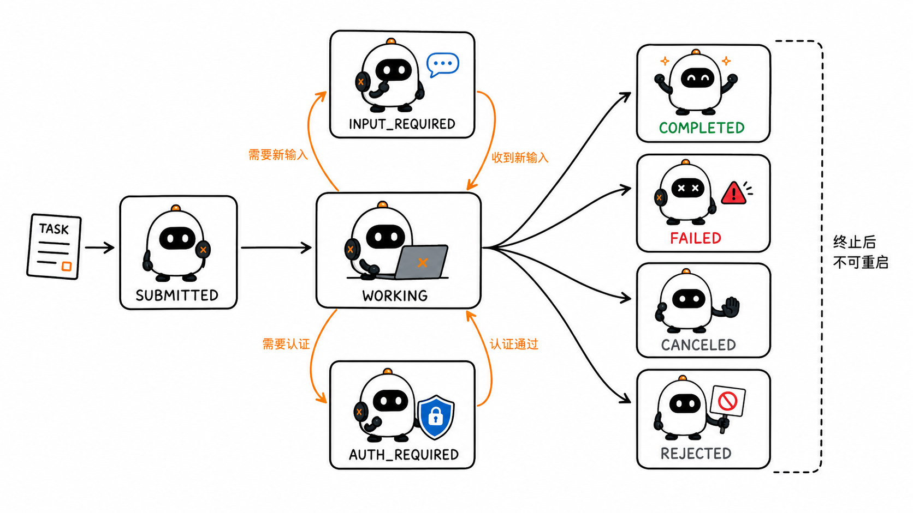

# Multi-Agent 与 A2A：多个 Agent 怎样分工与协作

这是 learn-pi-agent 的第 14 章。上一章把一个 Agent 通过 SDK 接入了应用。真实任务继续变大以后，新的问题出现了：一个 Agent 既要搜索资料、分析代码、执行修改，又要检查结果，所有信息都挤在同一个 Context 中；一些本可同时进行的工作也只能排队完成。

一种解决办法是把任务交给多个 Agent。负责接收用户目标的 Agent 可以拆分工作，让若干专门 Agent 在各自的 Context 中执行，再汇总它们的结果。若这些 Agent 位于不同进程、服务或组织，还需要一套共同协议来发现能力、发送任务和跟踪进度；A2A 解决的正是这一层互操作问题。



> **版本说明**：Pi 行为对应源码基线 `086c32e74530564922d011ade23ff582c9d63116`。A2A 内容以 `1.0.0` 规范及仓库 commit `16ba52690519bf55b9388e34d4db356efa88aa51` 为依据，OpenAI Agents SDK、Google ADK 与 Anthropic 工程资料核对日期为 `2026-08-24`。

## 1. 多一个模型调用，不一定多了一个 Agent

先看一个代码分析任务：

> 找出项目中的认证流程，判断是否存在越权风险，并给出可验证的修改建议。

一个 Agent 可以连续搜索、阅读、判断和回答。也可以把工作拆成三份：

- Scout 只负责寻找入口、调用链和关键文件；
- Security Reviewer 只负责检查权限边界和攻击路径；
- Manager 接收两份结果，处理冲突并形成最终回答。

后三个名称表达的是**运行角色**，而不是模型名称。它们可以使用同一个模型，也可以使用不同模型。

### 1.1 判断一个组件是不是 Agent

在本课程的语境中，一个可独立运行的 Agent 至少具有下面这些边界：

1. 接收一个目标或输入；
2. 拥有自己的 Instructions 与 Context；
3. 可以在 Agent Loop 中决定是否调用 Tool；
4. 保持自己的运行状态；
5. 有明确的完成、失败、取消或暂停结果。

因此，下面三种情况并不相同：

| 组件 | 内部是否有 Agent Loop | 是否有独立 Context | 调用方看到什么 |
| --- | --- | --- | --- |
| 普通 Tool | 通常没有 | 没有模型 Context | 函数结果或错误 |
| Agent-as-Tool | 有 | 通常有 | 被包装成 Tool Result 的 Agent 输出 |
| 远程 A2A Agent | 有，但对调用方不透明 | 有，由远端管理 | A2A Message、Task、状态与 Artifact |

一个函数内部即使调用了模型，也不一定形成完整 Agent；反过来，一个 Agent 被包装成 Tool 以后，对 Manager 来说仍表现为一次工具调用。

### 1.2 Subagent 描述的是关系

`Subagent` 不是一种特殊模型，也不是统一协议类型。它表示“这个 Agent 由另一个 Agent 或编排器派生、调用或管理”。同一个 Agent 在一个系统中可能是顶层入口，在另一个系统中也可能成为 Subagent。

`Worker` 更强调承担被分配的工作；`Specialist` 更强调它只处理某个领域；二者都可能是 Subagent。

### 1.3 Multi-Agent System 多出的不是角色名称，而是协调问题

单 Agent 主要管理模型、工具、Context 和停止条件。多 Agent 还要回答：

- 谁拆分任务，谁选择接收者？
- 哪些信息交给 Worker，哪些信息继续保留在 Manager？
- Worker 能否直接回复用户？
- 多个结果怎样去重、验证和合并？
- 一个 Worker 失败时，其他工作是否继续？
- 谁限制并发、轮次、Token、时间和费用？
- 取消怎样传播，修改冲突怎样处理？

这些问题共同组成多 Agent 的 **Orchestration（编排）**。

## 2. Manager、Agents-as-Tools、Handoff 与 Delegation

这些词经常同时出现，但它们描述的是不同层面。



### 2.1 Manager–Worker：一个 Agent 负责全局目标

Manager 接收用户目标，决定要不要拆分、分给谁、是否并行，以及何时汇总。Worker 接收范围更窄的任务并返回结果。

```text
用户
  ↓
Manager ──→ Scout Worker
   │       Security Worker
   │       Test Worker
   ↓
验证、去重、综合
  ↓
最终回答
```

Manager–Worker 是一种拓扑。Manager 可以通过本地函数、Agent-as-Tool、消息队列或 A2A 调用 Worker；具体通信方式并不由这个名称决定。

这个结构适合：

- 任务可以被拆成相对独立的子问题；
- 最终输出需要统一口径；
- 用户希望始终与同一个入口交互；
- Worker 的原始输出需要经过验证或脱敏。

### 2.2 Agents-as-Tools：Manager 保留对话控制权

Agents-as-Tools 把一个 Specialist Agent 包装成 Manager 可以调用的 Tool。对 Manager 来说，它与搜索工具、数据库工具一样具有名称、说明、参数和结果；区别在于这个 Tool 内部运行了另一个 Agent Loop。

调用链是：

```text
用户 → Manager → Tool Call: review_security(...)
                      ↓
                 Reviewer Agent
                      ↓
                 Tool Result
用户 ← Manager 整理后的最终回答
```

Manager 始终拥有用户会话和最终回答。Worker 通常只看到完成子任务所需的 Context，而不是 Manager 的全部历史。

OpenAI Agents SDK 将 `agent.asTool()` 作为这种模式的直接接口。它适合由一个 Agent 综合多个 Specialist 输出，或把共同 Guardrail 集中放在 Manager 一侧的场景。

### 2.3 Handoff：活跃对话交给另一个 Agent

Handoff 的重点不是“调用另一个 Agent 得到一个结果”，而是**把接下来处理当前对话的责任转交给 Specialist**。

例如客服入口判断用户的问题属于退款后：

```text
用户 → Triage Agent ──handoff──→ Refund Agent → 用户
```

转交以后，Refund Agent 成为当前运行中的活跃 Agent，并以自己的 Instructions、Tool 和模型继续处理。OpenAI Agents SDK 的 Handoff 会保留对话上下文，同时切换活跃 Agent；其他框架是否传递完整历史、筛选后的历史或摘要，要看各自实现。

Handoff 适合 Specialist 应直接与用户交互的情况。若最终答案仍要由入口 Agent 统一汇总，Agents-as-Tools 通常更自然。

### 2.4 Delegation：一次委派动作

Delegation 表示某个 Agent 把一项工作交给另一个 Agent。它可能通过 Agent-as-Tool 完成，也可能通过 Handoff、队列或 A2A 完成。

所以四个概念可以这样放在一起：

| 概念 | 回答的问题 |
| --- | --- |
| Manager–Worker | 多个 Agent 以什么组织关系协作？ |
| Agents-as-Tools | Manager 怎样把 Specialist 当成有边界的能力调用？ |
| Handoff | 当前对话控制权怎样转移给另一个 Agent？ |
| Delegation | 一项任务怎样被委派出去？ |

## 3. Context 隔离以后，必须设计任务契约

给每个 Worker 一份独立 Context，可以减少无关信息、避免不同搜索路径互相干扰，也能让它们采用不同的 Tool 与模型。但隔离不是简单地“少传一些消息”：Worker 如果不知道目标、边界和预期格式，就会重复工作或返回无法合并的内容。



### 3.1 不要把 Manager 的全部历史直接复制给每个 Worker

完整复制看似省事，却会带来四个问题：

1. 每个 Worker 都为相同历史支付 Context 成本；
2. 无关讨论会降低子任务的聚焦程度；
3. 历史中的敏感数据可能被扩散到不需要它的 Worker；
4. Worker 可能误以为自己要解决全局任务，而不是指定子任务。

Manager 应从自己的 State 中选择必要事实，再构造一份明确的任务输入。

### 3.2 一份可执行的任务契约

可以把委派输入设计成下面的结构：

```ts
type DelegatedTask = {
  taskId: string;
  objective: string;
  scope: string[];
  inputs: Array<{
    name: string;
    value: string;
    source?: string;
  }>;
  constraints: {
    allowedTools: string[];
    maxTurns: number;
    deadlineMs: number;
  };
  expectedOutput: {
    format: "json" | "markdown";
    requiredFields: string[];
  };
};
```

这不是 Pi 的源码类型，而是一份应用层任务契约。字段分别回答：做什么、做到哪里、依据什么、能使用什么资源、可以花多少预算、最后必须返回什么。

Worker 的输出也应有稳定结构：

```ts
type WorkerResult = {
  taskId: string;
  status: "completed" | "failed" | "incomplete";
  summary: string;
  evidence: Array<{
    claim: string;
    source: string;
  }>;
  changedFiles: string[];
  uncertainties: string[];
  error?: string;
};
```

结构化结果不能保证内容正确，但可以让 Manager 检查字段是否齐全、证据是否存在、失败是否需要重试，以及不同结果是否指向同一文件。

### 3.3 Worker 返回的是结论和证据，不是全部思考历史

Context 隔离的价值之一，是让 Worker 把大量搜索和工具输出压缩成少量高价值信息。Manager 通常需要：

- 结论；
- 支撑结论的文件位置、链接或 Tool 结果；
- 已执行的动作及结果；
- 仍不确定的部分；
- 失败原因和是否可重试。

如果把 Worker 的完整消息历史和所有日志都灌回 Manager，隔离带来的 Context 优势很快就会消失。完整轨迹可以留在 Trace 或任务存储中，需要诊断时再读取。

## 4. 并行不是免费的：先看依赖关系

多 Agent 最直观的优势是并行，但只有互不依赖的子任务才能真正并行。



### 4.1 扇出与汇聚

下面三个调查可以同时进行：

```text
                 ┌→ Worker A：认证入口
Manager 拆分任务 ├→ Worker B：权限校验 ─→ Manager 汇总
                 └→ Worker C：相关测试
```

若每个 Worker 分别耗时 20、35、25 秒，忽略调度开销时，并行阶段的关键路径接近最慢的 35 秒，而不是三者相加的 80 秒。

下面三个步骤却存在依赖：

```text
先找到入口 → 再设计修改 → 修改完成后再跑测试
```

强行并行会让后续 Agent 在缺少上游结果时猜测，最后增加返工。

### 4.2 成本由所有运行相加

多 Agent 的总成本可以粗略看成：

```text
总成本
= Manager 的规划与综合
+ 所有 Worker 的模型与工具成本
+ 重试、验证和失败处理
+ 重复传递的 Context
```

并行可以缩短墙钟时间，却不会自动减少 Token 或 API 费用。多个 Worker 还会重复读取项目说明、共享资料和基础代码。

Anthropic 公布的 Research 系统采用 Orchestrator–Worker 架构。在其内部研究评测上，Lead Agent 加并行 Subagent 相比单 Agent 提升了 `90.2%`；同一篇工程文章也指出，其多 Agent 系统消耗的 Token 约为普通聊天的 `15` 倍。这里的数值来自特定系统和内部评测，不能直接推广成所有任务都会获得同样收益。

这套系统尤其适合广度优先、可平行搜索、信息量超过单一 Context 的研究任务。Anthropic 同时指出，大量共享上下文或依赖紧密的任务并不适合当前的多 Agent 方案。

### 4.3 每次委派都要有预算和停止边界

工程上至少要限制：

| 边界 | 防止什么 |
| --- | --- |
| 最大 Worker 数 | Manager 为简单问题生成大量 Agent |
| 最大并发数 | Provider、CPU、文件系统或网络被瞬时压满 |
| 每个 Worker 最大 Turn / Token | 子任务无限探索 |
| 总调用和费用预算 | 多个局部合理决策叠加后超出产品成本 |
| Deadline 与取消信号 | 一个慢 Worker 阻塞整个汇聚点 |
| 最大返回大小 | Worker 输出重新塞满 Manager Context |
| 去重键与任务 ID | 同一委派被重复执行 |

还要明确“部分成功”是否可接受。三名 Worker 中两名成功时，Manager 可以继续综合、补发失败任务，也可以终止整个 Run；这应由任务语义决定，而不是由 `Promise.all()` 的默认行为偶然决定。

## 5. 经典工作提供了哪些组织思路

2023 年出现的一批工作把多 Agent 讨论从单轮角色扮演推向可编排的协作系统：

| 工作 | 主要思路 | 对工程设计的启发 |
| --- | --- | --- |
| CAMEL | 通过角色与初始提示组织 Agent 之间的对话 | 角色边界和任务设定会持续影响协作轨迹 |
| AutoGen | 用可配置、可对话的 Agent 与 Conversation Pattern 组合应用 | Agent 的交互方式也需要编程和观测 |
| MetaGPT | 把标准作业流程、角色与中间产物放进多 Agent 软件流程 | 协作不只是“大家聊天”，还需要稳定工件与交接规则 |

这些工作说明了不同组织方法，但论文中的示例效果不等于生产系统已经可靠。多 Agent 会放大幻觉、错误传播、协调开销和评测难度。角色数量越多，不代表系统越强；真正重要的是任务能否分解、输入输出是否可验证、控制权是否清楚。

## 6. Pi 怎样实现 Subagent

Pi 固定版本的核心明确不内置 Subagent。它的设计选择是保持核心精简，让使用者通过 Extension、独立进程或第三方 Package 实现需要的协作方式。

同一仓库提供了一个完整的官方 **subagent Extension 示例**。因此，准确说法是：

> Pi 核心不规定统一的 Subagent 机制；官方示例展示了怎样用 Extension 注册 `subagent` Tool，并启动相互隔离的 Pi 子进程。



### 6.1 Agent 定义是一份带 Frontmatter 的 Markdown

示例从用户级或项目级目录发现 Agent 文件。一份定义可以写成：

```markdown
---
name: security-reviewer
description: 检查认证、授权和数据访问边界
tools: read, grep, find, ls
model: claude-sonnet-4-5
---

你负责安全审查。先定位证据，再给出风险、影响范围和验证方法。
不要修改文件。
```

Frontmatter 决定名称、描述、可用 Tool 和可选模型，正文成为子 Agent 的追加 System Prompt。若省略 `model`，官方示例会继承派发 Session 当前使用的模型和 Thinking Level。

### 6.2 官方示例提供三种调用形态

`subagent` Tool 的参数在固定源码中支持三种互斥模式：

```ts
// 单个 Worker
const single = {
  agent: "security-reviewer",
  task: "检查 src/auth 下的越权风险"
};

// 多个 Worker 并行
const parallel = {
  tasks: [
    { agent: "scout", task: "定位认证入口和调用链" },
    { agent: "security-reviewer", task: "检查权限校验" }
  ]
};

// 按顺序传递上一步结果
const chain = {
  chain: [
    { agent: "scout", task: "定位认证入口" },
    {
      agent: "security-reviewer",
      task: "根据下面的定位结果审查风险：\n{previous}"
    }
  ]
};
```



这段对象展示真实参数形状，不是模型 API 的消息格式。`parallel` 在该基线中最多接收 8 个任务，内部并发上限为 4；`chain` 会把上一项的最终文本替换进下一项任务中的 `{previous}`。

### 6.3 每个 Worker 是独立 Pi 进程

官方示例不是在父 Agent 的 Context 中假装出几个角色。它为每个任务启动独立 `pi` 进程，并使用：

```text
--mode json -p --no-session
```

这带来几项具体结果：

- 子 Agent 有独立 Context Window；
- 子 Agent 的模型事件以 JSON 模式被父 Extension 读取；
- `--no-session` 表示这次子任务不写入常规持久化 Session；
- 父 Tool 可以持续显示子 Agent 的 Tool Call、文本和使用量；
- 父级取消信号会传播到子进程；
- 完成结果被压缩成 `subagent` Tool Result，再交还父 Agent。

并行结果在该示例中每个任务最多向父模型返回 50 KB；完整信息仍可保留在 Tool Details 中。这正是“运行轨迹用于观察，压缩结果进入父 Context”的实际例子。

### 6.4 这三种模式与第 11 章的 Workflow 是什么关系

`single`、`parallel` 和 `chain` 是 Extension 提供的控制结构：

- `single` 只执行一次委派；
- `parallel` 的并发与汇聚由 TypeScript 代码控制；
- `chain` 的顺序和 `{previous}` 传递也由代码控制。

至于父 Agent 是否调用 `subagent`、选择哪一种模式、派给哪个 Agent，可以由模型通过 Tool Call 决定。因此，整个系统同时包含确定性 Workflow 和模型驱动选择，并不矛盾。

### 6.5 项目级 Agent 是代码供应链的一部分

项目中的 `.pi/agents/*.md` 可以改变子 Agent 的 Instructions、模型和 Tool。恶意仓库也可以借此诱导 Agent 读取文件或运行命令。

官方示例默认只加载用户级 Agent；启用项目级 Agent 时，交互界面会要求确认。即使完成确认，Tool Allowlist 也不等于完整 Sandbox：子进程仍继承宿主提供给它的目录、环境和操作系统权限。第 15 章会继续拆解这一边界。

## 7. 本地多 Agent 为什么还不需要 A2A

Pi 的 subagent 示例已经让多个 Agent 协作，但它使用父进程自定义的 Tool 参数、子进程和 JSON 输出。所有组件由同一个实现控制，调用方知道怎样启动 Pi，也知道怎样读取结果。

A2A 处理的是另一类边界：

> 调用方只知道远端是一个可完成某类任务的 Agent Service，却不知道它内部使用 Pi、ADK、OpenAI Agents SDK，还是自研 Runtime。



### 7.1 MCP 与 A2A 连接的对象不同

| 机制 | 主要连接什么 | 对端暴露什么 | 是否规定对端有 Agent Loop |
| --- | --- | --- | --- |
| 函数 / Tool API | Agent Host → 函数或服务 | 可调用操作 | 否 |
| MCP | MCP Client/Host → MCP Server | Tool、Resource、Prompt 等能力 | 否 |
| Agent SDK | 应用代码 → SDK Runtime | Agent、Run、Session 与事件接口 | 是库内行为，不是网络互操作协议 |
| A2A | A2A Client → 远程 Agent Service | Agent Card、Message、Task、Artifact 与状态 | 是，远端被当成不透明 Agent 系统 |

官方 A2A 文档把二者概括为互补关系：MCP 让 Agent 连接 Tool 与数据，A2A 让独立 Agent 互相发现并协作。一个远程 A2A Agent 完全可以在内部使用 MCP 调用自己的工具。

### 7.2 A2A 不负责内部 Subagent 编排

A2A 1.0 明确不是 Agent 开发框架，也不是某个 Agent 与其内部 Subagent 的专用调用协议。它不规定远端怎样推理、有哪些内部 Tool、是否还有五个 Worker；这些细节可以保持不透明。

只有当系统需要跨框架、跨部署或跨组织互操作时，引入 A2A 才带来明显价值。同一进程中的两个 Agent 直接使用 SDK 接口通常更简单。

## 8. A2A 1.0 怎样完成一次协作

A2A 的参与者可以简化成三方：

- **User**：发起目标的人或自动化服务；
- **A2A Client**：代表 User 调用远端的应用或 Agent；
- **A2A Server**：对外提供 Agent 能力的服务。

A2A Server 对 Client 是一个黑盒。Client 通过 Agent Card 了解它能做什么，再通过标准操作发送 Message、跟踪 Task 和接收 Artifact。



### 8.1 第一步：读取 Agent Card

公开发现地址是：

```text
https://agent.example.com/.well-known/agent-card.json
```

A2A 1.0 的简化 Agent Card 可以写成：

```json
{
  "name": "Repository Review Agent",
  "description": "Reviews a repository and returns evidence-based findings.",
  "supportedInterfaces": [
    {
      "url": "https://agent.example.com/a2a/v1",
      "protocolBinding": "HTTP+JSON",
      "protocolVersion": "1.0"
    }
  ],
  "version": "2.1.0",
  "capabilities": {
    "streaming": true,
    "pushNotifications": false,
    "extendedAgentCard": false
  },
  "defaultInputModes": ["text/plain", "application/json"],
  "defaultOutputModes": ["text/markdown", "application/json"],
  "skills": [
    {
      "id": "repository-security-review",
      "name": "Repository Security Review",
      "description": "Finds authentication and authorization risks.",
      "tags": ["code", "security", "review"]
    }
  ]
}
```

Agent Card 中的 `version` 是这个 Agent 实现自身的版本；A2A 协议版本位于每个 `supportedInterfaces` 项的 `protocolVersion`。Client 还应读取可选的 `securitySchemes`、`securityRequirements`、输入输出 Media Type、Streaming 和 Push Notification 能力，再选择双方都支持的接口。

许多旧教程仍使用顶层 `url`、`protocolVersion`、`preferredTransport` 或 `additionalInterfaces`。这些是 A2A 0.3 及更早的结构；1.0 已将它们收拢到 `supportedInterfaces`。复制旧示例时必须先确认规范版本。

### 8.2 第二步：发送 Message

使用 A2A 1.0 的 HTTP+JSON Binding，可以向 `/message:send` 发送：

```http
POST /message:send HTTP/1.1
Host: agent.example.com
Content-Type: application/a2a+json
Authorization: Bearer token

{
  "message": {
    "role": "ROLE_USER",
    "parts": [
      { "text": "检查这个仓库的认证与授权边界" }
    ],
    "messageId": "msg-018f"
  }
}
```

`Message` 是一次通信，`Part` 是内容容器。A2A 1.0 的 Part 可以承载：

- `text`：文本；
- `raw`：Base64 编码的内联字节；
- `url`：文件或内容地址；
- `data`：结构化 JSON 值。

`mediaType`、`filename` 和 `metadata` 可以进一步描述内容。Client 应根据 Agent Card 声明的输入模式选择格式，不能假设所有 Agent 都只接收文本。

### 8.3 第三步：接收 Message 或 Task

如果请求可以立即完成，Server 可以直接返回一条无状态 Message。需要跟踪状态、持续处理或补充输入时，Server 返回 Task：

```json
{
  "task": {
    "id": "task-42",
    "contextId": "context-7",
    "status": {
      "state": "TASK_STATE_WORKING"
    }
  }
}
```

几个 ID 各自解决不同问题：

| ID | 谁创建 | 表示什么 |
| --- | --- | --- |
| `messageId` | Message 发送方 | 一条通信的唯一标识 |
| `taskId` | A2A Server | 一项可跟踪工作的标识 |
| `contextId` | A2A Server | 一组相关 Message 与 Task 的连续上下文 |
| `artifactId` | A2A Server | 某个 Task 产物的标识 |

`contextId` 不等于 `taskId`。同一个 Context 可以包含多个串行或并行 Task；任务完成后的修改请求应创建新 Task，并继续使用同一个 `contextId`，必要时通过 `referenceTaskIds` 引用旧 Task。

### 8.4 第四步：跟踪 Task 状态

A2A 1.0 定义了下面这些状态：

下面的图为便于阅读省略了统一的 `TASK_STATE_` 前缀；代码和协议消息仍应使用完整枚举值。

```text
TASK_STATE_SUBMITTED
        ↓
TASK_STATE_WORKING
   ├─→ TASK_STATE_INPUT_REQUIRED ─→ 新 Message ─→ WORKING
   ├─→ TASK_STATE_AUTH_REQUIRED  ─→ 外部认证 ─→ WORKING
   ├─→ TASK_STATE_COMPLETED
   ├─→ TASK_STATE_FAILED
   ├─→ TASK_STATE_CANCELED
   └─→ TASK_STATE_REJECTED
```



`INPUT_REQUIRED` 与 `AUTH_REQUIRED` 是可继续的中断状态；`COMPLETED`、`FAILED`、`CANCELED` 和 `REJECTED` 是终止状态。Task 一旦进入终止状态就不能重新启动，后续完善应建立新 Task。

### 8.5 第五步：接收 Artifact

Message 可以解释进度、请求输入或进行简短交流；Artifact 表示 Task 产生的正式交付物，例如报告、图片、表格或结构化数据。

```json
{
  "artifactId": "artifact-report-1",
  "name": "security-review.md",
  "parts": [
    {
      "mediaType": "text/markdown",
      "text": "# Security Review\n\n..."
    }
  ]
}
```

Streaming 时，Server 可以发送 `TaskStatusUpdateEvent` 和 `TaskArtifactUpdateEvent`。Artifact 可以分块到达，Client 依据相同 `artifactId` 以及 `append`、`lastChunk` 组装。对于长时间任务，还可以使用轮询、订阅或经单独配置的 Push Notification。

## 9. 把 Pi Agent 暴露成 A2A Server

Pi 固定版本没有内置 A2A Server。要让远端系统通过 A2A 调用 Pi，可以在 Pi SDK 外增加一个 Adapter Service：

```text
A2A Client
   │ Agent Card / SendMessage / GetTask / CancelTask
   ▼
A2A Adapter Service
   │ 身份验证、Task Store、协议校验、事件映射
   ▼
Pi AgentSession
   │ Agent Loop
   ▼
Provider / Tool / MCP / Extension
```

### 9.1 两边对象不能机械地一一改名

| A2A 侧 | Pi 侧可用的实现材料 | Adapter 仍要决定什么 |
| --- | --- | --- |
| Agent Card | Pi 应用的能力、模型和 Tool 配置 | 对外公开哪些 Skill、接口、认证和 Media Type |
| `SendMessage` | `session.prompt()` | 用户隔离、输入校验、任务去重和 Session 选择 |
| Task | 一次 Pi Run 加持久化任务记录 | Task ID、状态机、恢复与终止状态 |
| `contextId` | 一个或多个 Pi Session | 何时复用、分支或新建 Session |
| Status Update | `AgentSessionEvent` | 哪些内部事件映射成公开状态 |
| Artifact | 最终 Message、文件或结构化 Tool Result | 产物边界、Media Type、存储和下载权限 |
| `CancelTask` | `session.abort()` | 取消是否成功、Task 最终状态和资源清理 |

Pi Session 与 A2A Task 不是天然一一对应。一个 A2A Context 可以包含多个 Task；一个 Pi Session 也可以跨多次 Prompt。Adapter 要根据产品语义保存两侧 ID 的映射，而不是直接把 `sessionId` 当作所有协议 ID。

### 9.2 一条可靠的映射流程

收到首条 A2A Message 后，服务可以按下面顺序处理：

1. 验证传输协议版本、认证、租户和输入 Media Type；
2. 使用幂等键或 `messageId` 检查是否已经接收；
3. 创建 A2A `taskId` 与 `contextId`，把 Task 保存为 `SUBMITTED`；
4. 为该租户选择或创建独立 Pi `AgentSession`；
5. 订阅 Pi 事件后调用 `session.prompt()`；
6. 将允许公开的进度映射成 `WORKING` 和 Streaming Event；
7. 把最终文本、文件或结构化输出保存为 Artifact；
8. 原子地把 Task 写为 `COMPLETED`，失败则写为相应终止状态；
9. Client 请求取消时触发 `session.abort()`，等待实际运行停止后更新 Task；
10. 根据 Session 策略决定保留会话还是 `dispose()`。

如果服务在第 7 步保存 Artifact 后、更新 Task 前崩溃，重试可能生成重复产物。因此 Task Store、幂等语义和恢复策略是 Adapter 的核心，而不只是把 HTTP 请求转发给 `session.prompt()`。

## 10. 多 Agent 的可靠性来自边界，而不是相互讨论

### 10.1 明确唯一所有者

每项可变资源都应有唯一所有者：

- 谁拥有用户对话；
- 谁能修改某个文件；
- 谁能批准付款或发送消息；
- 谁能宣布 Task 完成；
- 谁负责最终回答。

多个 Worker 同时修改同一工作区时，容易产生覆盖和基于旧版本编辑的问题。可以给 Worker 独立工作区、限制为只读、按文件分区，或让单一 Worker 负责最终写入。

### 10.2 不信任 Worker 输出

另一个 Agent 的回答仍然可能错误，也可能包含来自网页、仓库或远程服务的 Prompt Injection。Manager 应把 Worker Result 当作需要验证的数据：

- 检查结构和大小；
- 验证引用的文件、URL 与状态；
- 对副作用重新应用权限策略；
- 不把 Worker 文本直接提升为 System Instruction；
- 记录来源 Agent、Task ID 和执行版本。

A2A 只标准化通信，不自动保证远端 Agent 可信、正确或被授权。

### 10.3 取消必须沿调用树传播

用户取消顶层 Run 时，系统需要知道哪些 Worker 正在运行、哪些远程 Task 已提交、哪些 Tool 正执行。父级应向所有仍活跃的子任务发送取消，并继续收集实际终止结果。

“发出了取消请求”不等于“副作用没有发生”。例如远程 Agent 可能已经提交订单，或 Task 已进入无法取消的阶段。最终状态必须从执行方确认。

### 10.4 Trace 要保留父子关系

每次委派至少记录：

```text
parentRunId
delegationId
workerRunId / remoteTaskId
agentName 与版本
输入摘要与数据范围
开始、结束和等待时间
Token、费用与 Tool 调用
最终状态、重试和取消传播
```

否则总任务失败时，只能看到 Manager 的一句“Worker 没有返回”，无法判断是路由错误、Provider 超时、Tool 失败、协议不兼容还是结果被输出上限截断。

## 11. 什么时候应该使用哪一种方案

| 需求 | 合适的起点 |
| --- | --- |
| 一个 Agent 的 Tool 与 Context 已能稳定完成 | 保持单 Agent |
| 多个独立方向需要并行搜索，再统一汇总 | Manager–Worker / Agents-as-Tools |
| 不同问题应由 Specialist 直接继续用户对话 | Handoff |
| 步骤和依赖关系固定，结果必须可预测 | 代码控制的 Workflow，节点可调用 Agent |
| 同一应用内需要隔离 Context 的 Pi Worker | Pi SDK 多 Session，或官方 subagent Extension 思路 |
| 不同框架或服务之间需要 Agent 互操作 | A2A |
| Agent 只需要访问外部 Tool 与数据 | MCP 或普通 Tool API |

一个实用的升级顺序是：

```text
单 Agent
  ↓ 确认出现独立子任务、Context 或权限边界
本地 Multi-Agent
  ↓ 确认出现跨进程、跨框架或跨组织互操作需求
A2A
```

先增加 Agent 数量，再寻找适合它们的问题，通常只会增加费用和故障点。

## 12. 九个常见错误

### 12.1 把多个角色提示当成多个 Agent

同一个 Agent Loop 在一份 Context 中轮流扮演角色，没有获得独立状态、工具或生命周期。

### 12.2 让 Manager 把全部历史复制给每个 Worker

这会重复消耗 Context，并扩大无关信息与敏感数据的传播范围。

### 12.3 只写任务目标，不写结果契约

Worker 返回的粒度和格式不同，Manager 只能靠再次调用模型猜测怎样合并。

### 12.4 把所有子任务都并行

有依赖的工作会基于缺失或过期输入执行，最终付出更多返工成本。

### 12.5 认为并行一定更便宜

并行主要降低关键路径时间，总 Token 与 Tool 成本仍是各 Worker、Manager 和重试的总和。

### 12.6 把 Handoff 当成一次 Tool Call

Handoff 转移活跃对话；Agents-as-Tools 返回一个子任务结果，Manager 继续拥有对话。

### 12.7 把 Pi subagent 示例当成核心内置功能

它是官方 Extension 示例。Pi 核心有意不规定唯一 Subagent 方案。

### 12.8 把 MCP 与 A2A 当成竞争协议

MCP 面向 Tool、Resource 等外部能力；A2A 面向不透明的远程 Agent，两者可以同时使用。

### 12.9 使用旧版 A2A 字段编写 1.0 服务

A2A 1.0 已更改操作名、Agent Card 接口声明和枚举值。Client 与 Server 必须先协商同一协议版本。

## 本章小结

- Multi-Agent System 由多个具有独立 Context、状态和生命周期的 Agent 协作组成；多一个模型调用并不自动多一个 Agent；
- Manager–Worker 描述组织关系，Agents-as-Tools 保留 Manager 控制权，Handoff 转移活跃对话，Delegation 则是一次委派动作；
- Context 隔离必须配合明确的目标、范围、Tool、预算、输出结构和证据契约；
- 只有互不依赖的任务适合并行，并行降低墙钟时间但不会自动降低总 Token 或费用；
- Pi 核心不内置 Subagent，固定仓库的官方 Extension 示例通过 `subagent` Tool 启动独立 Pi 进程，并提供 single、parallel 与 chain 三种模式；
- Pi 示例的本地子进程通信不是 A2A；A2A 用于不同框架、部署或组织中的不透明 Agent 互操作；
- MCP 连接 Agent 与 Tool/数据，A2A 连接 Agent 与远程 Agent，两者处于不同边界；
- A2A 1.0 通过 Agent Card 发现能力，通过 Message 发起交互，通过 Task 跟踪工作，通过 Artifact 交付结果；
- `contextId` 组织相关交互，`taskId` 标识一次工作，终止 Task 不可重启；
- 把 Pi 暴露为 A2A Server 需要额外 Adapter、认证、Task Store、ID 映射、事件转换、幂等、恢复和取消处理；
- 多 Agent 的可靠性来自所有权、任务契约、预算、隔离、验证与 Trace，而不是让更多模型自由讨论。

## 下一章：Sandbox、Code Agent 与 Computer Use

多个 Agent 可以放大执行能力，也会放大风险。下一章进入真实执行环境：文件系统、Shell、代码解释器、浏览器和 Computer Use 分别给 Agent 什么能力；工作目录、进程权限、Sandbox、环境变量和 Secret 又怎样限制这些能力。我们会继续区分“模型请求了动作”和“宿主环境真的允许执行”。

## 参考资料

- [Pi README：核心能力取舍与 “No sub-agents” 说明](https://github.com/earendil-works/pi/blob/086c32e74530564922d011ade23ff582c9d63116/packages/coding-agent/README.md)
- [Pi 官方 subagent Extension 示例说明](https://github.com/earendil-works/pi/blob/086c32e74530564922d011ade23ff582c9d63116/packages/coding-agent/examples/extensions/subagent/README.md)
- [Pi subagent Extension 源码：Tool Schema、子进程、并行与 Chain](https://github.com/earendil-works/pi/blob/086c32e74530564922d011ade23ff582c9d63116/packages/coding-agent/examples/extensions/subagent/index.ts)
- [Pi subagent Agent 发现与配置源码](https://github.com/earendil-works/pi/blob/086c32e74530564922d011ade23ff582c9d63116/packages/coding-agent/examples/extensions/subagent/agents.ts)
- [OpenAI Agents SDK：Agent Orchestration](https://openai.github.io/openai-agents-js/guides/multi-agent/)
- [OpenAI Agents SDK：Handoffs](https://openai.github.io/openai-agents-js/guides/handoffs/)
- [Anthropic：How we built our multi-agent research system](https://www.anthropic.com/engineering/multi-agent-research-system)
- [A2A Protocol 1.0.0 Specification](https://a2a-protocol.org/v1.0.0/specification/)
- [A2A 固定源码：规范与 Protobuf 定义](https://github.com/a2aproject/A2A/tree/16ba52690519bf55b9388e34d4db356efa88aa51)
- [A2A：What’s New in v1.0](https://a2a-protocol.org/latest/whats-new-v1/)
- [A2A 与 MCP 的关系](https://a2a-protocol.org/latest/topics/a2a-and-mcp/)
- [Google ADK：ADK with A2A Protocol](https://adk.dev/a2a/)
- [CAMEL: Communicative Agents for “Mind” Exploration of Large Scale Language Model Society](https://arxiv.org/abs/2303.17760)
- [AutoGen: Enabling Next-Gen LLM Applications via Multi-Agent Conversation](https://arxiv.org/abs/2308.08155)
- [MetaGPT: Meta Programming for A Multi-Agent Collaborative Framework](https://arxiv.org/abs/2308.00352)
