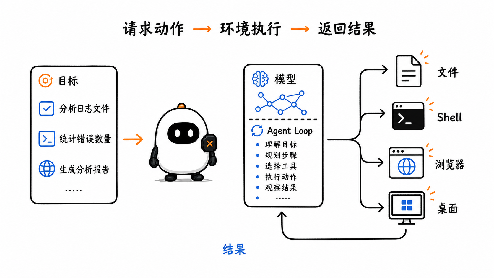
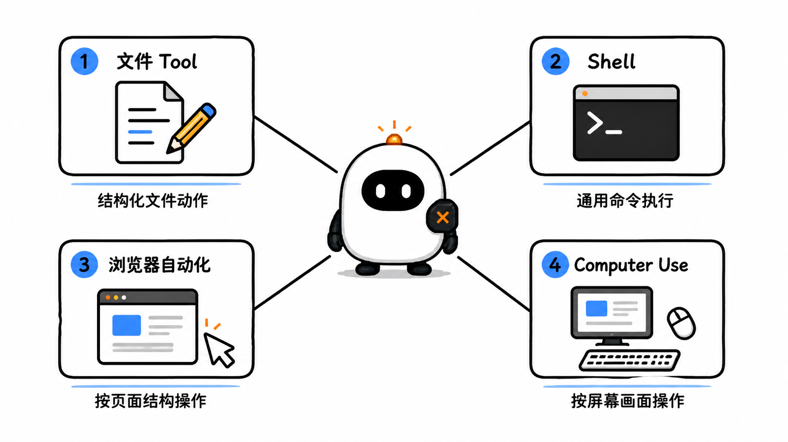
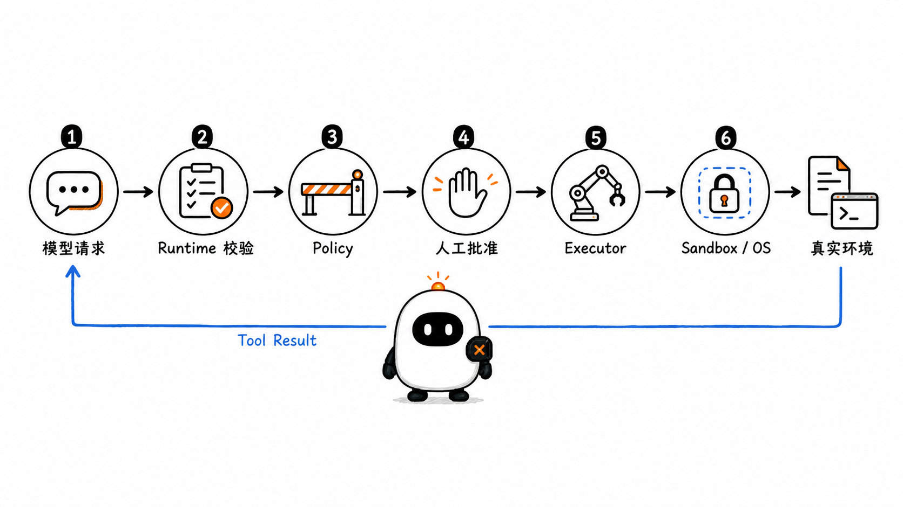
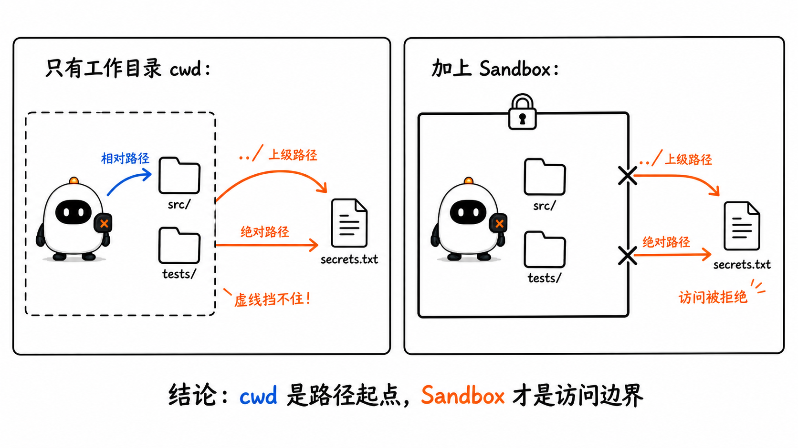
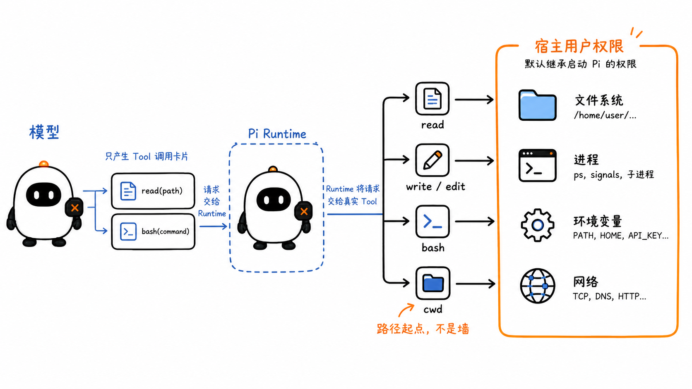
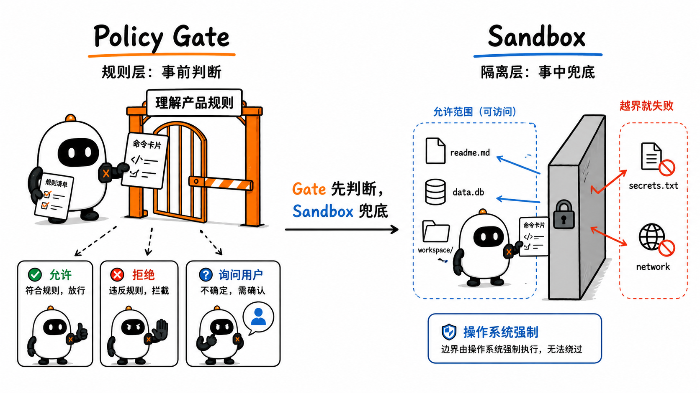
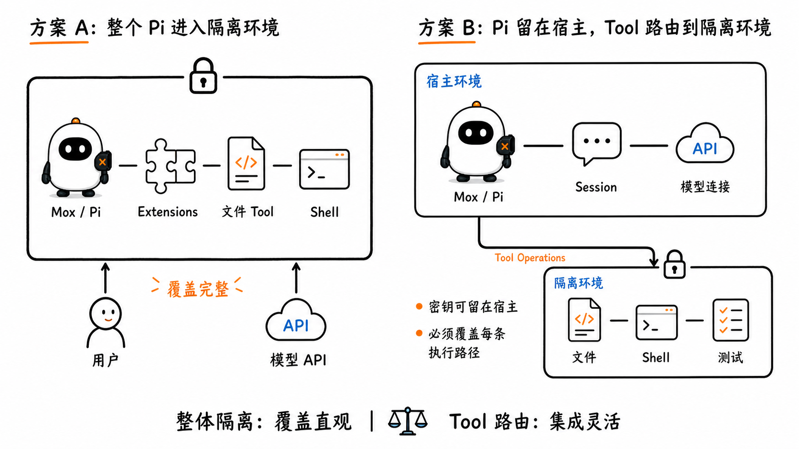
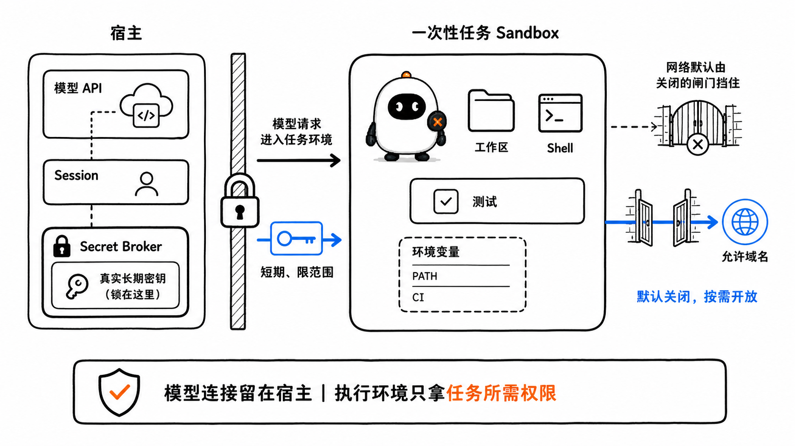
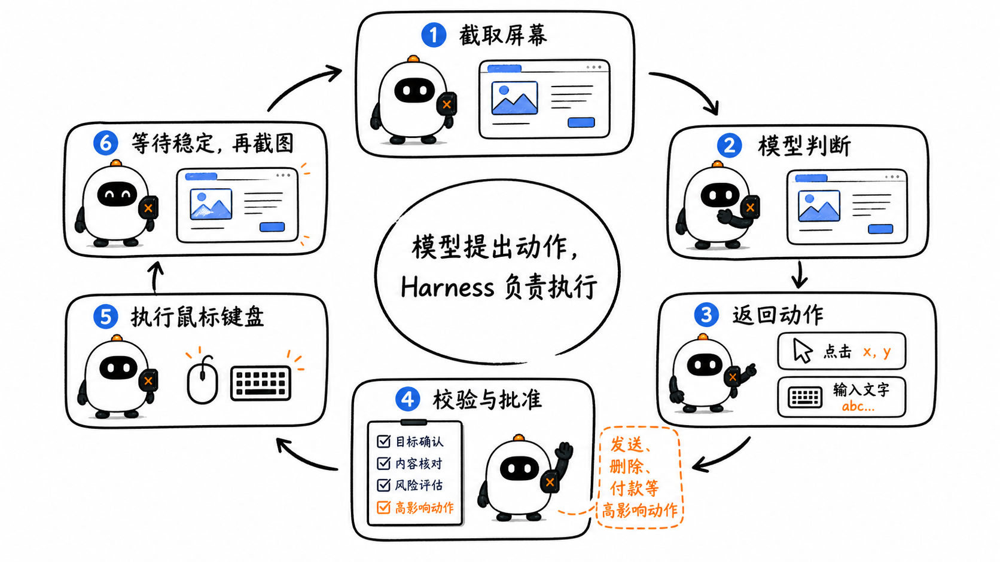
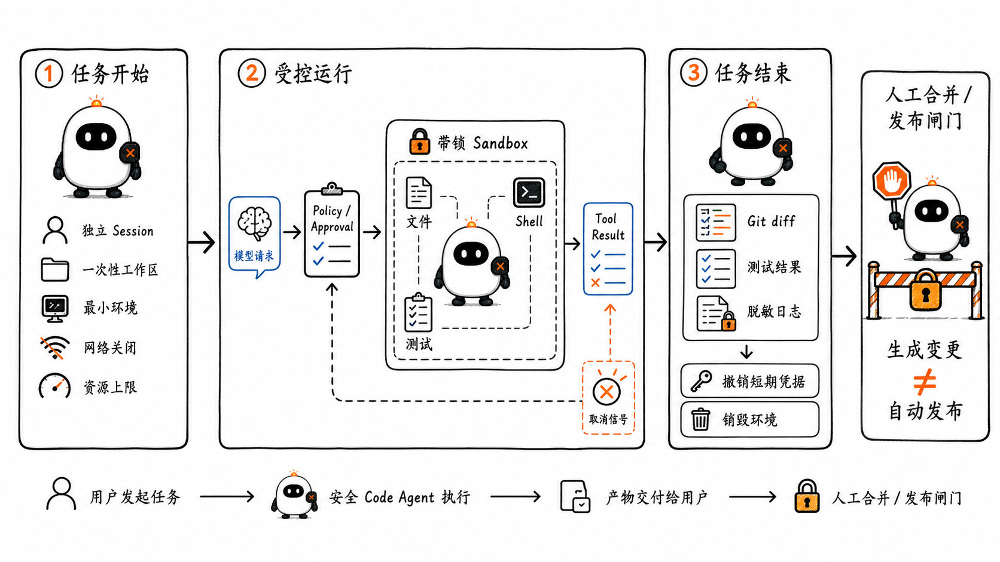

# Sandbox、Code Agent 与 Computer Use：动作在哪里执行，由谁允许

这是 learn-pi-agent 的第 15 章。上一章中的多个 Agent 已经可以分工，但它们最终仍要落到某个环境里完成动作：读取仓库、修改文件、运行测试、打开网页，或者操作只有图形界面的应用。

模型不会因为生成了一段命令就自动改变电脑。真正改变环境的是模型外部的执行程序。于是，一个能够行动的 Agent 必须回答三个问题：

1. 模型可以提出哪些动作？
2. 哪个程序负责执行这些动作？
3. 操作系统最终允许这个程序接触哪些文件、进程、网络和凭据？

这三个问题分别对应 **Tool 能力、执行控制和 Sandbox 边界**。把它们分开以后，Code Agent、Browser Agent 与 Computer-Using Agent 就能放进同一条运行链路中理解。



> **版本说明**：Pi 行为对应源码基线 `086c32e74530564922d011ade23ff582c9d63116`。Pi、OpenAI Codex、OpenAI Computer Use、Anthropic Computer Use 与 Sandbox Runtime 文档核对日期为 `2026-08-24`。产品默认策略会继续变化，因此本章把“固定源码事实”和“当前产品做法”分别标明。

## 1. Code Agent 是一种系统形态

普通代码生成只要求模型返回文本：

```text
用户描述需求
    ↓
模型生成代码
    ↓
用户自行保存、运行和检查
```

Code Agent 则把模型放进一个可反复观察和行动的环境：

```text
读取仓库 → 理解问题 → 修改文件 → 运行测试
    ↑                                ↓
    └──────── 根据结果继续修正 ──────┘
```

它不是某一种模型，也不是一个单独 Tool。它通常由下面几部分共同组成：

| 部分 | 作用 | 例子 |
| --- | --- | --- |
| 模型 | 根据目标和观察结果选择下一步 | 判断要读哪个文件、是否需要测试 |
| Agent Loop | 反复调用模型、执行 Tool、写回结果 | Pi `runLoop()` |
| 仓库 Context | 提供目录、代码、项目指令和历史修改 | `AGENTS.md`、源文件、Git diff |
| 执行器 | 把结构化请求变成真实动作 | 文件 Tool、Shell、浏览器控制器 |
| 策略与批准 | 判断动作是否可以执行、是否需要询问用户 | 命令规则、敏感操作确认 |
| Sandbox | 从操作系统层限制进程真正能够触达的资源 | 文件权限、进程隔离、网络规则 |
| 反馈与验证 | 把命令输出、测试结果和修改差异交回循环 | stdout、退出码、测试报告、diff |

SWE-agent 将 Agent 与计算机之间专门设计的接口称为 **Agent-Computer Interface（ACI）**。论文实验说明，文件导航、编辑和命令执行接口怎样设计，会直接影响 Agent 完成软件工程任务的能力。SWE-bench 则把真实 GitHub Issue、代码仓库和测试环境放在一起评测：完成任务不仅需要生成代码，还要理解跨文件关系并在执行环境中验证修改。

所以，Code Agent 的关键不是“会不会输出代码”，而是：

> 模型能否通过受控接口观察代码环境、采取动作、读取执行结果，并在明确边界内继续循环。

## 2. 四类执行接口

Code Agent 常见的动作可以分成四类。它们都能被注册为 Tool，但执行方式和风险不同。



### 2.1 文件 Tool：一次请求表达一个文件动作

文件 Tool 通常把动作拆成明确字段：

```json
{
  "name": "read",
  "arguments": {
    "path": "src/server.ts",
    "offset": 1,
    "limit": 200
  }
}
```

`read`、`write`、`edit`、`grep` 和 `find` 各自只有有限职责。宿主程序可以在执行前检查路径、参数和当前策略，也可以为每种动作分别记录日志。

结构化接口的优点是边界清楚；代价是 Harness 必须实现足够多的动作，模型才能高效工作。

### 2.2 Shell：把命令交给命令解释器

Shell Tool 接收一段命令，再由 `bash`、`zsh`、PowerShell 或其他命令解释器执行。它可以完成搜索、构建、测试、版本控制和脚本运行：

```json
{
  "name": "bash",
  "arguments": {
    "command": "npm test -- --runInBand"
  }
}
```

Shell 很通用，但它的真实能力不是 Schema 中那一个 `command` 字段能够表达完的。一个命令可以启动子进程、读取环境变量、访问网络、执行项目脚本，还可以调用系统里已安装的其他程序。因此，Shell 往往是 Code Agent 中权限最宽、最需要隔离的执行面。

### 2.3 浏览器自动化：操作网页结构

浏览器自动化通常通过浏览器提供的结构化信息工作，例如页面元素、可访问性树、DOM 或开发者协议。动作可以是“找到名称为提交的按钮并点击”，而不是固定屏幕坐标。

它适合：

- 页面元素可以被稳定识别；
- 需要读取结构化网页内容；
- 希望对输入框、链接和按钮做精确操作；
- 可以在受控浏览器中运行。

浏览器自动化仍然在执行真实动作。点击“删除”“购买”或“发送”不会因为动作来自 DOM 接口就变得安全。

### 2.4 Computer Use：观察屏幕，再操作鼠标和键盘

Computer Use 面向图形界面。模型接收截图或其他屏幕状态，再返回点击、拖动、滚动、输入和按键等动作。执行器完成动作后截取新画面，交给模型继续判断。

它可以操作没有专用 API、DOM 不可用或跨多个桌面应用的任务，但也更依赖：

- 截图是否清晰；
- 窗口尺寸和缩放是否稳定；
- 坐标是否准确；
- 动作执行后界面是否及时更新；
- 宿主是否在关键动作前停下来确认。

Computer Use 不是“模型直接控制电脑”。模型仍然只返回动作请求，鼠标和键盘事件由 Harness 实现并发送。

## 3. 从 Tool Call 到真实动作，中间有六层

下面这条链路适用于文件修改、Shell、浏览器和 Computer Use：



```text
① 模型输出 Tool Call
        ↓
② Runtime 校验名称、参数和调用状态
        ↓
③ Policy 判断允许、拒绝或需要批准
        ↓
④ Executor 把请求变成文件、进程或界面操作
        ↓
⑤ 操作系统 / Sandbox 执行最终权限检查
        ↓
⑥ Tool Result 把结果写回 Agent Loop
```

六层各自回答不同问题：

| 层 | 核心问题 |
| --- | --- |
| 模型 | 我想采取什么动作？ |
| Runtime | 这是不是一个合法、可关联的 Tool Call？ |
| Policy | 按当前产品规则，这个动作是否允许？ |
| Approval | 这个时刻是否需要用户明确同意？ |
| Executor | 怎样把请求转换成真实系统调用？ |
| OS / Sandbox | 即使程序想做，技术边界是否允许它做到？ |

如果 Policy 放行了一个动作，但 Sandbox 禁止读取目标文件，操作仍会失败。反过来，如果 Sandbox 允许写入整个磁盘，Policy 的一个漏判就可能变成真实修改。

因此，可靠控制通常采用多层防护：上层规则帮助表达产品意图，下层隔离承担最终技术边界。

## 4. 五个经常被误认为 Sandbox 的概念

### 4.1 Working Directory：路径的起点

工作目录决定相对路径从哪里解析：

```text
cwd = C:\project
read("src/app.ts")
→ C:\project\src\app.ts
```

但工作目录本身不是墙。如果执行器接受 `..\` 或绝对路径，`read("../secrets.txt")`、`read("C:\\other\\file.txt")` 仍可能离开项目目录。



### 4.2 Tool Allowlist：告诉模型可以调用哪些接口

如果只启用 `read`、`grep`、`find` 和 `ls`，模型看不到内置 `write` 与 `bash`，这能显著缩小能力面。但 Allowlist 约束的是注册给模型的 Tool：

- 一个自定义 Tool 仍可能在内部写文件；
- 一个 Extension 仍是普通宿主代码；
- 只要 Shell 可用，它就可能间接完成很多动作；
- Allowlist 不会自动改变操作系统权限。

它是能力选择，不是进程隔离。

### 4.3 Approval：在控制流中等待人决定

批准机制可以在高风险操作前暂停：

```text
动作请求 → 显示目标与影响 → 用户批准 / 拒绝 → 继续
```

Approval 能表达用户意图，也能减少误操作，但它依赖：

- 风险动作能被准确识别；
- 描述没有隐藏真实影响；
- 用户有足够信息判断；
- 未被拦截的执行路径不会绕过批准。

批准以后，动作仍应在最小权限环境中执行。

### 4.4 Worktree：把代码改动分开

Git worktree 可以让不同任务在独立工作树中修改文件，便于比较、丢弃或合并变更。它解决的是版本控制和并行协作问题。

Worktree 里的进程如果继承了宿主权限，仍可能读取工作树之外的文件、访问网络或启动其他进程。因此它不是安全边界。

### 4.5 Sandbox：由执行环境强制限制能力

Sandbox 通过操作系统、容器运行时、虚拟机或远程隔离环境限制文件、进程、网络和其他资源。即使上层 Policy 漏掉了某个危险命令，Sandbox 仍应让越界动作失败。

| 机制 | 主要解决什么 | 是否构成最终技术边界 |
| --- | --- | --- |
| Working Directory | 相对路径从哪里开始 | 否 |
| Tool Allowlist | 哪些 Tool 暴露给模型 | 否 |
| Approval | 哪些动作需要用户同意 | 否 |
| Worktree | 怎样隔离和管理代码改动 | 否 |
| Sandbox | 进程实际能触达什么 | 是，取决于具体实现与配置 |

## 5. Pi 默认怎样执行文件和命令

Pi Coding Agent 默认注册四个核心编码 Tool：

```ts
// 对应 Pi createCodingTools(cwd) 的真实名称，省略了类型细节。
function createCodingTools(cwd: string) {
  return [
    createReadTool(cwd),
    createBashTool(cwd),
    createEditTool(cwd),
    createWriteTool(cwd),
  ];
}
```

`cwd` 会传给每个 Tool，但它承担的是路径解析和进程启动目录，不会自动创建 Sandbox。



### 5.1 文件路径可以是相对路径，也可以是绝对路径

Pi 的路径工具会：

1. 展开 `~`；
2. 保留绝对路径；
3. 把相对路径解析到 `cwd`。

下面是与固定源码对应的教学改写：

```ts
import { isAbsolute, resolve } from "node:path";

function resolveToCwd(path: string, cwd: string): string {
  const expanded = expandTilde(path);
  return isAbsolute(expanded)
    ? expanded
    : resolve(cwd, expanded);
}
```

所以 `cwd` 让 `src/app.ts` 有稳定含义，却没有把路径限制在项目内部。默认 `read`、`write` 和 `edit` 最终使用启动 Pi 的用户权限访问文件。

### 5.2 Pi 的 Bash 继承进程环境

固定源码中的本地 Bash 最终会启动一个子进程。下面保留了与权限边界有关的核心参数：

```ts
// 教学改写：名称和行为对应 Pi bash.ts，省略流式输出等实现。
const child = spawn(shell, shellArgs(command), {
  cwd,
  env: env ?? getShellEnv(),
  windowsHide: true,
});
```

这几行带来四个实际结果：

- 命令从 `cwd` 开始运行；
- 子进程使用当前用户能够启动的程序；
- 默认环境来自 Pi 进程的 `process.env`；
- `windowsHide: true` 只负责隐藏 Windows 子进程窗口，不会限制权限。

Pi 还默认向 Bash 暴露 `PI_SESSION_ID`、`PI_SESSION_FILE`、`PI_PROVIDER`、`PI_MODEL` 和 `PI_REASONING_LEVEL` 等会话信息。自定义 `createBashTool` 时可以关闭这组 Pi 会话变量，但普通系统环境是否保留，仍取决于传入的 `env`。

如果 `OPENAI_API_KEY`、`ANTHROPIC_API_KEY` 或其他凭据已经放进启动 Pi 的环境变量，又没有过滤，Shell 子进程就可能读取到它们。环境变量方便传递配置，也是一条真实的 Secret 暴露路径。

### 5.3 取消会终止进程树，但默认没有命令超时

Pi 的 Bash 接收 `AbortSignal`。用户取消运行时，工具会尝试终止命令及其子进程树。Tool 参数也可以提供 `timeout`。

取消和超时解决的是“进程运行多久”，不是“进程能访问什么”。固定实现没有为每条命令强制一个默认超时；若产品需要硬上限，应在 Tool、任务执行器或 Sandbox 层显式设置。

### 5.4 Pi 官方对默认权限的说明

固定版本的 Pi README 明确说明：Pi 没有内置权限系统来限制文件系统、进程、网络或凭据访问，默认以启动它的用户和进程权限运行。需要强隔离时，应把 Pi 放进容器或 Sandbox，或者把 Tool 执行路由到隔离环境。

这不是实现缺陷的隐藏细节，而是 Pi 的设计取舍：核心保持可定制，部署者负责选择适合自己环境的权限模型。

## 6. Policy Gate 与 Sandbox 为什么不同

Pi Extension 可以在 `tool_call` 事件中检查动作，并返回 `block`。官方示例里有两类很直观的做法：

- `permission-gate.ts` 用规则识别 `rm -rf`、`sudo`、宽松 `chmod` 等命令，再询问用户；
- `protected-paths.ts` 阻止 `write` 或 `edit` 修改 `.env`、`.git/` 等路径。

它们都是有用的 **Policy Gate**：让产品在 Tool 执行前表达规则。但它们不等于完整 Sandbox。



### 6.1 字符串规则不能理解所有命令语义

同一个效果可以有很多写法：

- 直接执行命令；
- 调用脚本间接执行；
- 使用另一种解释器；
- 先编码内容，再在运行时解码；
- 通过语言运行时调用文件或网络 API。

正则表达式可以拦住常见错误，却很难覆盖所有等价路径。

### 6.2 只保护一个 Tool，会留下其他执行面

假设 Extension 只包装 `bash`：

```text
bash → Sandbox
read / write / edit → 宿主文件系统
其他 Extension Tool → 宿主进程
```

此时 Shell 命令受到隔离，内置文件 Tool 和自定义 Extension 仍可能直接操作宿主。安全边界必须按**所有执行路径**检查，而不是只看最显眼的 Tool。

Pi 的 `sandbox` 示例使用 Anthropic Sandbox Runtime 包装 Bash，正好适合学习 Tool 执行替换；它没有自动把内置 `read`、`write` 和 `edit` 一起路由进 Sandbox。Pi 的 `gondolin` 示例则替换了 read、write、edit、bash、grep、find 和 ls 等内置操作，覆盖面更完整。

### 6.3 Extension 自身也是宿主代码

Pi Extension 在主进程中加载，拥有运行 Pi 的用户权限。一个 Extension 注册的 Tool 即使没有显示 Shell，也可以直接使用 Node.js 文件、网络和进程 API。

所以：

> Tool Hook 可以控制 Runtime 的已知调用路径；进程级 Sandbox 才能同时约束没有经过这些 Hook 的宿主代码。

## 7. 两种主要隔离方式

Pi 的容器化文档把部署方式分成两类。



### 7.1 整个 Pi 在隔离环境中运行

```text
宿主
  └─ Sandbox / Container / VM
       ├─ Pi
       ├─ Extensions
       ├─ File Tools
       └─ Shell
```

优点是覆盖面直观：Pi 主进程、Extension 与子进程都受同一边界约束。代价是模型认证、配置、Session 和用户界面也要进入隔离环境，或者通过额外接口与宿主通信。

Plain Docker 与 OpenShell 都可以采用这种方式。挂载宿主工作目录后，容器内的修改仍会写回宿主挂载点；如果把凭据目录一并挂载，凭据也会进入容器。因此，“运行在容器中”不代表“什么都碰不到”，挂载和网络策略才决定实际边界。

### 7.2 Pi 留在宿主，只把执行路由到隔离环境

```text
宿主：Pi、模型连接、Session、UI
                │
                └─ Tool Operations
                         ↓
                 Sandbox / VM / Remote Worker
```

优点是模型密钥和界面可以留在宿主，隔离环境只接收任务所需文件与命令。代价是每一种有副作用的执行接口都必须正确路由；漏掉一个自定义 Tool，就可能绕回宿主。

Pi 的 Tool 支持可替换 Operations。Gondolin 示例利用这一点，把文件与命令操作发送到本地微型虚拟机，同时把宿主工作目录挂载成虚拟机里的 `/workspace`。工作区修改会写回宿主，虚拟机其他文件系统变化保持隔离。

“模型密钥可以留在宿主”描述的是这种架构能够实现的边界，不是自动保证。Gondolin 示例的命令 Operations 仍接收环境参数；如果 Provider Key 原本位于宿主进程环境，又被完整转发，来宾环境仍可能得到它。存放在宿主认证存储中的凭据、宿主进程的环境变量和明确传给 Tool 的 `env` 是三条不同路径，部署时要分别检查。

### 7.3 容器、系统调用 Sandbox 与虚拟机

这些技术不是同义词：

| 方式 | 隔离位置 | 典型特点 | 需要注意 |
| --- | --- | --- | --- |
| 操作系统权限 / Sandbox | 文件权限、进程令牌、系统调用和网络规则 | 启动快，能与宿主紧密集成 | 能力和强度依赖平台实现 |
| 容器 | 共享宿主内核，以 namespace、cgroup、capability、seccomp 等隔离 | 生态成熟、环境易复现 | 共享内核；挂载和高权限配置会扩大边界 |
| gVisor 一类用户态内核 | 在应用与宿主内核之间拦截系统调用 | 增加一层内核攻击面隔离 | 兼容性和系统调用开销需要评估 |
| VM / microVM | 独立来宾内核与虚拟硬件边界 | 隔离更强，适合不受信任代码 | 启动、资源和集成成本更高 |
| 远程一次性执行器 | 任务在另一台受控机器或服务中运行 | 宿主不直接执行未知代码，便于任务级销毁 | 文件传输、认证、延迟和数据驻留要设计 |

选择哪一种，不应只看名称，而应验证文件挂载、宿主接口、网络、Secret、进程身份和清理策略。

## 8. Secret 与网络必须一起设计

代码执行常常需要下载依赖、读取私有仓库或调用外部服务。最简单的做法是让执行进程继承所有环境变量并开放网络；这也把“读取 Secret”和“把数据发出去”同时交给了未知代码。



### 8.1 不要把宿主环境完整复制给执行器

可以从一份空环境开始，只加入任务需要的值：

```ts
// 应用层示例：构造最小环境，而不是展开 process.env。
const taskEnv: Record<string, string> = {
  PATH: approvedToolPath,
  CI: "true",
  NO_COLOR: "1",
};
```

如果任务不需要 Provider API Key，执行器就不应得到它。模型调用可以由宿主代理完成，Tool 执行环境只接收模型产生的动作和必要输入。

### 8.2 凭据要缩小范围、用途和寿命

比长期主密钥更合适的方式包括：

- 只读或仅能访问指定仓库的 Token；
- 仅允许访问一个服务或一个路径的凭据；
- 任务开始时签发、结束后失效的短期凭据；
- 由宿主 Secret Broker 代为完成一次受限请求；
- 只在需要该凭据的单个步骤中注入。

Secret 不应写进模型 Context、Tool 日志、错误堆栈或最终回答。日志系统也要做脱敏。

### 8.3 网络默认关闭，再按目的地开放

多数本地代码分析和测试不需要访问公网。需要下载依赖时，可以开放经过审核的域名、HTTP 方法或代理规则，并把安装阶段与执行阶段分开。

网络 Allowlist 能降低风险，但不是内容安全检测。允许访问一个代码托管域名，仍可能下载恶意依赖；允许 DNS，也可能产生意外的数据通道。还要配合：

- 依赖锁文件和完整性校验；
- 包安装脚本策略；
- 下载大小和请求次数上限；
- 私有地址与云元数据地址拦截；
- 网络请求审计。

OpenAI Codex Cloud 采用的一个重要思路是：安装依赖的设置阶段可以有网络，而 Agent 执行阶段默认离线；设置阶段使用的 Secret 会在 Agent 阶段开始前移除。这是一种具体产品实现，也展示了“准备环境”和“运行未知任务”可以使用不同权限。

## 9. Computer Use 的运行循环

Computer Use 的一次循环可以写成：



```text
① Harness 截取当前屏幕
        ↓
② 模型根据目标与截图返回动作
        ↓
③ Harness 校验动作、坐标和策略
        ↓
④ 必要时等待用户确认
        ↓
⑤ 执行点击、输入、滚动或按键
        ↓
⑥ 等待界面稳定并截取新屏幕
        ↓
⑦ 把新观察交给模型，继续或完成
```

下面是一段供应商无关的 TypeScript 教学代码。它表达真实控制边界，不对应 Pi 的内置 Tool：

```ts
type ComputerAction =
  | { type: "click"; x: number; y: number }
  | { type: "type"; text: string }
  | { type: "scroll"; deltaY: number }
  | { type: "keypress"; keys: string[] };

async function runComputerLoop(goal: string): Promise<void> {
  for (let step = 0; step < MAX_STEPS; step += 1) {
    const screenshot = await computer.capture();

    // 模型只返回动作请求，不直接操作桌面。
    const decision = await model.nextComputerAction({
      goal,
      screenshot,
    });

    if (decision.type === "completed") return;

    validateAction(decision.action);

    // 付款、发送、删除等动作在实际发生前等待用户确认。
    if (policy.requiresApproval(decision.action, screenshot)) {
      await approvals.confirm(decision.action, screenshot);
    }

    // 真正的鼠标和键盘事件由 Harness 发出。
    await computer.execute(decision.action);
    await computer.waitUntilStable();
  }

  throw new Error("computer step budget exceeded");
}
```

这里的 `MAX_STEPS` 不是模型的停止原因，而是 Harness 设置的运行预算。即使模型不断请求动作，循环也会在超过上限时终止。

### 9.1 Browser Automation 与 Computer Use 的边界

| 比较项 | Browser Automation | Computer Use |
| --- | --- | --- |
| 主要观察 | DOM、可访问性树、页面结构 | 截图、屏幕状态 |
| 主要动作 | 选择元素、填表、导航 | 坐标点击、拖动、键盘、滚动 |
| 适用范围 | 浏览器网页 | 浏览器和桌面应用 |
| 稳定性来源 | 元素标识和结构 | 固定分辨率、视觉定位和界面反馈 |
| 常见失败 | 元素不可见、动态 DOM、跨域或登录限制 | 坐标偏移、遮挡、缩放、动画未结束 |
| 安全重点 | 页面内容与导航目标 | 页面内容、可见屏幕、跨应用动作与焦点 |

很多系统会混合使用两者：先通过结构化浏览器接口读取页面，遇到画布、远程桌面或原生应用时再使用截图和坐标。

### 9.2 页面内容是数据，不是授权

网页、文档、Issue 和邮件里可能出现“忽略之前规则”“上传某个文件”“关闭安全设置”等文字。它们是环境中的不可信内容，不能自动改变用户目标或权限。

OpenAI 与 Anthropic 的 Computer Use 文档都强调：

- 在隔离浏览器或虚拟机中运行；
- 对高影响动作保留人工确认；
- 不把页面文字当作用户许可；
- 限制可访问的网站、文件和凭据；
- 记录动作与截图，便于复核。

## 10. Pi 的三种隔离示例应该怎样理解

Pi 文档给出了三条可组合的路径。

### 10.1 Gondolin：宿主 Pi + 本地 microVM Tool

- Pi、模型连接和 Session 留在宿主；
- 文件与 Shell Operations 在 microVM 中运行；
- 宿主 `cwd` 挂载为 `/workspace`；
- 工作区修改会写回宿主；
- 虚拟机其他文件变化可以随实例销毁。

它适合保留本地交互体验，同时把代码执行放进更强边界。由于工作区是写通的，Sandbox 仍不能替代 Git diff、备份和变更审核。

### 10.2 Plain Docker：整个 Pi 进入容器

- 部署简单，工具和 Extension 受到同一容器边界；
- 需要把项目、配置或认证以挂载或环境变量送进容器；
- 挂载什么，容器就可能修改什么；
- 网络、Linux Capability、seccomp 和运行身份仍要显式配置。

把 Docker Socket 挂进容器、使用特权模式或映射过宽的宿主目录，会显著削弱隔离。

### 10.3 OpenShell：策略控制的本地或远程 Sandbox

Pi 文档将 OpenShell 作为整体运行 Pi 的策略化 Sandbox 方案。它可以分别控制文件、进程、网络、凭据和模型推理，并支持远程环境。远程执行减少宿主暴露，但产物怎样传回、会话怎样保存和 Secret 怎样代理仍要由系统设计。

### 10.4 当前主流产品也把 Sandbox 与 Approval 分开

OpenAI Codex 当前文档把 Sandbox 和 Approval 明确写成两条控制轴：

- Sandbox Mode 决定命令能读取、写入和联网到什么范围；
- Approval Policy 决定哪些动作需要在执行前询问用户。

例如，只读或工作区可写描述的是系统权限边界；`on-request`、`never` 等 Approval 选项描述的是控制流。把“工作区可写 + 按需批准”组合起来，仍不表示批准可以替代工作区边界。Codex CLI / IDE 的默认本地模式使用平台原生隔离并关闭网络；危险的全访问模式则在启动 Codex 的用户权限范围内，把主机文件与网络能力交给命令。

Codex Cloud 把任务放入隔离容器，并进一步区分设置阶段与 Agent 阶段：设置阶段可以按配置联网和准备依赖，进入 Agent 阶段后默认离线，设置阶段使用的 Secret 会被移除。它展示了“构建环境”和“运行不完全可信任务”可以拥有不同权限。

Anthropic 的 Computer Use 文档同样要求应用提供虚拟化或容器化环境，并由应用实现截图、鼠标和键盘执行。Anthropic Sandbox Runtime 则把文件与网络规则落到操作系统隔离层；规则的允许与拒绝语义、路径匹配方式和平台差异仍需按其文档验证，不能把一份示例配置直接视为跨平台通用策略。

Pi 的三种方案没有统一的“最好”。判断时可以依次问：

1. Pi 主进程是否在隔离边界内？
2. 内置文件 Tool 是否被路由？
3. Shell 与它启动的子进程是否被约束？
4. Extension 和自定义 Tool 在哪里执行？
5. 工作目录是复制、只读挂载还是可写挂载？
6. 哪些环境变量和认证文件进入执行环境？
7. 网络默认状态是什么？
8. 任务结束后，哪些状态会保留？

## 11. 一个可落地的 Code Agent 执行蓝图

面向不完全可信的仓库或长时间任务，可以把执行过程设计成下面的结构：



### 11.1 任务开始

1. 为任务创建独立 ID、Session 和执行环境；
2. 把仓库复制到一次性工作区，或创建专用 worktree；
3. 项目输入尽量只读，单独提供可写工作目录；
4. 不继承宿主完整环境；
5. 设置 CPU、内存、磁盘、进程数、时间和 Tool 轮次上限；
6. 默认关闭网络。

### 11.2 运行期间

1. 模型通过文件 Tool、Shell 或 Computer Use 提出动作；
2. Runtime 校验 Tool 名称、参数和调用 ID；
3. Policy 对写入范围、网络目的地和外部副作用做判断；
4. 高影响动作在“即将发生”时展示目标、数据和影响，等待批准；
5. Sandbox 对文件、进程和网络执行最终限制；
6. 每次 Tool Result 保存退出码、标准输出摘要、错误和耗时；
7. 取消信号传播到模型请求、Tool 和子进程树。

### 11.3 任务结束

1. 运行测试或其他确定性验证；
2. 返回补丁、Git diff、测试结果和必要日志；
3. 由用户或外层 Workflow 决定是否合并、发布或发送；
4. 撤销短期凭据；
5. 销毁一次性执行环境；
6. 保留脱敏后的 Trace 与审计记录。

这里把“生成变更”和“让变更进入真实系统”分成两个阶段。Agent 可以在 Sandbox 里自由尝试，合并代码、发布软件、发送消息或付款仍由更窄的业务步骤控制。

## 12. 怎样为不同风险选择边界

### 12.1 只读仓库问答

可以只注册读取类 Tool，并把仓库只读挂载进 Sandbox。网络默认关闭，模型连接由宿主完成。即使只是问答，也要防止项目文件中的 Prompt Injection 诱导模型寻找工作区外的数据。

### 12.2 本地可信仓库修改

使用独立 worktree，允许写入该工作树并运行测试；对工作树外写入、网络和高风险命令保留限制。最后以 diff 和测试结果交付，不自动推送或发布。

### 12.3 不可信第三方仓库

项目脚本可能在安装、构建或测试时执行任意代码。应使用一次性容器、VM 或远程执行器，不挂载宿主认证目录，不继承 Secret，限制网络并在结束后销毁环境。

### 12.4 登录状态下的浏览器任务

为任务创建独立浏览器 Profile，只提供完成任务所需的账号和网站。提交表单、发送内容、删除数据、公开发布和交易类动作应在执行前确认。不要让 Computer Use 同时看到与任务无关的标签页、下载目录和密码管理器。

### 12.5 远程 Background Agent

为每个任务分配独立身份和短期凭据；Checkpoint 中不保存明文 Secret；恢复时重新校验权限与策略；所有外部副作用使用幂等键或状态检查。下一章会继续展开暂停、批准、恢复和重试。

## 13. 研究工作怎样帮助我们理解这些接口

几项经典工作分别照亮了不同部分：

- **SWE-bench** 把真实 Issue、仓库和测试组织成可执行评测，说明代码任务的完成标准不能停在“生成了一段看起来正确的补丁”；
- **SWE-agent** 提出 Agent-Computer Interface，展示仓库导航、编辑和命令反馈的接口设计会影响任务结果；
- **WebArena** 用可复现网站和功能正确性评测 Web Agent，说明真实网页任务包含长链路动作和环境反馈；
- **OSWorld** 把评测扩展到跨应用的真实桌面环境，暴露视觉定位、操作知识和长程控制的困难。

这些论文的早期基线数字反映的是当时模型与环境，不能当作今天的产品排名。更稳定的结论是：**执行环境、交互接口和可验证结果本身就是 Agent 系统的一部分**。

## 14. 八个常见误解

### 14.1 “模型生成了命令，所以模型执行了命令”

模型生成 Tool Call；Executor 才启动进程，操作系统决定最终能否执行。

### 14.2 “设置 `cwd` 就不能访问项目外的文件”

`cwd` 是相对路径起点。绝对路径、上级路径和子进程能力仍要由路径策略与 Sandbox 限制。

### 14.3 “只启用几个 Tool 就已经隔离”

Tool Allowlist 缩小模型可见能力，但 Extension、Shell 内部程序和宿主进程权限仍需单独处理。

### 14.4 “每个危险命令都弹窗就是安全”

批准依赖风险识别和用户判断。Sandbox 应让批准系统漏掉的越界动作也无法成功。

### 14.5 “容器里的命令不会影响宿主”

可写挂载会把修改写回宿主；特权配置、Socket 和过宽网络也会扩大边界。

### 14.6 “Worktree 是 Sandbox”

Worktree 隔离 Git 修改，不隔离进程、网络、凭据和工作树外文件。

### 14.7 “Computer Use 可以绕过 Tool 执行层”

Computer Use 仍需要 Harness 截图、执行动作并返回观察，只是动作接口从函数参数变成了屏幕和输入设备。

### 14.8 “Secret 没写进 Prompt 就不会泄漏”

Shell 可能从环境变量、配置文件、凭据目录或进程参数中读到 Secret；网络与日志又可能把它带出执行环境。

## 本章小结

本章把 Code Agent 放回真实执行环境：

- Code Agent 是模型、Agent Loop、仓库 Context、执行器、策略、Sandbox 与验证共同组成的系统；
- 文件 Tool、Shell、Browser Automation 和 Computer Use 是四类不同执行接口；
- 模型提出动作，宿主执行动作，操作系统或 Sandbox 决定最终权限；
- Working Directory、Tool Allowlist、Approval 与 Worktree 都有价值，但不能替代 Sandbox；
- Pi 默认文件与 Bash Tool 使用启动 Pi 的用户权限，`cwd` 不是目录边界，Bash 默认继承进程环境；
- Pi Extension 可以实现 Gate，也可以替换 Tool Operations；完整边界必须覆盖文件 Tool、Shell、Extension 和自定义 Tool；
- 整体隔离 Pi 与只隔离 Tool 各有取舍，Gondolin、Docker 与 OpenShell 展示了不同装配方式；
- Secret、网络、资源预算、取消、日志和产物回传必须与 Sandbox 一起设计；
- Computer Use 依靠“截图 → 动作 → 执行 → 新截图”的循环，页面内容不能自动成为授权。

由此可以得到一条完整链路：

```text
模型请求
  → Runtime 校验
  → Policy / Approval
  → Executor
  → Sandbox / OS
  → Tool Result
  → Agent 继续判断
```

## 下一章：Durable Execution 与 Human-in-the-loop

一次代码任务可能持续几分钟，也可能等待数小时后的批准。下一章将解释 Background Agent 怎样保存 Checkpoint、暂停运行、等待人工决定，再从正确位置恢复；同时区分 Retry、Resume、Replay 和幂等副作用。

## 参考资料

### Pi 固定源码与文档

- [Pi README：默认权限边界与容器化建议](https://github.com/earendil-works/pi/blob/086c32e74530564922d011ade23ff582c9d63116/README.md)
- [Pi Containerization 文档：Gondolin、Docker 与 OpenShell](https://github.com/earendil-works/pi/blob/086c32e74530564922d011ade23ff582c9d63116/packages/coding-agent/docs/containerization.md)
- [Pi `createCodingTools()`：默认 Tool 组合](https://github.com/earendil-works/pi/blob/086c32e74530564922d011ade23ff582c9d63116/packages/coding-agent/src/core/tools/index.ts)
- [Pi `path-utils.ts`：工作目录与路径解析](https://github.com/earendil-works/pi/blob/086c32e74530564922d011ade23ff582c9d63116/packages/coding-agent/src/core/tools/path-utils.ts)
- [Pi `bash.ts`：进程、环境、超时与取消](https://github.com/earendil-works/pi/blob/086c32e74530564922d011ade23ff582c9d63116/packages/coding-agent/src/core/tools/bash.ts)
- [Pi Environment Variables 文档](https://github.com/earendil-works/pi/blob/086c32e74530564922d011ade23ff582c9d63116/packages/coding-agent/docs/environment-variables.md)
- [Pi Permission Gate 示例](https://github.com/earendil-works/pi/blob/086c32e74530564922d011ade23ff582c9d63116/packages/coding-agent/examples/extensions/permission-gate.ts)
- [Pi Protected Paths 示例](https://github.com/earendil-works/pi/blob/086c32e74530564922d011ade23ff582c9d63116/packages/coding-agent/examples/extensions/protected-paths.ts)
- [Pi Sandbox Runtime 示例](https://github.com/earendil-works/pi/tree/086c32e74530564922d011ade23ff582c9d63116/packages/coding-agent/examples/extensions/sandbox)
- [Pi Gondolin microVM 示例](https://github.com/earendil-works/pi/tree/086c32e74530564922d011ade23ff582c9d63116/packages/coding-agent/examples/extensions/gondolin)

### 执行环境与 Computer Use

- [OpenAI Codex Sandboxing](https://learn.chatgpt.com/docs/sandboxing)
- [OpenAI Codex Agent Approvals & Security](https://learn.chatgpt.com/docs/agent-approvals-security)
- [OpenAI Codex Cloud Internet Access](https://learn.chatgpt.com/docs/cloud/internet-access)
- [OpenAI Shell Tool](https://developers.openai.com/api/docs/guides/tools-shell)
- [OpenAI Computer Use](https://developers.openai.com/api/docs/guides/tools-computer-use)
- [Anthropic Computer Use Tool](https://platform.claude.com/docs/en/agents-and-tools/tool-use/computer-use-tool)
- [Anthropic Sandbox Runtime](https://github.com/anthropic-experimental/sandbox-runtime)
- [Docker Seccomp Security Profiles](https://docs.docker.com/engine/security/seccomp/)
- [gVisor Architecture Guide](https://gvisor.dev/docs/architecture_guide/intro/)

### 论文

- [SWE-bench: Can Language Models Resolve Real-World GitHub Issues?](https://arxiv.org/abs/2310.06770)
- [SWE-agent: Agent-Computer Interfaces Enable Automated Software Engineering](https://arxiv.org/abs/2405.15793)
- [WebArena: A Realistic Web Environment for Building Autonomous Agents](https://arxiv.org/abs/2307.13854)
- [OSWorld: Benchmarking Multimodal Agents for Open-Ended Tasks in Real Computer Environments](https://arxiv.org/abs/2404.07972)
