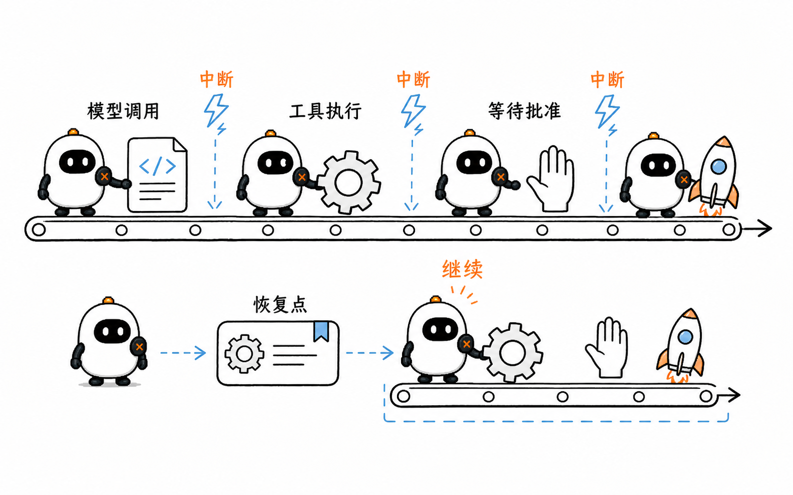
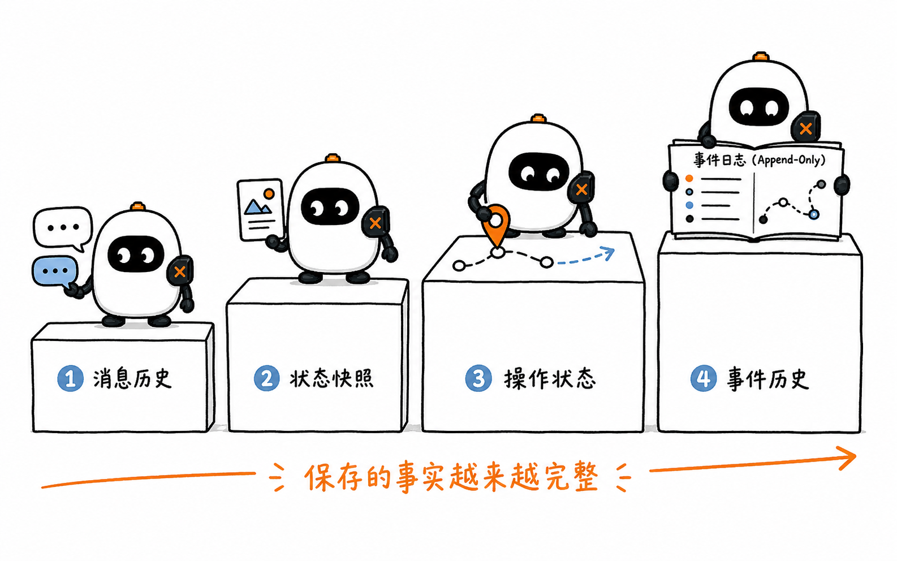
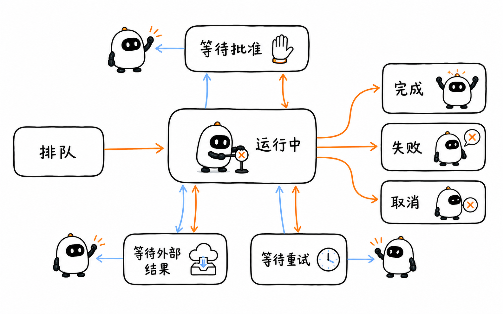
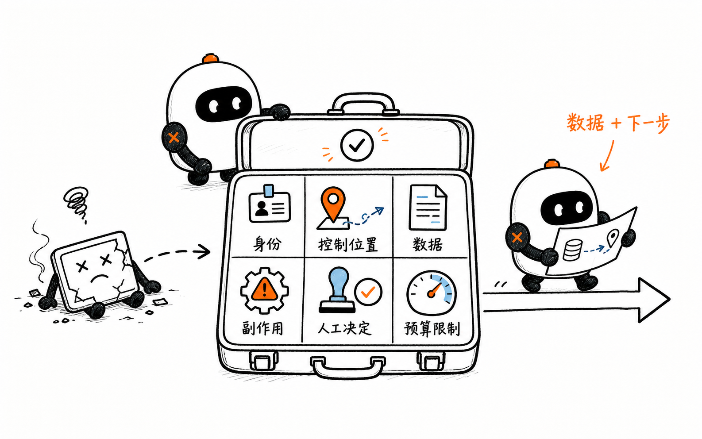
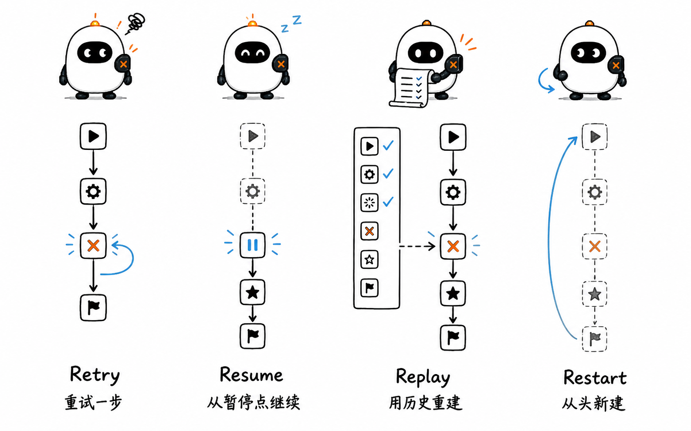
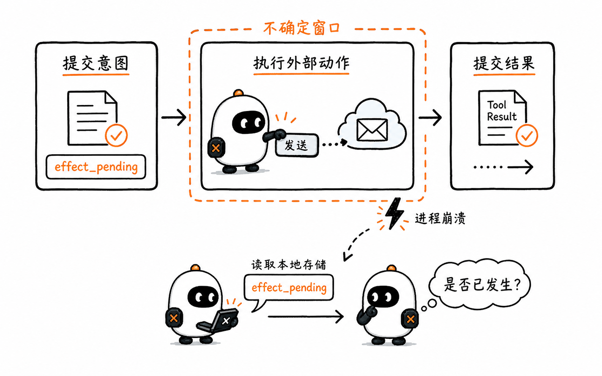
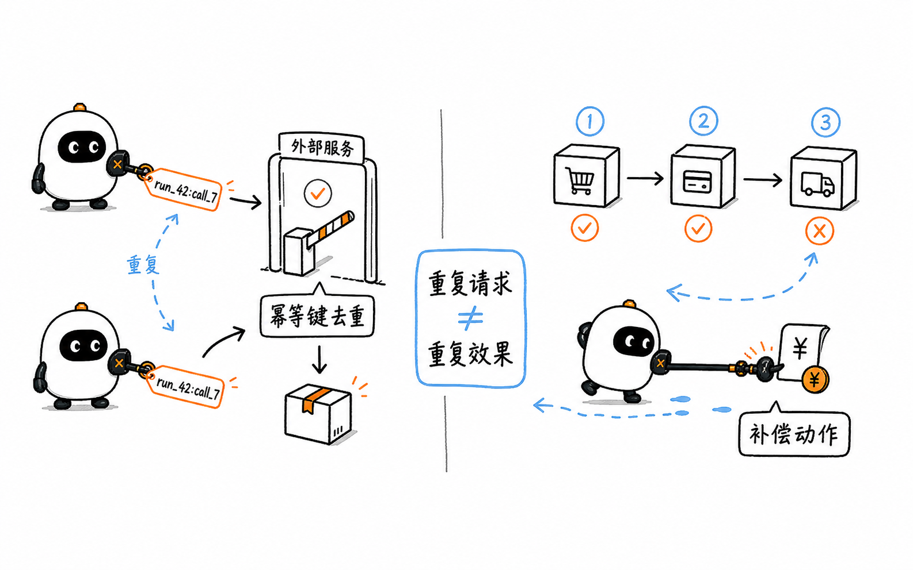
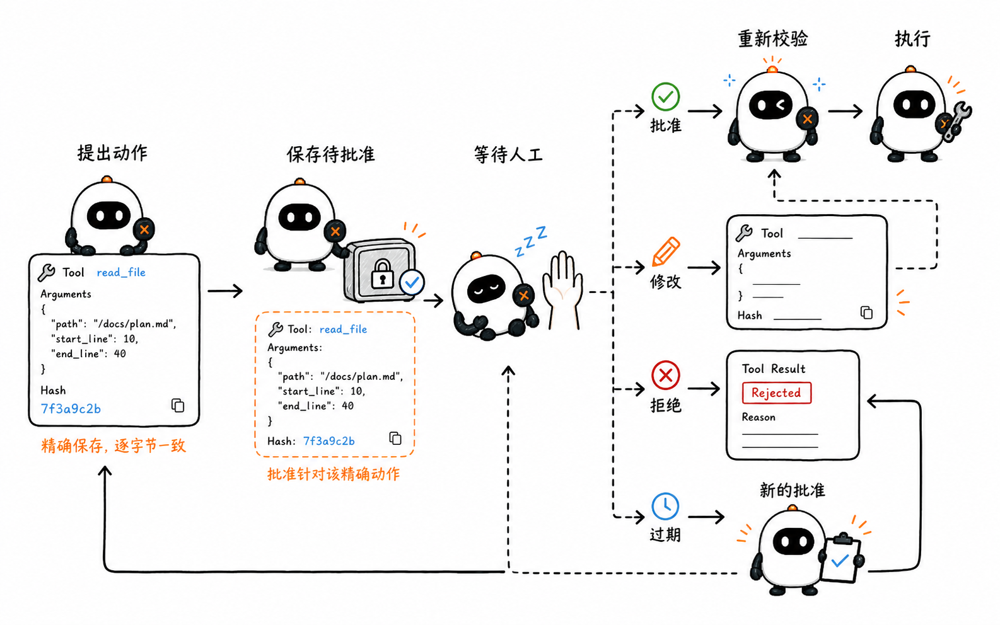
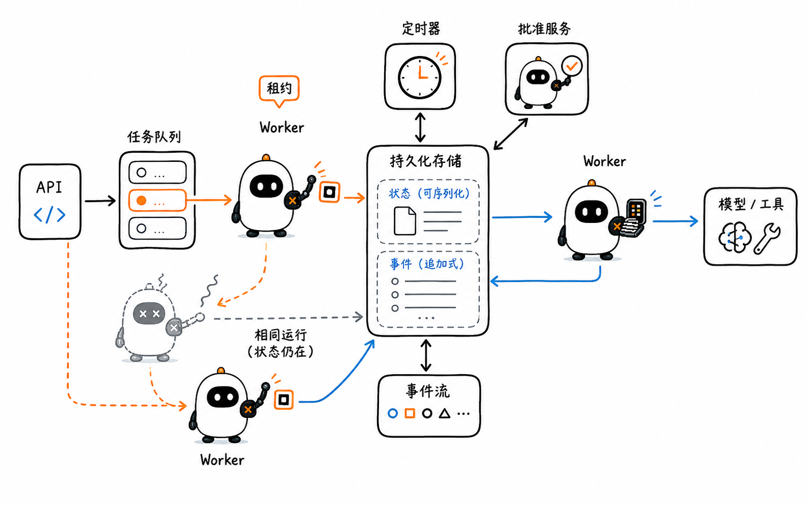
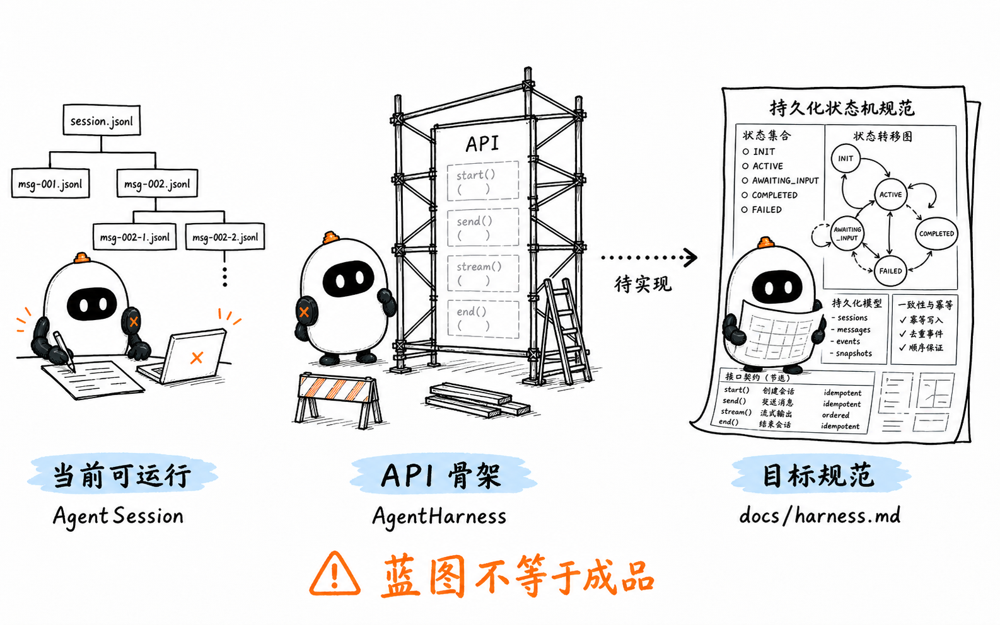

# Durable Execution 与 Human-in-the-loop：任务中断后，系统怎样安全继续

这是 learn-pi-agent 的第 16 章。上一章把 Agent 的动作放进真实执行环境：模型提出 Tool Call，Runtime、策略、批准、执行器与 Sandbox 共同决定动作能否发生。

现在把时间拉长。一次任务可能运行几十分钟，等待人工批准几个小时，甚至跨过进程重启。此时，系统不仅要保存“聊过什么”，还要知道：

1. 哪些步骤已经确认完成；
2. 下一步应该从哪里继续；
3. 某个外部动作是否可能已经发生；
4. 等待批准时，究竟在等谁决定哪一个动作；
5. 重试、恢复和取消怎样避免制造重复副作用。

这些问题共同组成 **Durable Execution（持久化执行）**。Human-in-the-loop 也不再只是弹出一个确认框，而是运行状态机中的一种可持久化等待状态。



> **版本说明**：Pi 行为对应源码基线 `086c32e74530564922d011ade23ff582c9d63116`。Pi、OpenAI Background mode、OpenAI Agents SDK、LangGraph 与 Temporal 文档核对日期为 `2026-08-24`。Pi 固定版本的 `docs/harness.md` 是实现规范，`AgentHarness` 运行 API 仍是 scaffold；本章会把当前可运行代码、API 骨架和目标设计分别标明。

## 1. Background 不等于 Durable

先看一个持续较久的任务：

```text
分析仓库 → 修改代码 → 运行测试 → 等待发布批准 → 发布 → 通知用户
```

如果 HTTP 连接断开，但服务器上的任务仍在运行，这叫**后台执行**。如果任务进程也崩溃，而新进程能够识别已完成步骤、恢复等待状态并继续推进，才进入**持久化执行**的问题。

| 能力 | 回答的问题 | 单独具备它仍缺少什么 |
| --- | --- | --- |
| Streaming | 结果怎样持续传给客户端？ | 断线后任务是否仍在运行 |
| Background / Async | 客户端不保持连接时，任务能否继续？ | 进程崩溃后从哪里恢复 |
| Session persistence | 过去的消息能否重新读取？ | 正在执行的步骤和未确认副作用 |
| Checkpoint | 哪个状态已经可靠保存？ | 外部动作能否安全重试 |
| Durable Execution | 失败后怎样从已确认状态继续推进？ | 仍需定义幂等、权限、版本和人工处置策略 |

OpenAI Responses API 的 Background mode 是一个清晰例子：创建 Response 时设置 `background: true`，服务端异步执行；客户端保存 Response ID，之后轮询 `queued` 或 `in_progress`，也可以取消正在执行的 Response。这解决了“一次模型响应不必绑在当前网络连接上”。

但一个完整 Agent 还可能在这条 Response 前后执行本地 Tool、等待批准、更新数据库和发送通知。Provider 的后台 Response 只覆盖它自身的异步生命周期，不会自动替整个 Agent 保存 Workflow 状态。

可以先记住：

> Background 描述任务是否依赖当前客户端连接；Durable 描述状态怎样提交、失败后怎样恢复。

## 2. 从保存消息到保存程序位置

“保存状态”至少有四个不同层次。



### 2.1 消息历史：保存发生过的对话

消息历史可以记录：

```text
User: 请发布版本 1.2.0
Assistant: 我准备运行测试
Tool Result: 128 个测试通过
Assistant: 我准备执行发布
```

它很适合重建模型 Context，却未必能回答“发布请求是否已经发送，只是 Tool Result 尚未来得及写入”。消息是交互事实，不一定是完整的执行状态。

### 2.2 状态快照：保存此刻的数据

快照可以保存当前任务数据：

```json
{
  "runId": "run_42",
  "status": "waiting_approval",
  "version": "1.2.0",
  "testsPassed": true
}
```

这比消息更结构化，但 `status` 只有一个字符串仍然不够。恢复程序还要知道正在等待哪个动作、动作参数是什么、由谁批准、批准是否过期，以及恢复后应该进入哪一段代码。

### 2.3 操作状态：保存数据和下一步控制位置

一个可恢复的操作状态通常同时保存：

- 当前 Run 和 Operation 的稳定 ID；
- 已完成阶段与下一阶段；
- 本轮需要使用的模型、工具和配置版本；
- 待批准动作的完整参数与摘要；
- 已发出但尚未确认的外部请求；
- 重试次数、下一次重试时间和错误类别；
- 取消标记、预算和截止时间；
- 已提交输出与下一步需要读取的结果。

这类状态相当于一个持久化的**程序计数器**：进程重新启动后，不需要从零猜测，而是读取状态并进入对应分支。

### 2.4 事件历史：用已发生事件重建状态

另一种实现不直接保存完整程序栈，而是追加记录“Workflow 已启动”“Activity 已调度”“结果已完成”“Timer 已触发”等事件。恢复时，运行时重新执行确定性 Workflow 代码，并让代码产生的命令与历史事件对齐。

Temporal 采用这种 record-and-replay 思路：Event History 是持久化事实，Workflow 通过重放重建本地状态；网络请求、数据库写入和模型调用等容易失败或不确定的动作放入 Activity。

因此，Checkpoint 有两种常见实现形态：

```text
完整状态快照 → 直接读取当前状态并继续
事件历史重放 → 重跑确定性控制代码，重建到最后已确认位置
```

二者都需要回答同一个问题：**恢复时，哪一个事实是可信的最后提交点？**

## 3. Durable Run 是一台持久化状态机

长任务不应该只用 `running: true/false` 表示。下面是一组更有用的状态：



```text
queued
  ↓ worker 取得任务
running
  ├─→ waiting_approval ──批准/拒绝/超时──┐
  ├─→ waiting_external ──结果/超时───────┤
  ├─→ retry_scheduled ──计时到达─────────┤
  ├─→ completed                          │
  ├─→ failed                             │
  └─→ cancelled                          │
                   └─────────────────────→ running
```

每次状态转移都要有明确触发条件：

| 当前状态 | 允许的输入 | 下一状态示例 |
| --- | --- | --- |
| `queued` | Worker 获得租约 | `running` |
| `running` | Tool 需要批准 | `waiting_approval` |
| `waiting_approval` | 有效批准 | `running` / `effect_pending` |
| `waiting_approval` | 拒绝 | `running`，并把拒绝结果交回 Agent |
| `waiting_external` | 外部 Response 完成 | `running` |
| `retry_scheduled` | Durable Timer 到期 | `running` |
| 任意非终态 | 取消请求 | `cancelled` 或进入取消协调阶段 |
| `running` | 得到最终结果 | `completed` |

### 3.1 Checkpoint 应该保存什么



可以把一个 Checkpoint 拆成六组信息：

| 组 | 典型字段 | 为什么需要 |
| --- | --- | --- |
| 身份 | `runId`、`operationId`、`stepId`、`toolCallId` | 把恢复、批准与结果关联到同一件事 |
| 控制 | `phase`、`nextAction`、`attempt` | 知道从哪个分支继续 |
| 数据 | 已确认输入、结果、消息 Entry ID | 重建下一步所需 Context |
| 副作用 | intent、参数摘要、idempotency key、replay policy | 判断是否可以重放 |
| 人工决定 | reviewer、decision、reason、policyVersion、expiry | 验证批准仍适用于当前动作 |
| 运行限制 | deadline、token/tool/cost budget、cancelRequested | 恢复后不绕过原有约束 |

不要把任意进程内对象直接序列化成 Checkpoint。文件句柄、网络连接、闭包、AbortController 和正在运行的子进程通常不能跨进程恢复。应该保存它们的稳定身份和可重建配置，例如文件路径、Provider Response ID、进程任务 ID 或取消状态。

### 3.2 等待期间不必占住一个进程

进入 `waiting_approval` 或 `waiting_external` 后，运行时可以：

1. 原子提交当前状态；
2. 释放 Worker、内存和网络连接；
3. 等到批准、Webhook、轮询结果或 Timer 到来；
4. 由任意可用 Worker 读取同一个 Run 并继续。

“等待三天后恢复”依赖的是持久化状态、队列和唤醒事件，不是让同一个 JavaScript Promise 在内存里挂三天。

## 4. Retry、Resume、Replay 与 Restart 不是同一个动作



| 词 | 从哪里开始 | 常见用途 | 最大风险 |
| --- | --- | --- | --- |
| Retry | 再执行失败的同一步或一次请求 | 临时网络错误、限流 | 重复副作用 |
| Resume | 从保存的暂停状态继续 | 人工批准、外部任务完成 | 状态或代码版本不兼容 |
| Replay | 用历史重新运行确定性控制逻辑 | 重建 Workflow 内存状态 | 非确定性代码得到不同命令 |
| Restart | 创建新 Run，从任务起点开始 | 原 Run 无法安全恢复 | 重复全部已完成工作 |
| Recovery | 恢复过程的总称 | 崩溃、迁移、Worker 丢失 | 没有明确语义时容易混用以上动作 |

### 4.1 Retry 要区分错误类型

适合重试的通常是短暂错误：

- 网络连接暂时失败；
- Provider 返回限流或服务不可用；
- Worker 租约丢失，但尚未开始副作用；
- 依赖服务明确返回“请求未被接受”。

不应盲目重试的通常是：

- 参数校验失败；
- 权限被拒绝；
- 用户明确 Reject；
- 业务规则不允许；
- 外部动作是否成功处于未知状态；
- 重试不会改变结果的永久错误。

重试策略至少要包含最大尝试次数、指数退避、随机抖动、总截止时间和不可重试错误分类。否则“自动恢复”可能变成无限花费模型 token 或反复调用高影响 Tool。

### 4.2 Replay 要求控制逻辑确定

如果 Workflow 重放时直接调用当前时间、随机数、网络 API 或模型，第二次执行可能选择不同分支。可靠的 record-and-replay 系统会把这些值作为历史事件或 Activity 结果记录下来；重放时读取旧结果，而不是再次产生新结果。

模型生成天然具有不确定性，也会产生费用，所以模型调用应被视为外部 Activity 或 Effect：

```text
Workflow 决定“需要一次模型响应”
    ↓
运行时持久化请求意图
    ↓
Provider 执行模型调用
    ↓
运行时持久化响应和 usage
```

Workflow 重放只重建“这里需要模型结果”的决定；已经确认的模型结果应该从历史读取。

## 5. 最难的是外部副作用

假设 Agent 要发送一封邮件：

```text
数据库记录：准备发送
        ↓
邮件服务：邮件已发送
        ↓
数据库记录：发送完成
```

如果进程在邮件服务成功后、写入“发送完成”前崩溃，恢复程序只能看到“准备发送”。邮件可能已经发出，也可能没有。这段无法由本地状态单独判断的区域，就是**不确定窗口**。



### 5.1 Effect sandwich：意图、动作、结算

Pi 的 `docs/harness.md` 目标规范把外部动作包在两次持久化提交之间：

```text
提交 intent / effect_pending
        ↓
执行 Provider 请求或真实 Tool      ← 不确定窗口
        ↓
提交 settlement / Tool Result / 下一状态
```

第一次提交保证恢复程序知道“这个动作可能已经开始”；第二次提交保证结果已经成为可信历史。它不能消灭不确定窗口，却能把不确定性变成显式状态，从而选择恢复策略。

### 5.2 “Exactly once”需要谨慎表达

一个运行时可以保证 Workflow 最终只观察到一个完成结果，却不代表底层 Tool 只执行了一次。Temporal 官方文档也明确区分：Activity 完成结果被观察为一次，但 Activity 本身可能执行多次，甚至部分完成多次。

常见语义是：

| 语义 | 做法 | 代价 |
| --- | --- | --- |
| At-most-once | 不确定时不重放 | 可能漏执行 |
| At-least-once | 没有确认结果就重试 | 可能重复执行 |
| Effectively-once | 允许重试，用幂等键或去重让最终业务效果只出现一次 | 需要外部系统配合 |

跨越两个独立系统时，没有共同事务或外部去重机制，单靠 Agent 本地 Checkpoint 无法凭空获得真正的 exactly-once 副作用。

### 5.3 幂等键、去重与补偿



**幂等键**把同一个逻辑动作的多次请求关联起来：

```text
runId + toolCallId
→ idempotencyKey = "run_42:call_7"
```

第一次请求执行并保存结果；相同 key 再次到达时，外部服务返回第一次结果，不再制造第二次业务效果。稳定 key 必须来自持久化身份，不能在每次 Retry 时重新随机生成。

并非所有系统都支持幂等键。还可以采用：

- 业务唯一约束，例如同一订单号只能创建一次付款；
- 本地去重表与 transactional outbox；
- 查询外部系统，确认目标状态是否已经达到；
- 对不可安全重放的动作转入人工处理；
- 用补偿动作抵消已完成步骤。

Sagas 论文把长事务拆成一系列可提交子事务，并为已完成步骤定义补偿事务。补偿不是“时光倒流”：发出的邮件无法收回，只能发送更正；已经产生的外部影响也可能被用户看见。因此，补偿必须是业务设计的一部分。

### 5.4 Replay policy 表达不确定时怎么办

Pi 目标规范为 Harness Tool 引入：

```ts
type HarnessTool = AgentTool & {
  replay?: "never" | "safe";
};
```

固定源码中的公开类型已经有这个字段，但 Durable 执行逻辑尚未完成。规范预期的恢复语义是：

- `safe`：读取、查询等可以重复执行的动作，可用已保存参数重放；
- `never`：删除、发送、付款等不应直接重复执行；恢复时生成 interrupted error 或转人工处置。

`safe` 不是由模型临时决定的形容词，而应是 Tool 作者和宿主基于真实副作用做出的契约。

## 6. Human-in-the-loop 是一段可恢复控制流

人工批准最安全的位置是**动作执行之前**：

```text
模型提出动作
  ↓
解析并校验参数
  ↓
保存待批准动作
  ↓
暂停 Run，释放 Worker
  ↓
人批准 / 修改 / 拒绝 / 超时
  ↓
重新校验决定与当前动作
  ↓
执行或把拒绝结果写回 Agent
```



### 6.1 批准的对象必须足够具体

一次 Approval Request 至少应展示并保存：

- Run、Step 与 Tool Call ID；
- Tool 名称和完整参数；
- 参数的规范化摘要或 hash；
- 目标资源、影响范围和风险说明；
- 请求批准时使用的策略版本；
- 发起时间、过期时间和当前状态；
- 允许作出决定的用户或角色。

只显示“是否允许运行 Shell？”过于宽泛。用户应该批准一个具体动作，例如：

```text
工具：publish_release
仓库：Jialei-03/learn-pi-agent
版本：v1.2.0
产物摘要：sha256:...
影响：创建公开 Release，不可静默撤回
```

### 6.2 Approve、Edit 与 Reject 的语义

| 决定 | 应发生什么 |
| --- | --- |
| Approve | 仅允许保存的那一个具体动作进入执行阶段 |
| Edit | 产生新的动作参数和新的 action hash，再重新校验策略；高风险修改通常应重新批准 |
| Reject | 不执行 Tool，把结构化拒绝结果写回运行状态，让 Agent 改方案或结束 |
| Expire | 旧批准失效；若仍需要执行，应重新提出请求 |

Edit 不能偷偷修改已批准动作后沿用旧决定。否则用户批准的是 A，系统实际执行的却是 B。

Reject 也不一定等于整个 Run 失败。可以把拒绝表示成 Tool Result：

```json
{
  "toolCallId": "call_7",
  "isError": true,
  "content": "用户拒绝发布：请先补充回滚说明"
}
```

Agent 可以据此准备新方案。是否允许继续由外层 Workflow、预算和策略共同决定。

### 6.3 恢复前要再次验证

批准和执行之间可能隔了数小时，期间这些事实可能变化：

- 文件内容和 Git commit 已改变；
- 目标订单已经取消；
- 用户权限被撤销；
- 策略版本更新；
- 凭据过期；
- Tool 实现升级；
- Deadline 已到。

因此，恢复时要验证 action hash、资源版本、批准身份、过期时间和当前策略。若动作已变化，回到 `waiting_approval`，不要沿用旧批准。这是在避免 **time-of-check to time-of-use（检查与使用之间状态变化）**。

### 6.4 批准状态本身也要版本化

OpenAI Agents SDK 的官方 Human-in-the-loop 流程会在 Tool 执行前产生 `interruptions`，应用通过 `RunState.approve()` 或 `reject()` 写入决定，再把同一个 `RunState` 交回 Runner。`RunState` 可以序列化，较长时间后恢复；官方也特别提醒，长期保存待批准任务时要记录 Agent 与 SDK 版本，并用兼容版本反序列化。

这说明 Approval 不是一个瞬时 UI 事件。它属于 Run State，必须和生成它的 Agent 图、Tool 定义与运行版本一起管理。

## 7. 一套后台 Agent 还需要哪些运行部件



一个能够跨进程运行的 Agent 服务通常包含：

| 部件 | 职责 |
| --- | --- |
| API / Command Handler | 创建 Run、读取状态、提交批准、取消任务 |
| Durable Store | 保存状态、消息、结果、预算、批准与事件 |
| Task Queue | 把可运行步骤交给 Worker |
| Worker | 取得租约，执行一次有界步骤，提交新状态 |
| Timer / Scheduler | 唤醒 Retry、Deadline 与 Approval expiry |
| Approval Service | 鉴权、展示动作、记录决定与审计信息 |
| Event Stream | 向 UI 推送状态、文本增量、工具进度与终态 |
| Reconciler | 处理租约丢失、未知副作用和卡住的 Run |

### 7.1 Worker lease 与 heartbeat

队列的消息交付可能重复，两个 Worker 也可能先后拿到同一个任务。运行时需要租约或版本条件：

```text
读取 run_42，version = 18
取得 lease，owner = worker_A，expiresAt = ...
执行一个有界步骤
仅当 version 仍为 18 且 lease 仍属于 worker_A 时提交 version = 19
```

长 Tool 可以发送 heartbeat，表示仍在工作并报告进度。Heartbeat 不是完成结果；Worker 崩溃、租约过期后，系统仍要根据 replay policy 决定能否重试。

### 7.2 取消是请求，不是瞬间事实

用户点击取消时，可以先持久化 `cancelRequested`，再向当前模型请求、Tool 进程或远程任务传播 AbortSignal。外部系统可能已经完成，也可能不支持取消，所以 Run 常常需要一个取消协调阶段：

```text
cancel requested
  ↓ 停止派发新步骤
  ↓ 尝试取消正在运行的外部动作
  ↓ 等待结算或记录未知状态
cancelled / failed / needs_review
```

“客户端停止等待”与“副作用已经停止”不是同一件事。

### 7.3 预算也必须随 Checkpoint 恢复

长任务的限制应写入持久化状态：

- 最大模型调用次数；
- 最大 Tool 调用次数；
- token 与费用上限；
- 最大并发数；
- 单步 timeout 与 Run deadline；
- 最大 Retry 次数；
- Approval expiry。

若预算只保存在 Worker 内存里，进程重启可能把计数清零，让任务无限继续。

## 8. Pi 固定源码要分成三层阅读



### 8.1 可运行层：coding-agent `AgentSession`

Pi 当前 coding-agent 使用 `SessionManager` 把会话组织成 append-only JSONL 消息树。`AgentSession` 的事件处理器在 `message_end` 时保存消息：

```ts
// 摘自固定源码的控制关系，省略 custom message 分支。
if (event.type === "message_end") {
  if (
    event.message.role === "user" ||
    event.message.role === "assistant" ||
    event.message.role === "toolResult"
  ) {
    this.sessionManager.appendMessage(event.message);
  }
}
```

重新打开 Session 时，`buildSessionContext()` 沿当前 `leafId` 选择活动分支、应用 Compaction，并投影为 `AgentMessage[]`。这能恢复对话 Context、模型和 thinking 设置。

如果消息历史末尾留下没有结果的 Tool Call，`pi-ai` 的 Provider 适配层会补一条错误 Tool Result：

```text
No result provided
```

它的目的，是让下一次模型 API 请求满足 Tool Call / Tool Result 配对要求。这不会重新执行原 Tool，也不能证明原动作是否发生。

所以，这条可运行路径提供的是：

```text
会话和消息恢复
≠
任意执行位置的 Durable Resume
```

### 8.2 API 骨架：`AgentHarness`

固定版本已经定义 `RunOutcome`、`SuspendedOperation`、Lane、队列和 `replay?: "never" | "safe"` 等公开类型，也提供 `createCodingAgentHarness()` 装配 Tool 与 System Prompt。

但实际运行方法尚未完成：

```ts
class AgentHarness {
  static async create(options: AgentHarnessOptions) {
    const [record] = await options.session.findRecords({ limit: 1 });
    if (record !== undefined) {
      throw new HarnessNotImplemented("create.restore");
    }
    return { harness: new AgentHarness(options), suspended: [] };
  }

  async prompt(/* ... */): Promise<RunResult> {
    return this.unavailable("prompt");
  }

  async resume(): Promise<ResumeResult> {
    return this.unavailable("resume");
  }
}
```

`abort()`、`compact()`、`navigateTree()`、队列和 Lane 运行路径也采用同样的 `HarnessNotImplemented` scaffold。类型存在，不能推导出行为已经可用。

### 8.3 目标设计：`docs/harness.md`

这份文档标题是 **AgentHarness — implementation specification**。它描述未来实现应具备的完整语义：

- 不可变 Entry、可变 Facts、Lane 与 Usage ledger；
- `op.meta` 保存操作身份与意图；
- `op.state` 保存完整当前状态，作为 durable program counter；
- 每次转移原子替换完整 operation state；
- Provider 与 Tool 采用 intent → effect → settlement；
- 崩溃后根据 `safe` / `never` 选择重放或合成 interrupted result；
- 结束时删除 operation state，并保存 Lane 的最终结果。

它是一份很有价值的 Harness Engineering 资料，但应写成“规范要求”“目标设计”或“若实现完成”，不能写成“Pi 当前会这样恢复”。

### 8.4 固定源码现在能证明什么

| 结论 | 固定源码能否证明 |
| --- | --- |
| coding-agent 会在消息结束时保存消息 | 能 |
| JSONL Session 能恢复活动对话分支 | 能 |
| Tool Call 缺失结果时可做协议级修复 | 能 |
| `AgentHarness` 计划支持 Lane、Suspend、Resume 与 replay policy | 能，从公开类型和规范可见 |
| 当前 `AgentHarness.prompt()` 能执行一次 durable run | 不能，固定代码明确抛出 `HarnessNotImplemented` |
| 当前 Pi 能在任意 Tool 中点崩溃后无重复恢复 | 不能 |

阅读正在快速演进的 Agent 仓库时，“接口已经定义”“文档已经设计”“功能已经落地并通过测试”是三个不同证据等级。

## 9. 用 Pi 规范命名写一个最小教学实现

下面的 TypeScript 借用 Pi 规范中的 `effect_pending`、`replay` 和 Tool Call 命名，展示持久化边界。它是可编译的教学简化代码，不是 Pi 固定版本的源码。

### 9.1 用联合类型限制合法状态

```ts
type ReplayPolicy = "safe" | "never";

type ToolAction = {
  runId: string;
  toolCallId: string;
  toolName: string;
  arguments: Record<string, unknown>;
  actionHash: string;
  idempotencyKey: string;
  replay: ReplayPolicy;
};

type ApprovalRecord = {
  decision: "approved";
  reviewerId: string;
  actionHash: string;
  policyVersion: string;
  decidedAt: string;
  expiresAt: string;
};

type ToolOutput = {
  content: string;
  isError: boolean;
};

type DurableRunState =
  | {
      phase: "ready_for_model";
      runId: string;
      nextStep: number;
    }
  | {
      phase: "waiting_approval";
      runId: string;
      nextStep: number;
      action: ToolAction;
      requestedAt: string;
    }
  | {
      phase: "effect_pending";
      runId: string;
      nextStep: number;
      action: ToolAction;
      approval: ApprovalRecord;
    }
  | {
      phase: "completed";
      runId: string;
      finalText: string;
    }
  | {
      phase: "needs_review";
      runId: string;
      reason: string;
    };
```

这个联合类型让每个 `phase` 只携带该阶段必需的数据。例如，只有 `effect_pending` 才同时拥有待执行动作和已经确认的批准记录。

### 9.2 Store 的提交边界

```ts
interface DurableStore {
  load(runId: string): Promise<DurableRunState | undefined>;

  // 原子替换当前 operation state。
  save(state: DurableRunState): Promise<void>;

  // 原子保存 Tool Result，并把运行位置推进到下一次模型调用。
  settleTool(input: {
    runId: string;
    toolCallId: string;
    output: ToolOutput;
    nextState: DurableRunState;
  }): Promise<void>;
}

interface ToolExecutor {
  execute(action: ToolAction): Promise<ToolOutput>;
}
```

`settleTool()` 不应先保存 Tool Result、稍后再保存下一状态；这两项要在同一个事务中提交，否则恢复时可能看到结果已经存在但程序位置仍停在旧阶段。

### 9.3 执行批准后的动作

```ts
async function executeApprovedTool(
  waiting: Extract<DurableRunState, { phase: "waiting_approval" }>,
  approval: ApprovalRecord,
  store: DurableStore,
  executor: ToolExecutor,
): Promise<void> {
  // ① 批准必须属于当前这组精确参数。
  if (approval.actionHash !== waiting.action.actionHash) {
    throw new Error("Approval does not match the current tool action");
  }

  // ② 过期批准不能继续使用。
  if (Date.parse(approval.expiresAt) <= Date.now()) {
    throw new Error("Approval has expired");
  }

  const pending: DurableRunState = {
    phase: "effect_pending",
    runId: waiting.runId,
    nextStep: waiting.nextStep,
    action: waiting.action,
    approval,
  };

  // ③ 先可靠记录“动作可能开始”，再触发外部副作用。
  await store.save(pending);

  // ④ 外部系统最好使用 action.idempotencyKey 去重。
  const output = await executor.execute(waiting.action);

  // ⑤ Tool Result 与下一控制位置一起原子提交。
  await store.settleTool({
    runId: waiting.runId,
    toolCallId: waiting.action.toolCallId,
    output,
    nextState: {
      phase: "ready_for_model",
      runId: waiting.runId,
      nextStep: waiting.nextStep + 1,
    },
  });
}
```

代码中的关键顺序是：

```text
验证批准
→ 保存 effect_pending
→ 执行 Tool
→ 原子保存 Tool Result 与下一状态
```

### 9.4 恢复未知结果

```ts
async function recoverEffectPending(
  state: Extract<DurableRunState, { phase: "effect_pending" }>,
  store: DurableStore,
  executor: ToolExecutor,
): Promise<void> {
  if (state.action.replay === "safe") {
    // 相同 idempotencyKey 必须沿用，不能为 Retry 生成新 key。
    const output = await executor.execute(state.action);
    await store.settleTool({
      runId: state.runId,
      toolCallId: state.action.toolCallId,
      output,
      nextState: {
        phase: "ready_for_model",
        runId: state.runId,
        nextStep: state.nextStep + 1,
      },
    });
    return;
  }

  // unsafe Tool 不能因为“没有看到结果”就自动再执行。
  await store.save({
    phase: "needs_review",
    runId: state.runId,
    reason:
      `Tool ${state.action.toolName} may have executed, ` +
      "but no durable result was recorded",
  });
}
```

这段代码没有声称消灭不确定窗口。它只是让未知状态可识别，并把 `safe` 与 `never` 的恢复选择写进类型和控制流。

## 10. 四种主流实现怎样表达这些概念

| 系统 | 保存或暴露的核心状态 | 暂停 / 恢复方式 | 重要边界 |
| --- | --- | --- | --- |
| OpenAI Background mode | Provider Response 与状态 | 保存 Response ID，轮询或续接 Stream；可取消 | 覆盖一次异步 Response，不等于整个 Agent Workflow durable |
| OpenAI Agents SDK HITL | `RunState`、`interruptions`、Approval decision | 序列化 State，`approve/reject` 后把同一 State 交回 Runner | 长期暂停要管理 Agent/SDK 版本；不是所有模糊输出状态都允许恢复 |
| LangGraph | Graph State 与 Checkpoint | `interrupt()` 暂停，`Command(resume=...)` 恢复 | 恢复会从节点开头重新执行；interrupt 前副作用应幂等或拆到其他节点 |
| Temporal | Event History、Workflow 状态、Activity 结果 | 重放确定性 Workflow；Activity、Signal、Timer 推进 | Activity 可能执行多次，写操作应幂等；模型调用应在 Activity 中 |

这四种机制解决的范围不同。比较产品时，不要只问“是否支持 Resume”，还要继续问：

1. Resume 的状态存在哪里？
2. 从哪一个边界继续？
3. 哪些代码会重新执行？
4. 外部副作用可能执行几次？
5. 待批准动作是否能跨进程和版本恢复？
6. 取消、过期与权限变化怎样处理？

## 11. 把整条链路放进一个发布任务

假设 Agent 要发布 `v1.2.0`：

```text
① 创建 run_42，状态 queued
② Worker 取得租约，读取固定 commit 与预算
③ 模型提出 run_tests，执行并原子保存 Tool Result
④ 模型提出 publish_release(call_7)
⑤ 校验参数，计算 actionHash 与 idempotencyKey
⑥ 保存 waiting_approval，释放 Worker
⑦ reviewer_9 批准精确的仓库、commit、tag 与产物 hash
⑧ 新 Worker 恢复，重新验证权限、commit、hash 和过期时间
⑨ 保存 effect_pending
⑩ 调用发布 API，携带 run_42:call_7 作为幂等键
⑪ 原子保存发布结果和 ready_for_model
⑫ 模型生成总结，Run 进入 completed
```

如果在第 10、11 步之间崩溃，系统读取 `effect_pending`。若发布 API 支持幂等键，可以用同一个 key 查询或重试；若不支持，就进入 `needs_review`，不能重新创建一个 Release 赌运气。

一套更完整的安全蓝图是：

```text
稳定身份
  + 明确状态机
  + 原子 Checkpoint
  + Effect intent / settlement
  + 幂等键、去重或补偿
  + 可持久化 Approval
  + 租约、Timer、Retry 与取消
  + 版本、预算与审计
```

## 12. 常见误解

### 12.1 “任务在后台运行，所以已经 Durable”

后台运行只说明客户端可以离开。进程崩溃后的恢复位置、副作用策略和状态提交仍需单独设计。

### 12.2 “保存 Session 就能续跑”

Session 可以恢复消息，却未必保存当前 Operation、下一阶段、Retry 计数和 effect_pending。继续对话与继续执行不是一个保证。

### 12.3 “Resume 就不会重复工作”

有的框架从节点边界恢复，有的通过历史重放，有的从序列化 Run State 继续。哪些函数会重新执行，要以框架语义和 Checkpoint 边界为准。

### 12.4 “Tool 没有 Result，说明没有执行”

结果可能在外部动作成功后、写回本地状态前丢失。缺少结算只说明结果未知。

### 12.5 “Retry 三次总比失败好”

对于付款、发送、删除和发布，盲目 Retry 可能扩大损失。先分类错误，再决定幂等重试、查询、补偿或人工处置。

### 12.6 “有确认弹窗就是 Human-in-the-loop”

如果待批准动作没有持久化，进程重启就无法恢复；如果只保存一个布尔值，又无法证明批准对应哪组参数。可靠 HITL 需要身份、动作、决定、版本和过期语义。

### 12.7 “用户批准后可以直接执行修改后的参数”

批准属于原动作。参数、目标资源或产物变化后，应产生新 action hash，并重新做策略判断；高风险变化需要重新批准。

### 12.8 “取消成功返回，就说明外部动作没有发生”

取消通常是协作请求。模型、子进程或远程服务可能已完成，最终状态要等结算或查询确认。

### 12.9 “当前 Pi `AgentHarness` 已经按规范完成恢复”

固定 commit 的 `AgentHarness` 运行方法明确返回 `HarnessNotImplemented`。`docs/harness.md` 是目标实现规范，不能把规范里的设计当作已运行代码。

## 13. 论文与工程背景

### 13.1 Sagas：长事务与补偿

Garcia-Molina 与 Salem 在 1987 年提出 Sagas：把长事务拆成一系列可以独立提交的子事务，并在后续失败时执行对应补偿。它为 Agent Workflow 中“已经发送、已经预订、已经修改”的跨系统动作提供了经典思考框架。

### 13.2 Durable Functions：record-and-replay 的形式语义

《Durable Functions: Semantics for Stateful Serverless》解释运行时怎样用记录—重放持续保存 Workflow 进度，并证明确定性编排下的恢复语义。它帮助理解为什么 Workflow 代码必须确定，而外部动作要隔离成 Effect / Activity。

### 13.3 Netherite：持久化执行的系统成本

Netherite 研究怎样通过分区、流水线式持久化和 group commit 提高 Serverless Workflow 的延迟与吞吐。它提醒我们：每一步都持久化会提高可靠性，也会带来 I/O、历史大小与调度开销；Checkpoint 粒度是正确性与性能的共同设计。

### 13.4 Guidelines for Human-AI Interaction

Amershi 等人在 CHI 2019 提出并验证 18 条 Human-AI Interaction 设计指南，包括让用户理解系统能力、支持纠正、提供适当控制和在失败时帮助恢复。Durable HITL 把这些交互原则落到工程状态：用户决定必须可理解、可追踪、可撤销或可纠正，而不是只有一个没有上下文的“允许”按钮。

## 本章小结

- Background 让任务脱离当前连接运行；Durable Execution 让任务在失败后从已确认状态继续。
- 消息历史、状态快照、操作状态与事件历史保存的是不同层次的事实。
- Checkpoint 不仅保存数据，还要保存下一控制位置、待处理 Effect、Retry、取消、预算和批准。
- Retry、Resume、Replay 与 Restart 的起点和语义不同。
- 外部动作存在 intent 已提交、动作可能成功、settlement 尚未提交的不确定窗口。
- Durable Runtime 不能凭空保证 exactly-once；写操作需要幂等键、去重、查询、补偿或人工处理。
- Human-in-the-loop 是 `waiting_approval → decision → revalidate → execute` 的持久化控制流。
- Pi 当前 coding-agent Session 能恢复消息树；固定版本的 `AgentHarness` 仍是 scaffold，`docs/harness.md` 描述目标 Durable Harness。
- 阅读演进中的源码时，要区分可运行实现、公开 API 骨架和实现规范。

## 下一章：Security、Guardrails 与 Governance

Durable Execution 解决任务怎样持续推进，但“允许谁在什么条件下推进哪些动作”仍需要安全与治理边界。下一章会系统区分 Input、Output 与 Tool Guardrail，解释身份、权限、最小权限、Prompt Injection、Tool Poisoning、数据泄漏、用户同意、审计和策略版本怎样进入同一条 Agent 运行链路。

## 参考资料

- [Pi coding-agent `AgentSession`：在 `message_end` 保存消息](https://github.com/earendil-works/pi/blob/086c32e74530564922d011ade23ff582c9d63116/packages/coding-agent/src/core/agent-session.ts)
- [Pi coding-agent `SessionManager`：JSONL 消息树与 Context 投影](https://github.com/earendil-works/pi/blob/086c32e74530564922d011ade23ff582c9d63116/packages/coding-agent/src/core/session-manager.ts)
- [Pi Provider 消息转换：为 orphaned Tool Call 合成错误结果](https://github.com/earendil-works/pi/blob/086c32e74530564922d011ade23ff582c9d63116/packages/ai/src/api/transform-messages.ts)
- [Pi `AgentHarness` API scaffold 与 `HarnessNotImplemented`](https://github.com/earendil-works/pi/blob/086c32e74530564922d011ade23ff582c9d63116/packages/agent/src/harness/agent-harness.ts)
- [Pi coding-agent Harness 装配入口](https://github.com/earendil-works/pi/blob/086c32e74530564922d011ade23ff582c9d63116/packages/coding-agent/src/server/create-harness.ts)
- [Pi `AgentHarness` implementation specification](https://github.com/earendil-works/pi/blob/086c32e74530564922d011ade23ff582c9d63116/packages/agent/docs/harness.md)
- [OpenAI Responses API：Background mode](https://developers.openai.com/api/docs/guides/background)
- [OpenAI Agents SDK：Human-in-the-loop](https://openai.github.io/openai-agents-js/guides/human-in-the-loop/)
- [LangGraph：Interrupts](https://docs.langchain.com/oss/python/langgraph/interrupts)
- [LangGraph：Persistence](https://docs.langchain.com/oss/python/langgraph/persistence)
- [Temporal：Workflow Execution 与 Replay](https://docs.temporal.io/workflow-execution)
- [Temporal：Event History](https://docs.temporal.io/encyclopedia/event-history)
- [Temporal：Activity、Retry 与 Idempotency](https://docs.temporal.io/activity-definition)
- [Garcia-Molina & Salem, Sagas](https://sigmodrecord.org/1987/12/09/sagas/)
- [Burckhardt et al., Durable Functions: Semantics for Stateful Serverless](https://www.microsoft.com/en-us/research/wp-content/uploads/2021/10/DF-Semantics-Final.pdf)
- [Burckhardt et al., Netherite: Efficient Execution of Serverless Workflows](https://www.microsoft.com/en-us/research/publication/netherite-efficient-execution-of-serverless-workflows/)
- [Amershi et al., Guidelines for Human-AI Interaction](https://www.microsoft.com/en-us/research/publication/guidelines-for-human-ai-interaction/)
