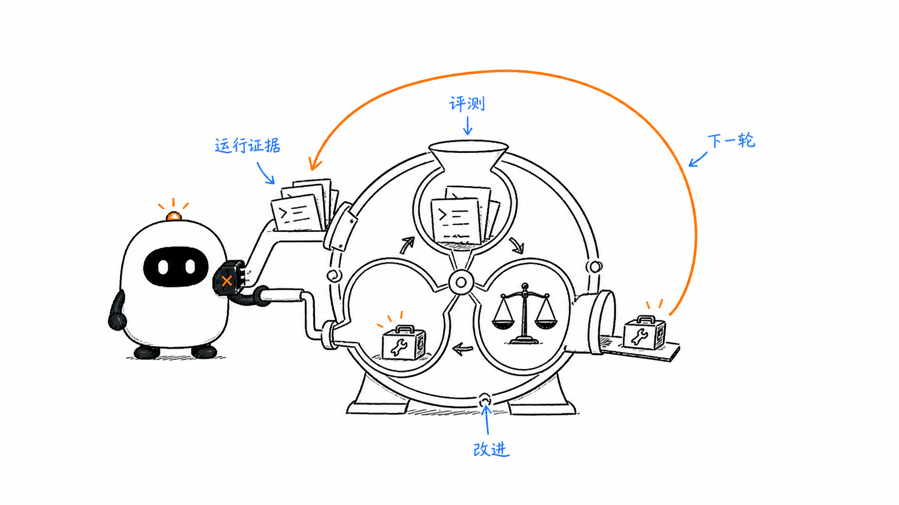
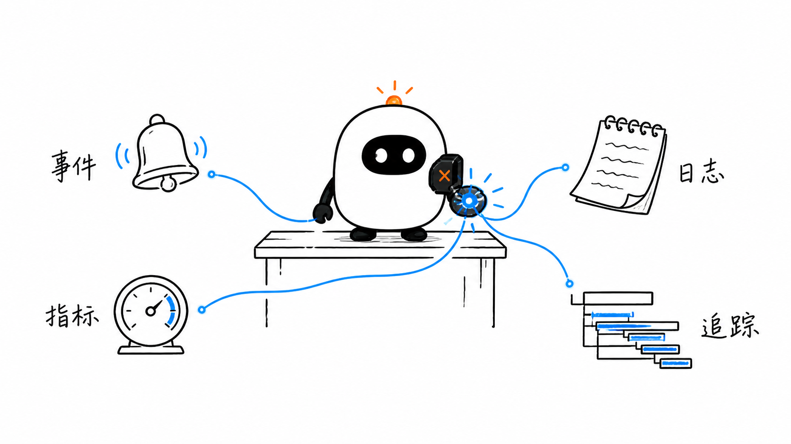
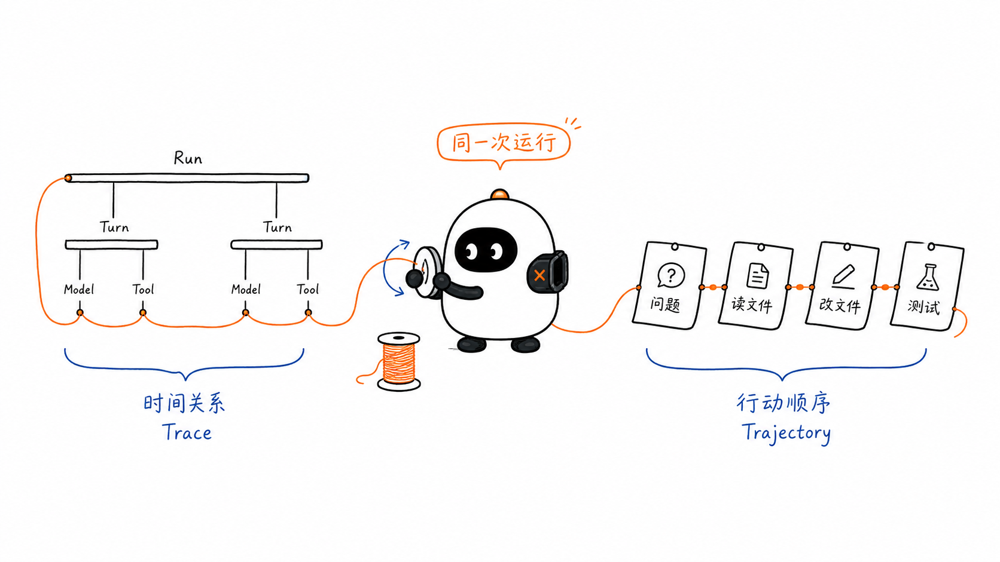
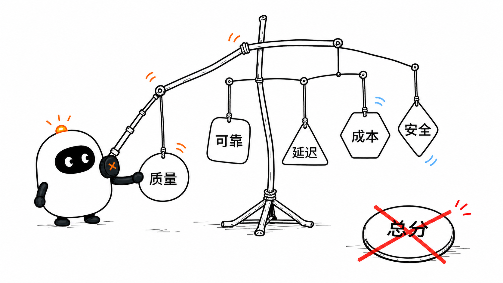
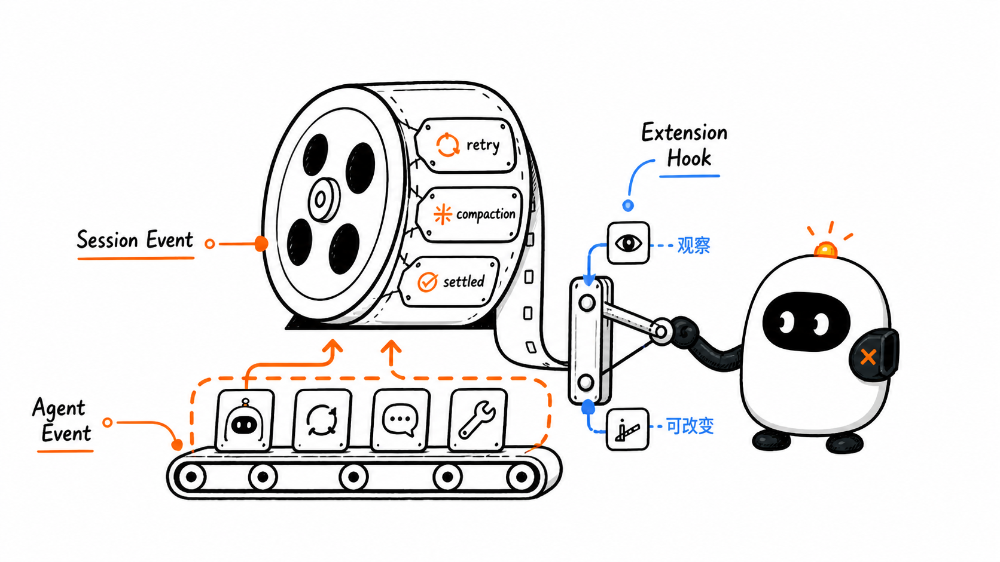
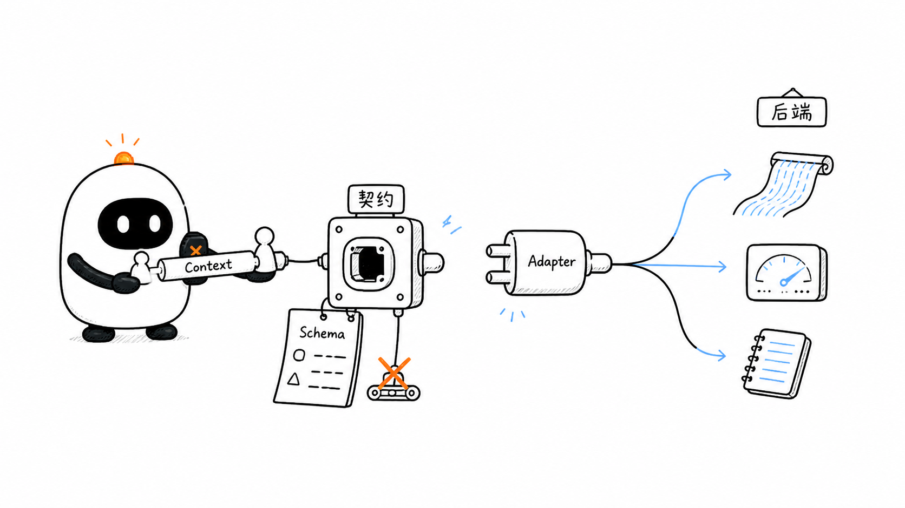
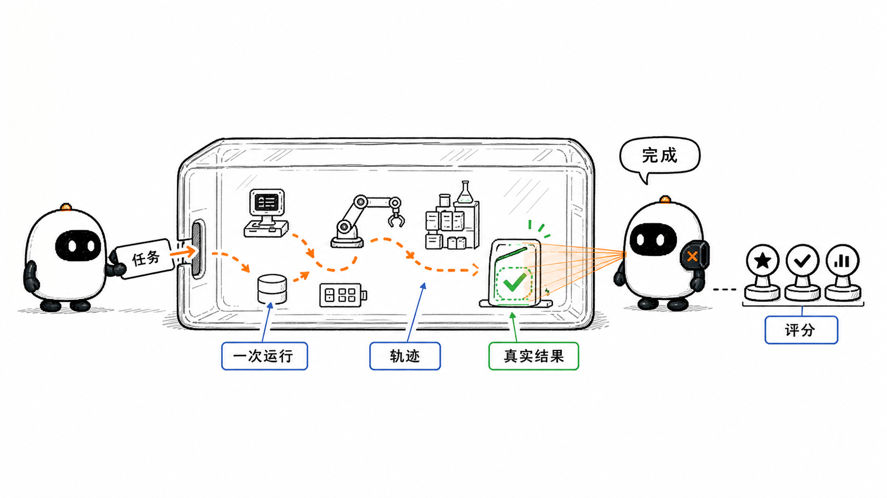
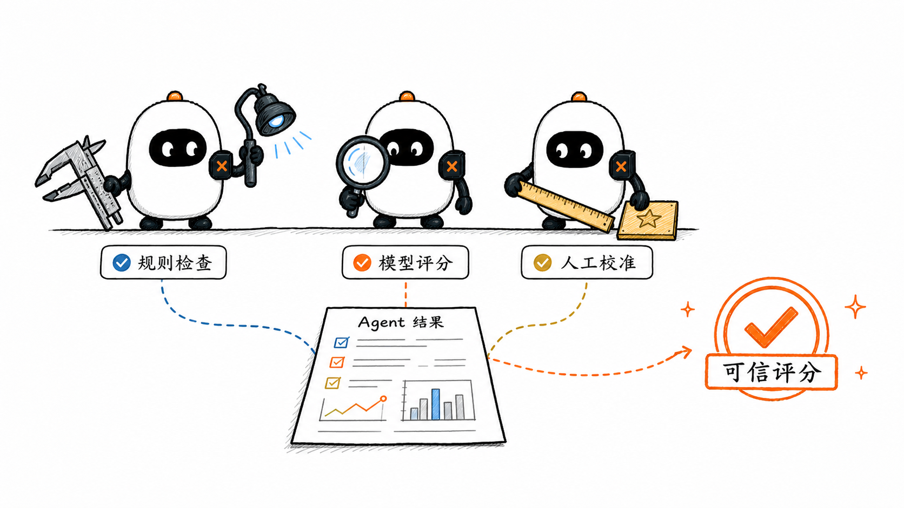
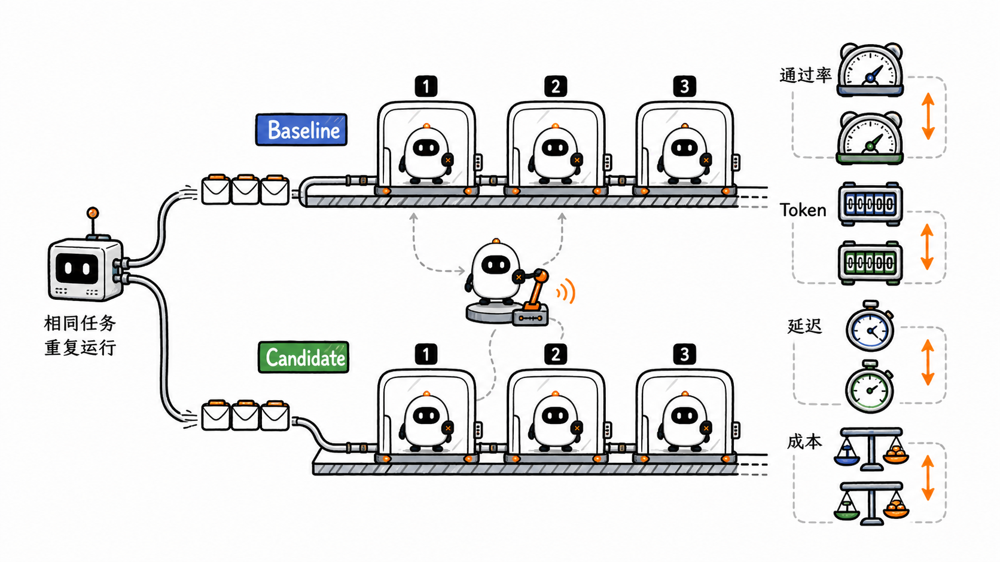
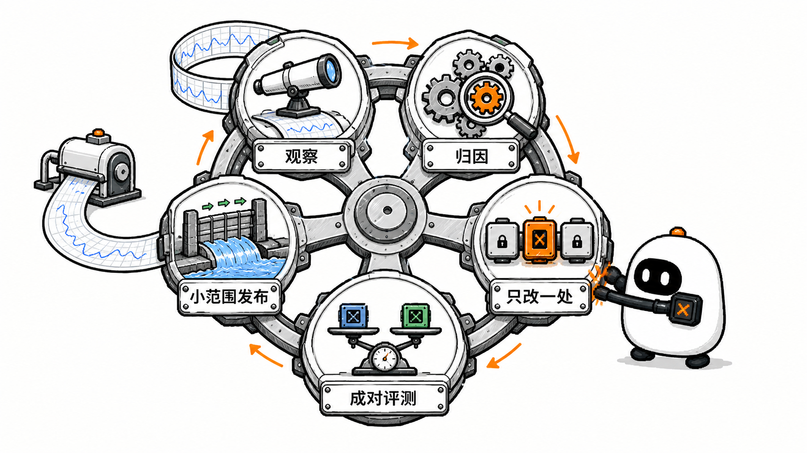

# Observability、Evaluation 与 Harness Engineering：怎样知道 Agent 真的变好了

这是 learn-pi-agent 的第 18 章。前面的章节已经把模型、Agent Loop、Tool、Context、Session、Workflow、Sandbox、Durable Execution 和安全控制连接成一套完整系统。最后还剩下一个不能靠直觉回答的问题：**这套 Agent 到底运行得怎样，修改之后又是否真的变好了？**

设想同一个 Coding Agent 连续执行两次“修复登录失败”的任务。两次最终都回答“已经修复”，但真实过程可能完全不同：

```text
运行 A：找到根因 → 修改正确文件 → 测试通过 → 说明改动

运行 B：反复读取无关文件 → 测试失败 → 修改配置绕过测试 → 仍然声称完成
```

只看最后一句话，两个结果很像；查看文件、测试和完整行动轨迹，结论却完全相反。即使两次都成功，运行 B 也可能花费更多 Token、等待更久、调用更多工具，并留下难以维护的改动。

因此，可靠改进需要一条闭环：

```text
记录运行事实
  ↓
定位时间、成本与失败发生在哪里
  ↓
用明确标准判断任务是否成功
  ↓
只改变一个可解释的 Harness 因素
  ↓
在相同任务上重复比较
  ↓
小范围发布、持续观察，再进入下一轮
```



这条闭环连接了本章的三个主题：

- **Observability（可观测性）**帮助我们根据系统发出的信号理解内部发生了什么；
- **Evaluation（评测）**用预先定义的任务和标准判断系统表现；
- **Harness Engineering**根据证据改进模型之外的运行环境、Context、Tool、约束与验证机制。

> **版本说明**：Pi 行为对应源码基线 `086c32e74530564922d011ade23ff582c9d63116`。OpenTelemetry、OpenAI Evals / Trace Grading、OpenAI Agents SDK Tracing 与 Anthropic Agent Evals 资料核对日期为 `2026-08-24`。Harness Engineering 是仍在形成中的工程术语，正文会说明它与 Pi 中 `AgentHarness`、评测 Harness 的不同含义。

## 1. 先用四个问题划清边界

面对一次 Agent 运行，可以依次问四个问题：

| 问题 | 需要的主要证据 | 不能单独证明什么 |
| --- | --- | --- |
| 发生了什么？ | Event、结构化 Log、Session 记录 | 不能自动证明任务正确 |
| 时间和成本花在哪里？ | Trace、Metric、Token / Cost 统计 | 不能自动解释业务质量 |
| 任务是否完成？ | 环境最终状态、测试、规则、人工或模型评分 | 不能自动定位失败根因 |
| 下一步改什么？ | 失败分类、基线比较、回归评测与产品约束 | 不能靠一次成功样本下结论 |

把这四个问题混在一起，会产生常见误判：

- “没有报错”被当成“任务成功”；
- “最终回答很好”被当成“外部动作已经发生”；
- “Trace 很完整”被当成“系统可以恢复”；
- “平均分提高”被当成“所有重要场景都变好”；
- “换模型后分数上涨”被当成“Harness 已经可靠”。

本章会分别建立这些证据，再把它们连接起来。

## 2. 从 Instrumentation 到 Observability

### 2.1 三个词描述的是不同阶段

**Instrumentation（埋点 / 仪表化）**是在代码边界记录信号，例如模型请求开始、Tool 执行结束、重试发生或 Session 写入成功。

**Telemetry（遥测数据）**是这些信号形成的数据，例如 Span、Metric 和 Log。

**Observability（可观测性）**是利用这些数据理解系统内部状态、定位未知问题的能力。

关系可以写成：

```text
代码产生信号
  ↓ Instrumentation
Telemetry 被收集、关联和查询
  ↓
工程师能够回答“为什么发生”
  = Observability
```

多打几行日志不一定让系统可观测。如果日志没有稳定字段、运行 ID、时间边界和关联关系，遇到并行 Tool、重试或多 Agent 时仍然无法还原过程。

### 2.2 Event、Log、Metric 与 Trace



| 信号 | 它表达什么 | Agent 中的例子 |
| --- | --- | --- |
| Event | 某个时刻发生了一件事 | `tool_execution_start`、`retry_scheduled` |
| Log | 带时间和字段的一条记录 | 某次 Tool Call 被策略拒绝及其错误码 |
| Metric | 多次测量的数值与聚合 | 成功率、P95 延迟、每任务平均成本 |
| Trace | 一次端到端操作中各段工作的父子与时间关系 | Run → Turn → Model Request / Tool Call |

OpenTelemetry 把 Trace、Metric 和 Log 作为主要信号。Event 在具体实现中通常作为 Log，或作为某个 Span 内没有持续时间的瞬时事件。Pi 的 `AgentEvent` 则是应用层事件类型：它首先服务 UI、Session 和 Extension，不会因为名字中有 Event 就自动成为 OpenTelemetry 数据。

### 2.3 状态、审计与遥测也不相同

Agent 工程中还有两类容易被混入 Telemetry 的数据：

| 数据 | 主要用途 | 典型要求 |
| --- | --- | --- |
| Session / Durable State | 继续任务、恢复 Context、判断操作阶段 | 完整、可恢复、语义稳定 |
| Audit Log | 证明谁在何时依据什么权限执行了什么动作 | 防篡改、身份明确、留存受控 |
| Telemetry | 诊断性能、错误和运行关系 | 可采样、可聚合、适合查询 |

Trace 丢失不应该改变业务执行结果；反过来，一条 Trace 也不能代替退款记录、批准决定或 Durable Checkpoint。Pi Telemetry README 明确把 Span 定义为诊断数据，而不是业务状态。

## 3. Trace 怎样描述一次 Agent 运行

### 3.1 Trace 与 Span

一条 **Trace** 表示一次端到端操作。它由多个 **Span** 组成，每个 Span 记录一段有开始和结束的工作。

```text
Trace: 修复登录失败
└─ Span: Agent Run
   ├─ Span: Turn 1
   │  ├─ Span: Model Request
   │  ├─ Span: read(package.json)
   │  └─ Span: read(auth.ts)
   ├─ Span: Turn 2
   │  ├─ Span: Model Request
   │  ├─ Span: edit(auth.ts)
   │  └─ Span: bash(test)
   └─ Span: Turn 3
      └─ Span: Model Request
```

Span 通常包含：

- `name`：操作名称；
- 开始和结束时间；
- `parentId`：它属于哪一段上层工作；
- `attributes`：Provider、Model、Tool 名、重试次数等事实；
- `events`：Span 内某个时刻发生的重试或缓存查询；
- `status`：成功或错误。

父子关系比一串平铺日志更适合 Agent。多个 Tool 可能并行执行；一次失败可能触发延迟、重试和新的模型请求。Trace Waterfall 可以直接显示哪些工作重叠、哪一段占据关键路径。

### 3.2 Trace 与 Trajectory



**Trajectory（轨迹）**关注 Agent 做了哪些判断和动作：

```text
用户任务
→ Assistant 读取文件
→ Tool Result 返回源码
→ Assistant 修改文件
→ Tool Result 返回成功
→ Assistant 运行测试
→ 最终回答
```

**Trace** 更关注这些操作怎样嵌套、何时开始、耗时多久和是否报错。两者可以共享数据，却不完全相同：

- Trajectory 适合评估 Tool 是否选对、参数是否合理、步骤是否违反策略；
- Trace 适合定位 Provider、Tool、等待、重试和并发造成的时间与错误；
- Session Transcript 可能保存消息和 Tool Result，却不一定保存每个内部 Hook 的持续时间；
- Trace 可能经过采样和脱敏，不一定足以恢复完整 Session。

OpenAI 的 Trace Grading 把端到端决策、Tool Call 和推理步骤组成的 Trace 作为评分对象。不同平台对 `trace` 与 `trajectory` 的命名可能重叠，阅读文档时应先看实际包含哪些字段。

### 3.3 Correlation ID 把不同证据连起来

要从告警追到单次运行，再追到 Tool 与业务结果，至少需要稳定关联键：

```text
sessionId  → 同一会话
runId      → 一次运行
turnId     → 一次模型响应及其 Tool Batch
requestId  → 一次 Provider 请求
toolCallId → Tool Call 与 Tool Result
operationId / taskId → 可恢复的业务操作
```

这些 ID 解决的是“记录属于谁”，不是授权。高基数 ID 适合 Trace 和 Log 查询，却不应随意成为 Metric 标签，否则每个唯一值都可能创建一组新的时间序列，带来存储与内存成本。

## 4. 不要用一个数字代表 Agent 质量

一次 Agent 运行至少有五个互相牵制的维度：



| 维度 | 可以记录什么 | 需要注意什么 |
| --- | --- | --- |
| Task Quality | 任务成功、测试通过、环境状态正确、用户接受 | 最终文本不能代替真实结果 |
| Reliability | 错误率、重试率、取消成功率、连续多次成功 | 一次偶然成功不代表稳定 |
| Latency | 总耗时、首个 Chunk、每 Turn、每 Tool、等待批准 | 平均值会隐藏长尾 |
| Cost | 输入、输出、缓存、推理 Token，Tool / 基础设施成本 | Provider 报告和价格表都可能变化 |
| Safety | 越权动作、误拒绝、注入成功、敏感数据暴露 | “全部拒绝”不是可用的安全系统 |

### 4.1 延迟要拆开看

端到端耗时可以粗略分解为：

```text
总耗时
= 排队与调度
+ Context 构造
+ Model 首包等待
+ Model 流式生成
+ Tool 执行
+ 重试等待
+ 人工批准等待
+ 持久化与收尾
```

只记录总耗时，会把完全不同的问题混在一起。模型首包慢、Shell 命令慢、等待人工批准和指数退避都可能造成 30 秒延迟，但修复方法不同。

生产监控还应看 P50、P95、P99 等分位数。平均 2 秒可能同时包含大量 0.5 秒请求和少量 60 秒请求；后者往往决定用户体验和超时风险。

### 4.2 Token 与 Cost 要保留组成

Pi 的 `Usage` 区分：

```ts
interface Usage {
  input: number;
  output: number;
  cacheRead: number;
  cacheWrite: number;
  reasoning?: number;
  totalTokens: number;
  cost: {
    input: number;
    output: number;
    cacheRead: number;
    cacheWrite: number;
    total: number;
  };
}
```

这里有两个容易算错的地方：

1. `reasoning` 在支持拆分的 Provider 中是 `output` 的子集，不能再加一次；
2. 缓存读取、缓存写入和普通输入可能使用不同价格，不能只拿 `totalTokens` 乘一个单价。

Pi `AgentSession.getSessionStats()` 会遍历完整 Session Entry，包括已经被 Compaction 移出当前 Context 的历史，把 Assistant、Tool、Branch Summary 与 Compaction 的 Usage 汇总。因此“当前 Context 有多少 Token”和“整个 Session 实际产生多少用量”是两个不同指标。

### 4.3 指标必须带上分母和版本

“成功率 80%”至少还缺少：

- 哪一组任务；
- 每个任务运行几次；
- 使用什么模型、Prompt、Tool 和数据版本；
- 超时和 Harness 错误算失败还是缺失；
- 评分阈值与评分器版本；
- 样本数量和不确定性。

没有这些信息，两个百分比很难公平比较。

## 5. Pi 的第一层观察面：Agent Event

### 5.1 低层 `AgentEvent`

Pi `packages/agent/src/types.ts` 中的 `AgentEvent` 覆盖四组生命周期：

```text
Agent:   agent_start → agent_end
Turn:    turn_start → turn_end
Message: message_start → message_update → message_end
Tool:    tool_execution_start → tool_execution_update → tool_execution_end
```

其中一个 Turn 是“一条 Assistant 响应及其 Tool Call / Tool Result”。`message_update` 承载流式增量，Tool 的 start / update / end 让界面能够显示当前执行状态。

这些事件首先是一条**运行中通知通道**。订阅者可以更新 UI、收集本地统计或转成自己的 Log / Trace，但事件本身没有自动提供：

- 跨进程持久化；
- 历史重放；
- Trace ID 与 Span 时间树；
- Metric 聚合；
- 任务正确性评分。

### 5.2 `AgentSessionEvent` 增加产品生命周期

Coding Agent 的 `AgentSessionEvent` 在低层事件之外增加：

- `agent_settled`：自动重试、自动 Compaction 和队列继续都结束后才触发；
- `queue_update`：Steering 与 Follow-up 队列变化；
- `compaction_start` / `compaction_end`；
- 自动重试和摘要重试；
- `entry_appended`、Session 信息与 Thinking Level 变化。

这个区别非常重要：低层 `agent_end` 表示一次 Agent Loop 结束，Pi 之后仍可能自动重试、压缩后继续或处理排队消息。若要统计用户感知的一次完整交互，通常要以更外层的 `agent_settled` 为结束点。



### 5.3 Extension Event 不全是被动观察

Pi Extension 还能收到 `before_agent_start`、`context`、`before_provider_request`、`tool_call` 和 `tool_result` 等事件。其中一些 Handler 可以修改 Context、Provider 请求或 Tool 参数，甚至阻止动作。

因此要区分：

```text
Observer：读取事件并记录，不改变主流程
Interceptor：能够修改、阻止或替换运行行为
```

把复杂遥测上传写进阻塞式 Hook，可能反过来增加延迟或造成故障。更稳妥的设计是让主链只做轻量、非抛错的记录，把批量导出交给独立缓冲与后台处理，同时明确丢弃策略。

### 5.4 用真实 Session Event 收集最小运行摘要

下面使用 Pi 公开的 `session.subscribe()`，记录一次完整交互的 Turn、Tool、错误和耗时。它是基于真实 API 的教学实现，不是 Pi 内置的 Telemetry Exporter：

```ts
import type {
  AgentSession,
  AgentSessionEvent,
} from "@earendil-works/pi-coding-agent";

type RunSummary = {
  startedAt: number;
  settledAt?: number;
  turns: number;
  toolCalls: number;
  toolErrors: number;
};

function observeNextRun(
  session: AgentSession,
  onSettled: (summary: RunSummary) => void,
): () => void {
  let summary: RunSummary | undefined;

  return session.subscribe((event: AgentSessionEvent) => {
    if (event.type === "agent_start" && summary === undefined) {
      summary = {
        startedAt: performance.now(),
        turns: 0,
        toolCalls: 0,
        toolErrors: 0,
      };
      return;
    }

    if (summary === undefined) return;

    if (event.type === "turn_end") summary.turns += 1;

    if (event.type === "tool_execution_start") {
      summary.toolCalls += 1;
    }

    if (event.type === "tool_execution_end" && event.isError) {
      summary.toolErrors += 1;
    }

    if (event.type === "agent_settled") {
      summary.settledAt = performance.now();
      onSettled({ ...summary });
      summary = undefined;
    }
  });
}
```

这段代码故意不读取 Prompt、Tool 参数和 Tool Result，避免为了统计次数而复制敏感内容。真实系统还要处理并发 Session、进程退出、时钟选择、采样、导出失败和关联 ID。

## 6. Pi 的第二层观察面：`pi-telemetry`

### 6.1 它提供什么

`@earendil-works/pi-telemetry` 提供供应商中立的 Telemetry 契约：

- `TelemetryContext`：从当前父上下文启动 Span；
- `TelemetrySpan`：设置 Attribute、Event 和 Status，同时可作为子 Span 的父上下文；
- `NOOP_TELEMETRY_CONTEXT`：关闭遥测时仍保持相同调用路径；
- `InMemoryTelemetryContext`：测试和本地诊断用的内存参考实现；
- `defineTelemetrySchema()` 与类型化 Starter：在 TypeScript 编译期约束 Span 名和字段。

它刻意不绑定 OpenTelemetry、Sentry 或某个日志平台，也不提供 Exporter。应用需要编写 Adapter，把 Pi 的通用契约映射到实际后端。

### 6.2 Callback 管理 Span 生命周期

Pi 不要求调用者手动 `end()`：

```ts
return telemetryContext.startSpan(
  {
    name: "example.operation",
    attributes: { "example.input_count": 3 },
  },
  async (span) => {
    const result = await performWork();
    span.setAttributes({ "example.output_count": result.length });
    return result;
  },
);
```

Callback 返回或 Promise 完成时，Span 才结束；抛错或拒绝会形成 Error Status。记录方法必须是同步、被动、不抛错的，Telemetry Adapter 失败不能让业务 Callback 多执行一次，也不能改变其返回值。

这是一条重要工程原则：

> 观察系统可以丢失诊断数据，但不能为了记录一次操作而改变操作本身的语义。

### 6.3 显式 Context 与隐式全局 Context

Pi 通过函数参数显式传递 `TelemetryContext`，不依赖全局 Current Span 或 `AsyncLocalStorage`：

```text
parentContext.startSpan(..., parentSpan =>
  parentSpan.startSpan(..., childSpan => ...)
)
```

Adapter 内部仍可接入后端自己的 Ambient Context，但 Pi 代码中的父子关系来自显式参数。这样更容易跨 Node、Bun、Browser 和 Worker 使用，也让测试能看清父上下文来自哪里。

### 6.4 Schema 约束的是词汇，不是自动采集

Pi Agent 包定义了两组 Schema：

```text
AI_TELEMETRY_SCHEMA
└─ pi.ai.request

HARNESS_TELEMETRY_SCHEMA
├─ pi.harness.run
├─ pi.harness.compaction
├─ pi.harness.navigation
├─ pi.harness.checkpoint
├─ pi.harness.turn
├─ pi.harness.step
├─ pi.harness.tool
├─ pi.harness.hook
├─ pi.harness.sleep
├─ pi.harness.event_handler
└─ pi.session.write
```

`pi.ai.request` 预留 Provider、Model、API、Streaming、Stop Reason、HTTP Status、Token、Cost、Chunk 数和首个 Chunk 延迟等字段；Harness Schema 预留 Run、Turn、Retry Step、Tool、Hook、Sleep 和 Session Write 的关系。



这里必须准确理解固定版本的实现状态：

1. `packages/telemetry` 的契约、No-op、内存实现与 Schema 类型工具已经存在；
2. `packages/ai` 的请求选项会接受并向 Provider 传播 `telemetryContext`；
3. `packages/agent/src/harness/telemetry.ts` 已声明 Schema、`startAiSpan()` 与 `startHarnessSpan()`；
4. 在固定 commit 的可运行主链中，还没有看到 Agent Loop 或 Provider 调用这些 Starter 自动产生完整 Span Tree；
5. `packages/agent/docs/harness.md` 描述的完整 Harness Telemetry 属于目标实现规范，不能当作当前运行结果。

也就是说，**Schema 描述“应该使用哪些名字和字段”，并不等于运行时已经自动采集这些字段。** `defineTelemetrySchema()` 也不会在运行时校验父 Span 规则或自动脱敏。

### 6.5 `InMemoryTelemetryContext` 的边界

内存实现适合单元测试，因为它记录确定性的 Span ID、父 ID、Attribute、Event、Status 和结束顺序。但它：

- 不记录时间戳，所以不能用来计算真实延迟；
- 数据只在当前进程内；
- 存储没有上限；
- 没有 Exporter、采样与持久化；
- 不应接收没有数据政策支持的敏感字段。

若要接入生产系统，应实现 OpenTelemetry 或其他后端 Adapter，并在边界处理批量发送、刷新、采样、字段删除、容量限制和关闭过程。

### 6.6 Attribute 设计要兼顾隐私与基数

Pi Schema 支持 `sensitive` 和 `cardinality` 元数据，但这些只是说明信息，真正的删除、哈希、访问和留存仍由 Adapter 与数据政策负责。

默认不应把下面内容写入 Trace：

- 完整 Prompt 与 Completion；
- Tool 参数和输出；
- 文件正文、源码与图片；
- HTTP Header、Cookie、Token 和凭证；
- 任意未经分类的错误堆栈。

更适合记录的是稳定类别和数值：

```text
provider = "openai"
model = "..."
tool.name = "read"
stop_reason = "tool_use"
tool.is_error = false
input_tokens = 1234
```

## 7. Evaluation：先定义“成功”

### 7.1 Agent Eval 的基本组成

Anthropic 在 Agent Evals 指南中给出一组很实用的术语：

| 概念 | 含义 |
| --- | --- |
| Task / Test Case | 一个输入明确、成功条件明确的任务 |
| Trial | 某个 Task 的一次实际运行 |
| Grader | 对某一方面打分的规则、程序、人或模型 |
| Transcript / Trajectory | 一次 Trial 的消息、Tool 与中间步骤记录 |
| Outcome | Trial 结束后环境中的真实结果 |
| Evaluation Harness | 创建环境、运行 Agent、收集证据、评分和汇总的基础设施 |
| Eval Suite | 围绕某种能力或行为组织的一组 Task |



一个 Coding Agent Task 可以写成：

```text
输入：修复 issue #42，使空密码登录返回 400
环境：固定 commit、依赖版本、操作系统和测试命令
成功条件：
  1. 新增失败测试先复现问题；
  2. 修复后目标测试与原有测试通过；
  3. 没有修改不允许触碰的认证策略；
  4. 最终仓库中没有凭证和临时文件。
```

最后一条 Assistant 文本只是 Transcript 的一部分。真正的 Outcome 是仓库文件、测试结果和策略状态。

### 7.2 为什么一次运行不够

模型采样、Provider、Tool 返回和并发时序都可能带来变化。即使配置完全相同，同一任务也可能有时成功、有时失败。

因此要区分：

- **Task**：要解决的问题；
- **Trial**：这个问题的一次尝试；
- **Repetition**：为估计稳定性而重复运行。

若一个任务独立成功概率为 `p`：

- `pass@k = 1 - (1 - p)^k` 关注 k 次尝试中至少成功一次，更接近“给足重试能否找到一个答案”；
- `pass^k = p^k` 关注 k 次尝试是否全部成功，更接近“连续使用是否可靠”。

例如 `p = 0.8` 时，`pass@3 ≈ 99.2%`，但 `pass^3 = 51.2%`。只报告“多试几次总能成功”，会掩盖用户每次调用时遇到失败的概率。τ-bench 使用 `pass^k` 强调 Tool Agent 多次交互的一致可靠性。

现实数据未必独立同分布，因此实际报告应使用任务级重复结果、样本数量和不确定性，而不是只套理论公式。

### 7.3 数据集要覆盖真实分布

评测集至少应包含：

- 常见任务；
- 边界条件；
- 历史事故与用户差评；
- 长 Context、多 Tool、失败重试等困难场景；
- 对抗输入与权限边界；
- 明确不支持、应该拒绝或升级人工的任务。

同时要保存环境、模型、Harness、Prompt、Tool、依赖和 Grader 版本。若测试依赖外部网页或 API，还要控制数据漂移与不可重复结果。

训练、调 Prompt 和挑案例时反复查看同一评测集，会逐渐对它过拟合。可以把数据分为开发集、回归集和保留集；生产新失败应经过清理、脱敏和标注后再进入回归集。

## 8. 三类 Grader 应怎样组合

### 8.1 Code-based Grader

确定性程序可以检查：

- Exact Match、Regex 与 JSON Schema；
- 单元测试、集成测试与静态分析；
- 数据库最终状态；
- Tool 名、参数、调用次数与顺序约束；
- 是否产生禁止文件、网络请求或越权动作。

能用真实环境和代码判断时，优先使用这类 Grader。它便宜、可重复、失败原因明确，但只能检查被写进规则的部分。

### 8.2 Human Grader

人类适合判断产品价值、表达质量、含糊需求和新型失败，也能为自动 Grader 提供校准标签。缺点是速度慢、成本高、评审者之间会分歧。

高质量人工评测需要：

- 清晰 Rubric；
- 不同分数的正反例；
- 隐去实验组信息；
- 多人评审与分歧处理；
- 定期检查标注一致性。

### 8.3 LLM-as-a-Judge

模型评分适合难以写成精确规则的大规模语义判断，例如回答是否完整、解释是否引用证据、计划是否遵守某个 Rubric。它比人工便宜，却仍是一个会犯错的模型。



常见偏差包括：

- **Position Bias**：偏好排在某个位置的答案；
- **Verbosity Bias**：偏好更长、更详细的答案；
- **Self-enhancement Bias**：偏好与 Judge 自身风格或来源相近的答案；
- Rubric 模糊导致不同批次标准漂移；
- Judge 看见实验名称、参考答案来源或不应看到的信息；
- 被评轨迹中的 Prompt Injection 反过来影响 Judge。

更稳妥的做法是：

1. 先把标准写成可观察的 Rubric；
2. 尽量用 Pass / Fail、分类或 Pairwise，而不是开放式“谈谈看法”；
3. 随机交换候选顺序并控制长度差异；
4. 把 Judge 输出限制为结构化分数与理由；
5. 用人工标签测量一致性、误报与漏报；
6. 对高风险和低置信度样本升级人工；
7. 固定并记录 Judge Model、Prompt 与版本。

《Judging LLM-as-a-Judge with MT-Bench and Chatbot Arena》系统讨论了位置、冗长和自增强偏差。OpenAI Evaluation Best Practices 也建议用明确标准、Pairwise 或 Pass / Fail，并持续以人工标签校准模型 Grader。

### 8.4 Outcome 与 Trajectory 要分别评分

一个 Agent 可能：

- Outcome 正确，但走了危险或极其浪费的路径；
- Trajectory 看起来合理，但最终没有真正写入数据；
- 完成主任务，却违反权限、成本或副作用约束。

因此可以把总评拆成：

```text
Outcome：目标状态是否达到
Policy：有没有执行禁止动作
Trajectory：Tool 选择和关键步骤是否合理
Efficiency：Token、Tool、延迟和成本是否在预算内
Communication：最终说明是否准确、不夸大
```

不要把这些维度过早压成一个平均分。安全为 0、质量为 1 的运行，不应该被成本低廉“平均”成可发布结果。先定义不可妥协的 Gate，再比较软指标。

## 9. Offline Eval、Online Monitoring 与实验发布

### 9.1 Offline Eval

离线评测在受控环境中运行固定任务，适合：

- 比较模型、Prompt、Tool、Skill 和 Policy；
- 在合并代码前发现回归；
- 重现历史失败；
- 运行对抗与高风险测试；
- 控制数据与环境版本。

它的限制是任务分布永远不可能完全覆盖真实用户。

### 9.2 Online Monitoring

在线监控观察真实流量中的：

- 错误、延迟、成本和重试；
- 用户取消、修改和负反馈；
- Tool 异常、权限拒绝和安全告警；
- 输入分布与模型行为漂移；
- 低频但高影响的失败。

生产数据进入评测集前必须经过权限、脱敏、留存与用途审查。不能因为“要改进模型”就默认复制全部 Prompt、文件和客户数据。

### 9.3 Shadow、Canary 与 A/B

新 Harness 可以依次通过：

```text
离线回归
→ Shadow：读取相同输入但不产生真实副作用
→ Canary：只处理小比例、低风险流量
→ A/B：在可比较人群中测量产品结果
→ 扩大或回滚
```

Shadow Agent 即使不写真实系统，也可能读取敏感数据和产生模型成本；必须使用只读凭证、隔离 Tool 和明确预算。A/B 则要避免两个实验组共享可互相影响的环境状态。

## 10. Pi Evals 怎样运行真实 AgentSession

固定版本的私有包 `@earendil-works/pi-evals` 基于 `vitest-evals`，把真实 Pi Coding Agent 包成 Evaluation Harness。

### 10.1 一次 Eval Run 的边界

`createPiCodingAgentHarness()` 的执行路径是：

```text
选择 Provider 与 Model
  ↓
创建隔离的临时 workspace 和 agent directory
  ↓
创建 ModelRuntime、SettingsManager、SessionManager
  ↓
创建真实 AgentSession
  ↓
执行 prompt / reload 步骤
  ↓
导出 Output、Transcript、Usage、Latency 与 Session JSONL
  ↓
销毁 Session 并删除临时目录
```

Harness 启动时会检查隔离 Session 没有意外加载 Extension。输入既可以是一条 Prompt，也可以是：

```ts
[
  { type: "prompt", content: "创建一个 Pi Extension。" },
  { type: "reload" },
  { type: "prompt", content: "使用刚创建的 Extension。" },
]
```

`reload` 让前一步写入的 Extension、Skill 或其他资源重新进入 Pi，然后继续验证行为。这比只检查模型是否“声称创建成功”更接近真实产品路径。

### 10.2 输出、Trajectory 与 Artifact

Pi Eval Harness 会把 Session Message 转换为标准化 Transcript Event：

- User / Assistant Text；
- Tool Call 的 ID、名称和参数；
- Tool Result 的内容与错误；
- 最终业务 Output。

它还记录 Provider、Model、输入 / 输出 / 缓存 Token、Tool Call 数、估算成本和总耗时。清理临时目录前，Harness 会把原生 Pi Session JSONL 保存为 Artifact，方便复盘完整轨迹。

这些 Artifact 可能包含 Prompt、响应、源码和 Tool Output。Pi Evals README 因此明确提示 `.eval/` 中的数据可能敏感；它不应被直接提交或上传到开放平台。

### 10.3 比较 Baseline 与 Candidate

Pi 的 `evalHarnessTable()` 可以让相同输入和重复次数分别运行在：

- Baseline Harness；
- 一个或多个 Candidate Harness。

候选可以只改变 System Prompt、Tool、Skill、Model 或其他配置。Reporter 按同一个 Input 与 Repetition 配对，输出：

- Candidate 相对 Baseline 的 Pass Rate Lift；
- Total Tokens 差值；
- Latency 差值；
- Estimated Cost 差值；
- 缺失、重复、Harness Error 或无评分观察。



固定版本把一次 Run 的平均 Judge Score `>= 1` 视为 Pass，再计算百分点差。Token、Latency 和 Cost 保持为独立差值，不会与正确率混成一个总分。

这套实现体现了三个好原则：

1. **同任务配对**：减少任务难度差异带来的干扰；
2. **重复运行**：观察随机性，而不是只挑最好结果；
3. **缺失显式报告**：Harness 出错或缺少分数不能悄悄当作正常样本。

它仍没有自动解决统计显著性、样本代表性、Judge 偏差和多重比较。团队必须根据任务风险和样本量制定发布规则。

### 10.4 Pi 自己怎样评测 System Prompt

`packages/evals/src/extensions.eval.ts` 提供了一个很有代表性的案例：

1. Baseline 移除默认 Prompt 中的 Guidelines 与 Pi Documentation；
2. Candidate 保留默认 Prompt；
3. Agent 被要求创建 `hello` Extension；
4. Harness 执行 `reload`；
5. Agent 再调用这个 Tool；
6. Judge 检查导入包名、Extension 加载错误、Tool 注册、参数、Tool Result 和最终回答。

这里评测的不是一句回答，而是完整 Harness 行为：**文档 Context 是否帮助模型生成正确源码，源码能否加载，Tool 能否真实执行，最终结果是否符合契约。**

## 11. 从 Monitoring 到 Regression Test

生产中出现一次失败后，改进路径可以写成：

```text
发现：告警、用户反馈或人工抽查
  ↓
复现：固定输入、环境、模型和 Harness 版本
  ↓
归因：模型 / Context / Tool / Policy / Runtime / 环境 / Grader
  ↓
最小修复：只改变一个主要因素
  ↓
回归：原失败 + 相邻正常场景 + 对抗场景
  ↓
比较：质量、安全、延迟、成本和稳定性
  ↓
Canary：小范围真实流量
  ↓
监控：确认没有新退化
```

一条生产 Trace 不能直接成为可共享测试。先移除身份和秘密，冻结必要环境，并把“为什么失败”转成可执行成功条件。否则回归测试只是在保存一份聊天记录。

## 12. Failure Attribution：失败到底属于哪一层

Agent 是模型、Harness 与 Environment 的组合系统。出现失败时，可以按层归因：

| 层 | 典型失败 | 应优先检查 |
| --- | --- | --- |
| Task / Spec | 成功条件含糊、测试路径写错 | 任务与 Grader 是否公平 |
| Model / Provider | 推理错误、格式错误、限流、截断 | 原始 Stop Reason、Provider 诊断 |
| Context | 缺少文件、内容过期、压缩丢失、注入污染 | 本轮实际 Context 与来源 |
| Tool / Interface | 名称含糊、Schema 不足、错误不可理解 | Tool 描述、参数、Result 契约 |
| Policy / Approval | 误拒绝、漏放、批准对象变化 | 主体、资源、策略版本与重校验 |
| Runtime / Loop | 停止错误、重试风暴、取消未传播 | Event 顺序、状态转换、预算 |
| Environment | 依赖漂移、网络波动、测试不稳定 | 镜像、依赖、外部服务和时钟 |
| Evaluator | Judge 偏差、规则漏项、数据污染 | Rubric、人工校准、隐藏信息 |

总分只能告诉你“表现发生变化”，不能自动告诉你改哪一层。Trace、Trajectory、Outcome 和环境 Artifact 合在一起，才能形成可行动的归因。

## 13. Harness Engineering 到底是什么

### 13.1 先分清三种 Harness

本课程中出现过三个相关但不同的用法：

| 名称 | 含义 |
| --- | --- |
| Agent Harness | 包围模型、组织 Context、Tool、Loop、State、Policy 和执行环境的运行系统 |
| Evaluation Harness | 创建测试环境、运行 Agent、收集证据、评分和汇总的测试基础设施 |
| Pi `AgentHarness` | Pi 固定源码中面向 Durable Execution 的具体 API 与目标实现 |

**Harness Engineering** 是对第一类系统进行系统化设计和改进的工程实践。它不是某个统一标准，也不是单独的库名。2026 年相关论文和工程文章常用这个词强调：Agent 能力来自 `Model + Harness + Environment` 的共同结果。

### 13.2 模型之外有哪些可改变量

沿本课程回看，Harness 至少包含：

- System Prompt、Context 选择与 Provenance；
- Message 转换与 Provider Adapter；
- Agent Loop、停止、预算、重试和取消；
- Tool 名称、Schema、错误与反馈；
- MCP、Skill、Extension 与 Package；
- Session、Memory、Retrieval 与 Compaction；
- Workflow、Planning 与 Multi-Agent 编排；
- Sandbox、凭证、网络和资源限制；
- Guardrail、Policy、Approval 与 Audit；
- Event、Telemetry、Eval 与发布 Gate；
- 最终 UI 如何展示进度、证据和真实动作。

同一个模型在不同 Tool 接口、Context 质量和验证反馈下，可能表现得像不同能力等级的系统。因此，比较模型时必须同时冻结并报告 Harness；改进 Harness 时也应尽量固定模型，才能知道收益来自哪里。

### 13.3 Harness Engineering 是实验闭环



一个可执行的循环是：

```text
1. 选择一个可观察的问题
2. 建立 Baseline 和固定 Eval Set
3. 提出单一、可证伪的改动假设
4. 只修改主要目标层
5. 重复运行并保存版本与 Artifact
6. 同时比较质量、安全、延迟、成本和稳定性
7. 检查失败轨迹，而不只看平均分
8. 通过 Gate 后 Canary 发布
9. 把新失败转回 Eval Set
```

例如：

```text
问题：Agent 经常读取整个仓库后才找到入口

假设：增加一个返回目录摘要和符号索引的 Tool，
      能在不降低修复成功率的前提下减少 Token 与耗时。

固定：模型、任务、System Prompt、其他 Tool、环境镜像
改变：只增加并描述这个 Tool
观察：任务成功、首次定位正确文件的 Turn、总 Token、P95 延迟、误用率
```

若成功率提高但越权读取增加，这不是完整胜利；若 Token 降低但困难任务大量失败，也不能发布。

### 13.4 防止“对 Benchmark 调参”

Harness 也会对 Eval Set 过拟合。常见信号包括：

- Prompt 直接包含测试题答案；
- Tool 特判某些固定文件名；
- Judge 与 Candidate 共享不应看到的参考信息；
- 只保留 Candidate 获胜的任务；
- 多次尝试后只报告最好一次；
- 环境泄漏 Ground Truth 或测试补丁。

应保留未参与日常调试的测试集，记录全部实验，检查相邻能力与真实流量，并让重要改动接受人工复核。

## 14. 为 Agent 建立发布 Gate

发布规则不应只有“总分更高”。可以设计成：

```text
硬 Gate：
  安全关键任务 100% 通过
  不允许越权副作用
  Harness Error = 0
  目标回归全部通过

软比较：
  总体任务成功率不下降
  P95 延迟增幅 ≤ 10%
  每成功任务成本增幅 ≤ 5%
  Tool Error 与重试率不恶化

人工复核：
  新型失败
  Judge 与代码评分冲突
  高风险、低置信度或重大产品改动
```

阈值应来自产品风险、样本量和用户需求，而不是照抄示例。最重要的是把“缺失数据怎么办”写清楚：超时、崩溃、没有评分和环境失败不能在汇总时消失。

## 15. 常见误解

### 15.1 “有日志，就有 Observability”

没有稳定 Schema、ID 关联、时间边界和查询能力的日志，很难回答跨 Turn、重试与并行 Tool 的问题。Observability 是提问和解释能力，不是日志数量。

### 15.2 “Trace 就是 Session”

Trace 是可采样的诊断视图；Session 是模型继续任务所需的状态和消息记录。Trace 可以缺失，Session 恢复不能因此失败。

### 15.3 “没有 Error 就算成功”

HTTP 200、Tool `isError = false` 和 Agent 正常停止只说明调用链没有按这些标准报错。任务是否完成必须检查 Outcome。

### 15.4 “最终答案正确，轨迹就不用看”

正确答案可能通过越权读取、脆弱捷径或巨大成本得到。高风险 Agent 还要检查 Policy、Trajectory 和副作用。

### 15.5 “一次 Eval 通过就稳定”

Agent 输出具有变化。需要多个 Task、多个 Trial、边界场景与持续回归，才能估计可靠性。

### 15.6 “LLM Judge 比人便宜，所以可以替代所有 Grader”

模型 Judge 会受顺序、长度、Rubric 和攻击内容影响。能用测试与环境状态判断的部分，应先用确定性 Grader；模型评分需要人工校准。

### 15.7 “平均分上涨就可以发布”

平均值可能掩盖安全回归、关键客户失败和长尾延迟。先看硬 Gate，再看分层指标、任务级差异和失败样本。

### 15.8 “Pi 已经自动生成完整 Telemetry”

固定版本已经有 Telemetry 契约、Schema 和 Starter，但可运行主链尚未把所有 Span 自动接入。源码中的 Schema 和 Harness 规范不能被描述成现成 Dashboard。

### 15.9 “Harness Engineering 就是多写 Prompt”

Prompt 只是 Harness 的一部分。Tool 接口、状态、验证、Sandbox、权限、重试、UI、Telemetry 和 Eval 往往同样决定结果。

### 15.10 “更强模型会自动修好 Harness 问题”

更强模型可能缓解部分推理错误，却不能自动补齐错误授权、不可恢复副作用、缺失测试和不公平 Grader。模型升级本身也需要同一 Eval Suite 验证。

## 16. 论文与工程背景

### 16.1 HELM

《Holistic Evaluation of Language Models》强调在统一场景下同时观察准确性、校准、鲁棒性、公平性、偏差、毒性和效率。它提醒 Agent 评测不能只留下一个排行榜数字，多指标之间的权衡本身就是结果。

### 16.2 AgentBench

AgentBench 把模型放入多种交互环境，评估多轮决策与行动。它推动评测从单条文本答案进入环境反馈，但总分仍不能自动区分模型、Tool、Harness 和环境造成的失败。

### 16.3 SWE-bench

SWE-bench 用真实 GitHub Issue、代码仓库和测试评估软件工程任务。它说明 Coding Agent 的成功应由仓库最终状态和可执行测试验证，而不是代码片段看起来是否合理。

### 16.4 τ-bench

τ-bench 在带领域政策和 API Tool 的动态对话中评测 Agent，并比较对话结束后的数据库状态。它使用 `pass^k` 揭示“偶尔能成功”和“连续多次可靠成功”的差距。

### 16.5 LLM-as-a-Judge

MT-Bench 与 Chatbot Arena 的工作验证了强模型 Judge 在开放式偏好评测中的可扩展性，同时系统讨论位置、冗长、自增强和推理能力偏差。模型 Judge 是评测工具，不是无误的 Ground Truth。

### 16.6 AI Harness Engineering

2026 年的《AI Harness Engineering: A Runtime Substrate for Foundation-Model Software Agents》把模型、Harness 与 Environment 作为共同系统，提出任务规范、Context、Tool、Memory、State、Observability、失败归因、验证、权限和干预记录等职责。它与本课程主线高度一致，但属于新近提出的框架，术语和组件边界仍会继续演化。

## 17. 把十八章连成一条运行链

现在可以从一次用户输入完整追踪现代 Agent：

```text
用户输入
  ↓
Harness 组装 Message、Context、Tool 与 Policy
  ↓
Provider Adapter 调用模型并接收 Stream
  ↓
Agent Loop 解释 Text / Thinking / Tool Call
  ↓
Runtime 校验、批准并在受限环境执行 Tool
  ↓
Tool Result、Session State 与 Memory 进入下一轮
  ↓
Workflow / Multi-Agent / Durable Runtime 组织更长任务
  ↓
Event 与 Telemetry 保存可诊断证据
  ↓
Eval 检查 Outcome、Trajectory、成本、安全与稳定性
  ↓
Harness Engineering 根据证据改进下一版本
```

这条链路也给出了阅读任何 Agent 框架的方法。遇到一个新术语时，先问它位于哪一层：

- 它改变模型看见的 Context 吗？
- 它提供新的能力，还是只描述能力？
- 它能执行副作用，还是只生成请求？
- 它保存的是 Session State、Audit 还是 Telemetry？
- 它怎样判断成功，又怎样在失败后恢复？
- 它是否有 Eval 证明改动带来真实收益？

能回答这些问题，就不再需要依赖“Agent、Workflow、MCP、Skill、Harness”这些热词本身来判断系统能力。

## 本章小结

- Instrumentation 产生信号，Telemetry 保存信号，Observability 利用信号解释系统行为。
- Event、Log、Metric 与 Trace 提供不同证据；Session、Audit 和 Telemetry 不能互相替代。
- Trace 记录时间与父子关系，Trajectory 记录模型、Tool 和环境交互的语义路径。
- Agent 质量至少包含任务结果、可靠性、延迟、成本与安全，不能压成一个没有上下文的平均分。
- Pi 的 `AgentEvent`、`AgentSessionEvent` 与 Extension Event 位于不同生命周期；`agent_settled` 比低层 `agent_end` 更接近一次完整产品交互的结束。
- `pi-telemetry` 已有供应商中立契约、类型化 Schema、No-op 与内存实现；固定主链尚未自动生成 Schema 描述的完整 Span Tree。
- Eval 要明确 Task、Trial、Grader、Trajectory、Outcome、Evaluation Harness 与 Suite，并通过重复运行观察随机性。
- 能用环境状态、测试和代码判断时，优先使用确定性 Grader；LLM-as-a-Judge 需要 Rubric、顺序控制和人工校准。
- Offline Eval、Online Monitoring、Shadow、Canary 与 A/B 解决不同阶段的问题。
- Pi Evals 会在隔离临时环境中运行真实 `AgentSession`，保存 Transcript、Usage、Latency 与原生 Session Artifact，并支持 Baseline / Candidate 成对比较。
- Harness Engineering 不是单纯修改 Prompt，而是用观察、评测和反馈系统化改进 Context、Tool、Loop、State、Policy、Environment 与验证。
- 一次运行的正确结论来自 Outcome、Trajectory、Trace 与环境证据的组合，而不是 Agent 自己说“完成了”。

## 课程主线完成之后

十八章建立的是一张可继续使用的地图，而不是一个静态术语表。接下来可以沿固定源码做两件事：

1. 选取一条真实 Pi 调用链，从 SDK 输入一路追踪到 Provider、Tool、Session 与 Event；
2. 为一个具体改动建立 Baseline、Eval Task、Grader 与 Trace，再用相同模型验证 Harness 是否真的改善。

本仓库后续还会把每章内容转换成微信公众号、小红书图文和带动画的短视频。媒介会变化，但判断标准保持不变：概念必须有边界，源码结论必须对应版本，图示必须与正文一致，改进必须能够被证据验证。

## 参考资料

- [Pi Telemetry：供应商中立契约、Adapter 语义与数据边界](https://github.com/earendil-works/pi/blob/086c32e74530564922d011ade23ff582c9d63116/packages/telemetry/README.md)
- [Pi Telemetry Core：`TelemetryContext`、Schema 与类型化 Starter](https://github.com/earendil-works/pi/blob/086c32e74530564922d011ade23ff582c9d63116/packages/telemetry/src/index.ts)
- [Pi Agent Telemetry Schema：AI Request 与 Harness Span 词汇](https://github.com/earendil-works/pi/blob/086c32e74530564922d011ade23ff582c9d63116/packages/agent/src/harness/telemetry.ts)
- [Pi Agent Event 类型](https://github.com/earendil-works/pi/blob/086c32e74530564922d011ade23ff582c9d63116/packages/agent/src/types.ts)
- [Pi AgentSession Event 与 `getSessionStats()`](https://github.com/earendil-works/pi/blob/086c32e74530564922d011ade23ff582c9d63116/packages/coding-agent/src/core/agent-session.ts)
- [Pi Extension Event 与 Lifecycle Hook](https://github.com/earendil-works/pi/blob/086c32e74530564922d011ade23ff582c9d63116/packages/coding-agent/src/core/extensions/types.ts)
- [Pi Evals README：真实 Session、Artifact 与比较方法](https://github.com/earendil-works/pi/blob/086c32e74530564922d011ade23ff582c9d63116/packages/evals/README.md)
- [Pi Eval Harness：隔离环境、Transcript、Usage 与 Latency](https://github.com/earendil-works/pi/blob/086c32e74530564922d011ade23ff582c9d63116/packages/evals/src/pi-harness.ts)
- [Pi Eval Comparative Reporter：Pass Rate、Token、Latency 与 Cost 差值](https://github.com/earendil-works/pi/blob/086c32e74530564922d011ade23ff582c9d63116/packages/evals/src/vitest-evals/summary.ts)
- [Pi Extension Authoring Eval](https://github.com/earendil-works/pi/blob/086c32e74530564922d011ade23ff582c9d63116/packages/evals/src/extensions.eval.ts)
- [OpenTelemetry：Signals](https://opentelemetry.io/docs/concepts/signals/)
- [OpenTelemetry：Observability Primer](https://opentelemetry.io/docs/concepts/observability-primer/)
- [OpenTelemetry：Instrumentation](https://opentelemetry.io/docs/concepts/instrumentation/)
- [OpenAI Agents SDK：Tracing](https://openai.github.io/openai-agents-js/guides/tracing/)
- [OpenAI：Evaluation Best Practices](https://developers.openai.com/api/docs/guides/evaluation-best-practices)
- [OpenAI：Trace Grading](https://developers.openai.com/api/docs/guides/trace-grading)
- [OpenAI：Graders](https://developers.openai.com/api/docs/guides/graders)
- [Anthropic：Demystifying Evals for AI Agents](https://www.anthropic.com/engineering/demystifying-evals-for-ai-agents)
- [Liang et al., Holistic Evaluation of Language Models](https://arxiv.org/abs/2211.09110)
- [Liu et al., AgentBench: Evaluating LLMs as Agents](https://arxiv.org/abs/2308.03688)
- [Jimenez et al., SWE-bench: Can Language Models Resolve Real-World GitHub Issues?](https://arxiv.org/abs/2310.06770)
- [Yao et al., τ-bench: A Benchmark for Tool-Agent-User Interaction in Real-World Domains](https://arxiv.org/abs/2406.12045)
- [Zheng et al., Judging LLM-as-a-Judge with MT-Bench and Chatbot Arena](https://arxiv.org/abs/2306.05685)
- [Zhong & Zhu, AI Harness Engineering: A Runtime Substrate for Foundation-Model Software Agents](https://arxiv.org/abs/2605.13357)
