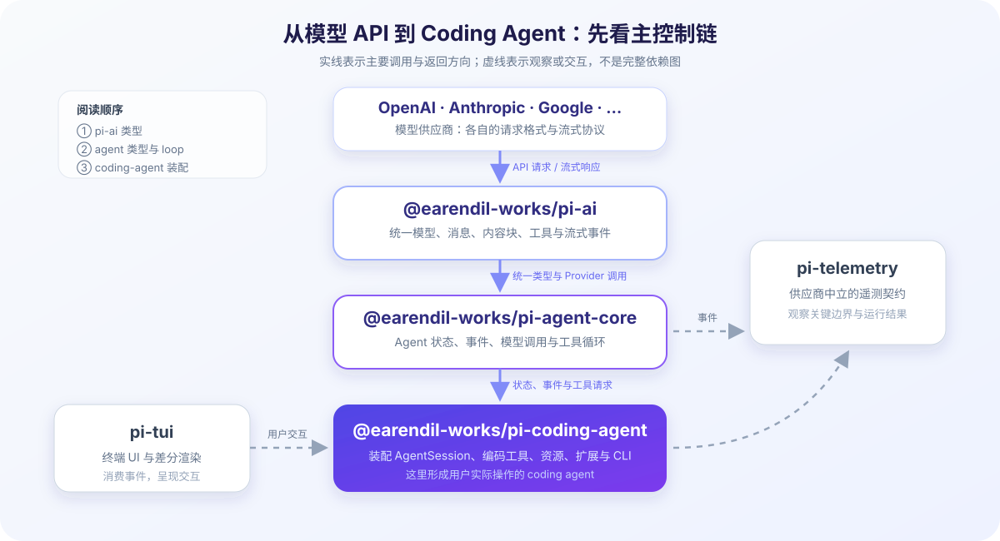

# Pi 源码地图：先找到主干

源码地图的作用不是一次展示所有目录，而是帮你回答第一个工程问题：**一次 coding agent 交互大致跨过哪些层？**

本文所有 Pi 链接固定到 commit `086c32e74530564922d011ade23ff582c9d63116`。如果你阅读最新 `main`，目录和职责可能已经变化，请先看[版本基线](version-baseline.md)。



## 第一层：五个需要先认识的包

| 源码入口 | 初学者可以先记住的一句话 | 暂时不要误解为 |
| --- | --- | --- |
| [`packages/ai`](https://github.com/earendil-works/pi/tree/086c32e74530564922d011ade23ff582c9d63116/packages/ai) | 统一多供应商模型 API、消息、工具与流式事件 | 它不是完整 Agent，也不负责直接执行编码工具 |
| [`packages/agent`](https://github.com/earendil-works/pi/tree/086c32e74530564922d011ade23ff582c9d63116/packages/agent) | Agent runtime：维护运行状态，组织模型调用、工具调用和事件 | 它不是完整 CLI 产品界面 |
| [`packages/coding-agent`](https://github.com/earendil-works/pi/tree/086c32e74530564922d011ade23ff582c9d63116/packages/coding-agent) | 面向编码场景的产品运行层，装配会话、工具、资源和交互 | 它不等于底层模型 Provider |
| [`packages/tui`](https://github.com/earendil-works/pi/tree/086c32e74530564922d011ade23ff582c9d63116/packages/tui) | 终端 UI 与差分渲染能力 | UI 显示的事件不是模型直接控制终端 |
| [`packages/telemetry`](https://github.com/earendil-works/pi/tree/086c32e74530564922d011ade23ff582c9d63116/packages/telemetry) | 供应商中立的遥测契约、适配与类型 | 可观测性本身不会保证任务正确 |

可以先把主依赖方向理解成：

```text
模型供应商
    ↑ 请求与流式响应
pi-ai
    ↑ 统一消息、模型与工具类型
pi-agent-core
    ↑ Agent 状态、事件与工具循环
pi-coding-agent
    ↙                 ↘
 pi-tui            编码工具 / 资源 / 会话

pi-telemetry 从关键边界观察运行，但不是主控制链。
```

箭头表达“上层调用下层、响应向上返回”的学习视角，不是完整的构建依赖图。

## 第二层：先读九个关键入口

### 1. 模型世界的类型：`pi-ai/src/types.ts`

打开 [`packages/ai/src/types.ts`](https://github.com/earendil-works/pi/blob/086c32e74530564922d011ade23ff582c9d63116/packages/ai/src/types.ts)，先搜索这些概念：Message、Content、Tool、Context、Stream Event。

阅读目标不是记住所有联合类型，而是看出模型边界需要表达哪些事实：谁发的消息，消息包含文字还是工具请求，工具结果如何关联，响应为何可以增量到达。

### 2. Agent 世界的类型：`pi-agent-core/src/types.ts`

打开 [`packages/agent/src/types.ts`](https://github.com/earendil-works/pi/blob/086c32e74530564922d011ade23ff582c9d63116/packages/agent/src/types.ts)，观察 AgentMessage、AgentTool、AgentEvent、AgentLoopConfig 等类型如何在模型消息之外增加运行所需的信息。

一个重要阅读问题是：哪些类型要传给模型，哪些只存在于宿主程序？两者不一定相同。

### 3. 低层循环：`agent-loop.ts`

打开 [`packages/agent/src/agent-loop.ts`](https://github.com/earendil-works/pi/blob/086c32e74530564922d011ade23ff582c9d63116/packages/agent/src/agent-loop.ts)，搜索 `runAgentLoop`、`runLoop`、`streamAssistantResponse` 和 `executeToolCalls`。

这个固定版本体现了几件关键事实：

- 循环内部主要使用 `AgentMessage[]`，到 LLM 调用边界才转换为模型可接受的 `Message[]`；
- 循环发出 agent、turn、message、tool execution 等事件，界面可以消费这些事件；
- assistant 响应中出现 tool call 后，宿主执行工具并把结果追加到上下文；
- 循环还处理停止、错误、中止、steering 与 follow-up，并非只有一条永远成功的 happy path。

### 4. coding-agent 会话树：`session-manager.ts`

打开 [`packages/coding-agent/src/core/session-manager.ts`](https://github.com/earendil-works/pi/blob/086c32e74530564922d011ade23ff582c9d63116/packages/coding-agent/src/core/session-manager.ts)，搜索 `SessionEntry`、`leafId`、`getBranch`、`buildContextEntries` 与 `buildSessionContext`。

这条路径说明本地 coding-agent 怎样把 JSONL Entry 组织成追加写入的消息树，再从当前叶子投影出恢复后的活动消息。完整文件历史、活动分支与本轮 Context 是三个不同集合。

### 5. 持久化 Harness：`harness/agent-harness.ts`

打开 [`packages/agent/src/harness/agent-harness.ts`](https://github.com/earendil-works/pi/blob/086c32e74530564922d011ade23ff582c9d63116/packages/agent/src/harness/agent-harness.ts)，并配合 [`packages/agent/docs/harness.md`](https://github.com/earendil-works/pi/blob/086c32e74530564922d011ade23ff582c9d63116/packages/agent/docs/harness.md) 阅读 Session、Lane、Operation State 与恢复策略。

这里的重点不再只是“怎样保存消息”，而是崩溃后怎样识别已确认状态、未确认副作用与安全重放边界。coding-agent 的 server 装配入口位于 `packages/coding-agent/src/server/create-harness.ts`。

### 6. MCP 适配入口：`extensions.md` 与 Tool 类型

固定版本的 Pi 没有内置 MCP Client；接入点位于 coding-agent Extension。先看 [`packages/coding-agent/docs/extensions.md`](https://github.com/earendil-works/pi/blob/086c32e74530564922d011ade23ff582c9d63116/packages/coding-agent/docs/extensions.md) 中的 `pi.registerTool(...)`、动态工具与 `session_shutdown`，再对照 [`packages/agent/src/types.ts`](https://github.com/earendil-works/pi/blob/086c32e74530564922d011ade23ff582c9d63116/packages/agent/src/types.ts) 的 `AgentTool`、[`packages/ai/src/types.ts`](https://github.com/earendil-works/pi/blob/086c32e74530564922d011ade23ff582c9d63116/packages/ai/src/types.ts) 的 `ToolResultMessage`，确认 MCP Tool 的 Schema、内容块、异常和取消信号怎样跨越两套类型边界。

### 7. 工作方法怎样进入 Context：`skills.ts` 与 `prompt-templates.ts`

[`packages/coding-agent/src/core/skills.ts`](https://github.com/earendil-works/pi/blob/086c32e74530564922d011ade23ff582c9d63116/packages/coding-agent/src/core/skills.ts) 负责发现 Skill、解析 `name` 与 `description`，并生成 system prompt 中的 `<available_skills>` 索引；[`system-prompt.ts`](https://github.com/earendil-works/pi/blob/086c32e74530564922d011ade23ff582c9d63116/packages/coding-agent/src/core/system-prompt.ts) 决定何时装入这份索引。再读 [`agent-session.ts`](https://github.com/earendil-works/pi/blob/086c32e74530564922d011ade23ff582c9d63116/packages/coding-agent/src/core/agent-session.ts) 的 `_expandSkillCommand()` 与 [`prompt-templates.ts`](https://github.com/earendil-works/pi/blob/086c32e74530564922d011ade23ff582c9d63116/packages/coding-agent/src/core/prompt-templates.ts)，区分模型通过 `read` 激活 Skill、用户显式展开 `/skill:name`，以及 Prompt Template 在模型调用前做字符串替换的三条路径。

### 8. 扩展点怎样被加载与串联：`extensions`、`resource-loader.ts` 与 `package-manager.ts`

先用 [`packages/coding-agent/docs/extensions.md`](https://github.com/earendil-works/pi/blob/086c32e74530564922d011ade23ff582c9d63116/packages/coding-agent/docs/extensions.md) 建立 Extension API 与事件地图，再进入 [`extensions/types.ts`](https://github.com/earendil-works/pi/blob/086c32e74530564922d011ade23ff582c9d63116/packages/coding-agent/src/core/extensions/types.ts)、[`extensions/loader.ts`](https://github.com/earendil-works/pi/blob/086c32e74530564922d011ade23ff582c9d63116/packages/coding-agent/src/core/extensions/loader.ts) 和 [`extensions/runner.ts`](https://github.com/earendil-works/pi/blob/086c32e74530564922d011ade23ff582c9d63116/packages/coding-agent/src/core/extensions/runner.ts)，分别观察类型边界、factory 注册和 Handler 串联。最后结合 [`resource-loader.ts`](https://github.com/earendil-works/pi/blob/086c32e74530564922d011ade23ff582c9d63116/packages/coding-agent/src/core/resource-loader.ts) 的 project trust / reload 顺序与 [`package-manager.ts`](https://github.com/earendil-works/pi/blob/086c32e74530564922d011ade23ff582c9d63116/packages/coding-agent/src/core/package-manager.ts) 的 npm、Git、本地来源及过滤规则，区分“运行时扩展点”和“资源分发单元”。

### 9. 把 Pi 嵌入 Workflow：`sdk.md` 与 `AgentSession`

[`packages/coding-agent/docs/sdk.md`](https://github.com/earendil-works/pi/blob/086c32e74530564922d011ade23ff582c9d63116/packages/coding-agent/docs/sdk.md) 说明应用怎样通过 `createAgentSession()`、`ModelRuntime` 与 `SessionManager` 创建 Pi Agent 节点。`session.prompt()` 等待一次完整 Agent Run，`session.messages` 暴露消息状态，`subscribe()` 提供生命周期与流式事件，`session.abort()` 与 `session.dispose()` 分别承接取消和资源清理；这些接口让外层 Workflow 保留业务步骤、并发、批准与副作用控制，同时把开放性调查交给 Pi 的 Agent Loop。不同 Workflow Node 使用独立的内存 Session 时，共享信息应通过显式输入传递。

### 第 12 章的 Planning 与 Reasoning 源码锚点

模型推理的统一表示位于 [`packages/ai/src/types.ts`](https://github.com/earendil-works/pi/blob/086c32e74530564922d011ade23ff582c9d63116/packages/ai/src/types.ts)：`ThinkingLevel` 是请求强度，`ThinkingContent` 是 Provider 返回后统一的内容块，`Usage.reasoning` 是供应商能够报告时的 token 统计。[`packages/agent/src/agent.ts`](https://github.com/earendil-works/pi/blob/086c32e74530564922d011ade23ff582c9d63116/packages/agent/src/agent.ts) 把 Agent State 中的 `thinkingLevel` 映射进模型请求。

Pi Coding Agent README 明确说明核心不内置 Plan Mode，但仓库的 [`examples/extensions/plan-mode`](https://github.com/earendil-works/pi/tree/086c32e74530564922d011ade23ff582c9d63116/packages/coding-agent/examples/extensions/plan-mode) 展示了扩展式实现：用 `setActiveTools()` 切换工具、在 `tool_call` 阶段拦截非只读 Bash、通过 `before_agent_start` 注入模式上下文，并用 Extension State 与 UI 保存计划进度。这正好说明“模型生成计划”和“产品真正限制、批准并执行计划”属于不同工程层。

## 三条核心观察主线

### 消息主线

用户消息通过 `runAgentLoop` 进入循环，并加入 `currentContext.messages`。Agent 内部消息到达模型调用边界时，由 `convertToLlm` 转换为 LLM 能接受的消息；模型响应和 Tool Result 随后继续追加到上下文。

### 事件主线

`agent_start` 和 `turn_start` 标记运行边界，`message_start`、增量事件与 `message_end` 描述响应过程，`agent_end` 给出这次循环的结束结果。UI、日志和遥测通过这些事件观察运行，而不需要接管核心循环。

### 工具主线

模型响应中的 Tool Call 先被筛选并校验参数，宿主再执行对应工具，把结果转换为 Tool Result。循环根据工具结果、错误和终止条件决定继续调用模型还是结束。

消息、事件和工具三条主线共同构成进入 `coding-agent` 前的最小地图。`coding-agent` 在这套运行机制之上继续装配 AgentSession、CLI、会话存储、扩展和具体编码工具。

## 为什么不从 CLI 入口一路单步

CLI 入口往往同时处理参数、配置、认证、终端、主题、扩展和会话恢复。对初学者而言，入口最“真实”，却未必最适合第一次理解核心机制。先从类型和 loop 建立最小主干，再回到 coding-agent 看能力怎样装配，能显著减少无关细节。

## 地图之外还有什么

固定版本 `packages` 目录还包括 client、protocol、server、evals 与 session backend 等内容。它们会在需要解释远程协议、评测或存储时进入课程，不在第一张图上并不代表不重要。

回到学习主线：[第一章：从大模型到 Agent](../docs/01-from-llm-to-agent.md)。
